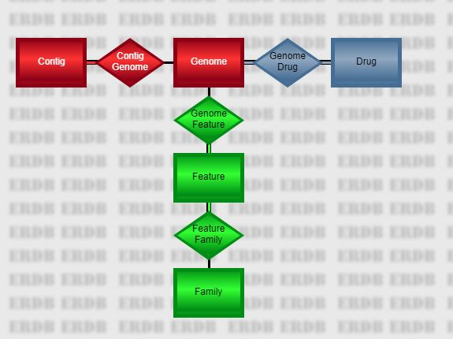

.. _cli-getting-started:

==========================================
 Using the PATRIC Command-line Interface
==========================================

`PATRIC <https://www.patricbrc.org>`_ is an integration of different
types of data and software tools that support research on bacterial
pathogens. The typical biologist seeking access to the PATRIC data and
tools will usually explore the web-based user interface. However, there
are many instances in which programatic or command-line interfaces are
more suitable. For users that wish command-line access to PATRIC, we
provide the tools described in this document. We call these tools the
*P3-scripts*. They are intended to run on your machine, going over the
network to access the services provided by PATRIC.

Document Conventions
--------------------

In this document, we observe the following conventions.

Text that you enter or type is shown in a white-background box.

::

    This is input.

Output is shown in a yellow-background box. In general, you will only
see the top portion of the output, since the whole thing could be quite
large.

::

    This is the top portion
    of the output.

Output is usually tab-delimited, and you will see columns separated by
multiple spaces that don't always line up.

If it is necessary to show multiple excerpts of a single large output
stream, the missing parts will be shown with a gray bar.

::

    This is the top part.
     
    This is somewhere in the middle.

    NOTE: we add new genomes to the PATRIC database every week. Your
    results from the examples in this tutorial may not match ours.

Installing the CLI Release
~~~~~~~~~~~~~~~~~~~~~~~~~~

Since the CLI tools run on your computer, to use them you will need to
download and install a software package in order to use them.

We currently have macOS and Debian/Ubuntu releases of the PATRIC Command Line
Interface. A Windows version is in the works.

The releases are available at the `PATRIC3 github
site <https://github.com/PATRIC3/PATRIC-distribution/releases>`_. Full installation
installations are available in :ref:`cli-installation`.

Command-Line Help
~~~~~~~~~~~~~~~~~

You can specify ``--help`` as a command-line option on any command to
get a summary of the options and parameters, for example

::

    p3-match --help

::

    p3-match.pl [-bchiv] [long options...] match-value
            -i STR --input STR      name of the input file (if not the standard
                                    input)
            -c STR --col STR        column number (1-based) or name
            -b INT --batchSize INT  input batch size
            --nohead                file has no headers
            -v --invert --reverse   output non-matching records
            --discards STR          name of file to contain discarded records
            -h --help               display usage information

The PATRIC Database
-------------------

The main PATRIC database is organized as a series of large,
heavily-indexed relational tables. From the perspective of the CLI,
there are five main tables representing objects of interest, connected
by four relationships.

The five entities are as follows.

Genome
    A genome is a set of contigs and annotations representing our best
    estimate of the DNA sequence for an organism. Use **p3-all-genomes**
    to list all of the genomes or a subset. Given a list of genomes,

    -  Use :ref:`cli::p3-get-genome-data` to retrieve data about the individual
       genomes.
    -  Use :ref:`cli::p3-get-genome-features` to access the features of the
       genomes.
    -  Use :ref:`cli::p3-get-genome-contigs` to access the genomes' sequences.
    -  Use :ref:`cli::p3-get-genome-drugs` to access drug resistance data about
       the genomes.

    Fields from the Genome table appear in the output with a heading
    prefix of ``genome``. Thus, the *genome\_name* will be in a column
    named ``genome.genome_name``.
Contig
    Represents one of the DNA sequences that comprise a genome. A contig
    can be a chromosome, a plasmid, or a fragment thereof. Contig data
    can be accessed from genome IDs using :ref:`cli::p3-get-genome-contigs`.
    Fields from the Contig table appear in the output with a heading
    prefix of ``contig``. Thus, the *length* will be in a column named
    ``contig.length``.
Drug
    Represents an antimicrobial drug used for therapeutic treatment.
    This table is the anchor for all antimicrobial resistance data in
    PATRIC. Use :ref:`cli::p3-all-drugs` to get a list of drugs. Use
    :ref:`cli::p3-get-drug-genomes` to get resistance data relating to specific
    drugs from a list. Fields from the Drug table appear in the output
    with a heading prefix of ``drug``. Thus, the *molecular\_formula*
    will be in a column named ``drug.molecular_formula``.
Feature
    Represents a region of interest in a genome. This could be a CRISPR
    array, an RNA site, a protein encoding region, or a regulatory site,
    among others. A feature can be split across multiple regions, or
    even multiple contigs, but never multiple genomes. Given a list of
    genome IDs, use :ref:`cli::p3-get-genome-features` to access the features in
    the genomes. Given a list of family IDs, use
    :ref:`cli::p3-get-family-features` to access the features in the families.
    Given a list of feature IDs, use :ref:`cli::p3-get-feature-data` to access
    data about those features. **It is important to remember that the ID
    of the feature is called *patric\_id*, not *feature\_id*.** The
    internal feature ID is a long string with a lot of data packed into
    it that may change if the genome is re-annotated (e.g.
    ``PATRIC.269798.23.NC_008255.CDS.22581.24344.fwd``). The
    *patric\_id* value is shorter and more consistent
    (``fig|269798.23.peg.22``). Fields from the Feature table appear in
    the output with a heading prefix of ``feature``. Thus, the
    *location* will be in a column named ``feature.location``.
Family
    Represents a protein family, which is a set of features believed to
    be isofunctional homologs. Given a list of family IDs, use
    :ref:`cli::p3-get-family-features` to get data about the features in the
    families or :ref:`cli::p3-get-family-data` to get data about the families
    themselves. Given a list of feature IDs, use :ref:`cli::p3-get-feature-data`
    to get the families to which the features belong. There are three
    types of protein families supported-- *local* families which are
    confined to one genus, *global* families which cross the entire
    database, and *figfams*, which are computed using a different
    method. Fields from the Family table appear in the output with a
    heading prefix of ``family``. Thus, the *product* will be in a
    column named ``family.product``.

Files and Pipelines
-------------------

The PATRIC CLI operates on tab-delimited files. That is, each record is
divided into fields or columns separated by tab characters. The first
record in each file contains the name of each column. Typically, a
column name consists of a record name, a dot, and a field name. For
example, the following file fragment contains a column from the genome
table followed by two columns from the feature table.

::

    genome.genome_id    feature.patric_id   feature.product
    670.470 fig|670.470.repeat.1    repeat region
    670.470 fig|670.470.repeat.2    repeat region
    670.470 fig|670.470.repeat.3    repeat region
    670.470 fig|670.470.rna.1   tRNA-Ala
    670.470 fig|670.470.rna.2   tRNA-Ile
    670.470 fig|670.470.repeat.4    repeat region
    670.470 fig|670.470.rna.3   16S ribosomal RNA
    670.470 fig|670.470.repeat.5    repeat region
    670.470 fig|670.470.rna.4   tRNA-Val
    670.470 fig|670.470.rna.5   tRNA-Ala
    670.470 fig|670.470.repeat.6    repeat region

The scripts are designed so they can be chained together in pipelines
where the output of one becomes input to the next. For example, the
above file was generated by the pipeline

::

    p3-all-genomes --eq genus,Methylobacillus | p3-get-genome-features --attr patric_id --attr product

In the first command of this pipeline, the ``--eq`` command-line option
was used to filter a query, while the ``--attr`` option in the second
command was used to specify the output columns and the order in which
they appear. These options are available on all of the database scripts.

For get-type scripts (:ref:`cli::p3-get-genome-data`,
:ref:`cli::p3-get-feature-data`, ...), you must supply the id of the
object of interest, e.g., the genome id, feature id, etc. By default,
the last column in the input file is used as the key field for these
get-type scripts. You can modify this behavior using the ``--col``
command-line option. The special value ``0`` denotes the last column,
but you can also use a 1-based column number (``1`` for the first, ``2``
for the second) or a column name. If the field-name portion of the
column name is unique, you can leave off the table-name portion. So, if
you want to get location information from the features output by the
pipeline above (identified in column ``feature.patric_id``, which is the
second one), you could use any of the three following commands

::

    p3-get-feature-data --col=feature.patric_id --attr sequence_id --attr location <input.tbl

::

    p3-get-feature-data --col=2 --attr sequence_id --attr location <input.tbl

::

    p3-get-feature-data --col=patric_id --attr sequence_id --attr location <input.tbl

where *input.tbl* is the above output file.

The special script :ref:`cli::p3-extract` allows you to select columns from a
file and even change the order. Thus, the following pipeline removes the
genome ID from our file and puts the feature ID at the end before asking
:ref:`cli::p3-get-feature-data` for the location information.

::

    p3-extract feature.product feature.patric_id <input.tbl | p3-get-feature-data --attr sequence_id --attr location

The same flexibility provided for arguments of the ``--col`` option is
available anywhere you specify column names, including the parameters of
:ref:`cli::p3-extract`. So, the following invocation is equivalent to the above.

::

    p3-extract product 2 <input.tbl | p3-get-feature-data --attr sequence_id --attr location

Because of the presence of the headings, many standard file-manipulation
commands won't work the way you expect. For example, if you use a
standard sort command, the headers will sort somewhere into the middle
of the file. We provide p3 scripts for several of the most common needs.

+--------------+---------------------------------------------------------------------------------------------+-------------------+
| P3 Script    | Description                                                                                 | Unix Equivalent   |
+==============+=============================================================================================+===================+
| p3-extract   | Select and re-order specific columns.                                                       | cut               |
+--------------+---------------------------------------------------------------------------------------------+-------------------+
| p3-sort      | Sort by specified columns.                                                                  | sort              |
+--------------+---------------------------------------------------------------------------------------------+-------------------+
| p3-match     | Select records that possess (or do not possess) a particular value in a specified column.   | grep              |
+--------------+---------------------------------------------------------------------------------------------+-------------------+
| p3-join      | Horizontally join two files on a single key field.                                          | join              |
+--------------+---------------------------------------------------------------------------------------------+-------------------+
| p3-head      | Display the first few lines of a file.                                                      | head              |
+--------------+---------------------------------------------------------------------------------------------+-------------------+
| p3-echo      | Create a small file.                                                                        | echo              |
+--------------+---------------------------------------------------------------------------------------------+-------------------+

These commands do not work precisely like their unix equivalents. Most
have fewer options: for example, :ref:`cli::p3-match` searches for text in a
single column rather than the entire file and does not support regular
expressions.

p3-echo
~~~~~~~

The :ref:`cli::p3-echo` command is your most important tool for creating small
files that feed into pipes. The ``--title`` command-line option
(abbreviated ``-t``) allows you to specify the title for the column you
are creating. Each positional parameter forms a single record with a
single column.

::

    p3-echo -t genome_id 1313.7001 1313.7002 1313.7016

::

    genome_id
    1313.7001
    1313.7002
    1313.7016

You can create a multi-column file by specifying multiple titles. There
will be one output column for each title specified. In the example
below, there are three titles, so the output table is three columns.
Every triple of parameters produces a record.

::

    p3-echo -t genome_id -t sequences -t gc_content 1313.7001  52  39.64  1313.7002  45  39.63  1313.7016  58  39.77

::

    genome_id       sequences        gc_content
    1313.7001       52      39.64
    1313.7002       45      39.63
    1313.7016       58      39.77

If a field contains special characters such as spaces or pipe symbols,
use double quotes to ensure the characters are interpreted correctly.

::

    p3-echo -t genome_id -t patric_id -t product 1313.7001 "fig|1313.7001.peg.1362" "hypothetical protein"

::

    genome_id   patric_id   product
    1313.7001   fig|1313.7001.peg.1362  hypothetical protein

If you leave off the title parameter, the default title ``id`` is used.
This is a handy shortcut when you're in a hurry.

::

    p3-echo 1313.7001 1313.7016

::

    id
    1313.7001
    1313.7016

Of course, you can only do that for a single-column output.

Database Script Examples
------------------------

In this section we briefly discuss the main database scripts.

p3-all-genomes
    This script lists all genomes with various characteristics. For
    example,

    ::

        p3-all-genomes --eq genome_name,Streptomyces

    ::

        genome.genome_id
        284037.4
        67257.17
        68042.5
        68042.6
        1395572.3
        68570.5
        1160718.3
        749414.3
        66876.3
        249567.6

    would list all genomes in the genus Streptomyces. (That is, all
    genomes whose names start with that word.) The ``--eq`` parameter
    introduces an equality constraint. In PATRIC, string searches
    perform a word-based substring match, which allows us to easily do
    queries of this type. The various database commands all support the
    ``--eq`` option. In addition, you can specify output fields using
    the ``--attr`` option. Thus,

    ::

        p3-all-genomes --eq genome_name,Streptomyces --attr genome_id --attr genome_name

    would output both the ID and name of each genome found, as shown
    below.

    ::

        genome.genome_id    genome.genome_name
        284037.4    Streptomyces sporocinereus strain OsiSh-2
        67257.17    Streptomyces albus subsp. albus strain NRRL F-4371
        68042.5 Streptomyces hygroscopicus subsp. hygroscopicus strain NBRC 16556
        68042.6 Streptomyces hygroscopicus subsp. hygroscopicus strain NBRC 13472
        1395572.3   Streptomyces albulus PD-1
        68570.5 Streptomyces albulus strain NK660
        1160718.3   Streptomyces auratus AGR0001
        749414.3    Streptomyces bingchenggensis BCW-1
        66876.3 Streptomyces chattanoogensis strain NRRL ISP-5002
        249567.6    Streptomyces decoyicus strain NRRL 2666

    To get a complete list of the available fields, use the ``--fields``
    option. This option is available for all the database scripts
    described in this section.

    ::

        p3-all-genomes --fields

    ::

        _version_
        additional_metadata (multi)
        altitude
        antimicrobial_resistance (multi)
        antimicrobial_resistance_evidence
        assembly_accession
        assembly_method
        bioproject_accession
        biosample_accession
        biovar

    The parenthetical ``(multi)`` indicates that a field has multiple
    values. The values returned will be separated by the current
    delimiter (which defaults to a double colon ``::``). There is also a
    parenthetical ``(derived)`` which indicates the value of the field
    is computed from other fields and can't be used in filtering.

p3-get-genome-data
    Given an input file of genome IDs, this script allows you to
    retrieve additional data and fields. For example, the following
    pipeline gets all Streptomyces genomes and then appends the genome
    name, number of contigs, and DNA length.

    ::

        p3-all-genomes --eq genome_name,Streptomyces | p3-get-genome-data --attr genome_name --attr contigs --attr genome_length

    ::

        genome.genome_id    genome.genome_name  genome.contigs  genome.genome_length
        284037.4    Streptomyces sporocinereus strain OsiSh-2   125 10242506
        67257.17    Streptomyces albus subsp. albus strain NRRL F-4371  307 9246299
        68042.5 Streptomyces hygroscopicus subsp. hygroscopicus strain NBRC 16556   133 10141569
        68042.6 Streptomyces hygroscopicus subsp. hygroscopicus strain NBRC 13472   680 9464604
        1395572.3   Streptomyces albulus PD-1   425 9340057
        68570.5 Streptomyces albulus strain NK660       9372401
        1160718.3   Streptomyces auratus AGR0001    213 7825489
        749414.3    Streptomyces bingchenggensis BCW-1  0   11936683
        66876.3 Streptomyces chattanoogensis strain NRRL ISP-5002   217 9129105

    In actual fact, the use of :ref:`cli::p3-get-genome-data` in the above
    pipeline is redundant, since :ref:`cli::p3-all-genomes` supports the same
    command-line options. In practice, you will use
    :ref:`cli::p3-get-genome-data` to process genome ID files created on a
    separate occasion or via other scripts that don't have the full
    power of :ref:`cli::p3-all-genomes`. If you don't specify any ``--attr``
    values, you get the same output fields as found on the PATRIC genome
    list tab.

    ::

        p3-all-genomes --eq genome_name,Streptomyces | p3-get-genome-data

    ::

        genome.genome_id    genome.genome_name  genome.genome_id    genome.genome_status    genome.sequences    genome.patric_cds   genome.isolation_country    genome.host_name    genome.disease  genome.collection_year  genome.completion_date
        284037.4    Streptomyces sporocinereus strain OsiSh-2   284037.4    WGS 125 9060    China   Rice        2012    2016-08-16T00:00:00Z
        67257.17    Streptomyces albus subsp. albus strain NRRL F-4371  67257.17    WGS 307 8633                    2016-01-26T00:00:00Z
        68042.5 Streptomyces hygroscopicus subsp. hygroscopicus strain NBRC 16556   68042.5 WGS 133 8955                    2016-02-05T00:00:00Z
        68042.6 Streptomyces hygroscopicus subsp. hygroscopicus strain NBRC 13472   68042.6 WGS 680 8767                    2016-02-05T00:00:00Z
        1395572.3   Streptomyces albulus PD-1   1395572.3   WGS 482 8332    China               2013-12-05T00:00:00Z
        68570.5 Streptomyces albulus strain NK660   68570.5 Complete    2   8793    China               2014-06-18T00:00:00Z
        1160718.3   Streptomyces auratus AGR0001    1160718.3   WGS 238 6866    China               2012-07-23T00:00:00Z
        749414.3    Streptomyces bingchenggensis BCW-1  749414.3    Complete    1   10313   China               2010-05-28T00:00:00Z
        66876.3 Streptomyces chattanoogensis strain NRRL ISP-5002   66876.3 WGS 217 8838    United States               2015-09-18T00:00:00Z
        249567.6    Streptomyces decoyicus strain NRRL 2666 249567.6    WGS 304 8231    United States               2015-08-19T00:00:00Z
        1907.4  Streptomyces glaucescens GLA.O  1907.4  Complete    2   6719    India               2014-10-01T00:00:00Z
        1172567.3   Streptomyces globisporus C-1027 1172567.3   WGS 278 6980    China               2012-05-04T00:00:00Z

    This is typical of the ``p3-get`` scripts: the default attributes
    match what you see on the web site as closely as possible.

p3-get-genome-features
    Given a file of genome IDs, return data about the genome's features.
    So, for example, the following pipeline would return the ID and
    function (product) of each feature in the Cytophaga genomes.

    ::

        p3-all-genomes --eq genus,Cytophaga | p3-get-genome-features --attr patric_id --attr product

    ::

        genome.genome_id    feature.patric_id   feature.product
        269798.23   fig|269798.23.peg.1 hypothetical protein
        269798.23   fig|269798.23.peg.2 Capsular polysaccharide synthesis enzyme Cap8C; Manganese-dependent protein-tyrosine phosphatase (EC 3.1.3.48)
        269798.23   fig|269798.23.peg.3 Dihydroflavonol-4-reductase (EC 1.1.1.219)
        269798.23   fig|269798.23.peg.4 TPR domain protein
        269798.23   fig|269798.23.peg.5 Phosphosulfolactate synthase (EC 4.4.1.19)
        269798.23   fig|269798.23.peg.6 DedA protein
        269798.23   fig|269798.23.peg.7 Shikimate 5-dehydrogenase I alpha (EC 1.1.1.25)
        269798.23   fig|269798.23.peg.8 hypothetical protein
        269798.23   fig|269798.23.peg.9 Excinuclease ABC subunit B
        269798.23   fig|269798.23.peg.10    DNA polymerase III epsilon subunit
        269798.23   fig|269798.23.peg.11    hypothetical protein
        269798.23   fig|269798.23.peg.12    putative fatty acid hydroxylase

    You can use the ``--fields`` option to list all the fields available
    in a feature record. In addition, you have access to the usual
    filtering parameters-- ``--eq`` as well as ``--lt``, ``--gt``,
    ``--le``, ``--ge``, and ``--ne``. So, for example, the following
    command would restrict the features to CDS features of at least 500
    base pairs.

    ::

        p3-all-genomes --eq genus,Cytophaga | p3-get-genome-features --eq feature_type,CDS --ge na_length,500 --attr patric_id --attr product

    ::

        genome.genome_id    feature.patric_id   feature.product
        269798.23   fig|269798.23.peg.2 Capsular polysaccharide synthesis enzyme Cap8C; Manganese-dependent protein-tyrosine phosphatase (EC 3.1.3.48)
        269798.23   fig|269798.23.peg.3 Dihydroflavonol-4-reductase (EC 1.1.1.219)
        269798.23   fig|269798.23.peg.4 TPR domain protein
        269798.23   fig|269798.23.peg.5 Phosphosulfolactate synthase (EC 4.4.1.19)
        269798.23   fig|269798.23.peg.6 DedA protein
        269798.23   fig|269798.23.peg.7 Shikimate 5-dehydrogenase I alpha (EC 1.1.1.25)
        269798.23   fig|269798.23.peg.8 hypothetical protein
        269798.23   fig|269798.23.peg.9 Excinuclease ABC subunit B
        269798.23   fig|269798.23.peg.10    DNA polymerase III epsilon subunit
        269798.23   fig|269798.23.peg.12    putative fatty acid hydroxylase
        269798.23   fig|269798.23.peg.13    Glycosyl transferase

p3-get-genome-contigs
    Given a file of genome IDs, returns the contigs. The following
    pipeline returns all the contigs in genome 28903.66.

    ::

        p3-echo -t genome_id 28903.66 | p3-get-genome-contigs --attr sequence_id --attr sequence

    The output will have three columns, including the genome ID, the ID
    of the contig, and the actual DNA sequence (which can be quite
    long). Again, use the ``--fields`` option to see which fields are
    available for output and filtering in the contig records.

p3-get-genome-drugs
    Given a file of genome IDs, output the drug resistance information
    we have on those genomes. For many genomes, no such data is yet
    available, so it is not hard to get an empty file output from this
    command. The following pipeline outputs the default resistance data
    information for all the Acinetobacter pittii genomes.

    ::

        p3-all-genomes --eq "genome_name,Acinetobacter pittii" | p3-get-genome-drugs

    ::

        genome.genome_id    genome_drug.genome_id   genome_drug.antibiotic  genome_drug.resistant_phenotype
        48296.102   48296.102   meropenem   Resistant
        48296.102   48296.102   imipenem    Resistant
        48296.102   48296.102   ciprofloxacin   Susceptible
        48296.102   48296.102   gentamicin  Susceptible
        48296.102   48296.102   amikacin    Susceptible
        48296.102   48296.102   tigecycline
        48296.104   48296.104   imipenem    Resistant
        48296.104   48296.104   ciprofloxacin   Susceptible
        48296.104   48296.104   gentamicin  Susceptible

p3-all-drugs
    This script lists anti-microbial drugs from the database. Use the
    ``--fields`` option to see a list of all the fields you can select.
    The default is to simply list the antibiotic name, as shown below.

    ::

        p3-all-drugs

    ::

        drug.antibiotic_name
        amikacin
        amoxicillin
        amoxicillin/clavulanic acid
        ampicillin
        ampicillin/sulbactam
        azithromycin
        aztreonam
        bacitracin
        capreomycin
        cefaclor
        cefazolin

p3-get-drug-genomes
    Given a file of antibiotic names, display all the resistance data
    for those antibiotics. The following pipeline lists all the genomes
    resistant to at least one drug.

    ::

        p3-all-drugs | p3-get-drug-genomes --attr genome_id --attr genome_name --resistant

    ::

        drug.antibiotic_name    genome_drug.genome_id   genome_drug.genome_name
        amikacin    1304920.3   Klebsiella pneumoniae 361_1301
        amikacin    1427177.3   Mycobacterium tuberculosis XTB13-081
        amikacin    1427178.3   Mycobacterium tuberculosis XTB13-082
        amikacin    1427180.3   Mycobacterium tuberculosis XTB13-084
        amikacin    1427185.3   Mycobacterium tuberculosis XTB13-091
        amikacin    1427191.3   Mycobacterium tuberculosis XTB13-097
        amikacin    1427192.3   Mycobacterium tuberculosis XTB13-098
        amikacin    1427193.3   Mycobacterium tuberculosis XTB13-100
        amikacin    1427199.3   Mycobacterium tuberculosis XTB13-107
        amikacin    1427200.3   Mycobacterium tuberculosis XTB13-108
        amikacin    1427202.3   Mycobacterium tuberculosis XTB13-110
        amikacin    1427204.3   Mycobacterium tuberculosis XTB13-112
        amikacin    1427207.3   Mycobacterium tuberculosis XTB13-115

    Rather than typing ``--eq resistant_phenotype,resistant``, the
    :ref:`cli::p3-get-drug-genomes` script provides the special command-line
    options ``--resistant`` and ``--susceptible`` to filter for the
    appropriate resistance phenotypes automatically.

p3-get-family-features
    Given a list of protein family IDs, get all the features in the
    families. PATRIC supports three types of protein families--
    ``local``, ``global``, and ``figfam``. The ``--ftype`` parameter
    specifies the type of family desired. So, for example, the following
    pipeline finds the global family for the feature
    *fig\|1105121.3.peg.460* and then lists the ID and product of each
    family member.

    ::

        p3-echo -t feature_id "fig|1105121.3.peg.460" | p3-get-feature-data --attr pgfam_id | p3-get-family-features --ftype=global --attr patric_id --attr product

Note that the features found are listed in the column
`feature.patric\_id`, while the original feature is maintained in
the first column `feature\_id`.

    ::

        feature_id  feature.pgfam_id    feature.patric_id   feature.product
        fig|1105121.3.peg.460   PGF_00112374    fig|1313.8637.peg.2087  hypothetical protein
        fig|1105121.3.peg.460   PGF_00112374    fig|1313.8636.peg.1563  hypothetical protein
        fig|1105121.3.peg.460   PGF_00112374    fig|1313.8645.peg.110   hypothetical protein
        fig|1105121.3.peg.460   PGF_00112374    fig|1313.12423.peg.2037 hypothetical protein
        fig|1105121.3.peg.460   PGF_00112374    fig|1330044.3.peg.533   hypothetical protein
        fig|1105121.3.peg.460   PGF_00112374    fig|1313.5699.peg.1778  hypothetical protein
        fig|1105121.3.peg.460   PGF_00112374    fig|1313.5750.peg.307   hypothetical protein
        fig|1105121.3.peg.460   PGF_00112374    fig|1313.5754.peg.739   hypothetical protein
        fig|1105121.3.peg.460   PGF_00112374    fig|1313.5758.peg.1823  hypothetical protein
        fig|1105121.3.peg.460   PGF_00112374    fig|1313.5781.peg.1819  hypothetical protein
        fig|1105121.3.peg.460   PGF_00112374    fig|1313.5778.peg.686   hypothetical protein
        fig|1105121.3.peg.460   PGF_00112374    fig|1313.5729.peg.1554  hypothetical protein

p3-get-feature-data
    Given a file of feature IDs, return data from those features. Again,
    use the ``--fields`` option to list the fields you can use for
    filtering and display. The following pipeline lists the function
    (product) and protein sequence of each peg of less than 300 base
    pairs in the genome 1105121.3.

    ::

        p3-echo -t genome_id 1105121.3 | p3-get-genome-features --lt na_length,300 --eq feature_type,CDS --attr patric_id | p3-get-feature-data --attr product --attr aa_sequence

    ::

        genome_id   feature.patric_id   feature.product feature.aa_sequence
        1105121.3   fig|1105121.3.peg.1487  BOX elements    MKIKEQTRKLAASCSKHCFEVVDKTDEVSYIYNPRRR
        1105121.3   fig|1105121.3.peg.1508  hypothetical protein    MISTTYRNHRKRFGLRMNLIAEKVSKTLDKTFDKDVREIPTSQFYQKFVDEMGRTYSGNLILQELITVNGAYKATYIGELSSN
        1105121.3   fig|1105121.3.peg.1557  hypothetical protein    MKREVISNGNDGPSQEILIFTKQIRHWILSDQVISGKRKLFFREDTPKEILDLYENIKSKLDFAYQEVYSNNGLKKYEK
        1105121.3   fig|1105121.3.peg.1598  BOX elements    MKIKEQTRKLAAGCSKHCFEVVDRTDEVSNLHTARRR
        1105121.3   fig|1105121.3.peg.1776  hypothetical protein    MVASASASSTSTQAQEQVDKSELRALSQELDQRLKALATVSDPKIDATKAVLLDAQKAPEDSALTE
        1105121.3   fig|1105121.3.peg.10    hypothetical protein    MENLLDVIEQFLGLSDEKLEELADKNQLLRLQEEKERKNA
        1105121.3   fig|1105121.3.peg.94    BOX elements    MKIKEQTRKLAAGCSKHCFEVVDKTDEVSYIYLRQGEADAV
        1105121.3   fig|1105121.3.peg.220   Ribonucleotide reductase of class III (anaerobic), large subunit (EC 1.17.4.2)  MVKRTCGYLGNPQARPMVNGRHKEIAARVKHMNGSTIKIAGHQVTN
        1105121.3   fig|1105121.3.peg.228   LSU ribosomal protein L23p (L23Ae)  MNLYDVIKKPVITESSMAQLEAGKYVFEVDTRAHKLLIKQAVEAAFEGVKVANVNTINVKPKAKRVGRYTGFTNKTKKAIITLTADSKAIELFAAEAE
        1105121.3   fig|1105121.3.peg.230   SSU ribosomal protein S19p (S15e)   MGRSLKKGPFVDEHLMKKVEAQANDEKKKVIKTWSRRSTIFPSFIGYTIAVYDGRKHVPVYIQEDMVGHKLGEFAPTRTYKGHAADDKKTRRK

    The use of :ref:`cli::p3-get-feature-data` here is redundant, since you
    could get the same result by placing the attribute requests directly
    on :ref:`cli::p3-get-genome-features`.

    ::

        p3-echo -t genome_id 1105121.3 | p3-get-genome-features --lt na_length,300 --eq feature_type,CDS --attr patric_id --attr product --attr aa_sequence

    :ref:`cli::p3-get-feature-data` is provided for the situation where you are
    piping in the feature list from something external or precomputed.

What Is a PATRIC Workspace?
---------------------------

Users of PATRIC have access to a wealth of public data that support
interpretation of prokaryotic genomes. The PATRIC team actively
integrates newly-sequenced genomes, data relating to antimicrobial
resistance, expression data, pathway data and subsystem data into an
integrated framework that can be queried using either the PATRIC UI or
the CLI.

In the PATRIC UI, your workspace looks a lot like a standard file
system, divided into folders full of data. In addition to files you
upload, such as FASTA and FASTQ files, there will also be typed objects
such as genomes, feature groups, and genome groups. The CLI allows you
to move these typed objects between your workspace and your file system
so you can manipulate them at will.

Logging In
~~~~~~~~~~

To access your workspace, you need a PATRIC account. If you do not have
one already, go to
`https://user.patricbrc.org/register <https://user.patricbrc.org/register>`_
and register now.

Now that you have a working user name and password, you can use the
:ref:`cli::p3-login` script to tell the CLI who you are. For example, if your
name is ``rastuser25``, you would type

::

    p3-login rastuser25

The script asks you for your password and places a special file on your
hard drive that can be used to get authorized access to your workspace
data. To log out again, simply use

::

    p3-login --logout

At any time, you can verify your login status using

::

    p3-login --status

If you are logged out, it will respond

::

    You are currently logged out of PATRIC.

If you are logged in, you will get something like

::

    You are logged in as rastuser25@patricbrc.org.

Working with Genome Groups
~~~~~~~~~~~~~~~~~~~~~~~~~~

Your workspace looks like a full-blown file system, but there are three
special folders.

-  **Genome Groups** contains named lists of genomes.
-  **Feature Groups** contains named lists of features.
-  **QuickData** contains folders full of genomes you submitted through
   the CLI annotation interface.

To create a genome group, you use :ref:`cli::p3-put-genome-group`. Say, for
example, you want to examine Streptococcus penumoniae genomes that are
resistant to penicillin. The following query command will return this
list of genomes (we will discuss all query commands in more details
later).

::

    p3-echo -t antibiotic penicillin | p3-get-drug-genomes --eq "genome_name,Streptococcus pneumoniae"  --resistant --attr genome_id --attr genome_name >resist.tbl

This particular command asks for data from the anti-microbial resistance
table. Each record in this table posits a relationship between a genome
and an antibiotic drug. We are accessing the table from the direction of
taking a drug and finding resistant genomes. To do this, we need a file
with a drug name in it. The :ref:`cli::p3-echo` command creates this file: the
``-t antibiotic`` parameter tells it we want a one-column file with a
column header of ``antibiotic``. We put the single record ``penicillin``
in that column.

The antibiotic file is then piped into :ref:`cli::p3-get-drug-genomes`. Its
parameters do the following.

``--eq "genome_name,Streptococcus pneumoniae"``
    Only include records for Streptococcus pneumoniae genomes. Because
    this is a string field, it does a substring match. A genome name
    including follow-on strain information (e.g.
    ``Streptococcus pneumoniae strain LMG2888``) will still match.
``--resistant``
    Only include records that state the genome is resistant. This is a
    special parameter for the :ref:`cli::p3-get-drug-genomes` and
    :ref:`cli::p3-get-genome-drugs` commands that is provided for convenience.
``--attr genome_id``
    Output the genome ID.
``--attr genome_name``
    Output the genome name.

When the command completes, the file **resist.tbl** will contain around
114 lines beginning with the following.

::

    antibiotic   genome_drug.genome_id   genome_drug.genome_name
    penicillin   1313.7006   Streptococcus pneumoniae P310010-154
    penicillin   1313.7016   Streptococcus pneumoniae P310937-212
    penicillin   1313.7018   Streptococcus pneumoniae P311313-217
    penicillin   760749.3    Streptococcus pneumoniae GA05248
    penicillin   760763.3    Streptococcus pneumoniae GA11304
    penicillin   760765.3    Streptococcus pneumoniae GA11663
    penicillin   760766.3    Streptococcus pneumoniae GA11856
    penicillin   760769.3    Streptococcus pneumoniae GA13338
    penicillin   760771.3    Streptococcus pneumoniae GA13455
    penicillin   760776.3    Streptococcus pneumoniae GA14373
    penicillin   760777.3    Streptococcus pneumoniae GA14688

Now we want to create a group for these genomes called
**resist\_strep**. We use the following command.

::

    p3-put-genome-group --col=2 resist_strep <resist.tbl

The ``--col=2`` tells the command that the genome IDs are in the second
column. The genome group is simply a set of genome IDs, so the other
columns will be ignored by the command. You can read the group back at
any time using :ref:`cli::p3-get-genome-group`.

::

    p3-get-genome-group resist_strep

Will output

::

    resist_strep.genome_id
    1313.7006
    1313.7016
    1313.7018
    760749.3
    760763.3
    760765.3
    760766.3
    760769.3
    760771.3

and so on. Note that if you want to see the names as well, you can use
the :ref:`cli::p3-get-genome-data` command to add them

::

    p3-get-genome-group resist_strep | p3-get-genome-data --attr genome_name

::

    resist_strep.genome_id  genome.genome_name
    1313.7006   Streptococcus pneumoniae P310010-154
    1313.7016   Streptococcus pneumoniae P310937-212
    1313.7018   Streptococcus pneumoniae P311313-217
    760749.3    Streptococcus pneumoniae GA05248
    760763.3    Streptococcus pneumoniae GA11304
    760765.3    Streptococcus pneumoniae GA11663
    760766.3    Streptococcus pneumoniae GA11856
    760769.3    Streptococcus pneumoniae GA13338
    760771.3    Streptococcus pneumoniae GA13455
    760776.3    Streptococcus pneumoniae GA14373
    760777.3    Streptococcus pneumoniae GA14688

Next we will ask for the genomes that are susceptible to penicillin. We
use the same command as before except we put ``susceptible`` in place of
``resistant``. We're going to pipe the results directly into
:ref:`cli::p3-put-genome-group` to store them in our workspace.

::

    p3-echo -t antibiotic penicillin | p3-get-drug-genomes --eq "genome_name,Streptococcus pneumoniae"  --susceptible --attr genome_id --attr genome_name | p3-put-genome-group --col=2 weak_strep

Now when you ask for the group back, you would get something like the
following.

::

    p3-get-genome-group weak_strep

::

    weak_strep.genome_id
    1313.6939
    1313.6941
    1313.6942
    1313.6944
    1313.6947
    1313.7001
    1313.7002
    1313.7007
    1313.7009

Working with Feature Groups
~~~~~~~~~~~~~~~~~~~~~~~~~~~

We want to look at features in the resistant Streptococcus pneumoniae
genomes that distinguish them from the susceptible ones. Then we will
gather those features into a feature group and store them in our
workspace so we can work with them later. We have the genomes we want
stored in the genome groups *weak\_strep* and *resist\_strep*. The
command that processes them is called :ref:`cli::p3-signature-families`.

:ref:`cli::p3-signature-families` compares two genome groups-- group 1 contains
genomes that are interesting for some reason, group 2 contains genomes
that are not. We can pipe one of the two groups directly into the
command, but the other needs to be in a file. We will start by creating
a file called *weak.tbl* that contains the *weak\_strep* genomes.

::

    p3-get-genome-group weak_strep >weak.tbl

Now we pipe in *resist\_strep* (the interesting set) and specify
*weak.tbl* as the source of group 2.

::

    p3-get-genome-group resist_strep | p3-signature-families --gs2=weak.tbl >families.tbl

The output contains protein families that are common in the interesting
set (resistant to penicillin) but not in the other set. If a set file is
not specified, it is taken from the standard input. In this case, that
would be the interesting set, since there is no **--gs1** parameter.

Our signature families analysis script has no output, because we
redirected it to *families.tbl*. We can peek at the results using the
``--all`` option of :ref:`cli::p3-extract`.

::

    p3-extract --all <families.tbl

::

    counts_in_set1  counts_in_set2  family.family_id    family.product
    92  10  PGF_00112374    hypothetical protein
    92  10  PGF_00303700    hypothetical protein
    92  10  PGF_03497231    hypothetical protein
    91  10  PGF_03497236    hypothetical protein

We found four protein families. The next step is to convert the families
into feature IDs. The :ref:`cli::p3-get-family-features` script performs that
function. We will use the following command.

::

    p3-get-family-features --gFile=resist.tbl --gCol=2 --ftype=global --col=family.family_id <families.tbl

The parameters work as follows.

--gFile=resist.tbl
    Only features from the genomes listed in the file *resist.tbl*
    should be included in the output.

--gCol=2
    The genome IDs in *resist.tbl* are in the second column.

--ftype=global
    The family IDs in the input file are global families. (Local
    families and FIGfams are also supported, but the
    :ref:`cli::p3-signature-families` script uses global families.)

--col=family.family\_id
    The protein family IDs in the input file are in a column named
    ``family.family_id``.

The output looks something like this.

::

    counts_in_set1  counts_in_set2  family.family_id    family.product  feature.patric_id   feature.refseq_locus_tag    feature.gene_id feature.plfam_id    feature.pgfam_id    feature.product
    92  10  PGF_00112374    hypothetical protein    fig|1105121.3.peg.460   SPAR163_0451    0   PLF_1301_00002060   PGF_00112374    hypothetical protein
    92  10  PGF_00112374    hypothetical protein    fig|1069626.3.peg.432   SPAR154_0430    0   PLF_1301_00002060   PGF_00112374    hypothetical protein
    92  10  PGF_00112374    hypothetical protein    fig|1313.6771.peg.1961  ERS013947_01920     PLF_1301_00002060   PGF_00112374    hypothetical protein
    92  10  PGF_00112374    hypothetical protein    fig|1313.5503.peg.1279  ERS013945_01218     PLF_1301_00002060   PGF_00112374    hypothetical protein
    92  10  PGF_00112374    hypothetical protein    fig|1313.5634.peg.1224  ERS013952_01170     PLF_1301_00002060   PGF_00112374    hypothetical protein
    92  10  PGF_00112374    hypothetical protein    fig|1069624.3.peg.437   SPAR151_0439    0   PLF_1301_00002060   PGF_00112374    hypothetical protein
    92  10  PGF_00112374    hypothetical protein    fig|1069628.3.peg.451   SPAR156_0440    0   PLF_1301_00002060   PGF_00112374    hypothetical protein
    92  10  PGF_00112374    hypothetical protein    fig|1313.5669.peg.1163  ERS013960_01123     PLF_1301_00002060   PGF_00112374    hypothetical protein
    92  10  PGF_00112374    hypothetical protein    fig|1313.6725.peg.2115  ERS013931_02059     PLF_1301_00002060   PGF_00112374    hypothetical protein
    92  10  PGF_00112374    hypothetical protein    fig|1313.5465.peg.1094  ERS013930_01056     PLF_1301_00002060   PGF_00112374    hypothetical protein
    92  10  PGF_00112374    hypothetical protein    fig|1313.5418.peg.2058  ERS013923_02003     PLF_1301_00002060   PGF_00112374    hypothetical protein
    92  10  PGF_00112374    hypothetical protein    fig|1313.5645.peg.1124  ERS013964_01084     PLF_1301_00002060   PGF_00112374    hypothetical protein

We didn't tell :ref:`cli::p3-get-family-features` what attributes of the
features to display, so it defaulted to the columns normally found on
the PATRIC web page *Features* tab. We don't have time to examine these
features in detail now, but we can put them in a feature group by piping
them into :ref:`cli::p3-put-feature-group` as follows.

::

    p3-get-family-features --gFile=resist.tbl --gCol=2 --ftype=global --col=family.family_id <families.tbl | p3-put-feature-group --col=feature.patric_id resist_fids

In the :ref:`cli::p3-put-feature-group` command, the ``--col=feature.patric_id``
parameter tells the command that the feature IDs are in the column with
that heading, and ``resist_fids`` is the group name. When you decide to
examine the features in greater detail, you can pull back the feature
IDs using :ref:`cli::p3-get-feature-group`.

::

    p3-get-feature-group resist_fids

The output will look something like this.

::

    resist_fids.patric_id
    fig|1105121.3.peg.460
    fig|1069626.3.peg.432
    fig|1313.6771.peg.1961
    fig|1313.5503.peg.1279
    fig|1313.5634.peg.1224
    fig|1069624.3.peg.437
    fig|1069628.3.peg.451
    fig|1313.5669.peg.1163
    fig|1313.6725.peg.2115

At any time, you can get a complete list of the groups in your workspace
using the :ref:`cli::p3-list-genome-groups` command or the
:ref:`cli::p3-list-feature-groups` command. So, if you have been following along
the above examples and your workspace was empty before you began, you
would see the following.

::

    p3-list-genome-groups

::

    resist_strep
    weak_strep

::

    p3-list-feature-groups

::

    resist_fids

Extracting and Mining Genome Typed Objects (GTOs)
-------------------------------------------------

Sometimes you want to store a genome on your local hard drive. PATRIC
provides a special format for encapsulating all the data from a genome
called the *genome typed object* or *GTO*. The :ref:`cli::p3-gto` script allows
you to download one or more PATRIC genomes in GTO format. The following
command downloads two strep genomes -- 1313.7001 and 1313.7016-- in GTO
format and stores them in the current directory.

::

    p3-gto 1313.7001 1313.7016

The GTO files have the same name as the genome ID with a suffix of
``.gto``. So, the above command creates **1313.7001.gto** and
**1313.7016** in the current directory. If you execute this command and
look at **1313.7001.gto**, you will see something like the following
(with large portions in the middle removed).

::

    {
       "analysis_events" : [],
       "scientific_name" : "Streptococcus pneumoniae P210774-233",
       "source" : "PATRIC",
       "source_id" : "1313.7001",
       "id" : "1313.7001",
       "taxonomy" : [
          "cellular organisms",
          "Bacteria",
          "Terrabacteria group",
          "Firmicutes",
          "Bacilli",
          "Lactobacillales",
          "Streptococcaceae",
          "Streptococcus",
          "Streptococcus pneumoniae"
       ],
       "contigs" : [
          {
             "genetic_code" : "11",
             "dna" : "gaaaggacaaaatttgtcctttctcaagcttagctgacttcaacccactacagttgacaaagagcctgttttctcaataggattgtactcaggtgagtagggaggaagaggtaaaagtttatgcccaaactcttcacacaagagttctagcttacccattctatggaatcttgcattatccataataataaccgatggtgtggttaatgttggtaagagaaatttctgaaaccatacttcaaaaaagtcgctcgtcatcgtctcttcgtaagtcattggagcgattaattcaccatttgttagacctgcaaccaaagaaatcctctgatatcttcttccagatactttgcctcttcttaactgaccttttaatgagcgaccatattctcgataaaaataagtatcgaatcctgtttcgtcaatctaaacaggtgctaggtgctttaaactattaaaattcttaagaaataaggctacttatcgccctgaatatcaaaaaagaaaggacaaaatttgtcctttctcaagcttagctgacttcaacccactacagttgacaaagagcctgttttctcaataggattgtactcaggtgagtagggaggaagaggtaaaagtttatgcccaaactcttcacacaagagttctagcttacccattctatggaatcttgcattatccataataataaccgatggtgtggttaatgttggtaagagaaatttctgaaaccatacttcaaaaaagtcgctcgtcatcgtctcttcgtaagtcattggagcgattaattcaccatttgttagacctgcaaccaaagaaatcctctgatatcttcttccagatactttgcctcttcttaactgaccttttaatgagcgaccatattctcgataaaaataagtatcgaatcctgtttcgtcaatctaaacaggtgctaggtgctttaaactattaaaattcttaagaaataaggctactttttctgggtcttgttcatagtaggtgtggttctttttttcgagtgtagcccatagctttgagcgcatagtggatggtagttggatgacagccaaattcagaagctatttcagtcaaataagcgtct",
             "id" : "1313.7001.con.0001"
          },
          {
             "id" : "1313.7001.con.0002",
             "genetic_code" : "11",
             "dna" : "aaagaagctgttcgaaaagtaggcgatggttatgtctttgaggagaatggagtttctcgttatatcccagccaaggatctttcagcagaaacagcagcaggcattgatagcaaactggccaagcaggaaagtttatctcataagctaggagctaagaaaactgacctcccatctagtgatcgagaattttacaataaggcttatgacttactagcaagaattcaccaagatttacttgataataaaggtcgacaagttgattttgaggctttggataacctgttggaacgactcaaggatgtctcaagtgataaagtcaagttagtggatgatattcttgccttcttagctccgattcgtcatccagaacgtttaggaaaaccaaattcgcaaattacctacactgatgatgagattcaagtagccaagttggcaggcaagtacacaacagaagacggttatatctttgatcctcgtgatataaccagtgatgagggggatgcctatgtaactccacatatgacccatagccactggattaaaaaagatagtttgtctgaagctgagagagcggcagcccaggcttatgctaaagagaaaggtttgacccctccttcgacagaccatcaggatgcaggaaatactgaggcaaaaggagcagaagctatctacaaccgcgtgaaagcagctaagaaggtgccacttgatcgtatgccttacaatcttcaatatactgtagaagtcaaaaacggtagtttaatcatacctcattatgaccattaccataacatcaaatttgagtggtttgacgaaggcctttatgaggcacctaaggggtatactcttgaggatcttttggcgactgtcaagtactatgtcgaacatccaaacgaacgtccgcattcagataatggttttggtaacgctagcgaccatgttcaaagaaacaaaaatggtcaagctgataccaatcaaacggagaaacctcagacagaaaaacctgaggaagataaggaacatgatgaagtaagtgagccaactca"
          },
     
       ],
       "ncbi_taxonomy_id" : "1313",
       "close_genomes" : [],
       "domain" : "Bacteria",
       "genetic_code" : "11",
       "features" : [
          {
             "type" : "repeat_region",
             "family_assignments" : [],
             "annotations" : [
                [
                   "Add feature from PATRIC",
                   "PATRIC",
                   1500218027.10933,
                   ""
                ],
                [
                   "Set function to repeat region",
                   "PATRIC",
                   1500218027.10933,
                   ""
                ]
             ],
             "aliases" : [],
             "id" : "fig|1313.7001.repeat.1",
             "function" : "repeat region",
             "location" : [
                [
                   "1313.7001.con.0001",
                   "67",
                   "+",
                   413
                ]
             ]
          },
          {
             "location" : [
                [
                   "1313.7001.con.0001",
                   "567",
                   "+",
                   539
                ]
             ],
             "function" : "repeat region",
             "id" : "fig|1313.7001.repeat.2",
             "aliases" : [],
             "annotations" : [
                [
                   "Add feature from PATRIC",
                   "PATRIC",
                   1500218027.10944,
                   ""
                ],
                [
                   "Set function to repeat region",
                   "PATRIC",
                   1500218027.10944,
                   ""
                ]
             ],
             "family_assignments" : [],
             "type" : "repeat_region"
          },
     
       ]
    }

This is a JSON-format string, which is to say, it displays an object
with fields, some of which are other objects (denoted by curly braces)
or lists (denoted by square brackets). JSON is a standard portable data
format, described in detail `here <http://www.json.org/>`_ and supported
by most programming languages. Without even fully understanding the
notation, you can still see in the above listing that various bits of
key metadata (scientific name, taxonomy, ID) are present in the file,
along with the ID and sequence of each contig and various pertinent data
about each feature.

You can use a minus sign (``-``) in the parameter list to specify that
the genome list come from the standard input. The following creates GTOs
for every genome in the genome group *weak\_strep*.

::

    p3-get-genome-group weak_strep | p3-gto -

This capability can be mixed with explicit genome IDs. So the following
script creates a GTO for *594.8*, all of the genomes in group
*weak\_strep*, and then genome *149539.441*.

::

    p3-get-genome-group weak_strep | p3-gto 594.8 - 149539.441

You can also use the ``--outDir`` option to specify that the output be
put in a different directory. The following creates a new subdirectory
**PathogenGTO** in the current directory and puts all the GTOs in it.

::

    p3-get-genome-group weak_strep | p3-gto --outDir=PathogenGTO 594.8 - 149539.441

You are not required to write code to manipulate GTOs. Instead, we've
included some useful scripts in the PATRIC CLI. First and foremost is
:ref:`cli::p3-gto-scan`. For example, if you run

::

    p3-gto-scan 1313.7001.gto

you would see the following analysis

::

    Processing contigs of 1313.7001.gto.
    Processing features of 1313.7001.gto.
    All done.
    contigs                52
    dna               2101113
    features             3382
    functionAnalyzed     1418
    functionRead         3382
    functionReused       1964
    roleMatch            1492
    roleProcessed        3478

This rather arcane output tells you several things. First, that there
are 52 contigs and 2,101,113 base pairs in the genome. It has 3382
features containing 1418 distinct assigned functions
(*functionAnalyzed*). 3382 features had assigned functions
(*functionRead*). This means every feature had a valid functional
assignment, which is usually the case. 1964 of the features had
redundant functions, that is, functions also found earlier in the genome
(*functionReused*). 3478 roles were found (*roleProcessed*) of which
1492 were distinct (*roleMatch*).

If you want to see the actual roles, specify the command-line option
``--verbose``.

::

    p3-gto-scan --verbose 1313.7001.gto

::

    Role name   1313.7001.gto
    (2E,6E)-farnesyl diphosphate synthase (EC 2.5.1.10) 1
    1,2-diacylglycerol 3-glucosyltransferase (EC 2.4.1.337) 1
    1,4-alpha-glucan (glycogen) branching enzyme, GH-13-type (EC 2.4.1.18)  1
    1-phosphofructokinase (EC 2.7.1.56) 1
    16S rRNA (cytidine(1402)-2'-O)-methyltransferase (EC 2.1.1.198) 1
    16S rRNA (cytosine(1402)-N(4))-methyltransferase EC 2.1.1.199)  1
    16S rRNA (cytosine(967)-C(5))-methyltransferase (EC 2.1.1.176)  1
    16S rRNA (guanine(1207)-N(2))-methyltransferase (EC 2.1.1.172)  1
    16S rRNA (guanine(527)-N(7))-methyltransferase (EC 2.1.1.170)   1
    16S rRNA (guanine(966)-N(2))-methyltransferase (EC 2.1.1.171)   1
    16S rRNA (uracil(1498)-N(3))-methyltransferase (EC 2.1.1.193)   1

In this table, each role name is shown along with the number of times it
occurs in the genome. You can see the features as well by adding the
``--features`` command line.

::

    p3-gto-scan --verbose --features 1313.7001.gto

::

    Role name   1313.7001.gto   Features containing role
    (2E,6E)-farnesyl diphosphate synthase (EC 2.5.1.10) 1   fig|1313.7001.peg.1606
    1,2-diacylglycerol 3-glucosyltransferase (EC 2.4.1.337) 1   fig|1313.7001.peg.679
    1,4-alpha-glucan (glycogen) branching enzyme, GH-13-type (EC 2.4.1.18)  1   fig|1313.7001.peg.595
    1-phosphofructokinase (EC 2.7.1.56) 1   fig|1313.7001.peg.227
    16S rRNA (cytidine(1402)-2'-O)-methyltransferase (EC 2.1.1.198) 1   fig|1313.7001.peg.1813
    16S rRNA (cytosine(1402)-N(4))-methyltransferase EC 2.1.1.199)  1   fig|1313.7001.peg.503
    16S rRNA (cytosine(967)-C(5))-methyltransferase (EC 2.1.1.176)  1   fig|1313.7001.peg.1301
    16S rRNA (guanine(1207)-N(2))-methyltransferase (EC 2.1.1.172)  1   fig|1313.7001.peg.83
    16S rRNA (guanine(527)-N(7))-methyltransferase (EC 2.1.1.170)   1   fig|1313.7001.peg.1682
    16S rRNA (guanine(966)-N(2))-methyltransferase (EC 2.1.1.171)   1   fig|1313.7001.peg.145
    16S rRNA (uracil(1498)-N(3))-methyltransferase (EC 2.1.1.193)   1   fig|1313.7001.peg.728

Later on in this file you can see an example of a role that occurs in
multiple features. You will note that a double colon (``::``) is used to
separate the individual feature IDs.

::

    6-phospho-beta-galactosidase (EC 3.2.1.85)  1   fig|1313.7001.peg.607
    6-phospho-beta-glucosidase (EC 3.2.1.86)    4   fig|1313.7001.peg.1031::fig|1313.7001.peg.1517::fig|1313.7001.peg.443::fig|1313.7001.peg.896
    6-phosphofructokinase (EC 2.7.1.11) 1   fig|1313.7001.peg.1372
    6-phosphogluconate dehydrogenase, decarboxylating (EC 1.1.1.44) 1   fig|1313.7001.peg.542

This is a common convention in the PATRIC CLI-- when a single column
contains multiple values, we use a double colon to separate them. You
can use the ``--delim`` option to change this default. Supported
alternate delimiters include ``space``, ``tab``, and ``comma``. For
example, the following would show if you coded ``--delim=space``.

::

    6-phospho-beta-galactosidase (EC 3.2.1.85)  1   fig|1313.7001.peg.607
    6-phospho-beta-glucosidase (EC 3.2.1.86)    4   fig|1313.7001.peg.1031 fig|1313.7001.peg.1517 fig|1313.7001.peg.443 fig|1313.7001.peg.896
    6-phosphofructokinase (EC 2.7.1.11) 1   fig|1313.7001.peg.1372
    6-phosphogluconate dehydrogenase, decarboxylating (EC 1.1.1.44) 1   fig|1313.7001.peg.542

The true power in :ref:`cli::p3-gto-scan` comes when you use it to compare
multiple GTO files. The following command displays a summary of the
differences between **1313.7001.gto** and **1313.7016.gto**.

::

    p3-gto-scan 1313.7001.gto 1313.7016.gto

::

    Processing contigs of 1313.7001.gto.
    Processing features of 1313.7001.gto.
    Processing contigs of 1313.7016.gto.
    Processing features of 1313.7016.gto.
    Role name   1313.7001.gto   1313.7016.gto
    2,3-butanediol dehydrogenase, R-alcohol forming, (R)- and (S)-acetoin-specific (EC 1.1.1.4) 0   1
    2-isopropylmalate synthase (EC 2.3.3.13)    1   2
    23S rRNA (adenine(2058)-N(6))-dimethyltransferase (EC 2.1.1.184) => Erm(B)  0   1
    4-hydroxybenzoate polyprenyltransferase and related prenyltransferases  0   1
    5S rRNA 2   3
    6-phospho-beta-galactosidase (EC 3.2.1.85)  1   2
    AAA superfamily ATPase  0   1
    ABC transporter amino acid-binding protein  0   1
    ABC transporter, ATP-binding protein    13  11
    ABC transporter, ATP-binding protein (cluster 3, basic aa/glutamine/opines) 3   4
    ABC transporter, permease protein (cluster 3, basic aa/glutamine/opines)    5   6
    ABC transporter, substrate-binding protein PebA (cluster 3, basic aa/glutamine/opines)  2   1
     
    weak similarity to aminoglycoside phosphotransferase    1   0
    * Features  3382    3304
    * DNA   2101113 2052306
    All done.
    contigs               110
    dna               4153419
    features             6686
    functionAnalyzed     1457
    functionRead         6686
    functionReused       5229
    roleMatch            1356
    roleMismatch          175
    roleProcessed        6877

Only roles that differ between the two genomes are shown (175, the
number in *roleMismatch*). For each, the role name is shown followed by
the number of occurrences in 1313.7001.gto and then the number of
occurrences in 1313.7016.gto. So, we can see that *2-isopropylmalate
synthase* occurs once in 1313.7001 but twice in 1313.7016. At the end of
the role listing, feature and DNA counts are shown. We see that
1313.7016 has 78 fewer features and around 50,000 fewer base pairs
(48,807 to be exact). 1356 roles occurred the same number of times in
both genomes (*roleMatch*).

You can specify as many GTO file names as you wish in the parameter list
for :ref:`cli::p3-gto-scan`. As with the single-genome case, ``--features``
causes the features to be listed in the last column. The ``--verbose``
option causes even the matching roles to be listed, so you can get
counts for everything.

The status and statistical messages are sent to the standard error
output, and the role table to the standard output. Thus, if you redirect
these to separate files, the direct output from :ref:`cli::p3-gto-scan` can be
used to get a convenient list of roles from the script. The file thus
created is tab-delimited with headers, just like a normal CLI output
file.

The script :ref:`cli::p3-gto-fasta` creates FASTA files from a single GTO. Three
command-line options (all mutually exclusive) are supported.

--contig
    Output a DNA fasta for the genome's contigs. This is the default.
--protein
    Output a protein fasta for the genome's features. Obviously, only
    protein-encoding features will be included.
--feature
    Output a DNA fasta for the genome's features. All features are
    included.

You specify the name of the GTO file as the first parameter of
:ref:`cli::p3-gto-fasta`.

::

    p3-gto-fasta 1313.7001.gto >1313.7001.fna

After this script, **1313.7001.fna** will look something like this.

::

    >1313.7001.con.0001
    gaaaggacaaaatttgtcctttctcaagcttagctgacttcaacccactacagttgacaa
    agagcctgttttctcaataggattgtactcaggtgagtagggaggaagaggtaaaagttt
    atgcccaaactcttcacacaagagttctagcttacccattctatggaatcttgcattatc
    cataataataaccgatggtgtggttaatgttggtaagagaaatttctgaaaccatacttc
    aaaaaagtcgctcgtcatcgtctcttcgtaagtcattggagcgattaattcaccatttgt
    tagacctgcaaccaaagaaatcctctgatatcttcttccagatactttgcctcttcttaa
    ctgaccttttaatgagcgaccatattctcgataaaaataagtatcgaatcctgtttcgtc
    aatctaaacaggtgctaggtgctttaaactattaaaattcttaagaaataaggctactta
    tcgccctgaatatcaaaaaagaaaggacaaaatttgtcctttctcaagcttagctgactt
    caacccactacagttgacaaagagcctgttttctcaataggattgtactcaggtgagtag
    ggaggaagaggtaaaagtttatgcccaaactcttcacacaagagttctagcttacccatt

In the feature-based fasta files, the functional assignment is included
as a comment, as shown below.

::

    p3-gto-fasta --protein 1313.7001.gto

::

    >fig|1313.7001.peg.1182 beta-glycosyl hydrolase
    MKHEKQQRFSIRKYAVGAASVLIGFAFQAQTVAADGVTTTTENQPTIHTVSDSPQSSENR
    TEETPKAELQPETPATDKVASLPKTEEKPQEEVSSTPSDKAEVVTPTSAEKETANKKAEE
    ASPKKEEAKEVDSKESNTDKTDKDKPAKKDEAKAEADKPETEAGKERAATVNEKLAKKKI
    VSIDAGRKYFSPEQLKEIIDKAKHYGYTDLHLLVGNDGLRFMLDDMSITANGKTYASDDV
    KRAIEKGTNDYYNDPNGNHLTESQMTDLINYAKDKGIGLIPTVNSPGHMDAILNAMKELG
    IQNPNFSYFGKESARTVNLDNEQAVAFTKALIDKYAAYFAKKTEIFNIGLDEYANDATDA
    KGWSVLQADKYYPNEGYPVKGYEKFIAYANDLARIVKSHGLKPMAFNDGIYYNSDTSFGS
    FDKDIIVSMWTGGWGGYDVASSKLLAEKGHQILNTNDAWYYVLGRNADGQGWYNLDQGLN
    GIKNTPITSVPKTEGADIPIIGGMVAAWADTPSARYSPSRLFKLMRHFANANAEYFAADY
    ESAEQALNEVPKDLNRYTAESVAAVKEAEKAIRSLDSNLSRAQQDTIDQAIAKLQETVNN
    LTLTPEAQKEEEAKREVEKLAKNKVISIDAGRKYFTLNQLKRIVDKASELGYSDVHLLLG
    NDGLRFLLDDMTITANGKTYASDDVKKAIIEGTKAYYDDPNGTTLTQAEVTELIEYAKSK
    DIGLIPAINSPGHMDAMLVAMEKLGIKNPQAHFDKVSKTTMDLKNEEAMNFVKALIGKYM

Only protein-encoding genes are output with the ``--protein`` option;
however, you see all the features when you use the ``--feature`` option.

::

    p3-gto-fasta --feature 1313.7001.gto

::

    >fig|1313.7001.repeat.1 repeat region
    tgttttctcaataggattgtactcaggtgagtagggaggaagaggtaaaagtttatgccc
    aaactcttcacacaagagttctagcttacccattctatggaatcttgcattatccataat
    aataaccgatggtgtggttaatgttggtaagagaaatttctgaaaccatacttcaaaaaa
    gtcgctcgtcatcgtctcttcgtaagtcattggagcgattaattcaccatttgttagacc
    tgcaaccaaagaaatcctctgatatcttcttccagatactttgcctcttcttaactgacc
    ttttaatgagcgaccatattctcgataaaaataagtatcgaatcctgtttcgtcaatcta
    aacaggtgctaggtgctttaaactattaaaattcttaagaaataaggctactt
    >fig|1313.7001.repeat.2 repeat region
    tgttttctcaataggattgtactcaggtgagtagggaggaagaggtaaaagtttatgccc
    aaactcttcacacaagagttctagcttacccattctatggaatcttgcattatccataat

Using RAST to Create New Genomes
--------------------------------

If you have a DNA fasta file and you know the taxonomic ID with a
certain degree of confidence, you can use the script :ref:`cli::p3-rast` to
annotate the DNA and produce a new genome. The standard output of the
script is a GTO. In almost every case, you will want to redirect this to
a file. In addition, the new genome is stored in your workspace. It will
appear in listings from :ref:`cli::p3-all-genomes`, and you can find its files
via the web interface in your QuickData folders.

To invoke :ref:`cli::p3-rast`, you specify a taxonomic ID or the ID of a genome
with the same taxonomic ID plus the name to give to the new genome. The
contigs should be in the form of a FASTA file via the standard input.
All this data is submitted to the PATRIC annotation service. When the
service completes, it stores the new genome in your workspace and sends
back a GTO. The example below shows a submission of sequences taken from
a metagenomic sample named *SRS576036* chosen because they have a high
similarity to sequences from Catenibacterium mitsuokai (taxon ID
100886).

::

    p3-rast 100886 "Catenibacterium from sample SRS576036" <sample.fna >test.gto 2>test.log

Now **test.gto** contains a GTO of the resulting genome and **test.log**
contains information about the RAST job. If we use the ``--private``
option of :ref:`cli::p3-all-genomes`, we will see the new genome in the list.

::

    p3-all-genomes --private --attr genome_name

::

    genome.genome_id       genome.genome_name
    100886.26       Catenibacterium from sample SRS576036

The genome was assigned the ID *100886.26*. We can see this in the GTO
file as well.

::

    {
       "genetic_code" : "11",
     
             ],
             "family_assignments" : [],
             "type" : "CDS",
             "id" : "fig|100886.26.peg.1540"
          },
          {
             "protein_translation" : "MLQIENASIAYGNDILFSGFNLQLERGEIASISGPSGCGKSSLLNAILGFTPLKEGRIVLNGILLDKGNVDVVRKQTAWIPQELALPLEWVKDMVQLPFGLKANRGTPFSETRLFACFEDLGLEQELYYKRVNEISGGQRQRMMIAVASMIGKPLTIVDEPTSALDSGSAEKVLSFFRRQTENGSAILTVSHDKRFANGCDRHIIMK",
             "aliases" : [],
             "location" : [
                [
                   "100886.26.con.0010",
                   "23684",
                   "-",
                   624
                ]
     
             "type" : "CDS"
          }
       ],
       "id" : "100886.26",
       "contigs" : [
          {
             "id" : "100886.26.con.0001",
     
    }

The genome ID appears as a part of every feature ID, as an ID in its own
right, and as the first part of every contig ID.

As long as you are signed in, the genomes you create using :ref:`cli::p3-rast`
will participate in all queries.

::

    p3-all-genomes --eq taxon_id,100886 --attr genome_name

::

    genome.genome_id        genome.genome_name
    100886.3        Catenibacterium mitsuokai
    100886.26       Catenibacterium from sample SRS576036

However, just as you can restrict :ref:`cli::p3-all-genomes` to your own private
genomes using the ``--private`` option, you can restrict it to public
genomes only using the ``--public`` option.

::

    p3-all-genomes --public --eq taxon_id,100886 --attr genome_name

::

    genome.genome_id        genome.genome_name
    100886.3        Catenibacterium mitsuokai

The GTO produced by :ref:`cli::p3-rast` has extra information in it describing
the annotation process, but it is functionally equivalent to the output
were you to re-fetch the genome using the standard script.

::

    p3-gto 100886.26

A :ref:`cli::p3-gto-scan` for **test.gto** would return the same role profile as
for **100886.26.gto**.

Customizing Your Toolkit
------------------------

The set of commands that we support via the p3-scripts offers a fairly
broad set of capabilities. For example, say you want the name of a
specific genome from the ID. You can do this easily using

::

    p3-echo -t genome_id 670.470 | p3-get-genome-data --attr genome_name

::

    genome_id       genome.genome_name
    670.470 Vibrio parahaemolyticus strain S176-10

If you do this a lot, you may find the extra typing tedious. It is
worth, therefore, a brief discussion of how to create shortcut scripts.

Custom Scripts in the BASH Environment
~~~~~~~~~~~~~~~~~~~~~~~~~~~~~~~~~~~~~~

In BASH (the most popular Unix shell) you can add functions to your
**.bashrc** file, using ``$``-notation to indicate the incoming
command-line variables. So, to create the command

::

    gn 670.470

You would use the function definition

::

    function gn {
        p3-all-genomes --eq=genome_id,$1 --attr genome_name
    }

You must reload the shell to activate your changes to the **.bashrc**
file. Use

::

    exec bash

to replace your current shell with a new instance.

In the function, the ``$1`` is replaced by the first parameter on the
command, which in our example is ``670.470``. If you type

::

    gn 1313.7001

the ``$1`` is replaced by ``1313.7001``, so the output would be

::

    genome_id       genome.genome_name
    1313.7001       Streptococcus pneumoniae P210774-233

You can have more than one parameter. The second is called ``$2``, the
third ``$3``, and so on. The following function creates a genome group
of everything resistant to a particular drug. The drug is the first
parameter, the group name the second.

::

    function rg {
        p3-echo -t antibiotic $1 | p3-get-drug-genomes --resistant --attr genome_id | p3-put-genome-group $2
    }

Once the above definition is in place, the following command will put
all the methicillin-resistant genomes into the group **meth\_resist**.

::

    rg methicillin meth_resist

Custom Scripts for the Windows CMD Shell
~~~~~~~~~~~~~~~~~~~~~~~~~~~~~~~~~~~~~~~~

In Windows, you create a file with the extension ``.cmd`` that has your
script in it, and put the file somewhere in your path. The incoming
command-line variables use ``%``-notation. The special command
``@echo off`` is normally put at the beginning of the file to prevent
the file internals from displaying.

So, to create the command

::

    gn 670.470

You would create the file

::

    @echo off
    p3-all-genomes --eq=genome_id,%1 --attr genome_name

and save it as **gn.cmd** in your script directory (which should be some
directory you have defined and placed on your path).

In the function, the ``%1`` is replaced by the first parameter on the
command, which in our example is ``670.470``. If you type

::

    gn 1313.7001

the ``%1`` is replaced by ``1313.7001``, so the output would be

::

    genome_id       genome.genome_name
    1313.7001       Streptococcus pneumoniae P210774-233

You can have more than one parameter. The second is called ``%2``, the
third ``%3``, and so on. The following function creates a genome group
of everything resistant to a particular drug. The drug is the first
parameter, the group name the second.

::

    @echo off
    p3-echo -t antibiotic %1 | p3-get-drug-genomes --resistant --attr genome_id | p3-put-genome-group %2

Once the above is saved as **rg.cmd**, the following command will put
all the methicillin-resistant genomes into the roup **meth\_resist**.

::

    rg methicillin meth_resist

More Applications
-----------------

The following documents describe more applications for the PATRIC CLI.

#. :ref:`cli-clustering`
#. :ref:`cli-signature-clusters`
#. :ref:`cli-common-tasks`
#. What Distinguishes One Set of Genomes from Another? (coming soon)
#. Uploading Genomes and Assembling Reads (coming soon)

 
