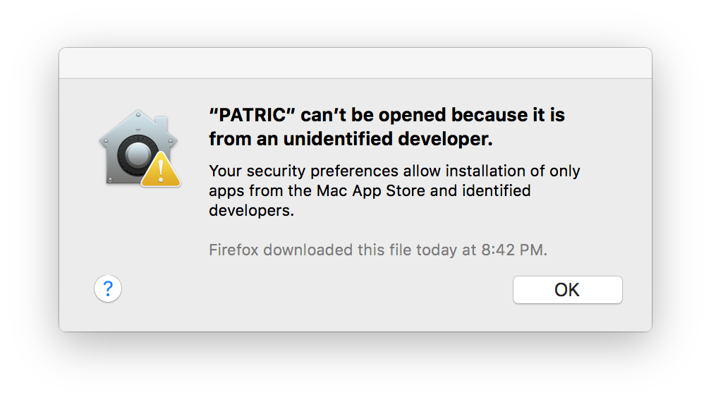
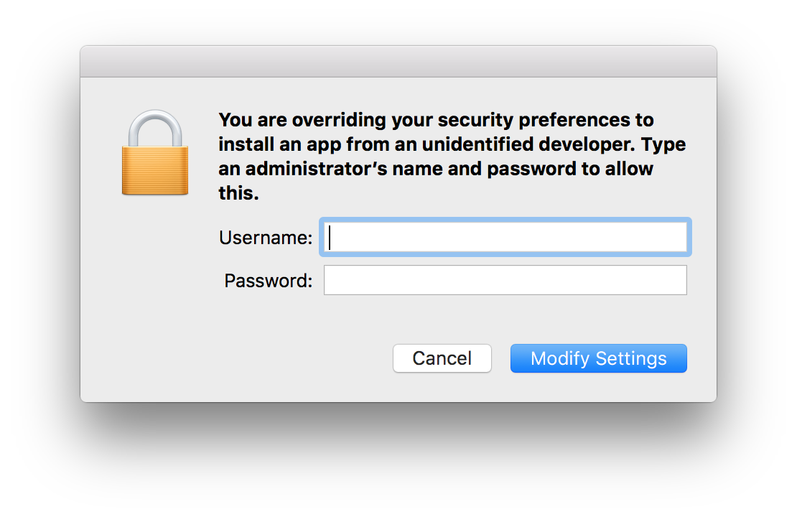
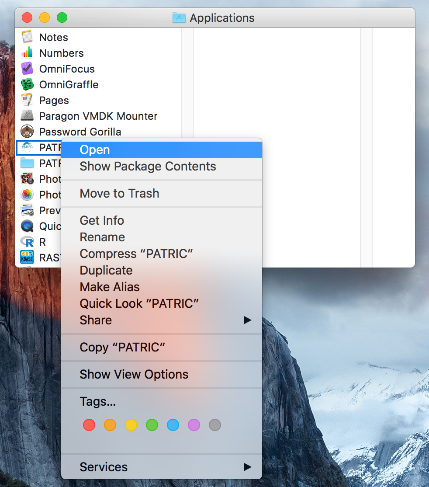
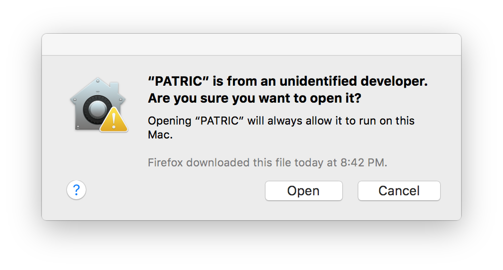

.. _cli-installation:

==============================================
 Installing the PATRIC Command Line Interface
==============================================

The PATRIC project supports the PATRIC command line on the following systems:

 * Apple computers running macOS version 10.11 (El Capitan) or newer. 

 * PCs running Ubuntu Linux version 14 or newer.

 * PCs running Debian Linux or other Linux distributions derived from Debian (e.g. Mint).

 * PCs running Windows 7 or newer. 

Distribution packages for the releases may be found at the `PATRIC github release site 
<https://github.com/PATRIC3/PATRIC-distribution/releases>`_. 

The installation details differ between the major operating systems. We will discuss each in turn.

Installation on macOS
=====================

The macOS version of the PATRIC command line interface is distributed
as a disk image file. We recommend downloading the most recent version
listed at  the `PATRIC github release site
<https://github.com/PATRIC3/PATRIC-distribution/releases>`_.

Download the release disk image file by clicking on the link named PATRIC-<version>.dmg. Your
browser will begin the download and save the file to your downloads
directory.

If you are using Safari, the download may be found by clicking on the
download status icon near the top right of window, or by going to the
View menu and clicking "Show Downloads.

|safari_download_image|

If you are using Google Chrome, the downloaded file will appear in an icon
at the bottom of the Chrome window:

|chrome_download_image|

If you are using Firefox, you will first be prompted to download the
binary file:

|firefox_download_image|

Select "Save File". The file download status will appear in the top right of
the window; click on the download icon to view the status and to open
the downloaded document:

|firefox_download_image_2|

When the download is complete (depending on your internet speed it may
take several minutes since the disk image is 200 megabytes
in size), open the image by clicking on the downloaded file
``PATRIC-1.018.dmg``. 

The disk image will open and the following window will appear:

|mac_disk_image|

To install the distribution, drag the PATRIC icon onto the
Applications icon. This will copy the PATRIC distribution into the
Applications folder on your computer. 

|mac_install_copy_dialog|

If you already an installation
of the PATRIC toolkit on your computer you will see the following
dialog:

|mac_overwrite_installation|

Select "Replace" to replace your existing installation with the
new one. 

Bring up a Finder window showing the Applications folder. You can do
this by clicking the desktop background to bring Finder to the front,
and selecting the Go menu and choosing Applications.

To start PATRIC the first time, you will need to start it in a way
that is a little clumsy. This is due to the security mechanisms in
macOS that protect users from unguarded downloads of applications from
the Internet.

You will know you need to do this if you doubleclick the PATRIC icon
and see this dialog:

|mac_unidentified_developer|

If you see this, instead of doubleclicking the PATRIC icon,
right-click it and select Open:

|mac_right_click_open|

If your user account has administrative privileges you will be
prompted to allow the application to open. Click "Open" to allow the
application to proceed:

|mac_unidentified_developer_admin|

If your user account does not have administrative privileges, you will
be prompted for an administrative account username and password:

|mac_unidentified_developer_override|

The PATRIC icon will bounce in the dock, possibly for several seconds
the first time, and then a Terminal window will open with the command
line interface prompt:

|mac_cli_window|

Installation on Debian / Ubuntu / Mint Linux
============================================

The version of the PATRIC command line interface packaged for Debian
Linu and its derivative distributions (Ubuntu, Mint, etc) is provided
as a Debian ``.deb`` distribution file. The release is named
``patric-cli-<version>.deb`` and may be found on the 
`PATRIC github release site                                                                       
<https://github.com/PATRIC3/PATRIC-distribution/releases>`_. 

There are several options for installation. The simplest is to
download the installer using a command line tool, and install with
``dpkg``. This method requires a followup call to ``apt-get`` to
resolve dependencies (here, we are installing version 1.024)::

  curl -O -L https://github.com/PATRIC3/PATRIC-distribution/releases/download/1.024/patric-cli-1.024.deb
  sudo dpkg -i patric-cli-1.024.deb
  sudo sudo apt-get -f install

It may be simpler to install using the ``gdebi`` tool as it handles
dependency management itself. Ubuntu does not have ``gdebi`` installed
by default so you will need to install it first::

   sudo apt-get install gdebi-core

Then to install with gdebi::

   sudo gdebi patric-cli-1.024.deb

When the install has completed, the PATRIC command line tools will be
available for you to use. They are installed in the system binary
directory ``/usr/bin`` which is accessible in your default
environment.

If you see an error like the following::

    $ sudo gdebi patric-cli-1.025.deb 
    Reading package lists... Done
    Building dependency tree        
    Reading state information... Done
    Reading state information... Done
    This package is uninstallable
    Dependency is not satisfiable: libanyevent-perl

there are a couple possibilities. First, on Ubuntu the PATRIC package
requires the Universe repository to be enabled. This can be done in the user interface. 
Open software center. Click on 'edit' and then 'software
sources' to open the software sources window. Once that is open, check
the box that says, "Community-maintained free and open-source software
(universe)."

This can also be done with the command line::

    sudo add-apt-repository universe

If the Universe repository was already in place, your package cache may be out of date. This may
be updated using::

    sudo apt-get update

Installation on Windows
=======================

The macOS version of the PATRIC command line interface is distributed
as a Windows installation package. The release is named
``PATRIC-<version>.exe`` and may be found on `PATRIC github release site
<https://github.com/PATRIC3/PATRIC-distribution/releases>`_.

Download the PATRIC installer file by clicking on the link named ``PATRIC-<version>.exe``. Your
browser will begin the download and save the file to your downloads
directory.

Start the installer by doubleclicking the downloaded file. This will
start the installation process. You should be able to take the
defaults for all of the options.

When the installation has completed, you may start a PATRIC command
line window by going to the Start Menu, select All Programs, and then
PATRIC.

.. |safari_download_image| image:: images/safari_download_image.png
.. |chrome_download_image| image:: images/chrome_download_image.png
.. |firefox_download_image| image:: images/firefox_download_image.png
.. |firefox_download_image_2| image:: images/firefox_download_image_2.png
.. |mac_disk_image| image:: images/mac_disk_image.png
.. |mac_install_copy_dialog| image:: images/mac_install_copy_dialog.png
.. |mac_overwrite_installation| image:: images/mac_overwrite_installation.png
.. |mac_cli_window| image:: images/mac_cli_window.png

.. |mac_unidentified_developer_open| image:: images/mac_unidentified_developer_open.png

