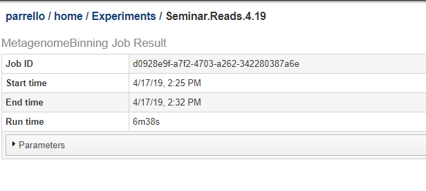

.. _cli-services:

=============================================
 Using PATRIC Services from the Command Line
=============================================

Each of computational services offered at the PATRIC web site is also
available to PATRIC command line users. We provide this access to
enable the efficient processing of batches of data and to enable
integration with existing data processing pipelines.

Most service-based data analyses in PATRIC follow a similar pattern. A
PATRIC user either uploads his data to the PATRIC workspace or chooses
data already in the PATRIC workspace from a previous upload or as the
output of an earlier analysis run. He then chooses an analysis to
perform, and constructs a description of the input parameters to the
analysis. He submits a request to PATRIC to perform the analysis and
awaits the run to complete. When the run is complete, the user may
either view the results on the PATRIC website or download the output
data to his computer for further processing and reporting.

When one uses the PATRIC website for analyzing data using the PATRIC
services, all interactions for uploading and downloading data,
choosing parameters, and running the service take place using
interactive web forms on the PATRIC website.

When we move to the command line, each interaction with the PATRIC
website is replaced with the invocation of a command line tool. We
will work through an example to make these concepts clear.

One of the commonly used services at PATRIC is the genome assembly
service. This service takes as input one or more sequence read
libraries and given on a set of parameters creates an assembled
genome.

In this example, let us assume we have the following two paired-end
read libraries, one single-end read library, and a reference
assembly::

   reads_A_1.fastq
   reads_A_2.fastq
   reads_B_1.fastq
   reads_B_2.fastq
   reads_C.fastq
   ref.fa

We'll also assume that these files are all residing on a computer that
has the PATRIC command line tools installed and that we have set up
our command line environment (see :ref:`cli-getting-started` for more
information).

To use the command line services we need to be logged in to PATRIC::

 $ p3-login PatricUser
 You are logged in as PatricUser

Since the read files are large, we will copy them to our PATRIC
workspace before we submit the assembly job. The ``p3-cp`` command
will copy data from our local machine to a folder in the
workspace. The ``ws:`` notation is used to specify that the target
path is in the PATRIC workspace::

 $ ls *.fastq *.fa
 reads_A_1.fastq reads_A_2.fastq reads_B_1.fastq reads_B_2.fastq  reads_C.fastq ref.fa
 $ p3-mkdir /PatricUser@patricbrc.org/home/AssemblyJob
 $ p3-cp *.fastq *.fa ws:/PatricUser@patricbrc.org/home/AssemblyJob
 Copying reads_A_1.fastq (XXX bytes)
 Copy completed in 30 seconds
 Copying reads_A_2.fastq (XXX bytes)
 Copy completed in 30 seconds
 Copying reads_B_1.fastq (XXX bytes)
 Copy completed in 30 seconds
 Copying reads_B_2.fastq (XXX bytes)
 Copy completed in 30 seconds
 Copying reads_C.fastq (XXX bytes)
 Copy completed in 30 seconds
 Copying ref.fa (XXX bytes)
 Copy completed in 30 seconds
 $ p3-ls /PatricUser@patricbrc.org/home/AssemblyJob

We will later see an example where the data copy operation is
performed by the service submission script.

Now that we have uploaded our input data we may submit our assembly
job. The PATRIC service submission scripts are all named starting with
``p3-submit``; the assembly service is thus named
``p3-submit-genome-assembly``. We can use the ``--help`` option to
determine the available options::

 $ p3-submit-genome-assembly --help
 p3-submit-assembly [-h] output-path output-name
     --recipe		      Assembly recipe
    --reference-assembly STR      Reference set of assembled DNA contigs
    --paired-end-lib P1 P2
    --single-end-lib LIB
    --workspace-path-prefix STR   Prefix for workspace pathnames
                      as given to library parameters

We may now submit our assembly job. We will use the
``--workspace-path-prefix`` parameter to shorten the library names
that we are passing to the command::

 $ p3-submit-genome-assembly --recipe auto \
     --workspace-path-prefix '/PatricUser@patricbrc.org/home/AssemblyJob' \
     --paired-end-lib ws:reads_A_1.fastq ws:reads_A_2.fastq  \
     --paired-end-lib ws:reads_B_1.fastq ws:reads_B_2.fastq  \
     --single-end-lib ws:reads_C.fastq \
     --reference-assembly ws:ref.fa \
     '/PatricUser@patricbrc.org/home/AssemblyRuns' \
     job-ABC-auto
 Job submitted: ace5ad73-db90-49d4-b854-8ab7290abb77
 Output will be written to /PatricUser@patricbrc.org/home/AssemblyRuns/.job-ABC-auto

Once the job is submitted we may use the ``p3-job-status`` command to
determine if the job is queued, running, or completed::

 $ p3-job-status ace5ad73-db90-49d4-b854-8ab7290abb77
 ace5ad73-db90-49d4-b854-8ab7290abb77: complete

When the job is complete, we can browse the output of the job. The
output files for the job are written to the workspace in a directory
that is named as the output name for the job prefixed with a period::

 $ p3-ls '/PatricUser@patricbrc.org/home/AssemblyRuns/.jobABC-auto'

A general-purpose script, ``appserv-start-app`` can be used to submit a job to any
PATRIC service.  In order to do this, you need to specify the service ID, a JSON file
containing the parameters, and the path to a PATRIC workspace (usually your home workspace).

We will show an example of how to do this for the Metagenome Binning Service (see
:doc:`/tutorial/metagenomic_binning/metagenomic_binning` service).

You can see a copy of the parameter json on the job results page.  Below, we show
the top of a job results page.  Click on the **Parameters** bar to expand it and see
the JSON string for the parameters.

The JSON string from the above job is shown below.::

 {
   "contigs": null,
   "srr_ids": null,
   "output_file": "Seminar.Reads.4.19",
   "skip_indexing": "0",
   "output_path": "/parrello@patricbrc.org/home/Experiments",
   "genome_group": "Seminar.Reads.4.19",
   "paired_end_libs": [
     "/rastuser25@patricbrc.org/Binning.Webinar/SRS014683_extract.1.fq",
     "/rastuser25@patricbrc.org/Binning.Webinar/SRS014683_extract.2.fq"
   ]
 }

Here the input is a pair of paired-end read files.  If contigs were being submitted, ``paired_end_libs`` would be ``null``
and the contig file name would be specified as a string in the ``contigs`` member.

This job is being run by ``parrello@patricbrc.org``, so the home workspace is ``parrello@patricbrc.org/home/``.
If we put the above JSON in a file named ``params.json``, the submit command would be::

 appserv-start-app MetagenomeBinning params.json "parrello@patricbrc.org/home/"

The script will respond with a job identifier, and the job will appear in your running-jobs list.

