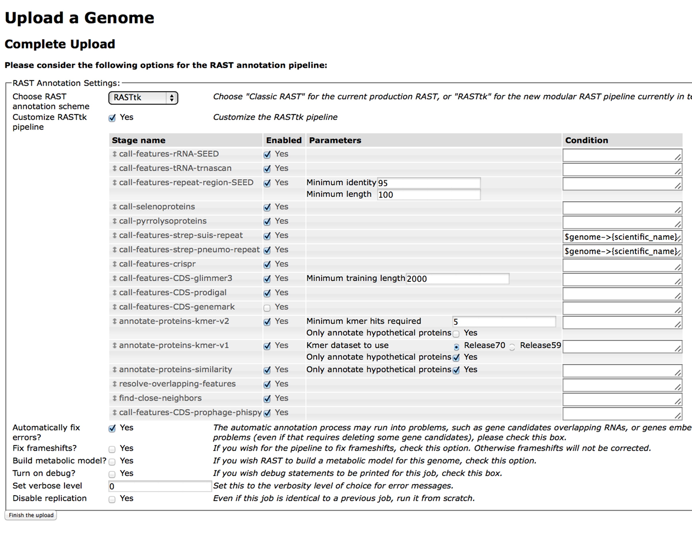

.. _rasttk-batch-mode:

Using the RAST tool kit in batch mode
=====================================

Welcome to the tutorial on submitting genomes to the RASTtk service in
BV-BRC in batch mode.  You can follow this tutorial by using the
BV-BRC Command Line Interface. We recommend that you first familiarize
yourself with the RASTtk commands in the tutorials,
:ref:`rasttk-getting-started` and :ref:`rasttk-incremental-commands`.

How to perform a default pipeline batch submission
--------------------------------------------------

We will start by logging in to IRIS or by opening the BV-BRC Command
Line Interface.  You will need to log into BV-BRC by typing the
following command::

    p3-login   username

The username and password are your BV-BRC account username and password.

Navigate to a directory where you are comfortable working.

In order to demonstrate the submission of a batch of genomes we will
start by making a new directory. Type::

    mkdir ToSubmit

Please remain in the current working directory. We will populate
"ToSubmit" momentarily.

Next we will download the contig files for *E. coli* and *B. subtilis*
from BV-BRC into our current working directory. Type::

    p3-genome-fasta --contig 511145.12 > E_coli.contig    
    p3-genome-fasta --contig 224308.43  >B_subtilis.contig

Then we will will convert these to genome typed objects and place them
into "ToSubmit". Type::

    rast-create-genome --scientific-name "Escherichia coli K-12" --genetic-code 11 --domain Bacteria --contigs E_coli.contig > ToSubmit/E_coli 

    rast-create-genome --scientific-name "Bacillus subtilis 168" --genetic-code 11 --domain Bacteria --contigs B_subtilis.contig > ToSubmit/B_subtilis 

Now we have two files called "E\_coli" and "B\_subtilis" which have been
converted to genome typed objects and are waiting to be submitted. If
you were annotating your own genomes, the process would be the same. You
would first need to convert your contigs in fasta format into genome
typed objects with the appropriate metadata. It is the directory of
genome typed objects that is then sent to the RAST server.

Now we will submit the entire directory, "ToSubmit" to be processed by
RASTtk. This command uses the RASTtk default pipeline::

    rast-process-genome-batch ToSubmit 

This command returns a job id, which you should save. Mine is:
9f0d6d9a-c686-4b55-af6f-e0df59b0bb01

You can query the status of your job by using the command
**rast-query-genome-batch** . Try it::

    rast-query-genome-batch  your job id

If your job is running you will get a response from the server that
looks like this::

    kb|g.220035 in-progress 2014-07-29T08:48:36.733-05:00   0001-01-01T00:00:00Z            
    kb|g.220034 in-progress 2014-07-29T08:48:36.758-05:00   0001-01-01T00:00:00Z            

If your job is completed you will get a response from the server that
looks like this::

    kb|g.220035 completed   2014-07-29T08:48:36.733-05:00   2014-07-29T08:49:54.069-05:00   http://redwood.mcs.anl.gov:7078/node/751a0a8c-e13b-420d-84de-b2acdb79dd67?download  http://redwood.mcs.anl.gov:7078/node/dc44ef34-3855-42ea-bbb6-0294a5c91a47?download  http://redwood.mcs.anl.gov:7078/node/6e2be0e9-d3c9-4cc7-9eae-c821e30c2e01?download
    kb|g.220034 completed   2014-07-29T08:48:36.758-05:00   2014-07-29T08:50:09.486-05:00   http://redwood.mcs.anl.gov:7078/node/f295435a-247f-45e6-87a2-772915561759?download  http://redwood.mcs.anl.gov:7078/node/d7c7ff6f-7ae4-48a2-aea3-11afe89a1805?download  http://redwood.mcs.anl.gov:7078/node/a7abccc6-1534-42b1-abbc-51ae71390907?download

We will create a new directory for the output of our RASTtk job. Type::

    mkdir Output

When your job is completed, you can download it into the directory
"Output" by typing::

    rast-download-genome-batch  your job id Output

This will download an annotated genome typed object for each genome.

Navigate to the Output directory by typing::

    cd Output

if you type::

    ls

You will see the contents of the output directory.

::

    B_subtilis.gto     
    B_subtilis.stderr
    B_subtilis.stdout  
    E_coli.gto
    E_coli.stderr
    E_coli.stdout

The files with the file extension, ".gto" are the annotated genome typed
objects and the ".stderr" files provide a record of what annotation
steps the RAST server performed. The .stdout file reports the temporary
directory where the computation was performed one the server.

Finally, we can convert the genome typed objects to the format we desire
by using **rast-export-genome**. For instance, I will convert the *E.
coli* genome to a genbank file by typing::

    rast-export-genome genbank < E_coli.gto > E_coli.gbk

That's all there is to it. Running the default RASTtk pipeline in batch
mode centers around the commands **rast-process-genome-batch** and
**rast-download-genome-batch**. The most difficult parts are creating
the initial directory of genome typed objects and and the conversion of
the downloaded genome typed objects into useful output using
"rast-export-genome". When you are annotating a directory with many
genomes it may be necessary to write a script that does this pre- and
post-processing for you.

How to perform a customized batch submission
--------------------------------------------

If you are still in the directory "Output/", please move back a level by
typing::

    cd ../

To demonstrate a custom batch mode submission, we will reannotate the
*E. coli* and *B. subtilis* genome typed objects that we originally put
in the "ToSubmit" directory. We will customize this submission by adding
the prophage finder, PhiSpy.

Customizing a batch submission is nearly the same process as a default
batch submission except that that it requires that you submit a special
file declaring the steps of the custom pipeline that you wish to run. In
order to do this, we use **rast-process-genome-batch** and we provide
the workflow file document using the --workflow flag.

Please click the link below to look at the file that we are about to
use. Notice that it contains a field called "stages" under which every
every step is declared with a key called "name". Special program options
such as "condition" and "paramaters" can also appear in this file under
each named step. Notice that at the bottom of the file one of the named
steps is "call\_features\_prophage\_phispy".

`A Sample Workflow File <Workflow.txt>`__

Please download this file by right clicking (or control-clicking) the
link. We will name the file Workflow.txt. Then save it to your current
working directory. If you are working in IRIS you should upload it to
your working directory after you have saved it on your computer.

Now lets submit the custom annotation job. Please type::

    rast-process-genome-batch --workflow Workflow.txt ToSubmit

You can check the status of your job with **rast-query-genome-batch**
the same as before.

When your job is complete, you can download it. First we will make a
directory called "Customized"::

    mkdir Customized

Download the genome::

    rast-download-genome-batch  your-job-id Customized

If you look at the new directory, it will have the same file names as
before.

Now we will export a genome::

    rast-export-genome feature_data  < Customized/E_coli.gto >E_coli.tbl

Notice that new file contains the prophage calls.

Generating workflow documents the easy way
~~~~~~~~~~~~~~~~~~~~~~~~~~~~~~~~~~~~~~~~~~

If generating a RASTtk workflow document seems unpleasant to you, then
you're in luck. It is possible to generate a workflow document using the
`RAST <http://rast.nmpdr.org>`__ website.

If you submit a genome on the RAST website using the RASTtk option, and
you select "Customize RASTtk pipeline" it will bring up a table of
options that looks like this:

|image0|

You can select from the available steps that you want to have in your
custom pipeline and click "Finish the upload". When you click, "View Job
Details", You will see a page that looks like this:

|image1|

The workflow file is available by clicking the "Download" button.

.. |image1| image:: images/Job_Details.png
   :width: 600px
