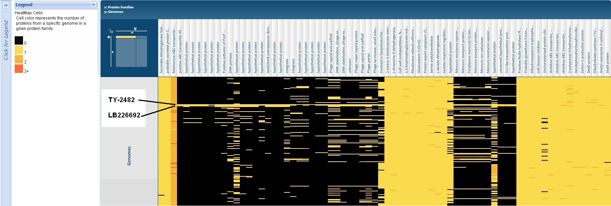

:github_url: https://github.com/PATRIC3/p3_docs/blob/master/docroot/news/2011/20110608-e-coli-outbreak-new-comprehensive-comparisons.rst

===============================================
E. coli outbreak: New Comprehensive Comparisons
===============================================

.. feed-entry::
   :date: 2011-06-08

An outbreak of *Escherichia coli* causing a severe illness
called \ `hemolytic-uremic
syndrome <http://en.wikipedia.org/wiki/Hemolytic-uremic_syndrome>`__
(HUS) began in Germany in May 2, 2011 and has killed more than 20 people
and sickened more than 2,000.  The organism causing the outbreak has
been identified as a strain of *E. coli* O104:H4 that produces a Shiga
toxin and causes an illness similar to infection with *E. coli*
O157:H7.  Two isolates from this outbreak have been sequenced.  Both
strains, TY-2482 (sequenced by the Beijing Genomics Institute in
collaboration with University Medical Centre Hamburg-Eppendorf with 12X
coverage from IonTorrent PGM:
`assembly <ftp://ftp.genomics.org.cn/pub/Ecoli_TY-2482/Escherichia_coli_TY-2482.contig.20110606.fa.gz>`__)
and LB226692, (sequenced by Life Tech in collaboration with the
University of Muenster with 28X coverage from IonTorrent PGM:
`assembly <http://www.ncbi.nlm.nih.gov/nuccore/334717079>`__) have been
annotated and are now available at `PATRIC Bioinformatics Resource
Center <http://patricbrc.org/>`__.

The two genomes have been annotated using
`RAST <http://patricbrc.org/portal/portal/patric/RAST>`__, making them
consistent with the 184 *E. coli* genomes and the total 2,865 bacterial
genomes available at PATRIC.  The proteins conserved across all *E.
coli* have been used to generate a preliminary phylogenetic tree that is
based on 166640 characters across 527 genes in 354 taxa.  This tree,
shown below shows that the two new strains are most closely related to
the pathogenic, enteroaggregative strain 559899.

.. raw:: html

   <h6 style="text-align: center;">

.. raw:: html

   </h6>

.. raw:: html

   <h6 style="text-align: center;">

Click Image to enlarge.

.. raw:: html

   </h6>

Click
`here <http://patricbrc.org/portal/portal/patric/Phylogeny?cType=taxon&cId=561>`__
to view this tree in its interactive form on the PATRIC Website.

The proteins from these two new pathogenic strains can be compared to
other bacterial genomes using the PATRIC Protein Family Sorter.  An
example of this, showing two of several unique islands that have been
identified in these two genomes is provided in the figure below and in
interactive form on the PATRIC Website by clicking
`here <http://patricbrc.org/portal/portal/patric/FIGfamSorterB?cType=taxon&cId=561&dm=result>`__
and then selecting the “Heatmap” tab.

See the `Protein Family Sorter
FAQs <../../../../../protein-family-sorter/>`__ for help in using the
sorter.  An Excel file with tabs containing lists of proteins in these
islands is available by clicking :download:`E coli protein islands <../files/201100/E-coli-protein-islands.xlsx>`.

.. raw:: html

   <h5 style="text-align: center;">

Click Image to enlarge.

.. raw:: html

   </h5>

For a comparison of the RAST annotations with the other publicized
annotation click `here. <http://theseed.org/ecoli/>`__

Much of the information in PATRIC is updated on an ongoing basis.   Such
as:

-  Interactive Disease maps with outbreak information.  Click
   `here <http://patricbrc.org/portal/portal/patric/DiseaseOverview?cType=taxon&cId=562>`__
   and then select the Disease Map tab.
-  The PATRIC Google news search for countermeasures and other
   information.  Click
   `here <http://patricbrc.org/portal/portal/patric/GSearch?dm=countermeasure&kw=Escherichia+coli+TY-2482>`__.

Many laboratories are analyzing these genomes and providing data to the
research community.  PATRIC is performing additional analyses, including
collecting a list of the important genes identified, and will be
providing gene trees and multiple sequence alignments of the genes with
their closest homologs, which we will release as additional news items. 
For updates:

-  Check the `PATRIC News Page <../../../../../>`__.
-  Follow us on `Twitter <http://twitter.com/PATRICBRC>`__.
-  Follow us on
   `Facebook <http://www.facebook.com/pages/Pathosystems-Resource-Integration-Center-PATRIC/117100971687823>`__.

For quarterly PATRIC updates on current PATRIC and PATRIC-related
research, new PATRIC functionality, and PATRIC grant opportunities,
please `sign up for our PATRIC
Newsletter <../../../../../subscribe/>`__.
