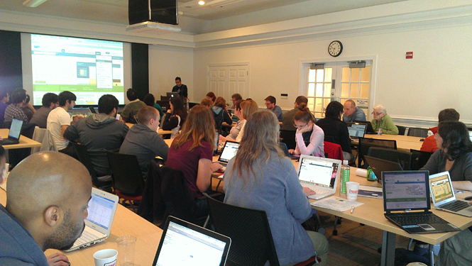

:github_url: https://github.com/PATRIC3/p3_docs/blob/master/docroot/news/2012/20121011-patric-team-presents-workshop-at-duke-and-unc.rst

=============================================
PATRIC Team Presents Workshop at Duke and UNC
=============================================

.. feed-entry::
   :date: 2012-10-11

Rebecca Wattam, Maulik Shukla, and Joe Gabbard presented a day-long
workshop for over 50 researchers from UNC’s Department of Microbiology
and Immunology, Duke’s Department of Molecular Genetics and
Microbiology, and North Carolina State’s College of Veterinary Medicine.
The workshop showcased PATRIC’s comparative genomics tools, as well as
new transcriptomics analysis capabilities. The workshop also allowed the
PATRIC team to engage in one-one-one interactions with participants,
helping them analyze their data and understand how to best leverage
PATRIC for their research.

