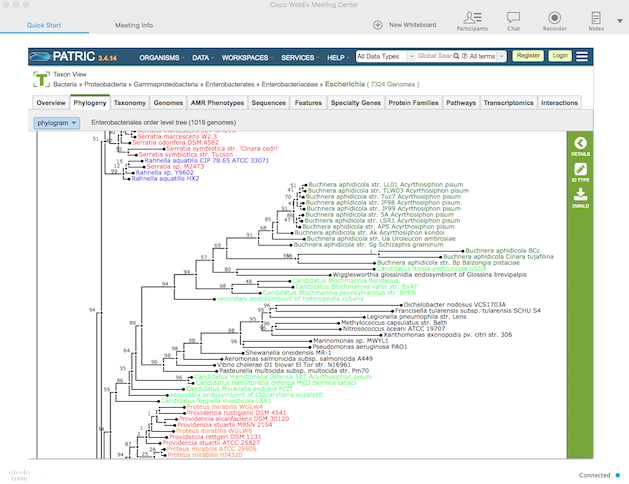

:github_url: https://github.com/PATRIC3/p3_docs/blob/master/docroot/news/20171122-patric-webinar.rst

PATRIC Webinar – Phylogenetic Tree Builder, November 30, 2017, 3:00pm EST
==========================================================================

.. feed-entry::
   :date: 2017-11-22

PATRIC now provides a new service that builds phylogenetic trees. The trees, which can include both private and public
data, are built using well-established methods for generating whole-genome phylogenies from amino acid sequences. On
November 30th at 3pm EST we will provide a webinar demonstrates this service. Please email rwattam@vt.edu if you plan to
attend so that we will know approximately how many participants to expect.

.. cut::

Webinar connection information:
--------------------------------

PATRIC Webinar
~~~~~~~~~~~~~~~

Thursday, November 30, 2017,

3:00 pm Eastern Standard Time (New York, GMT-05:00), 1 hr

Meeting number (access code): 317 850 406

`Add to Calendar <https://virginiatech.webex.com/virginiatech/j.php?MTID=m22555462c003c75d14a63bb08cb2232e>`__

When it’s time, `join the meeting
<https://virginiatech.webex.com/virginiatech/j.php?MTID=m34566c7b9cb53eb80a4067be9331e760>`__.

Audio Connection Options
~~~~~~~~~~~~~~~~~~~~~~~~~

**Call Using Computer**

Virginia Tech prefers users call using their computer, as this allows video & screen sharing, as well as reducing costs
to the University. Once you join the meeting on your computer (or the WebEx App), click **Call Using Computer** (or
**Call over Internet**) to connect. This is the preferred method as Virginia Tech is not billed additionally for this
meeting.

**Other Call-In Options**

Calling in by phone won’t allow video or screen sharing, and charges to Virginia Tech apply.

If you can’t call using computer, but have free long distance, call 1-415-655-0001. If you don’t have free long
distance, or are not sure, call 1-855-749-4750.

`Can’t join the meeting? <https://help.webex.com/docs/DOC-5412>`__

IMPORTANT NOTICE: Please note that this WebEx service allows audio and other information sent during the session to be
recorded, which may be discoverable in a legal matter. By joining this session, you automatically consent to such
recordings. If you do not consent to being recorded, discuss your concerns with the host or do not join the session.