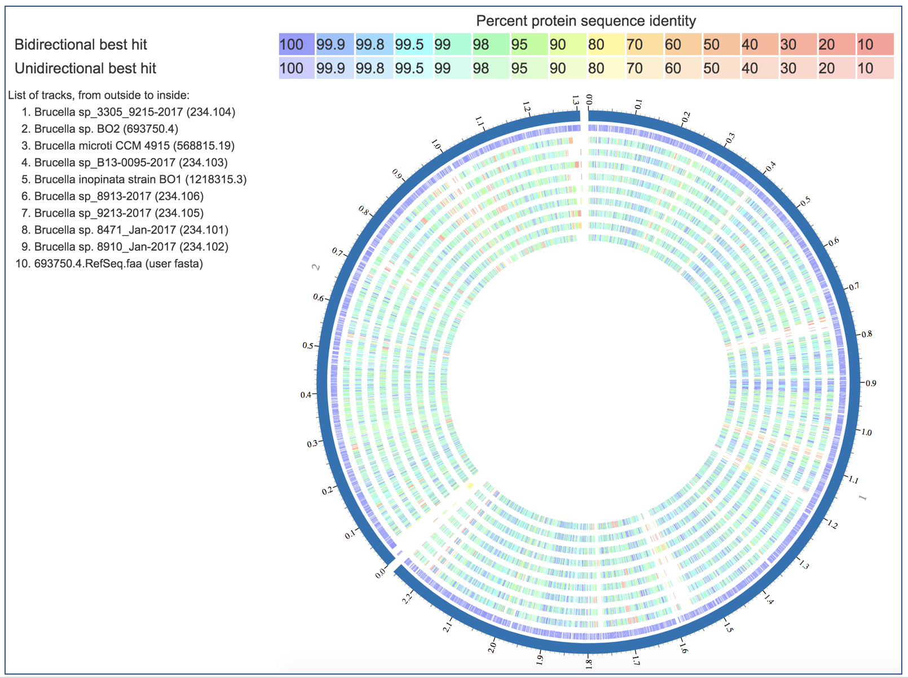

:github_url: https://github.com/PATRIC3/p3_docs/blob/master/docroot/news/2018/20180125-proteome-comparison-webinar.rst

PATRIC Webinar – Proteome Comparison Service, January 30, 2018, 4:00pm EST
==========================================================================

.. feed-entry::
   :date: 2018-01-25

PATRIC provides a service that allows researchers to compare annotated proteins by bi-directional BLASTP analysis.  The Proteome Comparison tool can be used to examine up to compare nine genomes to single reference, which can be a genome that has been annotated in PATRIC or from an independent source, or a group of proteins.  On January 30th at 4pm EST we will provide a webinar demonstrates this service. Please email rwattam@vt.edu if you plan to attend so that we will know approximately how many participants to expect. The webinar will be recorded and made available for later access.

.. cut::

Webinar connection information:
--------------------------------

PATRIC Webinar
~~~~~~~~~~~~~~~

Tuesday, January 30, 2018,

4:00 pm Eastern Standard Time (New York, GMT-05:00), 1 hr

<https://virginiatech.webex.com/virginiatech/j.php?MTID=m2b9bf8ee0ba76fa73fc65a0dd734f859>

Meeting number (access code): 641 088 085

Audio Connection Options
~~~~~~~~~~~~~~~~~~~~~~~~~

**Call Using Computer**

Virginia Tech prefers users call using their computer, as this allows video & screen sharing, as well as reducing costs to the University. Once you join the meeting on your computer (or the WebEx App), click Call Using Computer (or Call over Internet) to connect. This is the preferred method.

**Other Call-In Options**
If you can't call using computer, but have free long distance, call 1-415-655-0001.
If you don't have free long distance, or are not sure, call 1-855-749-4750.

Can't join the meeting? Contact support here:
<https://virginiatech.webex.com/virginiatech/mc>

IMPORTANT NOTICE: Please note that this WebEx service allows audio and other information sent during the session to be recorded, which may be discoverable in a legal matter. You should inform all meeting attendees prior to recording if you intend to record the meeting.
