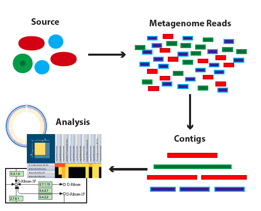

:github_url: https://github.com/PATRIC3/p3_docs/blob/master/docroot/news/2018/20180213-metagenomic-binning-webinar.rst

PATRIC Webinar – Metagenomic Binning Service, Wednesday February 28, 2018, 3:00pm EST (20:00 GMT)
=================================================================================================

.. feed-entry::
   :date: 2018-02-13

PATRIC provides a new Metagenomic Binning Service that accepts either reads or contigs, and attempts to "bin" the data into a set of genomes. It can be used to reconstruct bacterial and archael genomes from environmental samples. The new service will produce reports that estimate the quality of the reconstructed genome for each bin, as well as potentially problematic annotations for each of the derived genomes.

On February 28th at 3pm EST we will provide a webinar demonstrates this service. Please email rwattam@vt.edu if you plan to attend so that we will know approximately how many participants to expect. The webinar will be recorded and made available for later access.

.. cut::

Webinar connection information:
--------------------------------

PATRIC Webinar
~~~~~~~~~~~~~~~

Wednesday, February 28, 2018

3:00 pm Eastern Standard Time (New York, GMT-05:00), 1 hr

<https://virginiatech.webex.com/virginiatech/j.php?MTID=m85170d102da7f8f64147a694bd09591f>

Meeting number (access code): 649 723 633

Audio Connection Options
~~~~~~~~~~~~~~~~~~~~~~~~~

**Call Using Computer**

Virginia Tech prefers users call using their computer, as this allows video & screen sharing, as well as reducing costs to the University. Once you join the meeting on your computer (or the WebEx App), click Call Using Computer (or Call over Internet) to connect. This is the preferred method.

**Other Call-In Options**
If you can't call using computer, but have free long distance, call 1-415-655-0001.
If you don't have free long distance, or are not sure, call 1-855-749-4750.

Can't join the meeting? Contact support here:
<https://virginiatech.webex.com/virginiatech/mc>

IMPORTANT NOTICE: Please note that this WebEx service allows audio and other information sent during the session to be recorded, which may be discoverable in a legal matter. You should inform all meeting attendees prior to recording if you intend to record the meeting.
