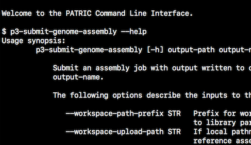

:github_url: https://github.com/PATRIC3/p3_docs/blob/master/docroot/news/2018/20180628-assembly-cli-webinar.rst

PATRIC Webinar – Genome Assembly via Command Line Interface, July 19, 2018, 3:00pm EDT
======================================================================================

.. feed-entry::
   :date: 2018-06-28

PATRIC provides a Genome Assembly Service for prokaryotes that allows single or multiple assemblers to be invoked to compare results. The service attempts to select the best assembly, i.e., assembly with the smallest number of contigs and the longest average contig length. Several assembly workflows or "recipes" are available.  

On July 19th at 3pm ET PATRIC will host a webinar demonstrates this capability using the PATRIC Command Line Interface (CLI). Please email rwattam@vt.edu if you plan to attend so that we will know approximately how many participants to expect.

.. cut::

Webinar connection information:
--------------------------------
Time: Jul 19, 2018 3:00 PM Eastern Time (US and Canada)

Join from PC, Mac, Linux, iOS or Android: https://virginiatech.zoom.us/j/634111742

Or iPhone one-tap :
    US: +16699006833,,634111742#  or +19294362866,,634111742# 

Or Telephone:
    Dial(for higher quality, dial a number based on your current location): 
        US: +1 669 900 6833  or +1 929 436 2866 
    Meeting ID: 634 111 742
    International numbers available: https://zoom.us/u/b2fXB2xSi

Or an H.323/SIP room system:
    H.323: 
        162.255.37.11 (US West)
        162.255.36.11 (US East)
        221.122.88.195 (China)
        115.114.131.7 (India)
        213.19.144.110 (EMEA)
        202.177.207.158 (Australia)
        209.9.211.110 (Hong Kong)
        64.211.144.160 (Brazil)
        69.174.57.160 (Canada)
    Meeting ID: 634 111 742

    SIP: 634111742@zoomcrc.com
