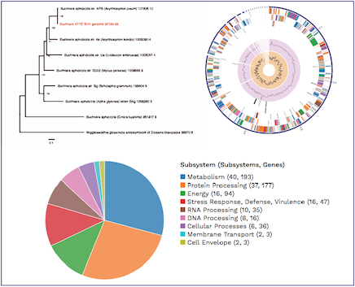

:github_url: https://github.com/PATRIC3/p3_docs/blob/master/docroot/news/2018/20180808-comprehensive-genome-analysis-webinar.rst

PATRIC Webinar – Comprehensive Genome Analysis Service, August 8, 2018, 2:00pm ET
======================================================================================

.. feed-entry::
   :date: 2018-07-30

PATRIC’s new Comprehensive Genome Analysis Service provides a streamlined automated workflow that accepts raw reads and then performs a comprehensive analysis including assembly, annotation, identification of nearest neighbors, building a phylogenetic tree, and a basic comparative analysis that includes a subsystem summary. The service also indicates genome quality and provides quality statistics.  We will provide a webinar demonstrating this new service on August 8th at 2pm ET.  Please email rwattam@vt.edu if you plan to attend so that we will know approximately how many participants to expect.

.. cut::

Webinar connection information:
--------------------------------
Time: Aug 8, 2018 2:00 PM Eastern Time (US and Canada)

Join from PC, Mac, Linux, iOS or Android: https://virginiatech.zoom.us/j/428648372

Or iPhone one-tap :
    US: +16699006833,,428648372#  or +19294362866,,428648372# 
Or Telephone:
    Dial(for higher quality, dial a number based on your current location): 
        US: +1 669 900 6833  or +1 929 436 2866 
    Meeting ID: 428 648 372
    International numbers available: https://zoom.us/u/dlJekh32y

Or an H.323/SIP room system:
    H.323: 
        162.255.37.11 (US West)
        162.255.36.11 (US East)
        221.122.88.195 (China)
        115.114.131.7 (India)
        213.19.144.110 (EMEA)
        202.177.207.158 (Australia)
        209.9.211.110 (Hong Kong)
        64.211.144.160 (Brazil)
        69.174.57.160 (Canada)
    Meeting ID: 428 648 372

    SIP: 428648372@zoomcrc.com

Or Skype for Business (Lync):
    https://virginiatech.zoom.us/skype/428648372

