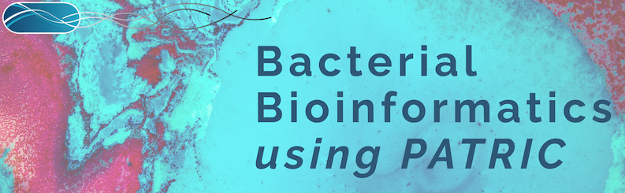

:github_url: https://github.com/PATRIC3/p3_docs/blob/master/docroot/news/2020/20201022-mooc-release.rst

New PATRIC Online Bacterial Bioinformatics Course
=================================================

.. feed-entry::
   :date: 2020-10-22

We have released a new online Bacterial Bioinformatics course, freely available through Coursera. The course has biologically based lessons for PATRIC services including genome assembly, annotation, comprehensive genome analysis, phylogenetic trees, finding similar genomes, comparing protein families, and proteome comparison. 

- `Register for free here <https://www.coursera.org/learn/informatics#about>`_.

.. cut::

Below is a link to flyer with additional information about the course.

