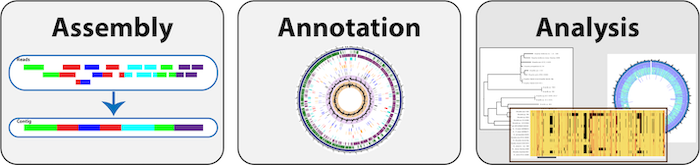

:github_url: https://github.com/PATRIC3/p3_docs/blob/master/docroot/news/2021/20210201-new-webinar-series.rst

Bioninformatics Resource Center Webinar Series
==============================================

.. feed-entry::
   :date: 2021-02-01

The Bioinformatic Resource Centers (BRC) have partnered to present a joint webinar series on Respiratory Pathogens and the tools available for their study. 

.. cut::

While much of the scientific focus of attention has been on the novel coronavirus, SARS-CoV-2, we will discuss other pathogens that may cause respiratory illness, or even co-occur with SARS-CoV-2. The Bacterial and Viral Bioinformatics Resource Center, (BV-BRC) will discuss viral and bacterial pathogens, whereas The Eukaryotic Pathogen, Host & Vector Genomics Resource (VEuPathDB), will focus on fungal pathogens and host response. Webinars will be structured to include a brief basic biology refresher on the pathogen of interest and a live demo of available tools for in silico research.

A special guest speaker will also be featured during each session. The IRD and ViPR will focus on the following viral families: Orthomyxoviridae (Influenza), Coronaviridae (various human coronavirus species), Pneumoviridae (RSV), and Picornaviridae (Enterovirus). Our counterparts at the Pathosystems Resource Integration Center (PATRIC) will discuss bacterial respiratory pathogens and antibacterial resistance, and showcase PATRIC’s bioinformatic tools. Finally our partners at VEuPathDB, will present data on Aspergillus and Candida, and introduce users to bioinformatic resources available at FungiDB and HostDB. A schedule is provided below.

Influenza & IRD
^^^^^^^^^^^^^^^
| **Date:** Tuesday February 16th, 2021
| **Time:** 11AM US Eastern Time
| **Recording:**
| **Additional Details:** This webinar focused on respiratory pathogens and introduced users to bioinformatic resources available at the Influenza Research Database.

Coccidioides & FungiDB
^^^^^^^^^^^^^^^^^^^^^^
| **Date:** Tuesday March 2nd, 2021
| **Time:** 11AM US Eastern Time
| **Recording Link:** https://youtu.be/SEWk0BvaWkc
| **Additional Details:** This webinar will feature a lecture from Dr Bridget Barker from Northern Arizona University and introduce users to bioinformatic resources available at FungiDB.org.

Coronaviridae & ViPR
^^^^^^^^^^^^^^^^^^^^
| **Date:** Tuesday March 16th, 2021
| **Time:** 11AM US Eastern Time
| **Registration:** https://jcvi.webex.com/jcvi/j.php?RGID=r2bbbbd00a3c3606b0c8f8abc232b2f94
| **Additional Details:** This webinar will focus on respiratory pathogens and introduce users to bioinformatic resources available at the Virus Pathogen Resource.

AMR, bacteria & PATRIC
^^^^^^^^^^^^^^^^^^^^^^
| **Date:** Tuesday March 30th, 2021
| **Time:** 11AM US Eastern Time
| **Registration:** https://jcvi.webex.com/jcvi/j.php?RGID=r6b68a005abac7a6f2679419fc25ec788
| **Additional Details:** This webinar will focus on respiratory pathogens and introduce users to bioinformatic resources available at the Pathosystems Resource Integration Center.

RSV, Pneumoviridae & ViPR
^^^^^^^^^^^^^^^^^^^^^^^^^
| **Date:** Tuesday April 20th, 2021
| **Time:** 11AM US Eastern Time
| **Registration:** https://jcvi.webex.com/jcvi/j.php?RGID=r3305a49424c66191b85bc2d62611dc74
| **Additional Details:** This webinar will focus on respiratory pathogens and introduce users to bioinformatic resources available at the Virus Pathogen Resource.

Aspergillus and FungiDB
^^^^^^^^^^^^^^^^^^^^^^^
| **Date:** Tuesday May 4th, 2021
| **Time:** 11AM US Eastern Time
| **Registration:** https://jcvi.webex.com/jcvi/j.php?RGID=rc56f63b3a337eb29428a94f8c9234c07
| **Additional Details:** This webinar will focus on Aspergillus pathogens and introduce users to bioinformatic resources available at FungiDB.

Enterovirus, Picornaviridae & ViPR
^^^^^^^^^^^^^^^^^^^^^^^^^^^^^^^^^^
| **Date:** Tuesday May 18th, 2021
| **Time:** 11AM US Eastern Time
| **Registration:** https://jcvi.webex.com/jcvi/j.php?RGID=r92ea0b9b113ecdab29ccf51f45bdc209
| **Additional Details:** This webinar will focus on respiratory pathogens and introduce users to bioinformatic resources available at the Virus Pathogen Resource.

Bacterial Respiratory Pathogens & PATRIC
^^^^^^^^^^^^^^^^^^^^^^^^^^^^^^^^^^
| **Date:** Tuesday June 1st, 2021
| **Time:** 11AM US Eastern Time
| **Registration:** https://jcvi.webex.com/jcvi/j.php?RGID=re7dd05381f96e50405e90793bae8f838
| **Additional Details:** This webinar will focus on respiratory pathogens and introduce users to bioinformatic resources available at the Pathosystems Resource Integration Center.

|
| A full calendar of all BRC events is available at `BRC Event Calendar <https://brc-gateway.github.io/brc-gateway-website/outreach#calendar>`_.
