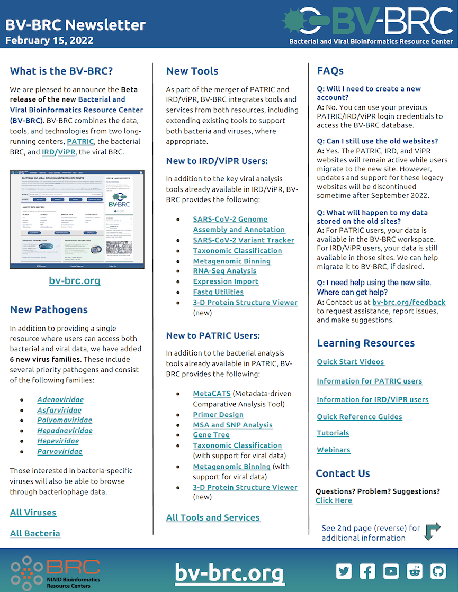
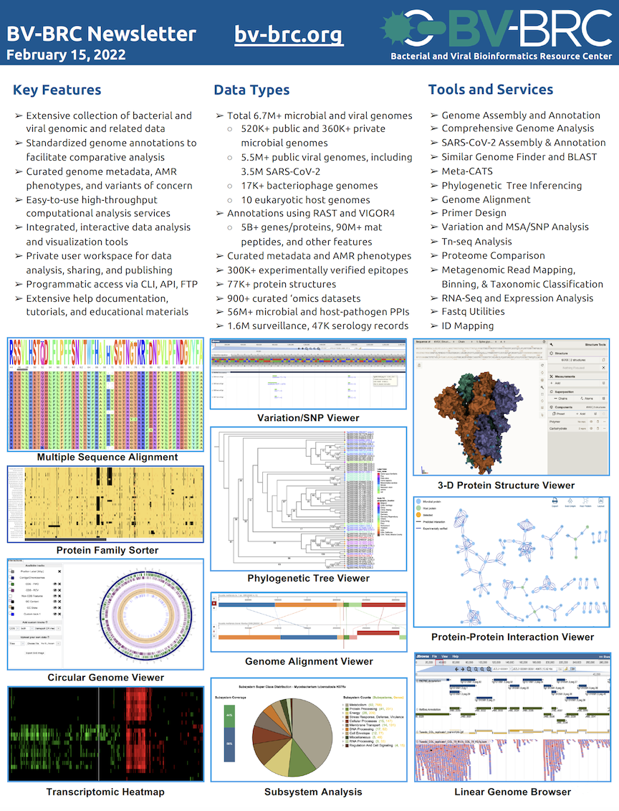

BV-BRC Public Beta Release
==========================

.. feed-entry::
   :date: 2022-02-15

We are pleased to announce the Beta release of the new `Bacterial and Viral Bioinformatics Resource Center (BV-BRC) <https://www.bv-brc.org>`_. BV-BRC combines the data, tools, and technologies from two long-running centers, `PATRIC <https://www.patricbrc.org>`_, the bacterial BRC, and `IRD <https://www.fludb.org>`_ / `ViPR <https://www.viprbrc.org>`_, the viral BRCs

.. cut::

The Beta website is designed to allow users to explore, try out features, and provide feedback to the BV-BRC team. PATRIC, IRD, and ViPR users, as well as other bacterial and viral researchers, are invited to use the site. The Beta website is available from the link below:

`BV-BRC Beta Website <https://bv-brc.org/>`_

To aid users in getting started, we have created some introductory Help documents:

* `BV-BRC Quick Start Videos <https://www.bv-brc.org/docs/quick_start/quick_start.html>`_
* `BV-BRC Data and Functionality Overview (Guide for PATRIC Users) <https://www.bv-brc.org/docs/quick_start/data_functionality_overview.html>`_
* `Mapping of IRD/ViPR Features and Terminology to BV-BRC (Guide for IRD and ViPR Users) <https://www.bv-brc.org/docs/quick_start/ird-vipr_bv-brc_mapping.html>`_ 

Users can `provide feedback here <mailto:help@bv-brc.atlassian.net>`_.

The brochure below provides additional information about the BV-BRC website. Full documentation is available from the Help menu.

BV-BRC Beta Release Brochure
----------------------------

`Click here to download the brochure PDF <../../_static/files/news/2022/bv-brc-newsletter-feb-2022.pdf>`_

