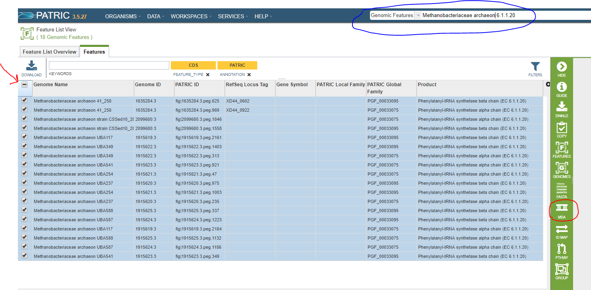
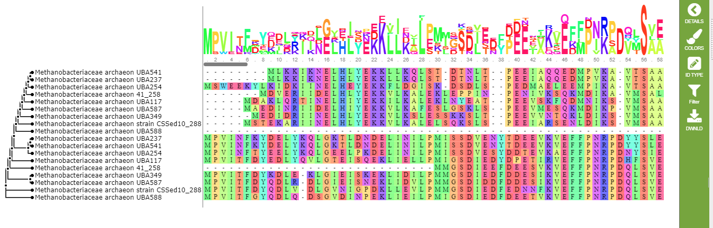
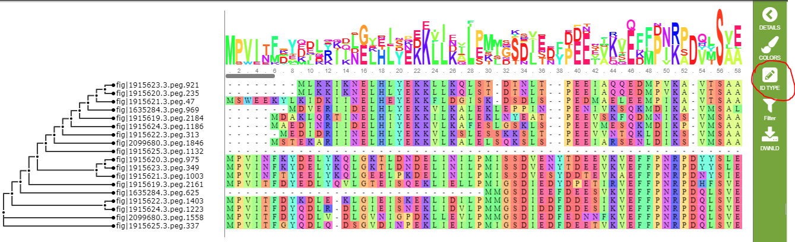

========================================
 Creating a Multiple-Sequence Alignment
========================================

Basic Steps
===========

1. List the features of interest and select them.

2. Invoke the Multiple-Sequence Alignment Tool.

3. Choose *Nucleotide* or *Amino Acid*.

4. Process the result.

List the Features of Interest and Select Them
---------------------------------------------

Since it is a tool, rather than a service, Multiple-Sequence Alignment is not available from the menus at the top of the
PATRIC web pages.  Instead, you select a group of features from a feature list and click on the tool icon in the green
sidebar.

You can do a feature search to find the features you want, or you can use a feature group.  In this example, we will align
all of the features with EC number 6.1.1.20 in *Methanobacteriaceae archaeon* genomes.  In the screenshot below, the search
we used to get these features is circled in blue.  To select all the features in the list, click on the checkbox shown by the
red arrow.

There are any number of ways to get a suitable feature list.  In addition to searching for eligible features, you can create
a feature group in your workspace and list it from there (see :doc:`/user_guides/workspaces/groups`).

Invoke the Multiple-Sequence Alignment Tool
--------------------------------------------

The icon for the Multiple-Sequence Alignment tool appears on the green control bar whenever you have more than one feature
selected, and is identified by the acronym **MSA**.  In the screenshot above, the icon is circled in red.  Click this icon
to invoke the tool.

Choose the Alignment Type
-------------------------

A callout will appear below the icon.  Click on *Nucleotide* for a DNA alignment or *Amino Acid* for a protein amino acid alignment.

Process the Result
------------------

The resulting alignment is shown below.

Each codon is assigned a different color.  There are 15 color schemes defined in PATRIC.  You can choose any one of them, or turn
color-coding off entirely, by clicking the **colors** icon on the green control bar.

The default display shows the name of each genome containing the feature in a particular row of the alignment.  In our example, this
doesn't quite work because one of the genomes has two features in the list.  You can use the **ID type** icon to change the display to
use feature IDs.  This is shown below.

The **filter** button allows you to hid columns in the alignment.  You can hide columns by the percentage of conservation or the
percentage of gaps, and for whichever criterion is selected, you can specify a minimum percentage, a maximum percentage, or a
percentage range.  The filtering chooses
columns to hide, so (for example) if you filter on gaps of less than 50%, it will hide those columns and show only columns with more
than 50% gap characters.  Each time you use the filter button, it works with the columns remaining on the display.  So, if you hide
columns with more than 50% gap characters and then hide the ones with more than 50% conservation, you will see only columns with
less than 50% gap characters *and* less than 50% conservation.  To get all the columns back, use the **Reset** option.

Finally, you can use the **DWNLD** button to download the alignment, either as an alignment in FASTA or text format, or as a
tree in SVG or Newick format.

