# Examining Antimicrobial Resistance (AMR) data in PATRIC

## 1. Finding AMR data in PATRIC

1.1. Using Global Search to find antibiotic information

- 1.1.1. The Global Search box is located at the top right of every PATRIC page.

- 1.1.2. Enter the name of an antibiotic of interest, and then click on the down arrow that follows All Data Types.
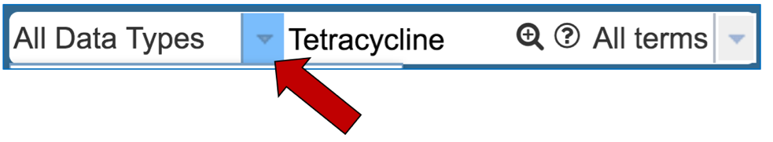

- 1.1.3. This will open a drop-down box that allows you to filter on specific types of data. Click first on Antibiotic, and then on the search icon that you can see in the text box.
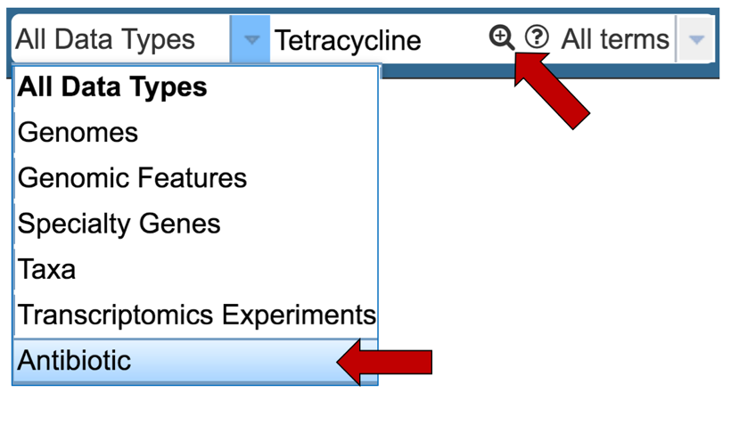

- 1.1.4. This will open the search results page. You will see higher level categories in a box at the top of the page. Click on the number that follows the word Antibiotics.
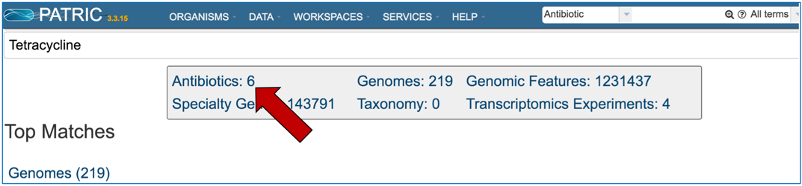

- 1.1.5. This will open the Antibiotics List View where you can drill down on information on specific antibiotics (described below).
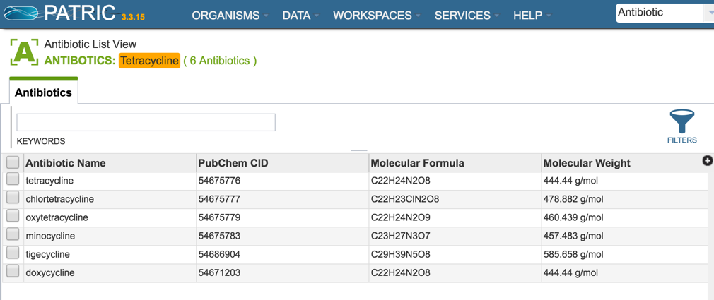

1.2. Using Taxon landing pages to find antibiotic information

- 1.2.1. From the Organisms tab, click on a genus of interest.
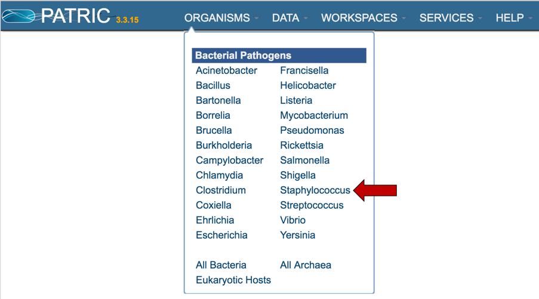

- 1.2.2. This will open the Taxon View landing page, that summarizes all the data for that genus. A table that summarizes the number of genomes that have been identified as resistant, susceptible or intermediate is available on the top right.
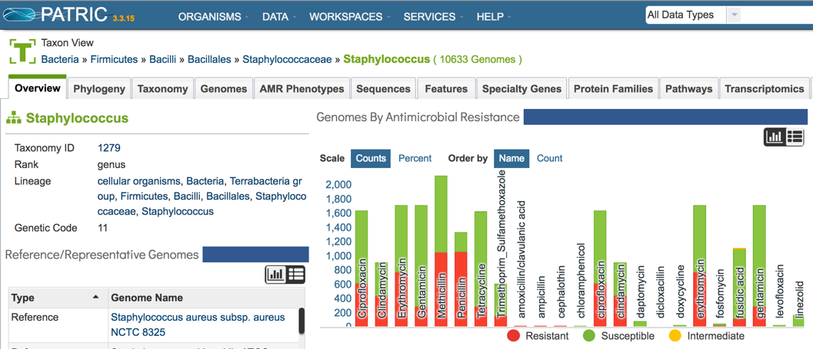

- 1.2.3. To find specific data on the AMR phenotypes, click on that tab at the top of the page.
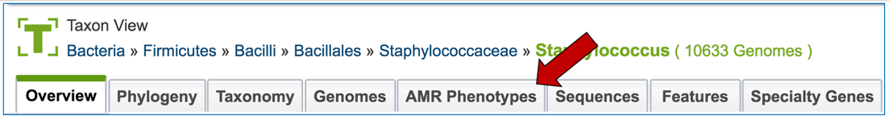

- 1.2.4. This will open a table that shows all the genomes across the genus that have been identified as being resistant, intermediate, or susceptible. Clicking on the filter icon that can be found at the top of the table will open a dynamic filter.
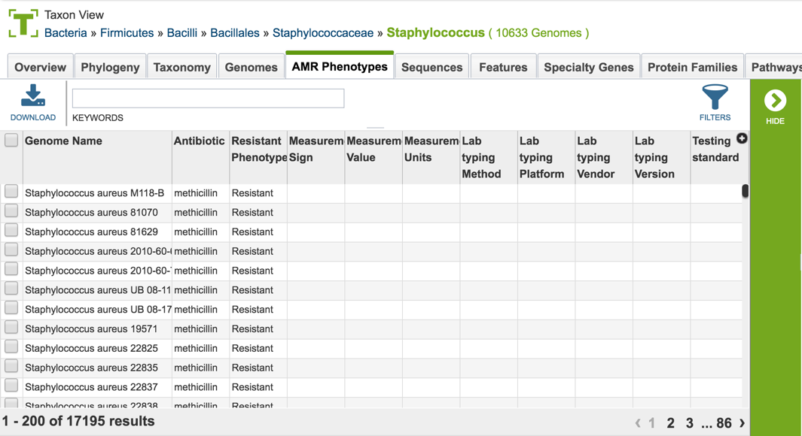

- 1.2.5.	The filter that has information on the phenotype, laboratory typing and testing methods that can be selected to narrow the number of genomes.
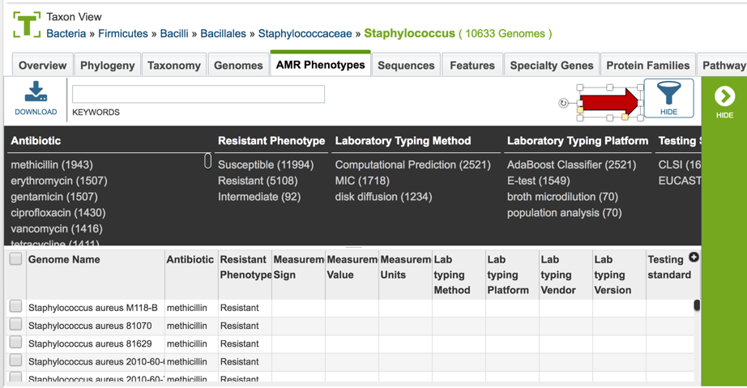

- 1.2.6. The search can be narrowed by clicking on specific fields.
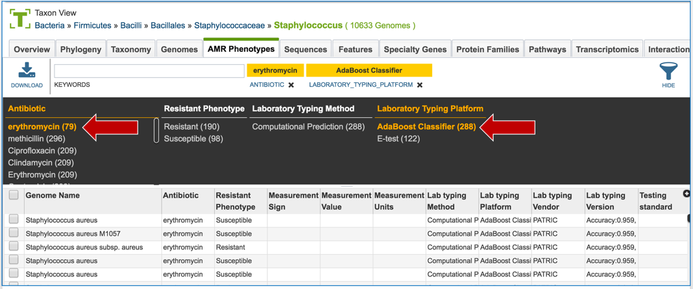

- 1.2.7. Clicking of a genome of interest will show all possible downstream analysis steps or views will appear in the vertical green bar. Click on the Genome icon.
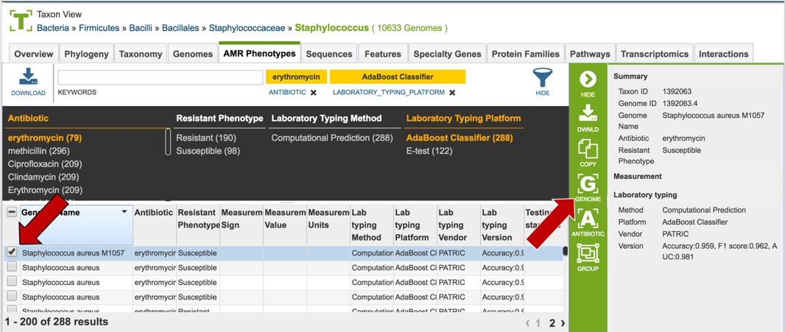

- 1.2.8. This will open the Genome View landing page, where the AMR phenotypes are displayed on the to right.
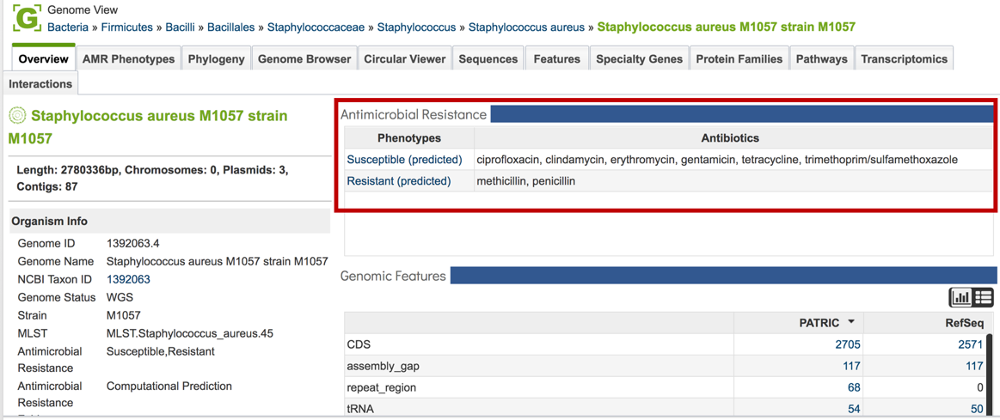

1.3. Using the Data tab to find antibiotic information

- 1.3.1. Information on AMR can be found by clicking on the Data tab, and then on Antibiotic Resistance under Data Types.
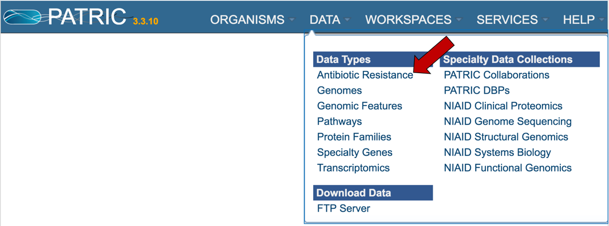

## 2.	Exploring AMR data in PATRIC-Overview
2.1. PATRIC has a new landing page where information on individual antibiotics and the information on antimicrobial resistance for particular genomes and genes, and regions can be accessed. To find this data, click on the Data tab and then on Antibiotic Resistance, which you can see under Data Types.

2.2. This will open a page that defines antimicrobial resistance (AMR), and gives you access to different types of information on the antibiotics, the phenotypes, genes and regions associated with AMR.
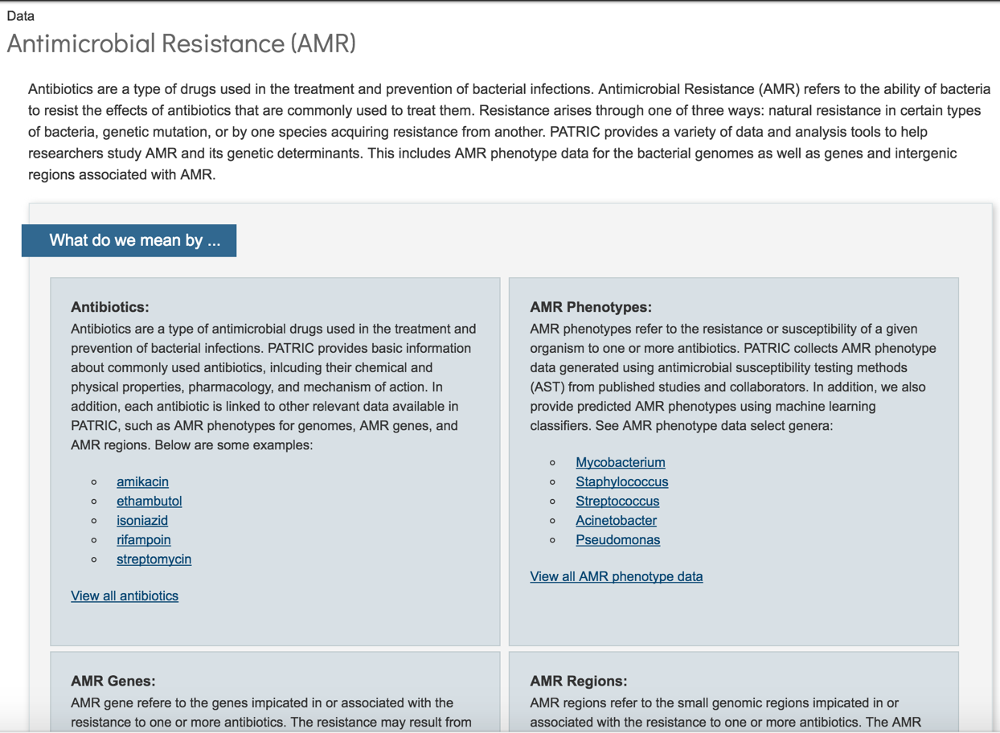

2.3. Information about the antibiotics that are included in the resource. To see a total list of all the antibiotics available in PATRIC, click on “View all antibiotics” that is in the Antibiotics panel.

2.4. AMR phenotypes, which are liked at the level of individual genomes and are also summarized across taxon levels. You can see all genomes across PATRIC that have AMR phenotypic data by clicking on “View all AMR phenotype data” that is in the AMR phenotype panel.
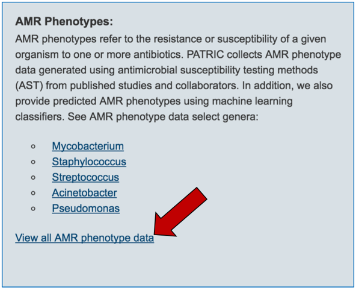

2.5. PATRIC also provides information on genes that are linked to antibiotic resistance. Data is assembled from several sources, including the Antibiotics Resistance Database [1], the Comprehensive Antibiotics Resistance Database [2] and NCBI’s Bacterial Antimicrobial Resistance Reference Database (also called NDARO) [3]. The PATRIC curation team has also been working on AMR genes, and that data is in the resource as well. You can see all genes available in PATRIC that have some association with AMR resistance or susceptibility by clicking on “View all AMR genes” that is in the AMR genes panel.
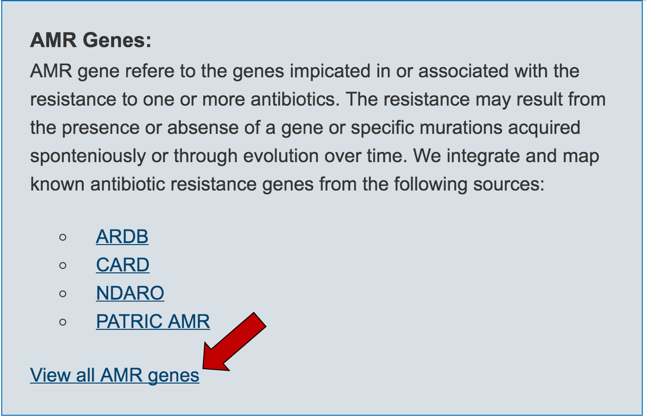

2.6. PATRIC has also identified small genomic regions that are associated with antibiotic resistance. That effort, which examines AMR for a few taxa, has been published [4]. You can see of the small regions currently available in PATRIC that have some association with AMR resistance by clicking on “View all AMR regions” that is in the AMR Regions panel.
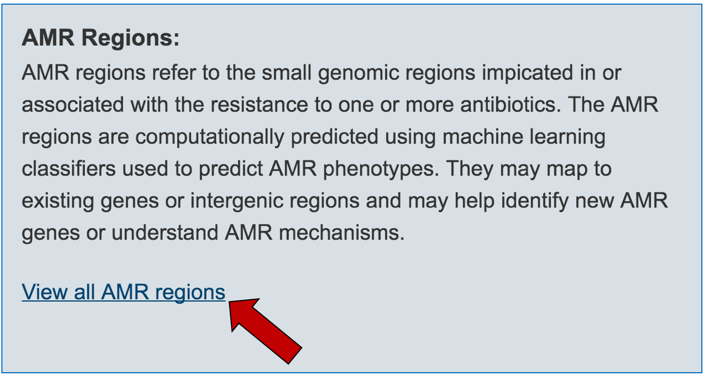

## 3. Antibiotic View-Drilling down on information related to specific antibiotics
3.1. Go to the Antibiotics panel and click on “View all antibiotics”.
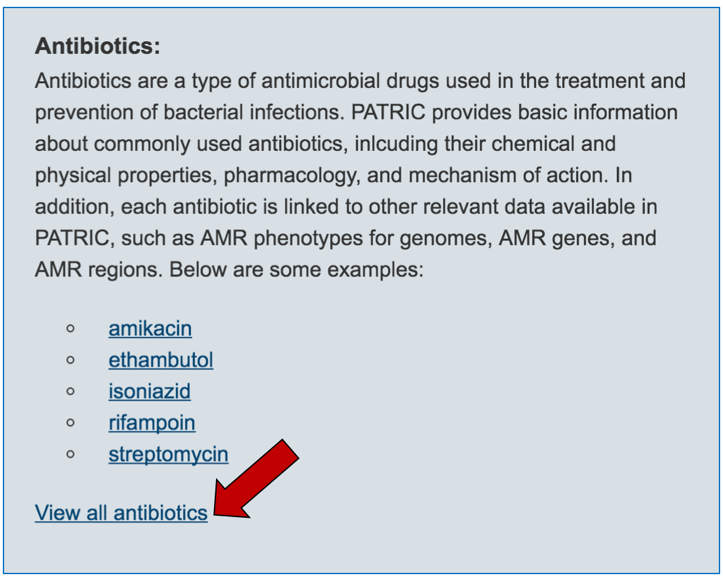

3.2. This will open a table that shows all of the antibiotics that PATRIC has data on.

3.3. There is a filter above the table that you can use to search for a particular antibiotic of interest.
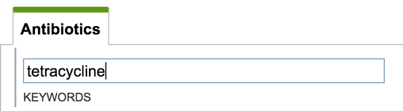

3.4. This will return a list of antibiotics that have that same text.
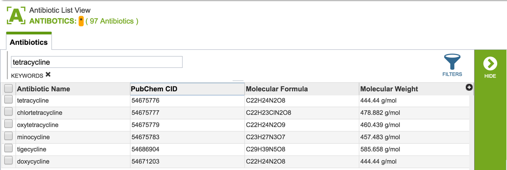

3.5. To view information on a specific antibiotic, click on the check box in front of the name, and then the possible downstream actions will appear in the vertical green bar. Click on the Antibiotic icon.

3.6. This will open the Antibiotic View page, where data from PubChem [5] is integrated. The overview tab includes a general description of the drug, the chemical structure, the mechanism of action, a description of the pharmacological activity and class, and known synonyms. The AMR phenotype tab provides a list of all the genomes that have been identified as being susceptible or resistant to that antimicrobial. This tab also includes the laboratory typing method and platform, and the testing standard if that information is available. A third tab, called AMR genes, displays information on the genes associated with resistance. The final tab, AMR regions, includes the location of the specific k-mers that are associated with the genome’s phenotype.  
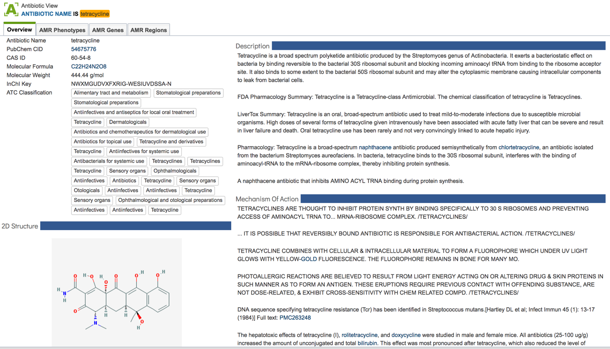

3.7. To see the AMR phenotypes associated with the selected antibiotic, click on the AMR Phenotypes tab.
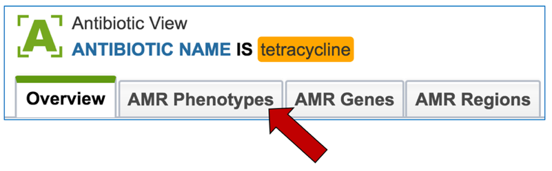

3.8. This will open a table that shows all the genomes in PATRIC that have been identified as being resistant, susceptible, or intermediate to the selected antibiotic. Clicking on the filter at the top right side of the table allows you to see additional information.
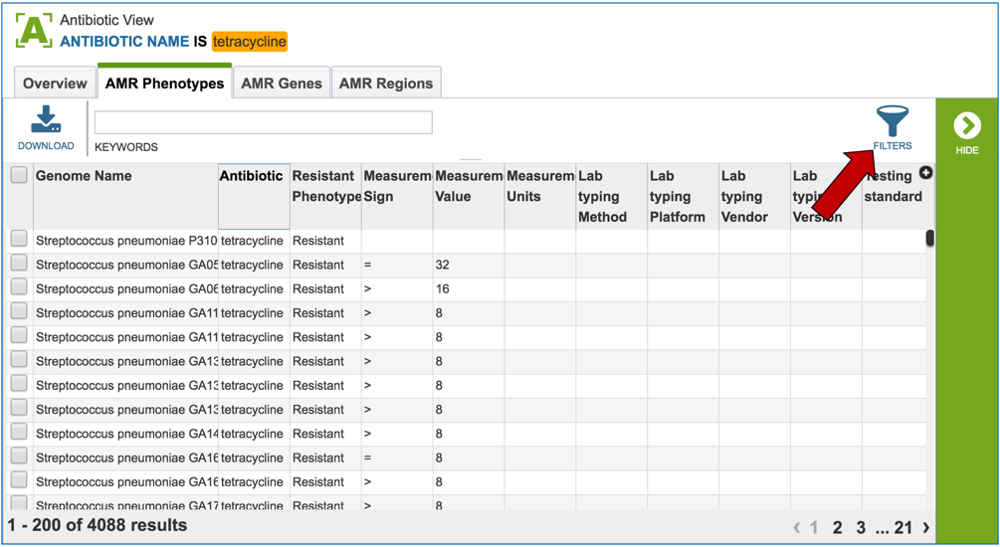

3.9. A dynamic filter will appear above the table. Clicking on different features of interest will filter the table to show the genomes that match those choices.
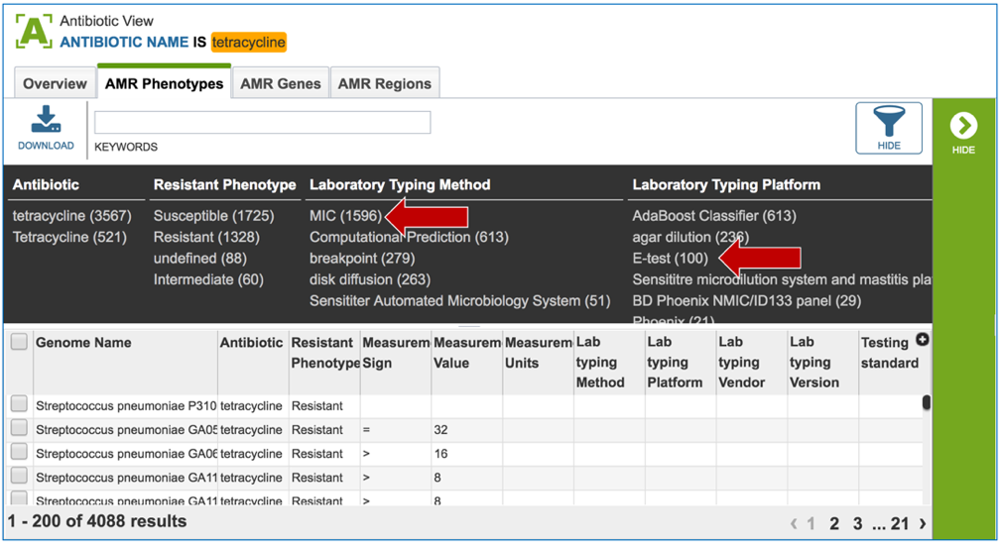

3.10. The filter reflects the choices you made to filter down on the data.
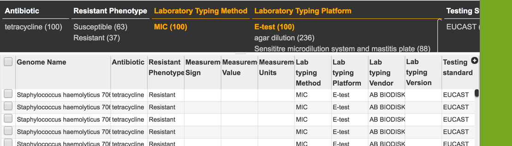

3.11. A particular genome of interest can be selected by clicking on the check box that appears right in front of the name. Once one box has been selected, all possible downstream analysis steps or views will appear in the vertical green bar.  Click on the Antibiotic icon.
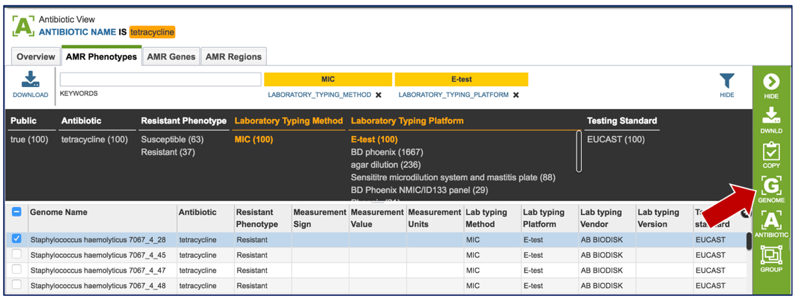

3.12. This will open a new tab, which is the landing page for the selected genome. In the top panel, you can see the antibiotics that the selected genome is resistant or susceptible to.
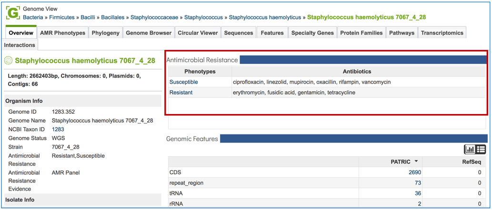

3.13.	To find information on the genes that are associated with the selected antibiotic, click on the AMR Genes tab that you will see on the Antibiotic View page.
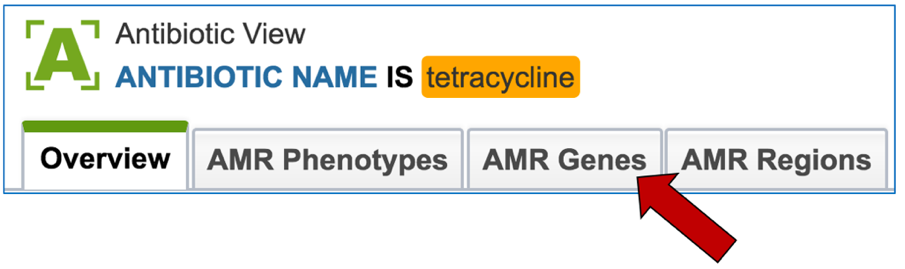

3.14.	This will give a list of all the genes that have some association with the selected antibiotic.  Clicking on the filter at the top right of the table will show more data associated with those genes.
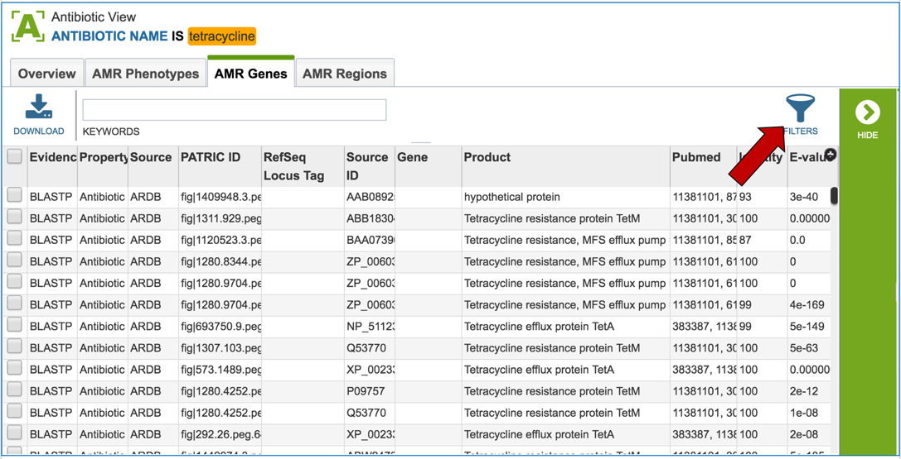

3.15.	You can filter on the source, the evidence, or the classification.  
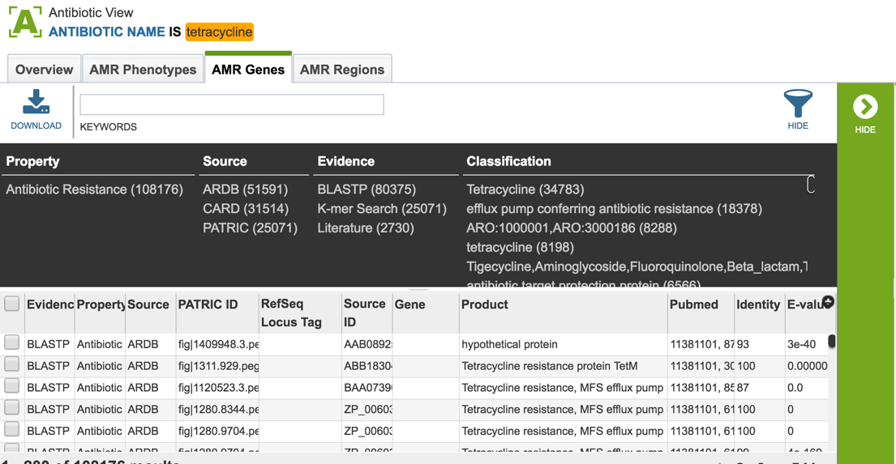

3.16.	The table below will reflect the choices made in the filter.
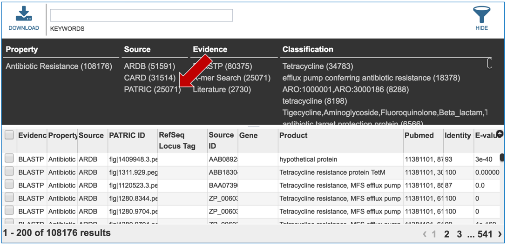

3.17.	To see more information about a specific gene of interest, click on the check box that occurs in front of the Evidence column.  Once one box has been selected, all possible downstream analysis steps or views will appear in the vertical green bar.  Click on the Feature icon.
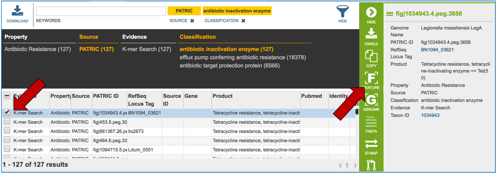

3.18.	This will open the landing page for the selected gene. The overview page shows the gene (in red) in the top panel, and provides other information about it, including its RefSeq locus tag. It also has links to the protein families, and to other databases like GenBank.
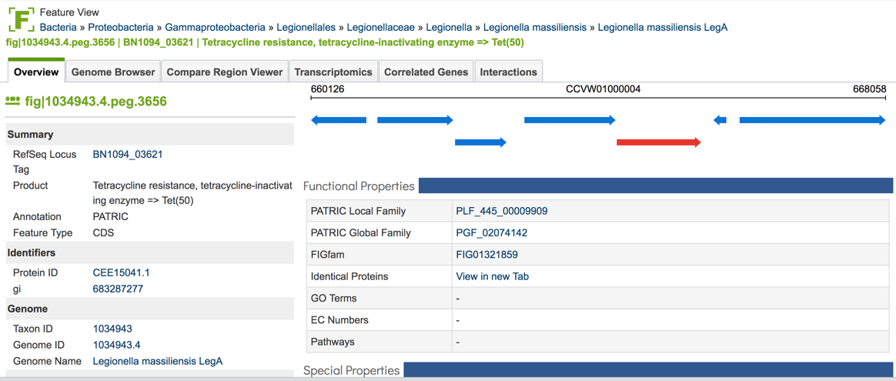

3.19.	There are several tabs across the top of the Feature Landing page that contain additional information.  Click on the tab called Compare Region Viewer.
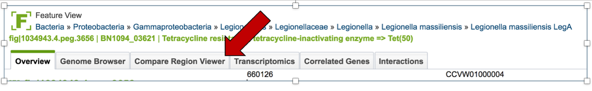

3.20.	The Compare Region view shows the gene neighborhood, and looks for conservation across this neighborhood across all the genomes in PATRIC.
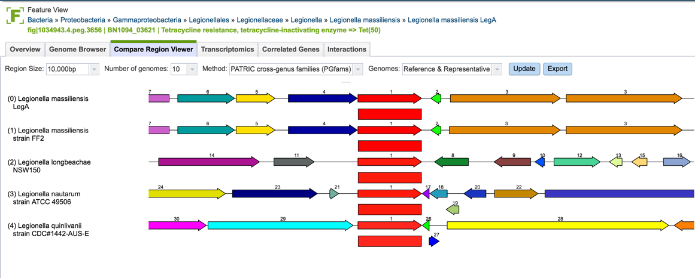

3.21.	To find information on the regions that are associated with the selected antibiotic, click on the AMR Regions tab that you will see on the Antibiotic View page.
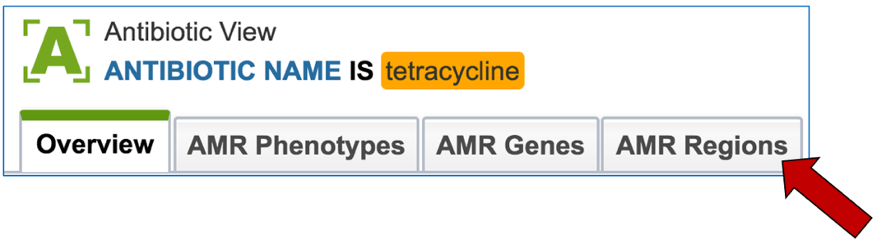

3.22. This will give a list of all the regions that have some association with the selected antibiotic, and the way that those regions have been determined is published [4]. Clicking on the filter at the top right of the table will show more data associated with those genes.

3.23.	There is a text box filter above the table that you can use to search for a particular genus or species of interest.
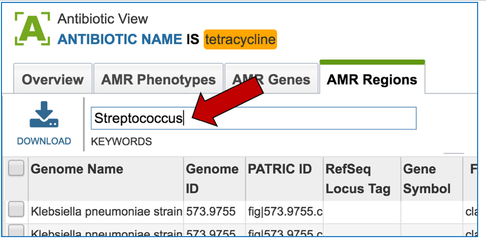

3.24. This will filter the table to show all the genomes that have that particular name.
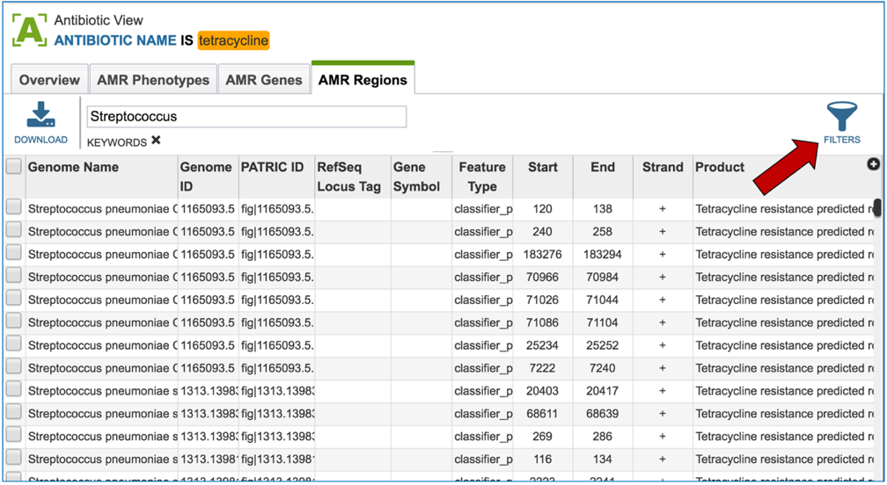

3.25.	Clicking on the filter at the top right of the table will show more data associated with those genes.
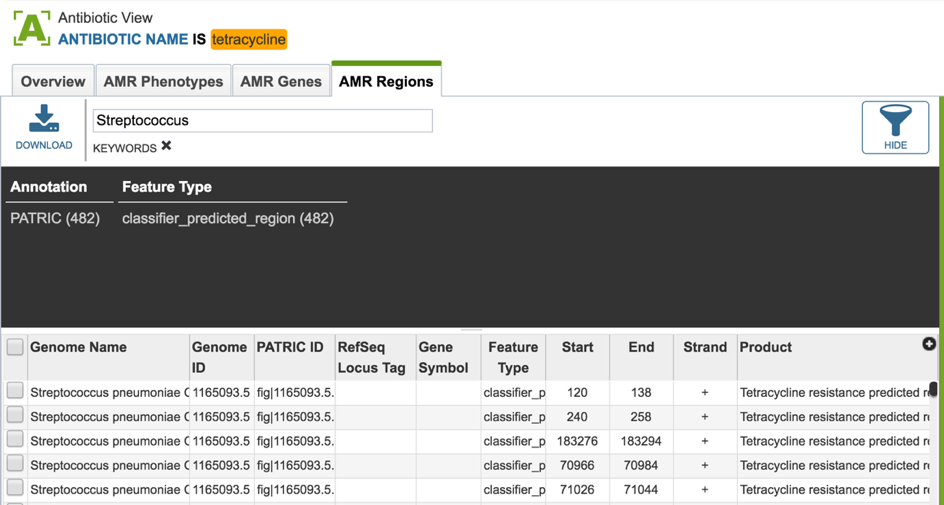

3.26.	To see more information about a specific region of interest, click on the check box that occurs in front of the genome name. Once one box has been selected, all possible downstream analysis steps or views will appear in the vertical green bar. Click on the Feature icon.
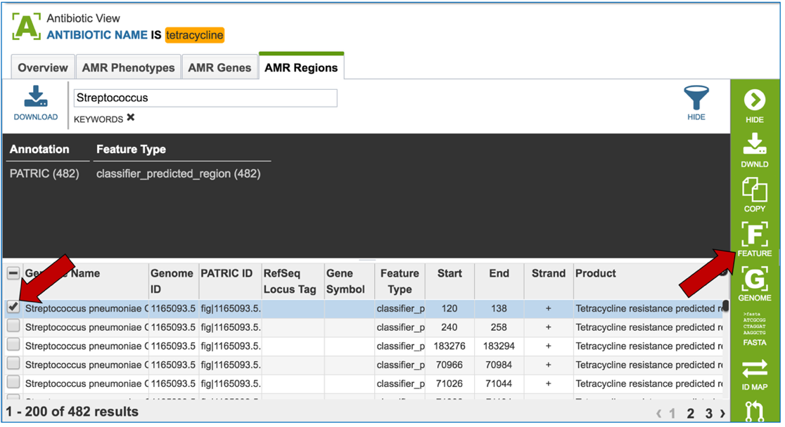

3.27. This will open the landing page for the selected region. The overview page shows the region (in red) in the top panel, and provides other information about it.
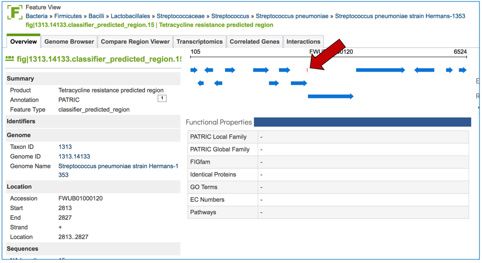

3.28.	Click on the Genome Browser tab.
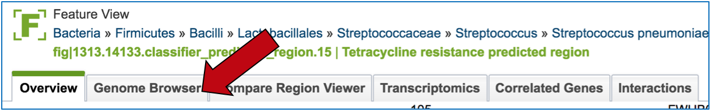

3.29.	This will open the Genome Browser, which will show you the exact location of the region associated with AMR resistance.
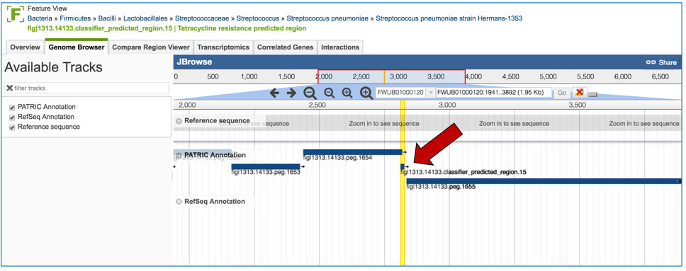

## References
1. Liu B, Pop M. ARDB—antibiotic resistance genes database, Nucleic Acids Res 2009;37:D443-D447.
2. McArthur AG, Waglechner N, Nizam F et al. The comprehensive antibiotic resistance database, Antimicrobial agents and chemotherapy 2013;57:3348-3357.
3. NCBI. Bacterial Antimicrobial Resistance Reference Gene Database. ([https://www.ncbi.nlm.nih.gov/bioproject/?term=3130472017](https://www.ncbi.nlm.nih.gov/bioproject/?term=3130472017), date last accessed).
4. Davis JJ, Boisvert S, Brettin T et al. Antimicrobial resistance prediction in PATRIC and RAST, Sci Rep 2016;6.
5. Kim S, Thiessen PA, Bolton EE et al. PubChem substance and compound databases, Nucleic Acids Res 2015:gkv951.
