# BLAST Service

## Submitting a BLAST (Basic Local Alignment Search Tool) job at PATRIC

### I. Locating the BLAST Service

1. At the top of any PATRIC page, find the Services tab. Click on BLAST.
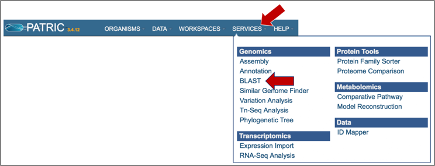

2.  This will open up the BLAST landing page where researchers can do nucleotide or amino acid BLAST searches.
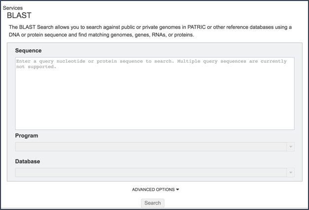

### II. Loading a Sequence and Choosing a Type of BLAST

1.	 Cut and paste a sequence into the Sequence box.  Depending upon the sequence, this will open the drop down box under Program, showing the types of BLAST available(1).  Definitions of the types of BLAST searches are as follows:
* BLAST: searches nucleotide databases using a nucleotide query
* BLASTP: searches protein databases using a protein query
* BLASTX: searches protein databases using a translated nucleotide query
* TBLASTX: searches translated nucleotide databases using a translated nucleotide query
* TBLASTN: searches translated nucleotide subjects using a protein query
* *Note that all the format for all BLAST submissions requires that first line begins with >.  If the first line lacks the > the BLAST job will fail.*
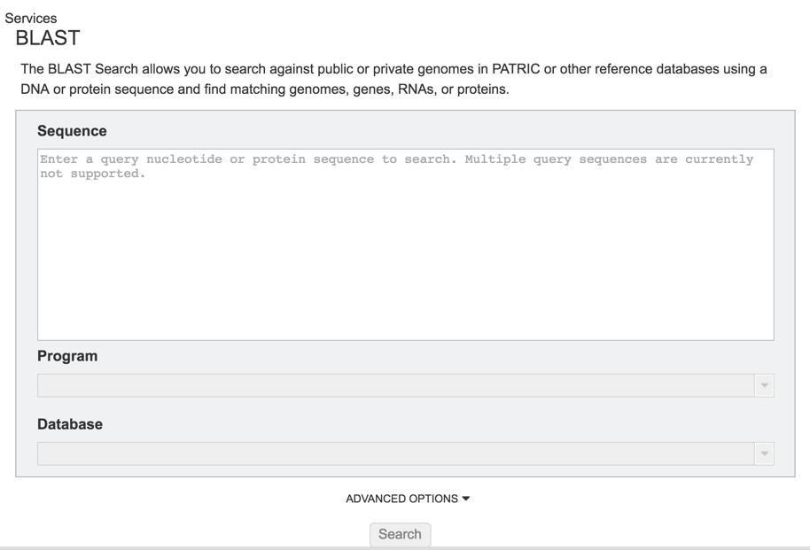

2. Clicking on the algorithm of choice will close the drop down box and display the choice in the Program text box.
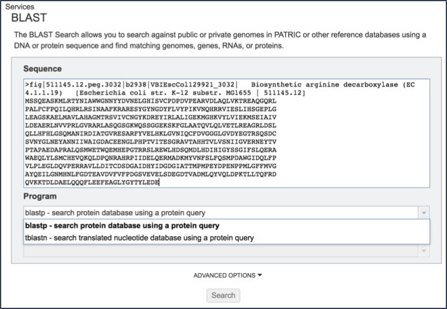

### III. Selecting a Database

1.	 PATRIC provides a variety of databases that selected sequences can be compared to.  If the sequence selected is a protein, the available databases are as follows:
* The Reference or Representative Genome proteins (faa) includes those genomes that RefSeq has given special status(2).  The reference genomes represent the highest quality dataset that is supported by curation by NCBI scientific staff, and the representative genomes are another high-quality selection that were identified at RefSeq by clustering genomes and applying weighting metrics that include consideration of species-level taxonomic classification (e.g., a preference for type strain) and assembly quality (e.g. a preference for complete genomes but WGS is allowed).
* Transcriptomics Genomes proteins (faa) include all the proteins that are found in any of the microarray experiments that are included in PATRIC.
* Specialty gene reference proteins (faa) contain all the genes used by PATRIC to tag genes that are of special interest.  These include genes that have been identified as being virulence factors, as important in antibiotic resistance or susceptibility, are homologs with human genes, or have been investigated as being a drug target.
* Search within a selected genome(s) allows researchers to choose specific genomes that they wish to BLAST against.
* Search within selected genome group allows researcher to BLAST against any of the genome groups that they have created and are stored in their workspace.
* Search with selected taxon allows researchers to BLAST their sequence against any taxon level available in PATRIC.
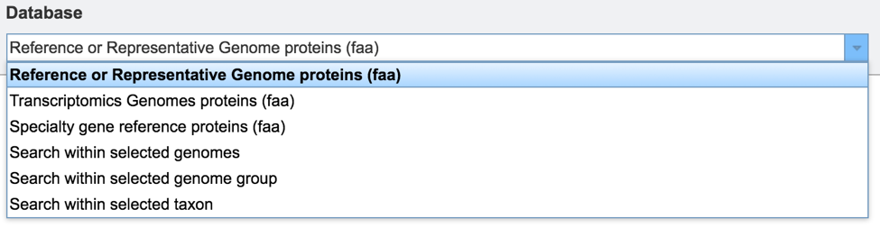

2.	If the sequence selected for BLAST analysis is nucleotide, the available databases are as follows:
•	The Reference or Representative Genome genes (fna), or fasta nucleic acid, inlcudes those genomes that RefSeq has given special status(2).  .fna is used generically to specify nucleic acids. The reference genomes represent the highest quality dataset that is supported by curation by NCBI scientific staff, and the representative genomes are another high-quality selection that were identified at RefSeq by clustering genomes and applying weighting metrics that include consideration of species-level taxonomic classification (e.g., a preference for type strain) and assembly quality (e.g. a preference for complete genomes but WGS is allowed). This will include non-coding sequences, like intergenic regions.
* The Reference or Representative Genome features (ffn) is the FASTA nucleotide of gene regions, and this database contains all the coding regions across this special selection of genomes.
* The Reference and Representative Genome features (frn) is the FASTA non-coding RNA, and includes all the non-coding RNA regions for a genome (tRNA, rRNA).
* PATRIC 16sRNA genes (frn) includes all the 16s rRNA genes across all the genomes available in PATRIC.
* Transcriptomic genomes (ffn) will BLAST against all the genome sequences that have expression data associated with them that are publicly available in PATRIC.  This will include non-coding sequences, like intergenic regions.
* Transcriptomics Genomes feature (ffn) will BLAST against all the coding sequences from the genomes that have expression data associated with them that are publicly available in PATRIC.
* Plasmid contigs (fna) will BLAST against all the sequences identified as coming from plasmids that are available in PATRIC. This will include non-coding sequences, like intergenic regions.
* Search within selected genomes allows researchers to choose specific genomes that they wish to BLAST against.
* Search within selected genome group allows researcher to BLAST against any of the genome groups that they have created and are stored in their workspace.
* Search with selected taxon allows researchers to BLAST their sequence against any taxon level available in PATRIC.
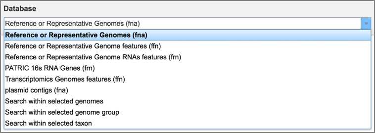

### IV. BLASTing Against Gene Features or Contigs

1.	Depending upon query type, researchers will be able to choose to search entire genomes or limit the search to only features.  When BLASTN, TBLASTN, or TBLASTX are selected, researchers can choose to search against either contigs or features.  When BLASTP or BLASTX are selected, the search is limited to features.
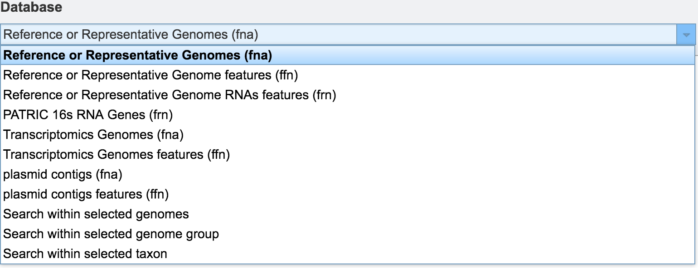

### V. Adjusting the BLAST 

1.	 Once a database to BLAST against is selected, researchers have the option of further refining the BLAST job by using the Advanced Options.
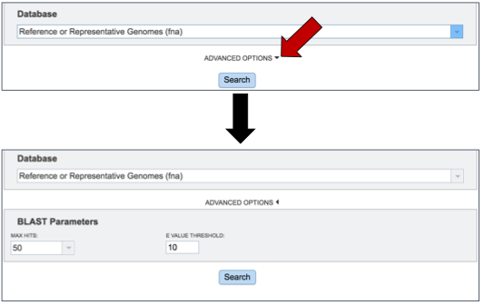

2.	 Researchers can adjust both the number of hits returned, and the E value threshold.  There are limits to the number of hits returned.  To see the available number, click on the arrow at the end of the text box under Max Hits.  This will open a drop down box that allows researchers to choose 1, 10, 50, 100 or 500 hits.

### VI. Submitting the BLAST Job

1.	Once the sequence has been uploaded, the program and database selected, the BLAST parameters adjusted, the job can be started by clicking the Search button at the bottom of the page.
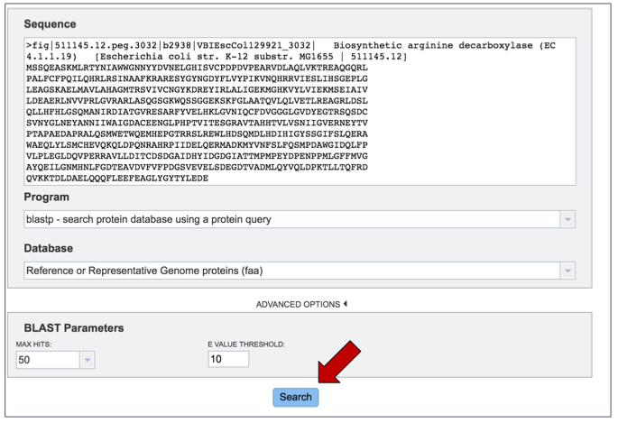

### VII. Examining the BLAST Results

1.	When the BLAST results are ready, the page will reload showing the name of the organism, the query and subject coverage, the score and the E value.  Depending on the type of BLAST selected, researchers will also see locus tags, gene symbols and functional descriptions for the features, or information about the genomic contigs.
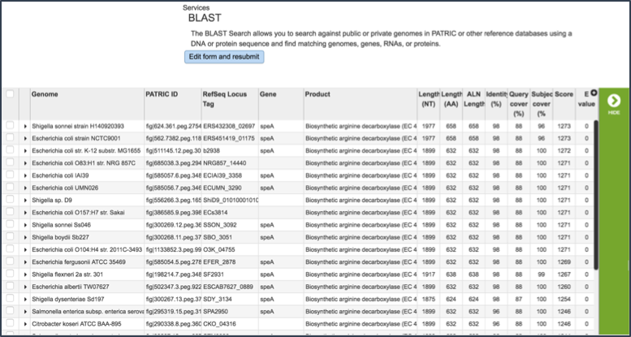

2.	 Clicking on a single check box in front of a specific return will do two things.  It will populate the vertical green bar with all the possible downstream analysis tools or processes that can be deployed with that selection.  With a single choice, those possibilities include;
* The ability to download information on the sequence 
* The fasta file (protein or nucleotide) 
* The ability to look at other identifiers linked to the gene by the ID Mapping tool, what pathway includes the selected gene
* An ability to either create a new group that includes the feature, or to add it to an existing group, 
* A direct link to the genome landing page that the feature belongs to.
* A direct link to the feature landing page for that gene or protein.
When a single result is selected, the information about that specific choice also appears beyond the green bar.
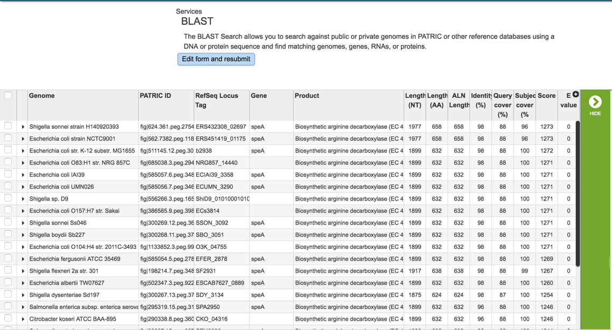

3.	Clicking on multiple check boxes will also populate the vertical green bar with the downstream analysis tools or processes.  These are similar to those enabled when a single return was selected, with a few differences that include:
* The ability to generate a multiple sequence alignment (MSA)
* The ability to go to a specific landing page that summarizes all the data across the selected features (Features icon)
* The ability to go to a specific landing page that summarizes all the data across the genomes that contain the selected features (Genomes icon)

4.	Some examples of downstream process are demonstrated, specifically obtaining sequences, generating gene trees/multiple sequence alignment, and the summarization of selected genes on a KEGG pathway map.
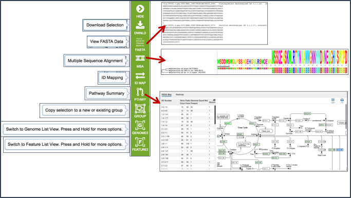

### VIII. Submitting Another BLAST Job

1.	 At the top of the BLAST result page, researchers can click on the Edit from and resubmit button to initiate another BLAST job
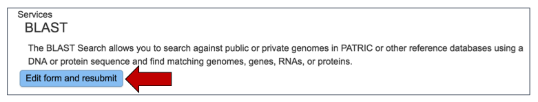

2.	 This will reload the page, showing the original parameters used for the first BLAST job.  These can be adjusted, with a second job submitted by clicking the Search button at the bottom of the page.
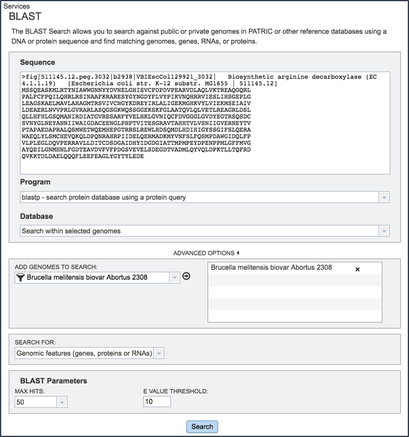

## References
1.	Boratyn, G.M., Camacho, C., Cooper, P.S., Coulouris, G., Fong, A., Ma, N., Madden, T.L., Matten, W.T., McGinnis, S.D., Merezhuk, Y. et al. (2013) BLAST: a more efficient report with usability improvements. Nucleic acids research, 41, W29-33.

2.	O'Leary, N.A., Wright, M.W., Brister, J.R., Ciufo, S., Haddad, D., McVeigh, R., Rajput, B., Robbertse, B., Smith-White, B., Ako-Adjei, D. et al. (2016) Reference sequence (RefSeq) database at NCBI: current status, taxonomic expansion, and functional annotation. Nucleic acids research, 44, D733-745.

