# Building Phylogenetic Trees - Codon Trees

For the **All Shared Proteins** version of this tutorial see: [All Shared Proteins Tree Building](http://docs.patricbrc.org/tutorial/codon_tree_building/codon_tree_building.html)

A phylogenetic tree or evolutionary tree is a branching diagram or "tree" showing the evolutionary relationships among various biological species or other entities. The Codon Tree service in PATRIC allows researchers to build trees that contain private and public genomes, adjusting for the number of genes that will be used to generate the tree.

## I.  Locating the Phylogenetic Tree Service – Codon Tree App

1: At the top of any PATRIC page, find the Services tab.

2: Click on Phylogenetic Tree.

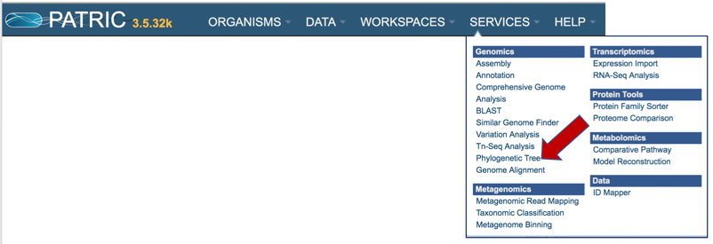

3: This will open up the Phylogenetic tree landing page where researchers can generate a phylogenetic tree.

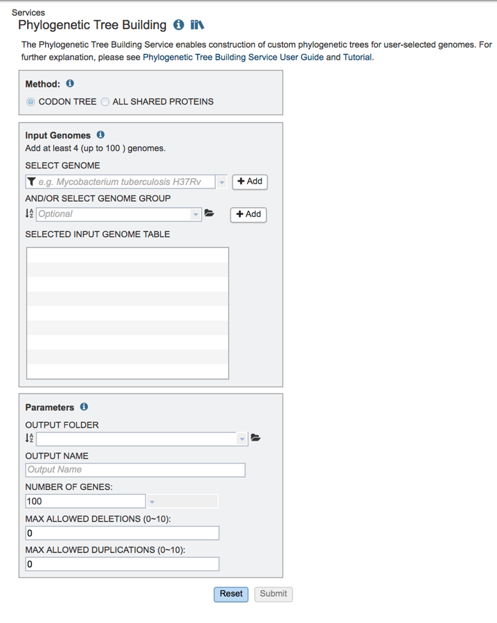

## II. Choosing a method

PATRIC provides two separate pipelines (**Codon Trees** or **All Shared Proteins**) for building phylogenetic trees. The default is set for Codon Trees, which uses the amino acid and nucleotide sequences from defined number of PATRIC’s global Protein Families (PGFams)[1], which are picked randomly, to build an alignment, and then generate a tree based on the differences within those selected sequences. This tutorial deals with the Codon Trees pipeline.  Both the protein (amino acid) and gene (nucleotide) sequences are used for each of the selected genes from the PGFams.  Protein sequences are aligned using MUSCLE[2], and the nucleotide coding gene sequences are aligned using the Codon_align function of BioPython[3].  A concatenated alignment of all proteins and nucleotides were written to a phylip formatted file, and then a partitions file for RaxML[4] is generated, describing the alignment in terms of the proteins and then the first, second and third codon positions. Support values are generated using 100 rounds of the “Rapid” bootstrapping option[5] of RaxML. The resulting newick file can be viewed in PATRIC, and we also suggest that researchers download it and view it in FigTree[6] to generate a publication quality image.

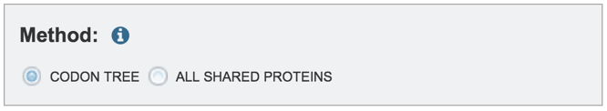

## III. Selecting individual genomes

1: Public or private genomes that are in the PATRIC database can be used to build a phylogenetic tree.  Up to 100 genomes can be used in this service.  To add a private genome, click on the Filter icon at the beginning of the text box underneath Select Genome.

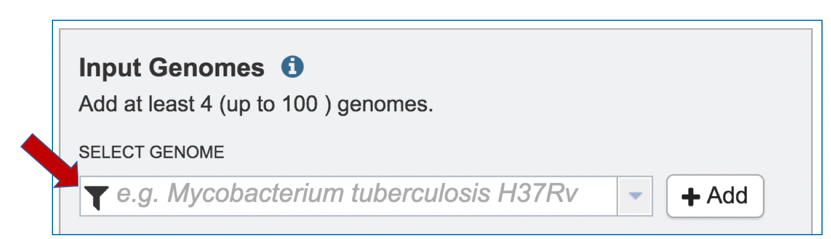

2: This will open a drop-down box with a list of the types of genomes that can be filtered on

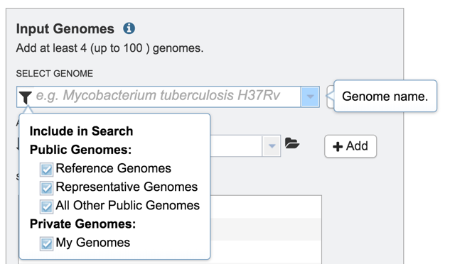

3: Click off the check box in front of Reference, Representative and All Other Public Genomes to enable filtering on private genomes that are in the researcher’s workspace.

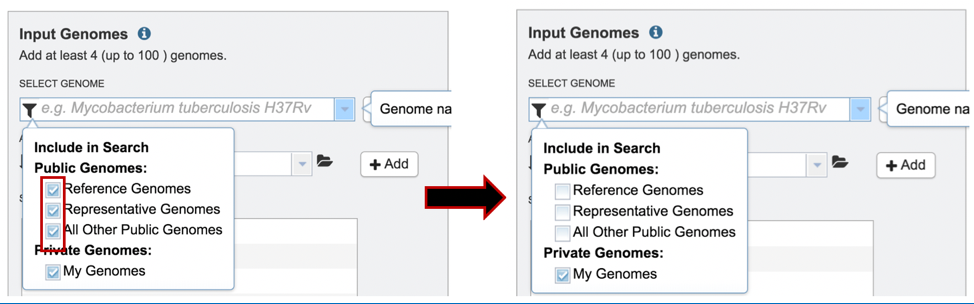

4: Clicking on the drop-down box at the end of the text box under Select Genome will show the private genomes in the workspace that have most recently been annotated.

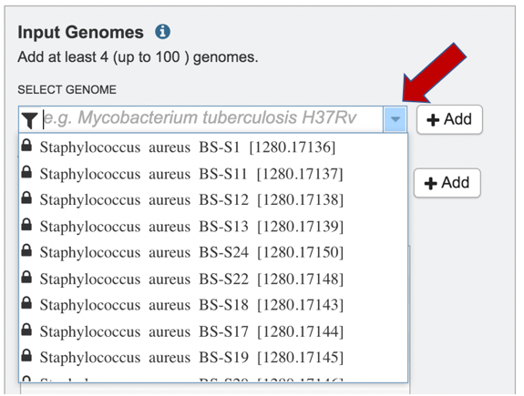

5: The list can also be filtered by beginning to type a name in the text box under Select Genome.

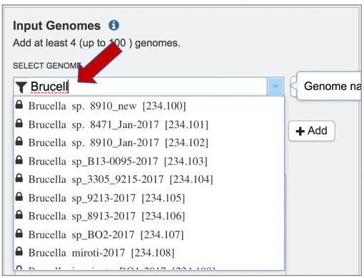

6: A genome of interest can be selected by double clicking on it.

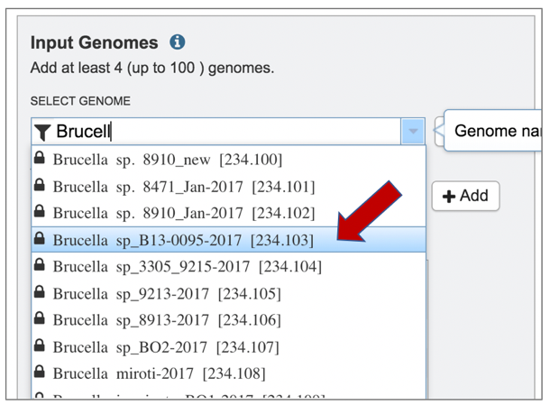

7:  This will auto-fill the name of the genome into the text box.

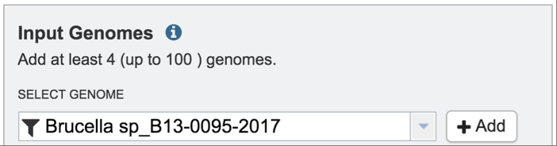

8:  The genome needs to be added into the Selected Input Genome Table.  Click the Add button at the end of the text box, and the genome will appear in the table.

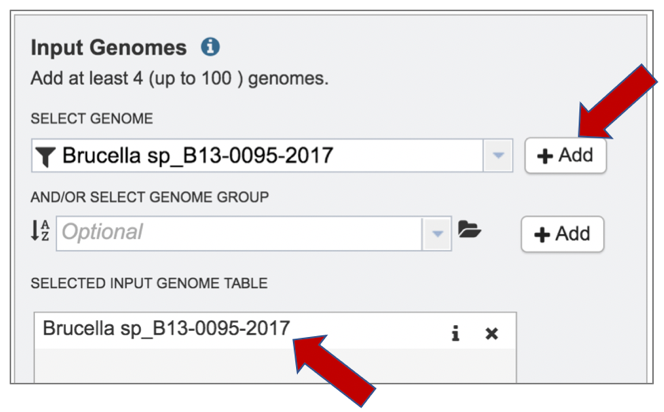

9: To add a different type of genome (Reference, Representative, or All Other Public Genomes), click on the filter icon and click the check boxes to the desired category.

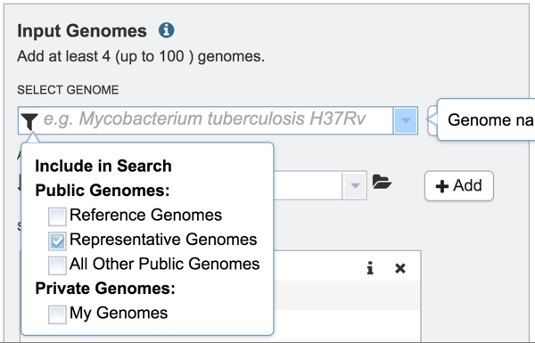

10: The selected genomes will be moved to the Selected Genome Input Table by clicking on the name and then the Add button.

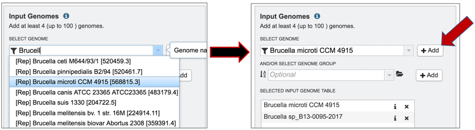

## III.  Selecting Genome Groups

1:  Genome groups can also be added to the Input Genome Table.  Clicking on the down arrow that follows the text box underneath And/Or Select Genome Group will show the genome groups that have most recently been created by the researcher.

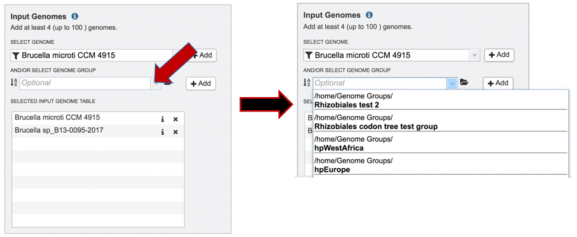

2: The list can be filtered by beginning to type a name in the text box under Select Genome.

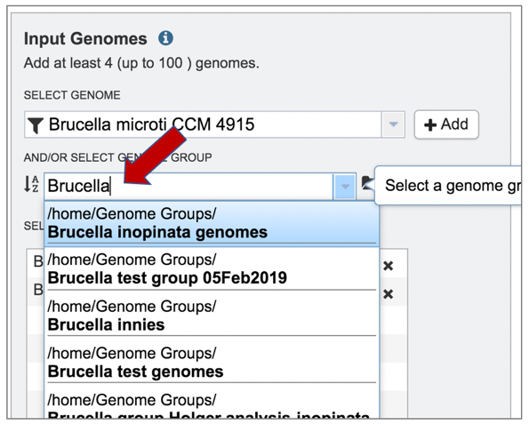

3: The selected genomes will be moved to the Selected Genome Input Table by clicking on the name and then the Add button.

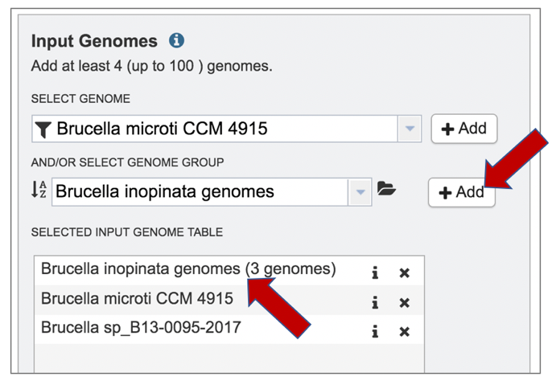

4: Clicking on the Information icon following the name will show the Genome IDs of the genomes within a selected group.

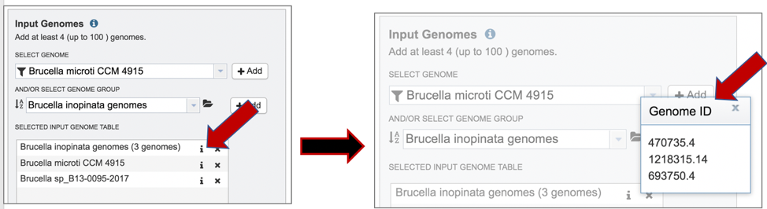

5: Clicking on the X icon that follows the name of a genome or genome group in the Selected Input Genome Table will remove it from the selection.

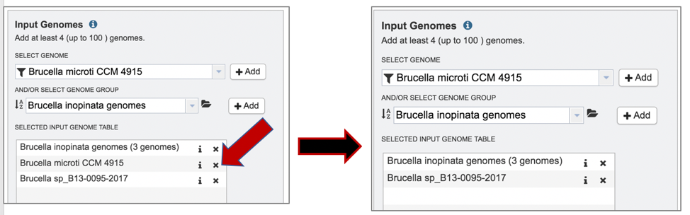

## IV.  Selecting Codon Trees parameters

1: Several parameters must be addressed before the codon tree job can be submitted, and the Submit button will turn blue when the job is ready.

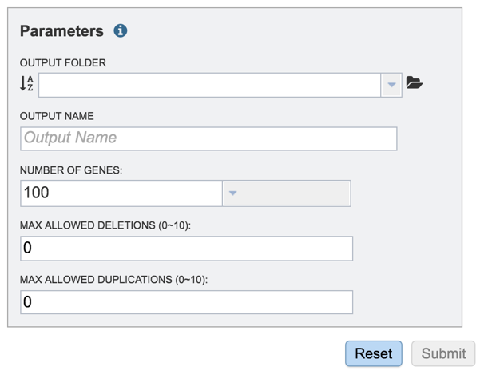

2: Clicking on the down arrow that follows the text box underneath Output Folder will show the folders that have most recently been created by the researcher.  Clicking on a folder will add it to the text box.

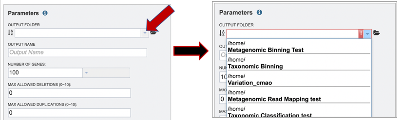

3: New Folders can also be created by clicking on the folder icon at the end of the text box.

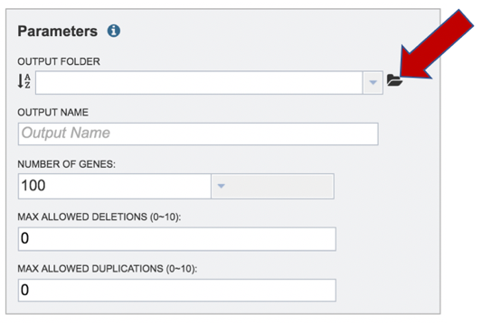

4: This will open a pop-up window that shows all the folders that are available in the private workspace.  The entire list can be viewed by moving the scroll bar down.

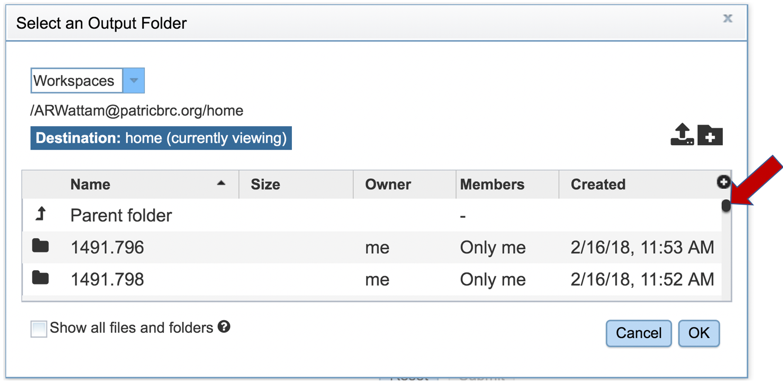

5: New folders can be created by clicking on the Folder icon in the upper right corner of the pop-up window.

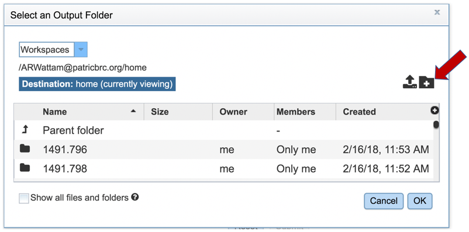

6: This will open a new pop-up window.  A new folder can be created by entering a name in the text box, and then clicking the Create Folder icon.  This will close the second pop-up window.

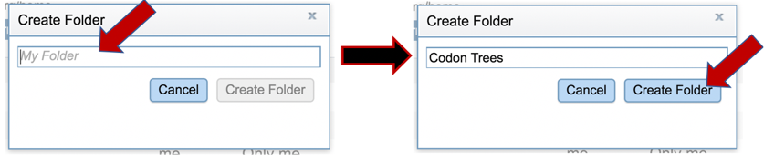

7: Scroll down in the primary pop-up window to find the new folder.  Click on the row, and then on the OK button at the bottom right.

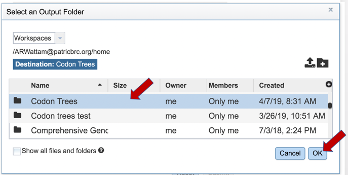

8: The name of the selected folder will appear in the text box.

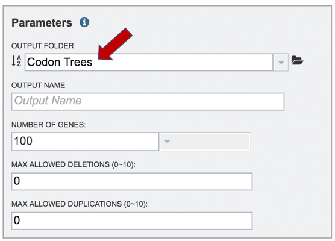

9: Enter a name for the tree in the text box under Output Name.

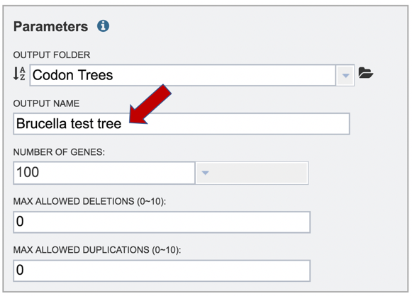

10: The number of single-copy PGFams[1] set as the default is 100.  This will include 100 amino acid and nucleotide sequences for the alignment and the tree, but will depend on the number of single copy genes found in all of the genomes selected.  For example, if one genome has only 10 single copy genes, then the tree will be built on the protein and gene sequences for those 10 genes, even if all the other genomes have 100 single copy genes.  This can be adjusted (see below for Max Allowed Deletions and Duplications). 

A different number can be selected by clicking on the down arrow at the end of the text box underneath Number of Genes, and the range is 10 to 1000 genes.  Genomes that are in widely different taxa might be resolved with as few as 10 genes, but closely related genomes (same species or even strain) might require up to 1000 genes selected to separate them on a phylogenetic tree.  The more genes selected, the longer the tree job will run. Clicking on the desired number will fill the text box.

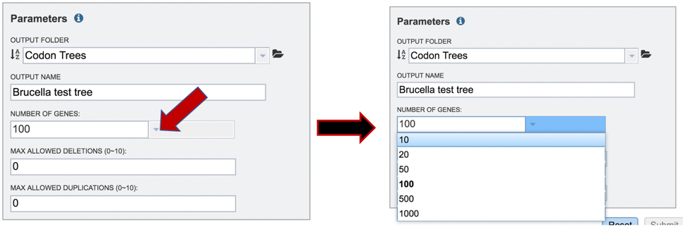

11: The selection of “single-copy” genes can be made more lenient by allowing one or more instances of genomes missing a member of a particular homology group (Max Allowed Deletions).  If the number is set at 1, 9 genomes would have a gene in a particular PGFam, and the 10th would be missing it.  Likewise, if the number is set at 2, 8 genomes would have the PGFam and the last 2 would be missing it.  This would only be used if there are not enough PGFams meet the single copy criterion. The number of deletions allowed can be set between 0 and 10 in the text box underneath Max Allowed Deletions (0-10).

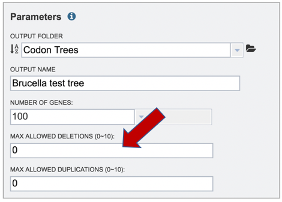

12: The selection of “single-copy” genes can also be made more lenient by allowing for PGFams that might have more than one copy of a single gene within a single genome.  If the number is set at 1, then. 9 genomes have one gene in a particular PGFam, and the 10th has two.  If the number is set at 2, 8 genomes will have one gene in a particular PGFam and the other two have 2.  When there are two copies of a gene, the algorithm will pick the gene that is the most similar to the other genes found in the other selected genomes.  This would only be used if there are not enough PGFams meet the single copy criterion.  This number of can be set between 0 and 10 in the text box underneath Max Allowed Duplications (0-10). 

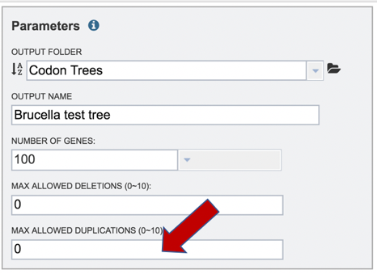

13: When all the parameters are entered, the codon tree job is ready to submit.  Submit the job by clicking on the blue Submit button.

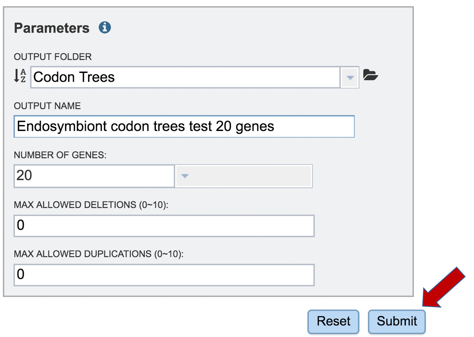

14: A message will appear above the submit button, indicating that the submission was successful. 

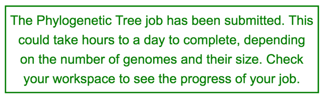

15: The bottom of each PATRIC page has an indicator that shows the number of jobs that are queued, running or completed.  Clicking on the word Jobs will rewrite the page to show the Job status.

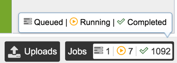

## V. Viewing the Codon Tree job

1: Researchers must monitor the Jobs Status page to see the status of their job, which is indicated in the first column (Queued, Running, Complete, Failed). 

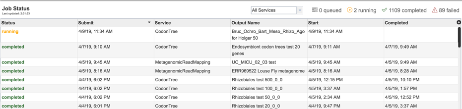

2: Clicking on the row that contains the job of interest will open two icons in the vertical green bar.  If there is a problem with a particular job, the Report Issue icon should be clicked.

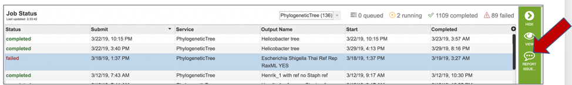

3: This will open a pop-up window where issues with particular jobs can be reported.  A description of the particular problem can be provided, and clicking the submission button will generate a message to PATRIC team members, notifying them that there has been a problem.  We encourage researchers to report all failed jobs, or those that have results that are confusing.  In addition, researchers should report long waits that they are experiencing in the queue.

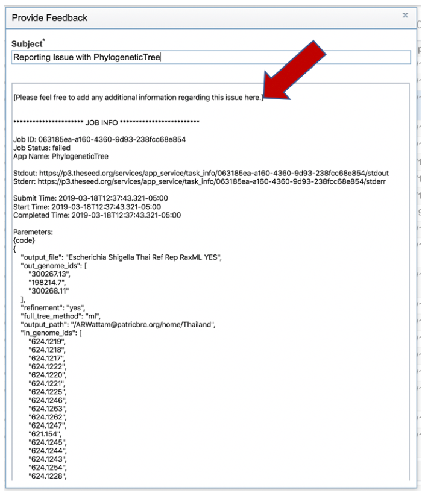

4: A job that has been successfully completed can be viewed by clicking on the row and then clicking on the View icon in the vertical green bar.

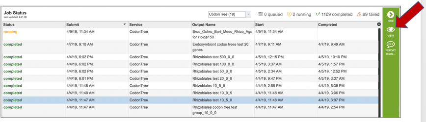

5: This will open page for the selected job.  The top box has the job ID number and gives pertinent information about the time it took to complete and the selected parameters. The lower table has a number of output files.

6: Click on the TreeReport.html.  This will populate the vertical green bar with a number of icons.  Clicking the information icon (i) will open a new tab that has the Metagenomic Read Mapping tutorial.  There are icons for downloading the data, viewing it, deleting the file, renaming the file, copying or sharing with another PATRIC user, moving it to a different director, or changing the type tagged to the file.  To examine the TreeReport.html, click on the View icon.

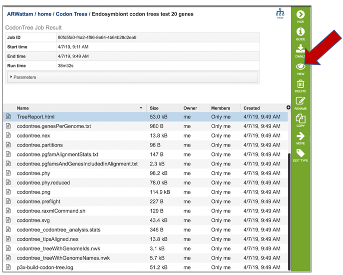

7: This will re-write the page to show the html report, which can also be downloaded.  The report shows the rendered tree at the top, followed by the tree statistics, which includes the number of genomes, proteins, and genes used in building the tree.  Below that is a list of the genomes that are included in the tree. 

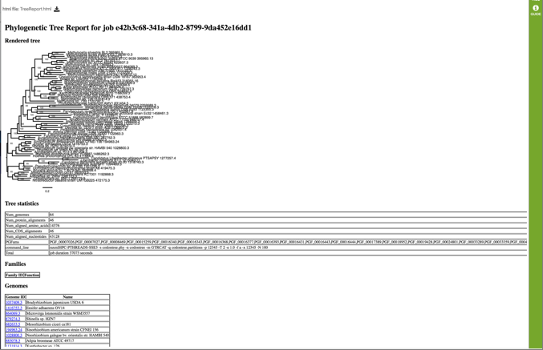

8: Clicking on any of the template identifiers in the first column will open a new tab that shows the landing page for that particular genome.

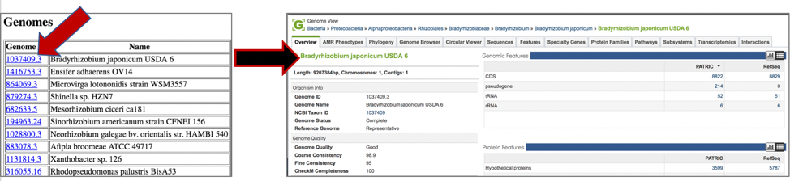

9: Click on row that contains the codontree.genesPerGenome.txt file and then click the View icon.

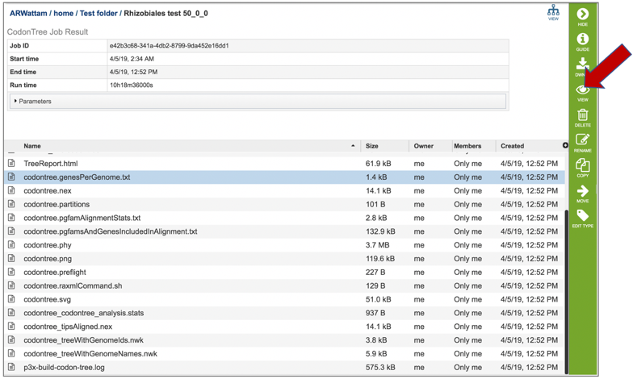

10: This will open a text file that shows the genome ID, the number of genes that genome has, the total single copy genes in that genome,  and then the number of those genes that were used in the alignment.

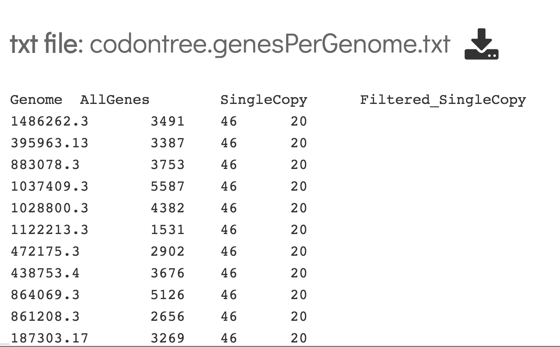

11: Click on the row that contains the codontree.pgfamsAndGenesIncludedinAlignment.txt file and then click the View icon.

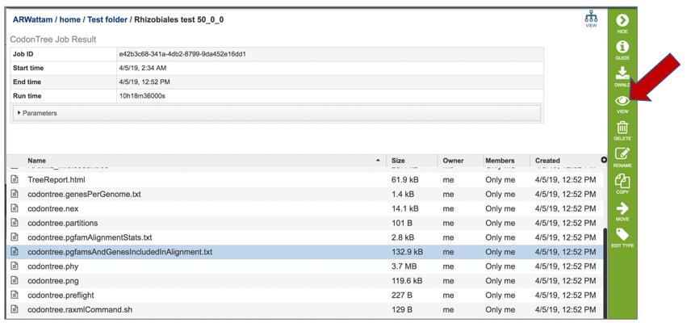

12: This shows the PGFam ID, and the locus tags for the proteins/genes for each of the genes used in the alignment for each of the genomes that were included in the analysis.

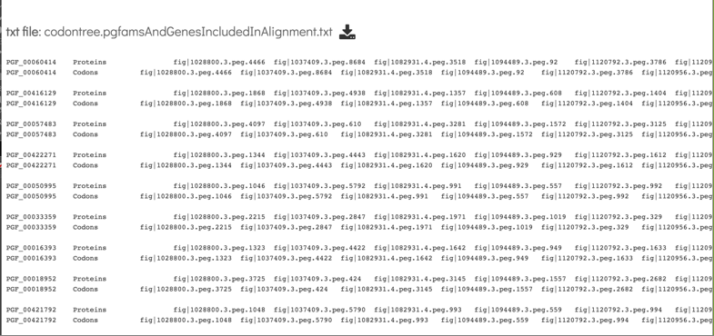

13: Click on the row that contains the codontree.png file.  This file can be viewed, but also downloaded.  Click the Download icon.

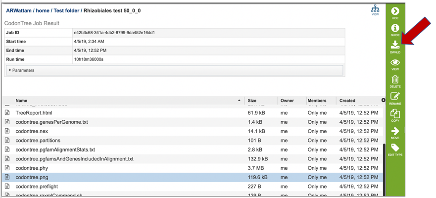

14: The png file of the tree will be downloaded to your computer.  This is the same file that would be seen if the View icon in the vertical green bar was selected.

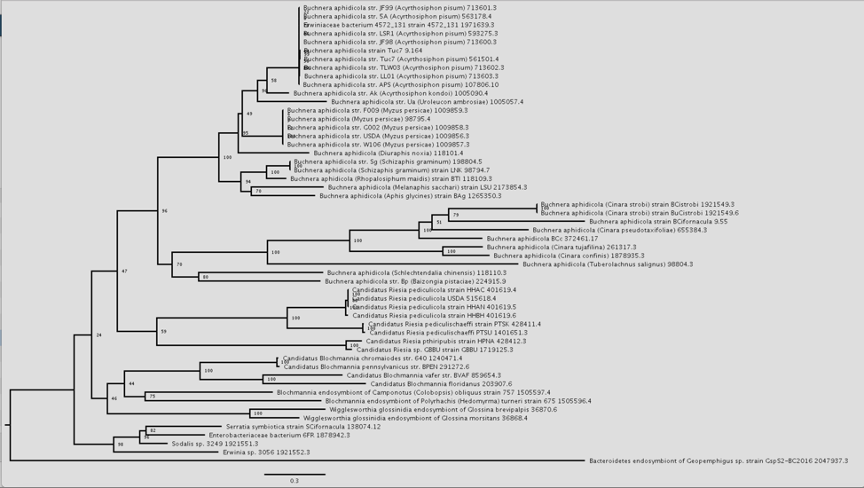

15: Clicking on the View icon in the upper right corner is also an option.

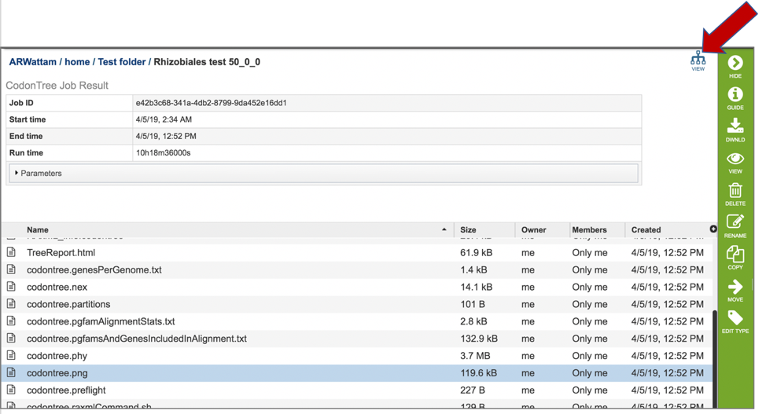

16: This will open an interactive viewer in PATRIC where the names are colored based on sharing the same genus (or first name) of the genome.

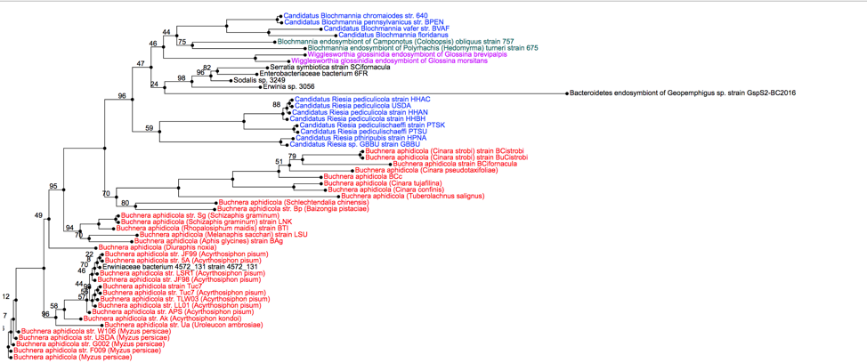

17: In this view, when a particular node of a branch (shown as a circle) is clicked on, all the genomes that are on that branch are selected (indicated by a check mark).  This will change the icons in the vertical green bar, and researchers will be able to go to a view that includes all the genomes, as well as creating a user group.

18: The scaled vector graph (.svg) is a publication quality image that is best downloaded.

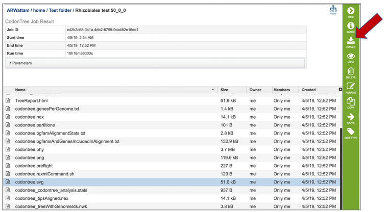

19: The .stats file contains the information statistics on the tree.  Click on the row that lists the file and then click on the View icon.

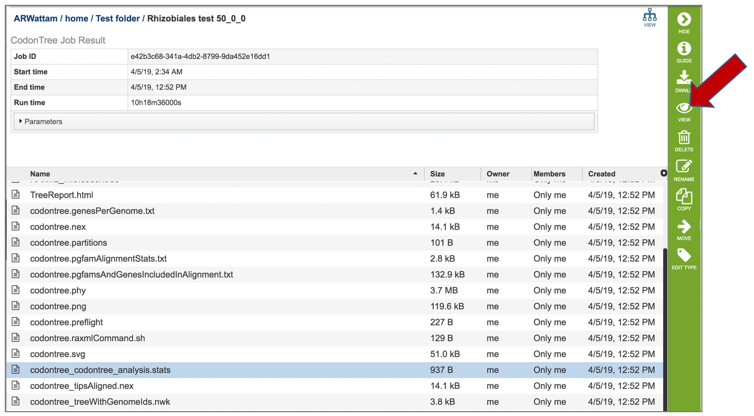

20: This file includes the number of genomes in the tree, the number of proteins aligned, the number of amino acids included in the alignment, the number of genes (CDS) in the alignment, the number of nucleotides, and the PGFam IDs that the proteins/genes were collected from.

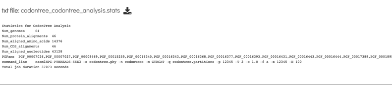

21: Newick files are the instructions for building the phylogenetic tree.  These files should be downloaded, and opened in viewer that can interpret them, where they can be adjusted to create the best possible image.  Two viewers that we recommend are FigTree[6] and the Interactive Tree of Life (ITOL)[7]. The Codon Trees pipeline provide two different versions of newick (.nwk) for download.  The codontree_treeWithGenomeIDs.nwk shows the IDs for all the genomes in the tree, which will be visible as the leaves.

22: The codontree_treeWithGenomeNames.nwk will produce a tree that has the genome names at the leaves.

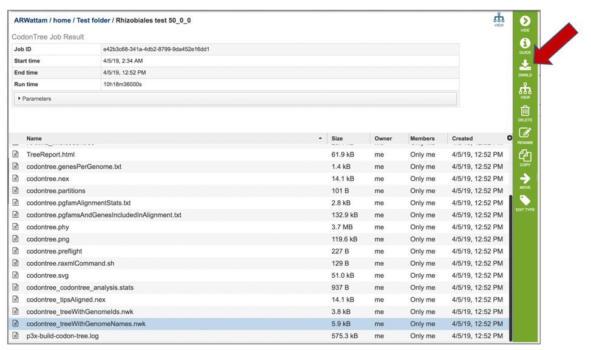

23: When either of the types of .nwk files are chosen, the View icon in the upper right corner of the table will show the same interactive tree discussed above.

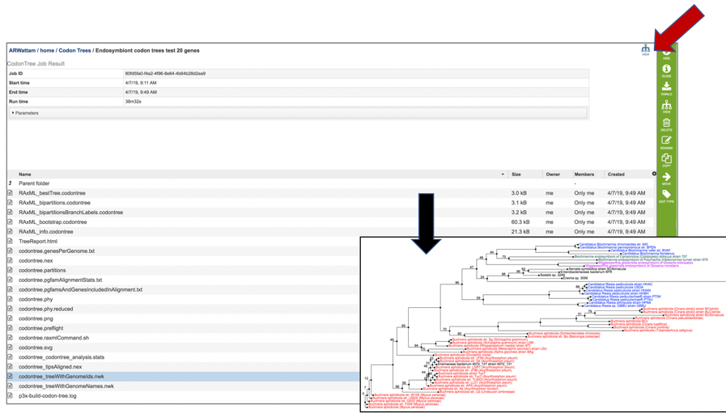

## VI.  Source code for algorithms

* The source code for RAxML can be found at: [RAxML](https://github.com/stamatak/standard-RAxML)
* The source code for MUSCLE can be found at: [MUSCLE](https://www.drive5.com/muscle/downloads.htm)
* The source code for BioPython can be found at: [BioPython](https://github.com/biopython/biopython)

## References

1.	Davis, J.J., et al., PATtyFams: Protein families for the microbial genomes in the PATRIC database. 2016. 7: p. 118.
2.	Edgar, R.C.J.N.a.r., MUSCLE: multiple sequence alignment with high accuracy and high throughput. 2004. 32(5): p. 1792-1797.
3.	Cock, P.J., et al., Biopython: freely available Python tools for computational molecular biology and bioinformatics. 2009. 25(11): p. 1422-1423.
4.	Stamatakis, A.J.B., RAxML version 8: a tool for phylogenetic analysis and post-analysis of large phylogenies. 2014. 30(9): p. 1312-1313.
5.	Stamatakis, A., P. Hoover, and J.J.S.b. Rougemont, A rapid bootstrap algorithm for the RAxML web servers. 2008. 57(5): p. 758-771.
6.	Rambaut, A.J.S.h.t.b.e.a.u.s.f., FigTree, a graphical viewer of phylogenetic trees. 2007.
7.	Letunic, I. and P. Bork, Interactive tree of life (iTOL) v3: an online tool for the display and annotation of phylogenetic and other trees. Nucleic acids research, 2016. 44(W1): p. W242-W245.

