# Comparing Pathways in PATRIC across individual genomes or genome groups

The Comparative Pathway Tool allows users to search for pathways based on taxonomy, EC number, pathway ID, or pathway name and compare pathways across one or more genomes using KEGG pathway maps and interactive heatmap viewer. 

**Keywords:** Comparative genomics, Comparative pathway analysis, Pathway comparison, Pathways, Metabolic pathways, KEGG pathways, Metabolomics. 

## I. Locating the Comparative Pathway tool.
1. At the top of any PATRIC page, find the Services tab. Click on Comparative Pathway.
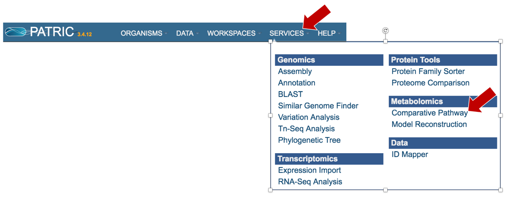

2. This will open the landing page for the Comparative Pathway tool.
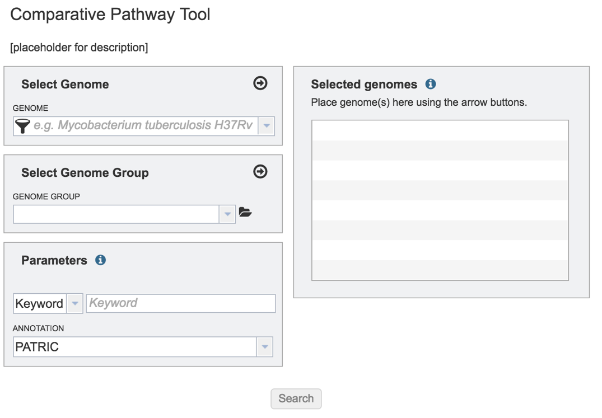

## II. Comparing Genome Groups – Comparative Pathway tool – Private Genome
1. To include any genome (reference, representative, other public, or private genomes), click on the filter button to narrow the selection and deselect the categories that are not of interest. 

2. Typing in the text box will show a list of the genomes available that contain that text. Private genomes are indicated by a Lock symbol. Once the genome of interest is located, clicking on it will fill the box.
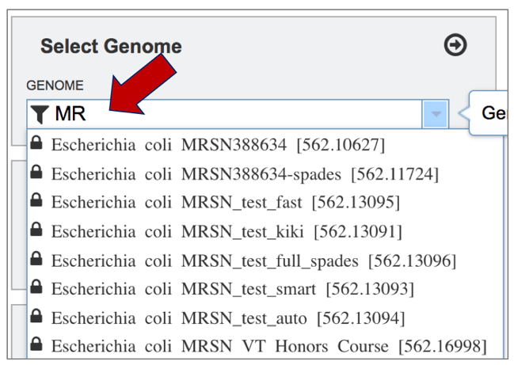

3. The genome must be added to the genomes for comparison, a box in the Selected Genomes box. Click on the arrow at the upper right of the Select Genome box (and the name of the genome will appear in the Selected Genomes box.

## III. Comparing Genome Groups – Comparative Pathway tool – Selecting Multiple Genome Groups
1. To select a genome group, go to the Select Genome Group box and click on the down arrow that follows the text box (red arrow). That will show a list of all the genome groups, with the most recently created appearing at the top of the list.

2. Clicking on the genome group of interest (red arrow) will make the name appear in the text box.
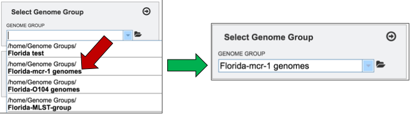

3. The genome group must be added to the genomes for comparison, a box in the Selected Genomes box. Click on the arrow at the upper right of the Select Genome box (red arrow) and the name of the genome will appear in the Selected genomes box.
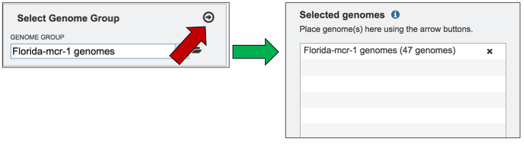

4. This can be repeated until all the genome groups or genomes of interest, have been added to the Selected Genomes box.
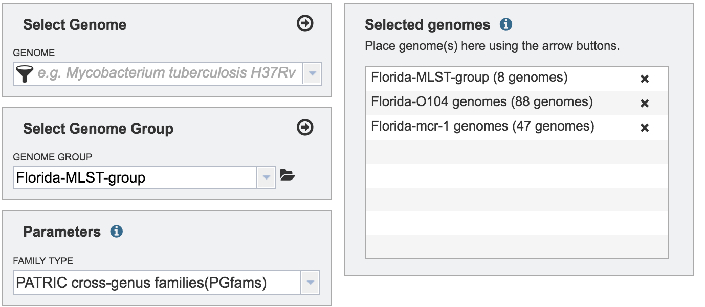

## IV. Selecting Parameters – Comparative Pathway Tool
1. Although not required for the job to be submitted, specific pathway parameters can be selected to filter down the number of pathways across all the genomes selected. In the Parameter box, clicking on the down arrow next to Keywords (red arrow). A specific Pathway ID or EC Number can be used as a filter.
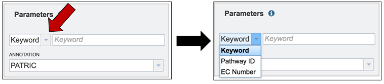

## V. Submitting the Comparative Pathway job.
1. Once all selections have been made, the comparative pathway job can be launched by clicking on the Search button (red arrow).
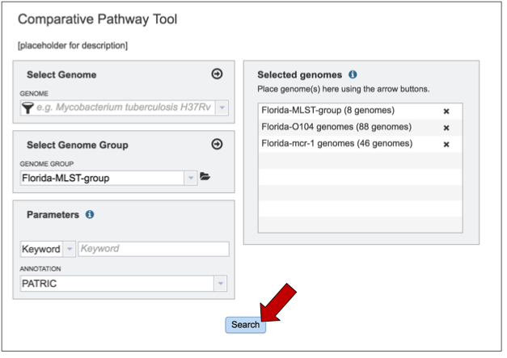

2. This will open up a table that shows all the Pathways that have any genes assigned to them from the genomes that have been chosen.
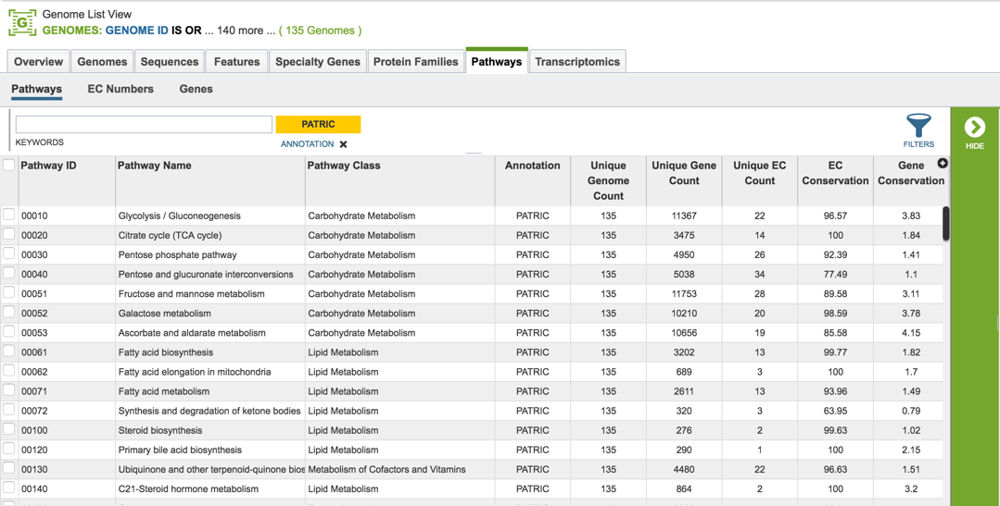

## VI. Selecting and viewing a Pathway – Pathway View
1. Clicking on a specific pathway (red arrow) will populate the green vertical bar with all the downstream tools available for that selection (blue arrow). Click on the Map Icon.
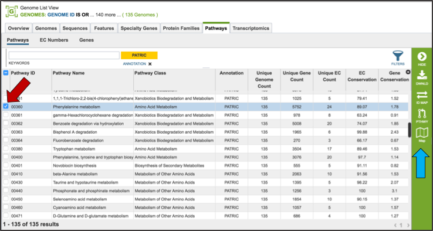

2. This will open a new page that has contains the Pathway View. On the left is a table listing the Enzyme Commission numbers of the genes that are found across all the genomes, and are present in that particular pathway. A KEGG diagram is on the right, and it has differently colored boxes that show the genes present, absent, or incompletely shared by all the genomes that were part of the selection.
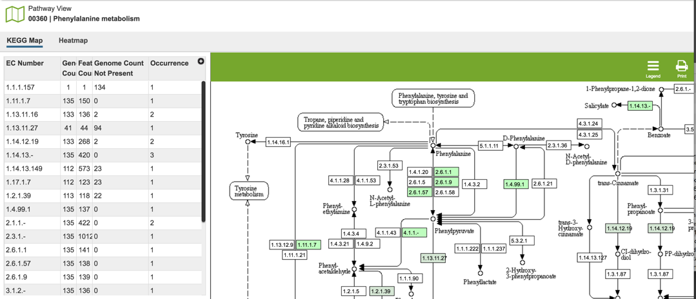

3. Clicking on the Legend Icon at the top right of the horizontal green bar will open the legend that explains the different colors.
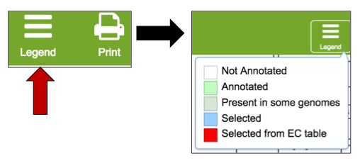

4. The presence and/or absence of genes can also be viewed in a heatmap. Click on the heat map tab above the EC table (red arrow). This will open a new page with the heatmap of the genes across all the genomes in the selected pathway
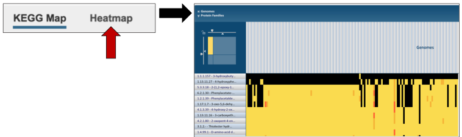

## VII. Comparative Pathway– Heatmap – Downloading information by Row
1. The names of genes and genomes, locus tags, functional description and other information can be downloaded directly from the heatmap. To select and see all the genes from an individual column, click on any column head of interest where the name of the protein family is displayed (red arrow).
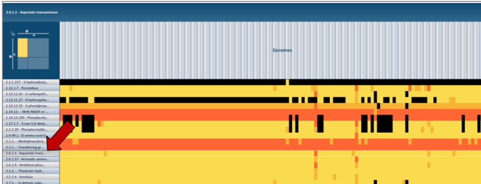

2. This will open a pop-up box that allows users to download the heatmap data, download the proteins, show the protein, or add the proteins to a group in the workspace. To see the proteins in the column, click on the Show Proteins button (red arrow).
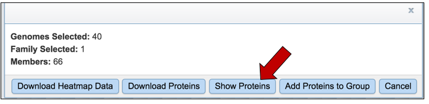

3. This will open a new tab that shows the list of proteins.
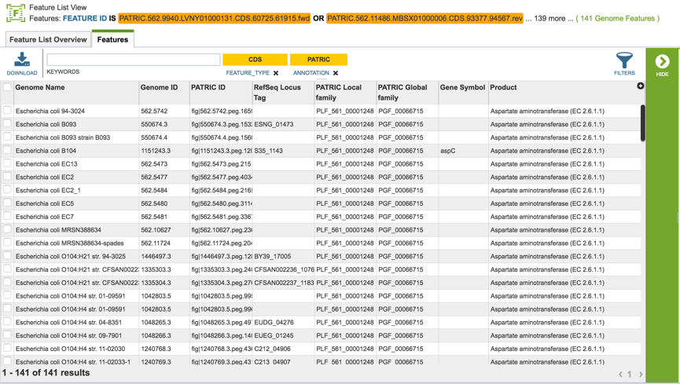

4. All the proteins in the list can be selected by clicking the box in the column head to the left of Genome Name (red arrow). This will select all the proteins in the table. Once any, or all features are selected, the vertical green bar will show all the tools or processes that can be used on these proteins (blue arrow). These include download the group, creating a feature group, creating a genome group, getting the protein or nucleotide FASTA sequences, creating a multiple sequence alignment, finding other identifiers that map to the proteins in that selection, see if any of them are in a pathway, or group them all together.

5. For instance, clicking on the Pathway icon will open a new table that shows all the pathways that all the selected genes are part of.
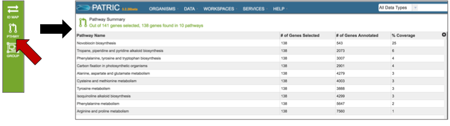

## VIII. Comparative – Heatmap – Downloading information by Selection
1. The names of genes and genomes, locus tags, functional description and other information can be downloaded directly from the heatmap. To select a group of proteins from the heatmap directly, use the mouse to draw an icon over the proteins of interest. As you mouse over a region, you will see a yellow box begin to form.
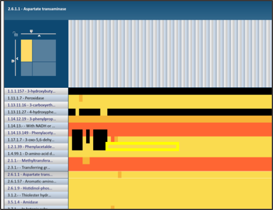

2. This will open a pop-up box that allows users to download the heatmap data, download the proteins, show the protein, or add the proteins to a group in the workspace. To see the proteins in the column, click on the Show Proteins button (red arrow).

3. This will open a new tab that shows the list of proteins.

4. All the proteins in the list can be selected by clicking the box in the column head to the left of Genome Name (red arrow). This will select all the proteins in the table. Once any, or all features are selected, the vertical green bar will show all the tools or processes that can be used on these proteins (blue arrow). These include download the group, creating a feature group, creating a genome group, getting the protein or nucleotide FASTA sequences, creating a multiple sequence alignment, finding other identifiers that map to the proteins in that selection, see if any of them are in a pathway, or group them all together.
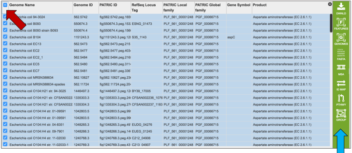

5. For instance, clicking on the MSA icon will open a new page that shows a multiple sequence alignment.
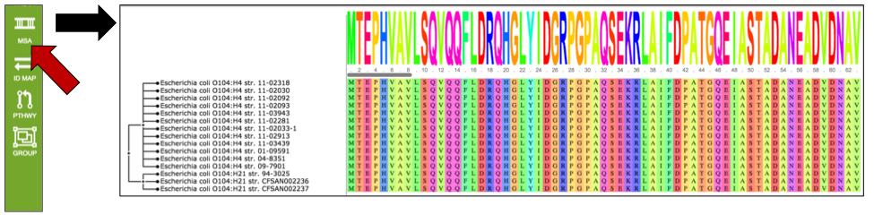

## IX. Manipulating the MSA view
1. Changing the color. The MSA is available in a number of different colors that can be selected by clicking on the Colors icon in the vertical green bar.
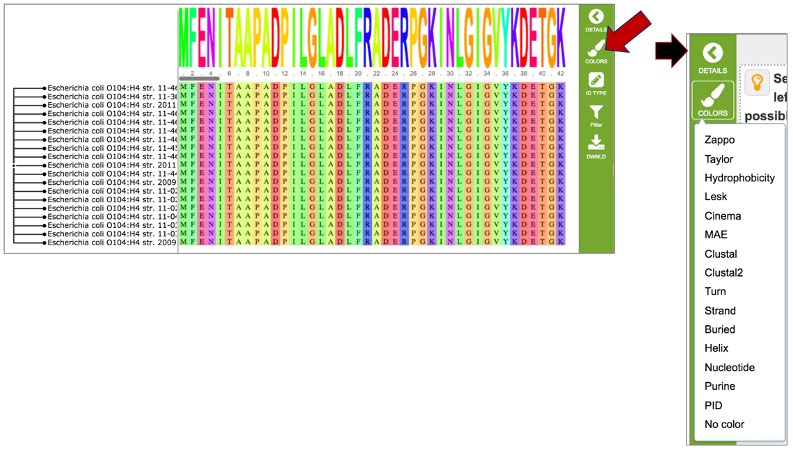

2. Changing the IDs visualized on the tree. The identifiers (Genome name or Gene ID) available on the tree can be selected by clicking on the ID Type icon in the vertical green bar.
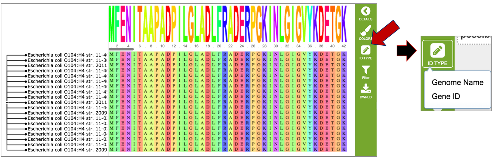

3. Filtering the MSA. Researchers can select what they want to see on the MSA by filtering on how conserved the nucleotides/amino acids are in each column. Filtering on the gaps in the alignment is also possible. To enable any of these filters, click on the Filter icon in the vertical green bar.
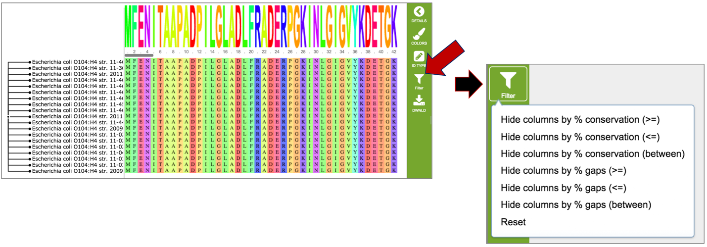

4. Downloading the MSA. The alignment, a picture of the tree (svg), newick file, and individual fasta files can all be downloaded by clicking on the Download icon in the vertical green bar.
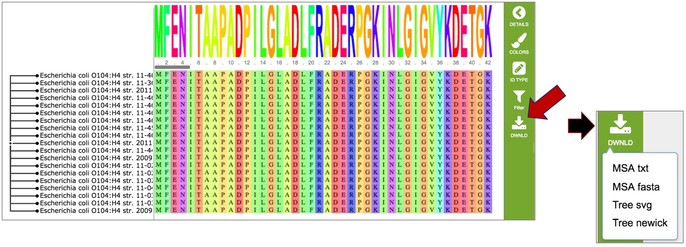
