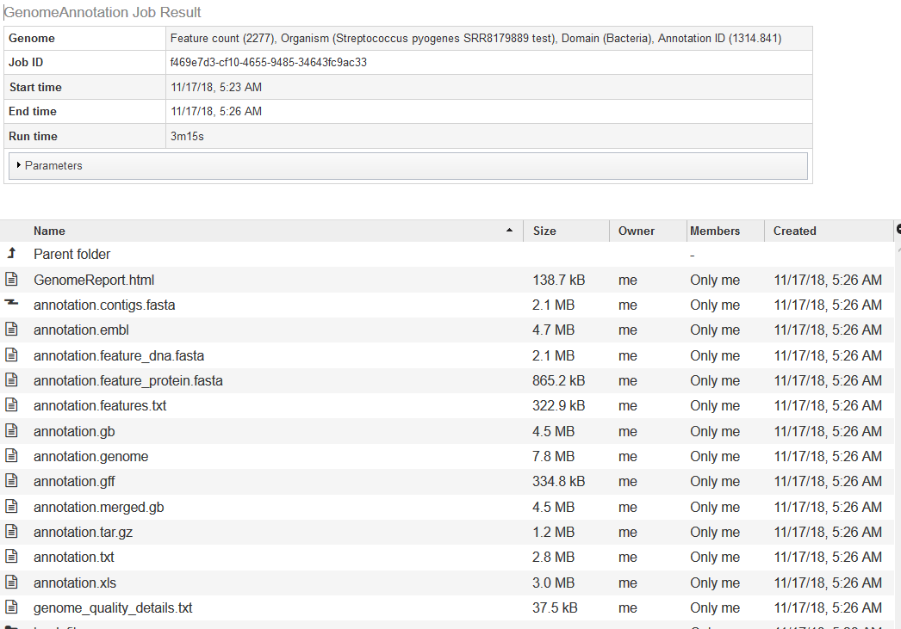
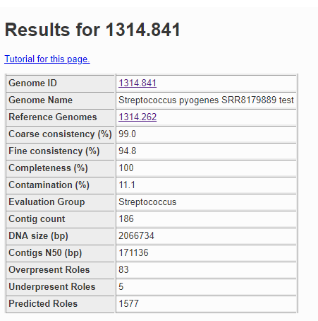
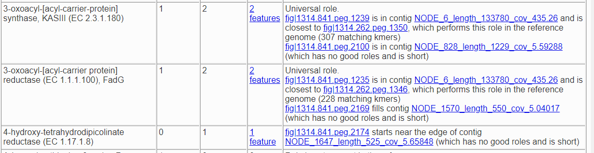
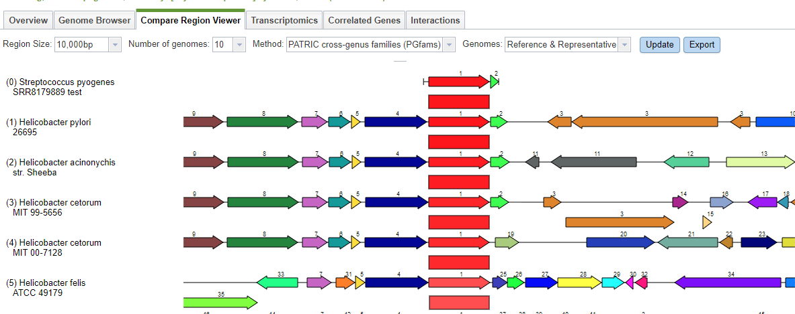
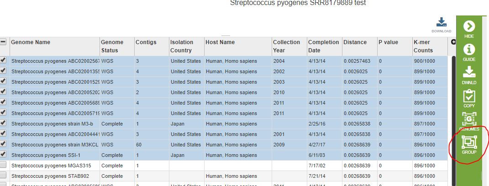
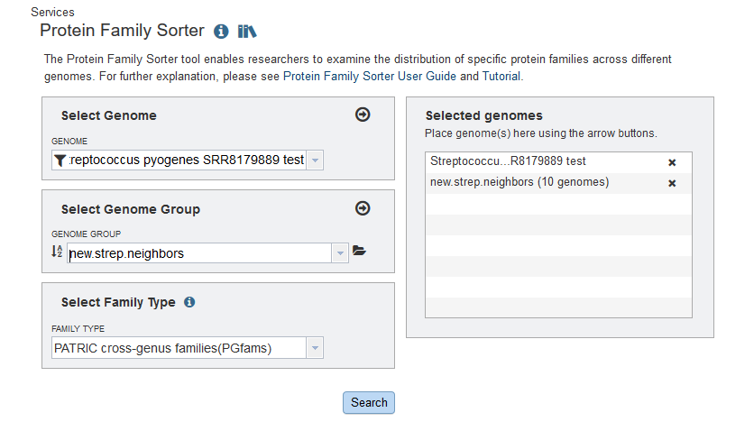
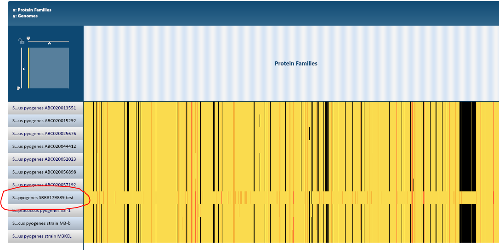
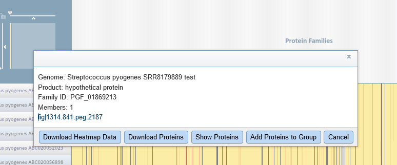
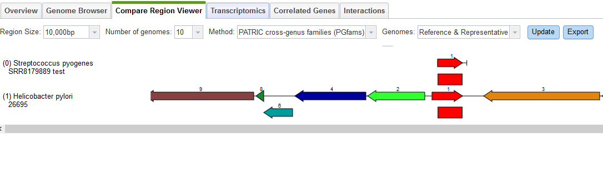

=================================================
 Comparing Your New Genome to Existing Neighbors
=================================================

In this tutorial, we discuss a common task when working with a new private genome
run through the :doc:`comprehensive-genome-analysis`-- comparing the genome to its
close neighbors.  In this example, we will look at the results of a comprehensive
genome analysis run for the NCBI SRA sample SRR8179889.  The sample was assembled
into contigs and then annotated as a *Streptococcus pyogenes* (from which the sample
was cultured).

The output of the pipeline looks like this

.. image:: images/cga_result.png

The Full Genome Report contains a lengthy text analysis (with tables and diagrams) of the genome and its
annotation.  Among the diagrams will be a phylogenetic tree showing the new genome’s relationship to its
neighbors.  The list of neighbors will be in the text file *tree_ingroup.txt*.

Checking the Annotation Quality
-------------------------------

If you double-click on **annotation**, it will take you to the annotation job for the new genome.

The quality analysis of the genome can be found in *GenomeReport.html*.  The summary at the top is
shown below.

The contamination score in this case is
11.1%, and anything more than 10% is considered a red flag.  Below is a fragment of the problematic roles report from
the quality analysis.

Here we have two roles that should only occur once but actually appear twice, and one role which should not
occur but was found once.  Both of the roles that are duplicated have a version that matches the corresponding
role in the reference genome and one that does not.
So, *fig|1314.841.peg.1239* is likely correct, because it matches a feature with that role in the reference genome
for this species, but *fig|1314.841.peg.2100* is suspect because it does not.  To find out what it does match, we
click on the link for it, which takes us to the Compare Regions display.

The Compare Regions view uses protein familes to link features together.  The gene we selected-- *fig|1314.841.peg.2100*-- is shown
in red on the first line.  The closest proteins in the same family are shown in red on the lower lines.  Each red protein is
surrounded by its neighborhood on the contig, and all proteins are color-coded and numbered by family.  So, all the dark blue
proteins with the number 4 belong to the same family, and are generally found near our protein of interest.  What we see clearly
from this display is that our protein of interest in our new genome is more like something found in Helicobacter than in
Streptococcus pyogenes.

A similar search using the other two suspect features returns the same result.  We can conclude the extra DNA in our original sample
is from Helicobacter.

A Visual Comparison Using the Protein Family Sorter
---------------------------------------------------

We would now like to compare the genome directly to its close neighbors using the :doc:`/user_guides/services/protein_family_service`.
The Protein Family Sorter requires you to enter genomes one at a time unless they are already in a genome group.  First we need to
find the closest neighbors in PATRIC.  The Comprehensive Genome Analysis found a set suitable for generating a phylogenetic tree,
but these are not necessarily the closest.  Using the :doc:`/user_guides/services/similar_genome_finder_service`, we can get a list
of the 50 or so closest genomes.  We will select the first 10 and put them into a genome group using the **Group** icon.

We are now ready to invoke the Protein Family Sorter.  In the screen shot below, we entered the new genome as an individual,
and *new.strep.neighbors* is the name of the genome group of close neighbors we just created.

The Protein Family Sorter produces a tabular analysis and a heatmap.  The heatmap is shown below.

At this resolution, every protein family is a vertical line.  Black indicates there is no protein in the family.  Yellow indicates
there is one and only one protein from that family in the genome, and when there is more than one a shade of orange is shown.
Each row represents a genome, and our new genome stands out dramatically.

You can scale the display so that the columns are wide enough to see the protein family names.  You can also click on an individual
protein. We would like to see one of the proteins that is in the new genome but does not have family members in the neighboring genomes.
Every part of the diagram is clickable, and you can even drag-select a whole region.
Clicking on part of the yellow band inside the big black vertical bar produced the pop-up below.

You can click on the feature link to see it in Feature View.  Selecting the Compare Regions tab shows us that this particular protein
belongs in Helicobacter pylori.

This confirms what we learned from the quality report:  the sample contains some Helicobacter DNA.

