# Comprehensive Genome Analysis Service

The Comprehensive Genome Analysis Service is a streamlined analysis "meta-service" that accepts raw genome reads and performs a comprehensive analysis including assembly, annotation, identification of nearest neighbors, a basic comparative analysis that includes a subsystem summary, phylogenetic tree, and the features that distinguish the genome from its nearest neighbors.

## Submitting a CGA Job

### Finding the service

1. Click on the Services tab at the top of the page, and then click on Comprehensive Genome Analysis (CGA).
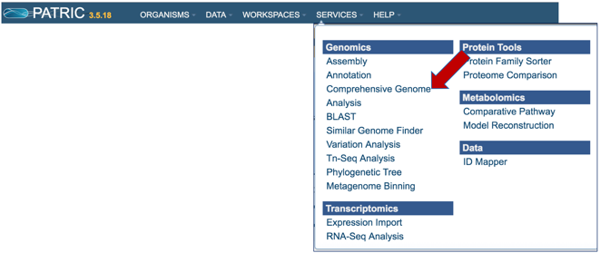

2. This will open the landing page for the service.
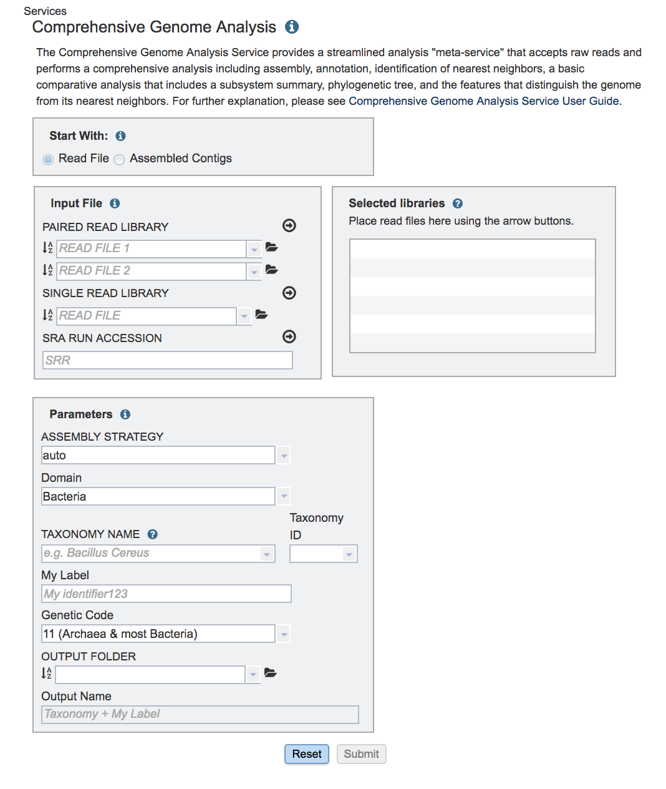

### Uploading paired end reads

1. To upload a fastq file that contains paired reads, locate the box called “Paired read library.” 
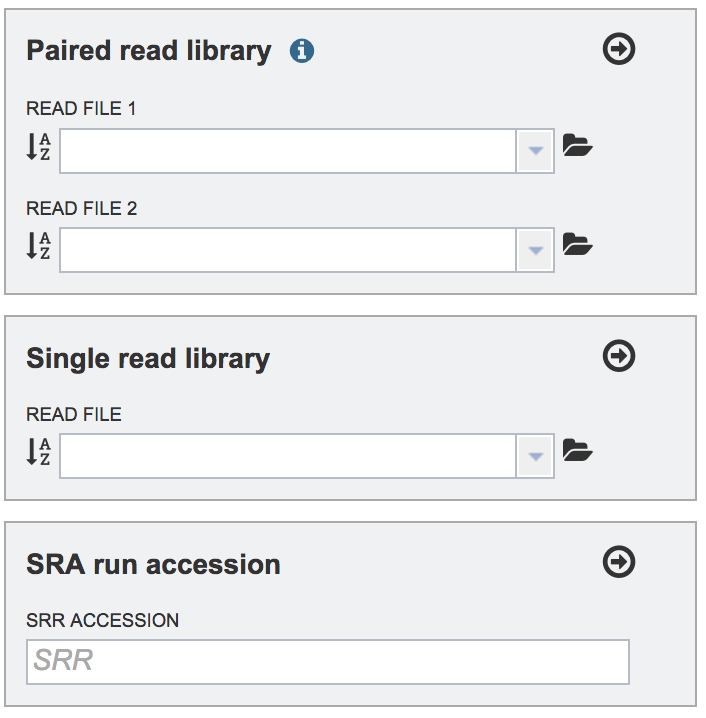

2. The reads must be located in the workspace. To initiate the upload, first click on the folder icon. 
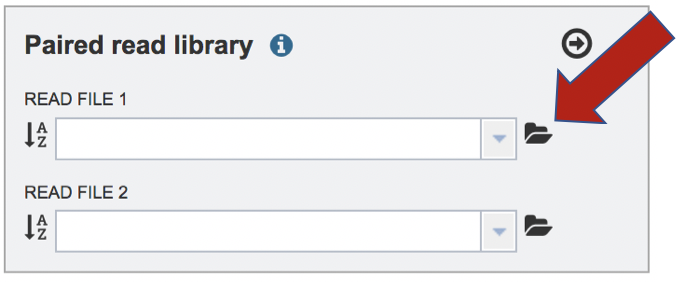

3. This opens up a window where the files for upload can be selected. Click on the icon with the arrow pointing up. 
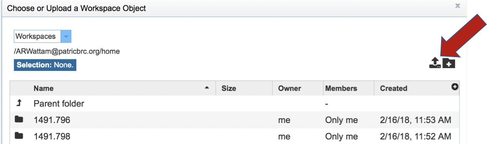

4. This opens a new window where the file you want to upload can be selected. Click on the “Select File” in the blue bar. 
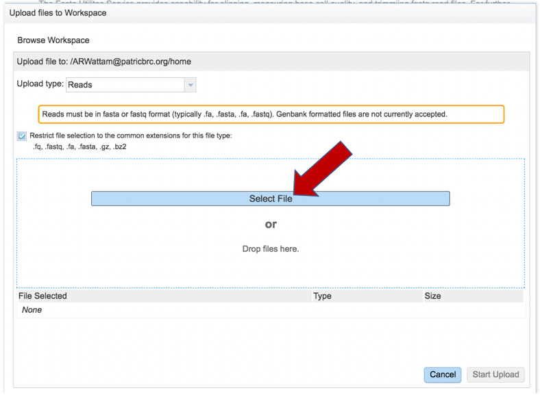

5. This will open a window that allows you to choose files that are stored on your computer. Select the file where you stored the fastq file on your computer and click “Open”.  
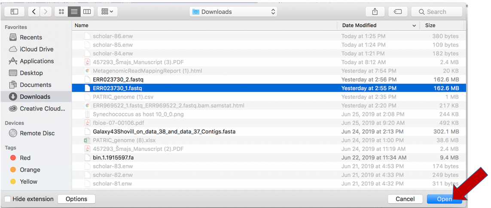

6. Once selected, it will autofill the name of the file. Click on the Start Upload button.
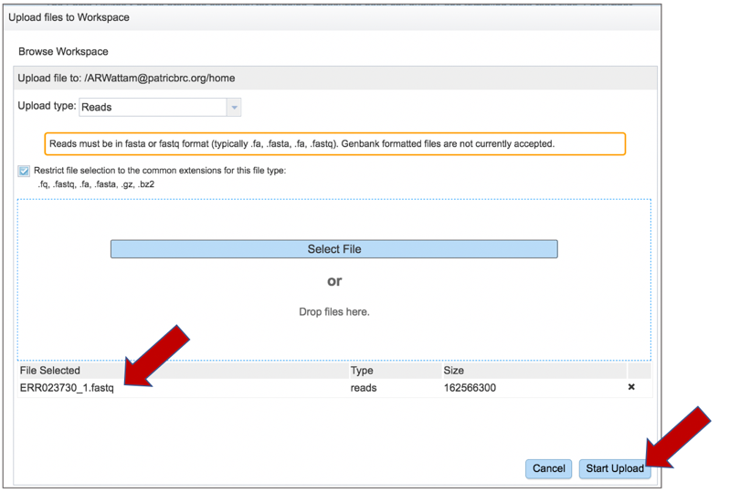

7. This will auto-fill the name of the document into the text box. 
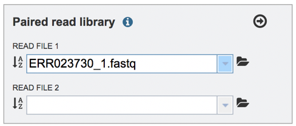

8. Pay attention to the upload monitor in the lower right corner of the PATRIC page. It will show the progress of the upload. Do not submit the job until the upload is 100% complete.

9. Repeat to upload the second pair of reads.
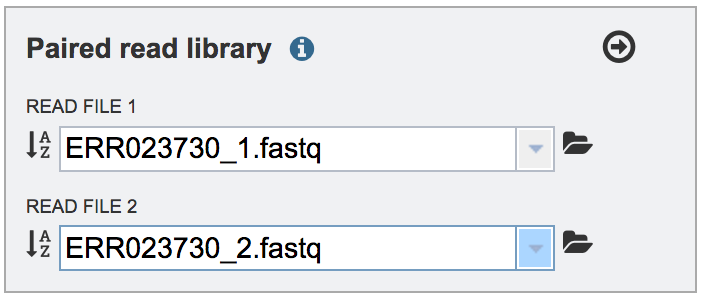

10. To finish the upload, click on the icon of an arrow within a circle. This will move your file into the Selected libraries box.
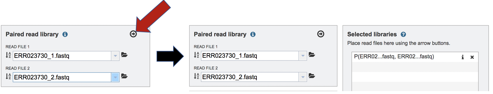

### Uploading single reads

1. To upload a fastq file that contains single reads, locate the text box called “Single read library.” If the reads have previously been uploaded, click the down arrow next to the text box below Read File. 

2. This opens up a drop-down box that shows the all the reads that have been previously uploaded into the user account. Click on the name of the reads of interest.
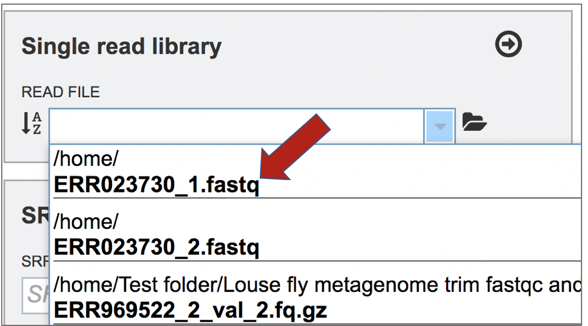

3. This will auto-fill the name of the file into the text box.
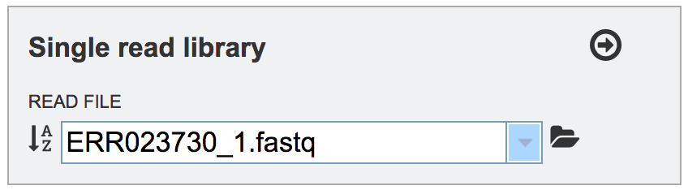

4. To finish the upload, click on the icon of an arrow within a circle. This will move the file into the Selected libraries box.
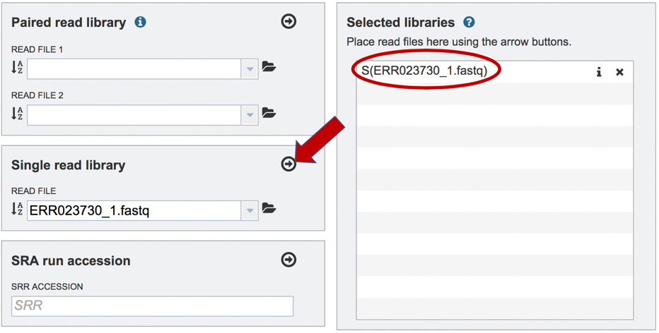

### Submitting reads that are present at the Sequence Read Archive (SRA)

1. PATRIC also supports analysis of existing datasets from SRA. To submit this type of data, locate the Run Accession number that you will find at SRA and copy it.
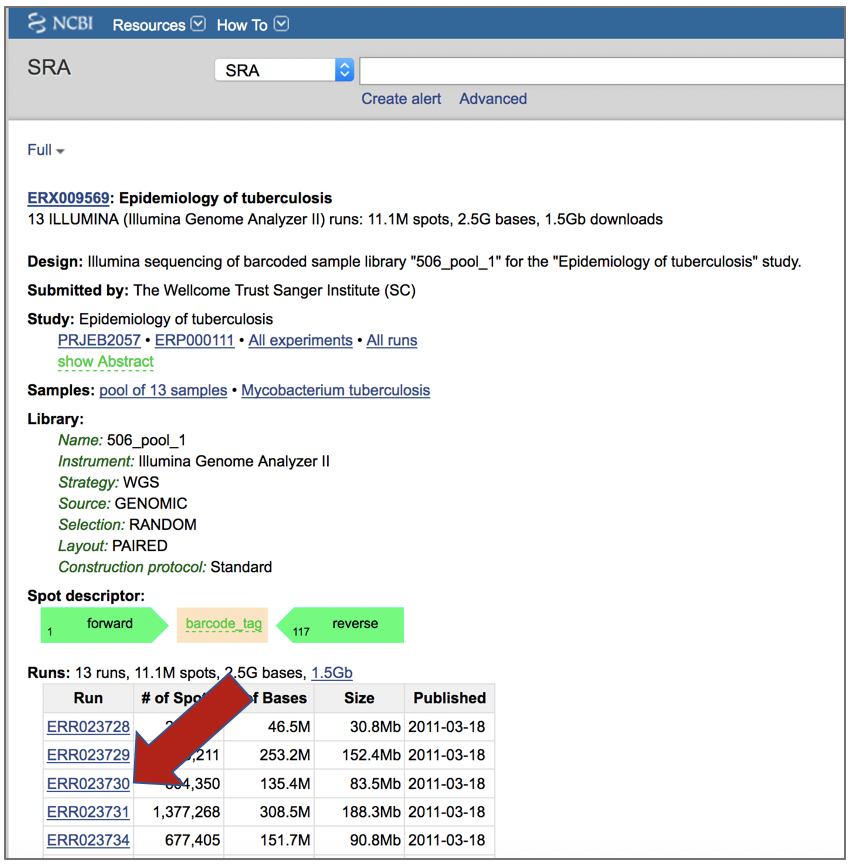

2. Paste the copied accession number in the text box underneath SRA Run Accession, then click on the icon of an arrow within a circle.  This will move the file into the Selected libraries box.
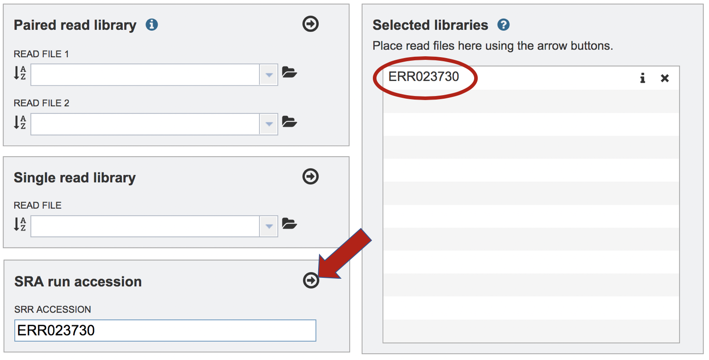

## Setting Parameters

1. The assembly strategy for the reads must be selected.  Clicking on the down arrow that follows the text box under Assembly Strategy will open a drop-down box that shows all the strategies that PATRIC offers.  A description of each strategy is listed below. Clicking on one of the strategies will autofill the text box with that selection.

- Unicycler[1] is an assembly pipeline that can assemble Illumina-only read sets where it functions as a SPAdes-optimizer. It can also assembly long-read-only sets (PacBio or Nanopore) where it runs a miniasm plus Racon pipeline. For the best possible assemblies, give it both Illumina reads and long reads, and it will conduct a hybrid assembly.  Unicycler builds an initial assembly graph from short reads using the de novo assembler and then uses a novel semi-global aligner to align long reads to it. The latest version of Unicycler is available here (https://github.com/rrwick/Unicycler).
- SPAdes[2] is an assembler that is designed to assemble small genomes, such as those from bacteria, and uses a multi-sized De Bruijn graph to guide assembly. The latest version of the SPAdes toolkit is available here (http://cab.spbu.ru/software/spades/).
- Canu[3] is a long-read assembler which works on both third and fourth generation reads. It is a successor of the old Celera Assembler that is specifically designed for noisy single-molecule sequences. It supports nanopore sequencing, halves depth-of-coverage requirements, and improves assembly continuity. It was designed for high-noise single-molecule sequencing (such as the PacBio RS II/Sequel or Oxford Nanopore MinION).  The algorithm is available here (https://github.com/marbl/canu).
- The metaSPAdes [4] software combines new algorithmic ideas with proven solutions from the SPAdes toolkit to address various challenges of metagenomic assembly.  The latest version of the SPAdes toolkit that includes metaSPAdes is available here (http://cab.spbu.ru/software/spades/).
- Plasmids are stably maintained extra-chromosomal genetic elements that replicate independently from the host cell's chromosomes. The plasmidSPAdes[5] algorithm and software tool for assembling plasmids from whole genome sequencing data and benchmark its performance on a diverse set of bacterial genomes. The latest version of the SPAdes toolkit that includes plasmidSPAdes is available here (http://cab.spbu.ru/software/spades/).
- Single-cell[2]: SPAdes, a new assembler for both single-cell and standard (multicell) assembly, and it improves on the recently released E+V−SC assembler (specialized for single-cell data). The latest version of the SPAdes toolkit that includes the assembly algorithm for reads from single cell is available here (http://cab.spbu.ru/software/spades/).
- Selecting Auto will use Canu if only long reads are submitted. If long and short reads, as or short reads alone are submitted, Unicycler is selected.

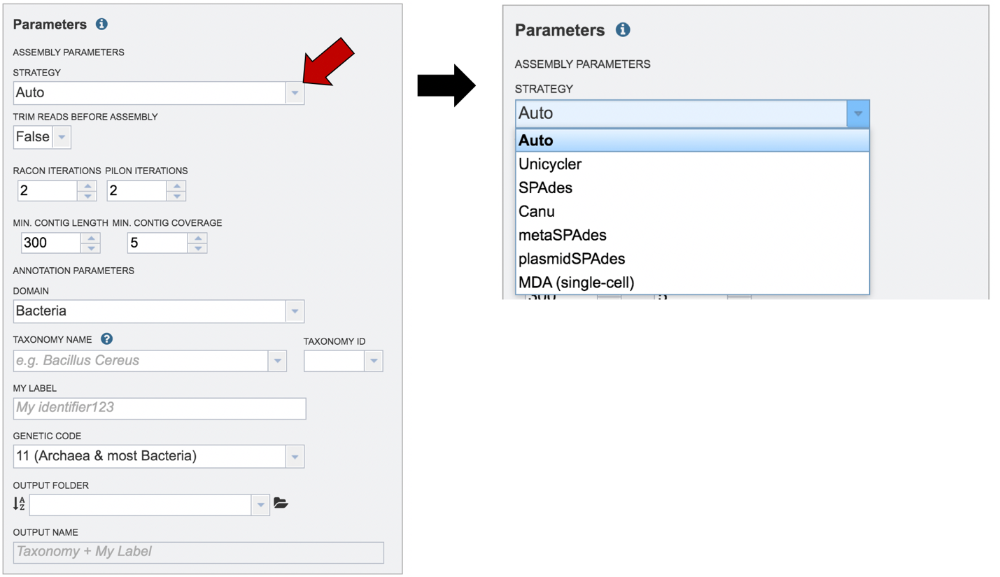

2. The PATRIC assembly service also has options to trim the reads using TrimGalore[6], which can be selected by clicking the down arrow following the word False under Trim Reads Before Assembly.
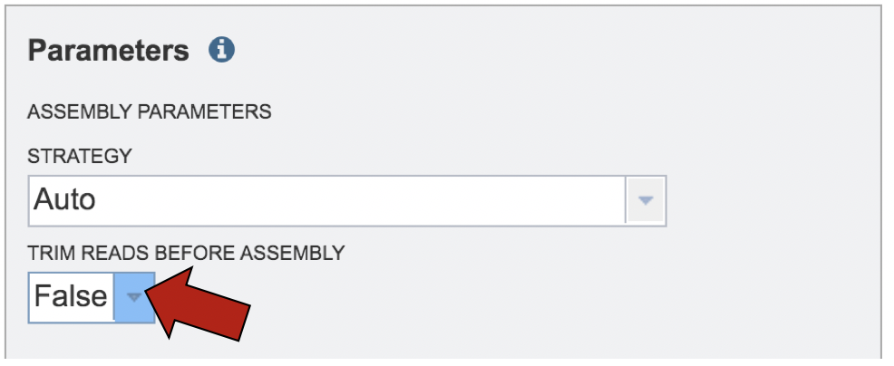

3. PATRIC’s assembly service also allows for the correction of assembly errors (or “polish) using Racon[7] and/or Pilon[8]. Both racon and pilon take the contigs and the reads mapped to those contigs, and look for discrepancies between the assembly and the majority of the reads.  Where there is a discrepancy, racon or pilon will correct the assembly if the majority of the reads call for that.  Racon is for long reads (PacBio or Nanopore) and pilon is for shorter reads (Illumina or Ion Torrent).  Once the assembly has been corrected with the reads, it is still possible to do another iteration to further improve the assembly, but each one takes time.  PATRIC allows for 0 to 4 racon or pilon iterations.  The number of polishing rounds can be selected by clicking on either the up or down arrows underneath Racon or Pilon interations.
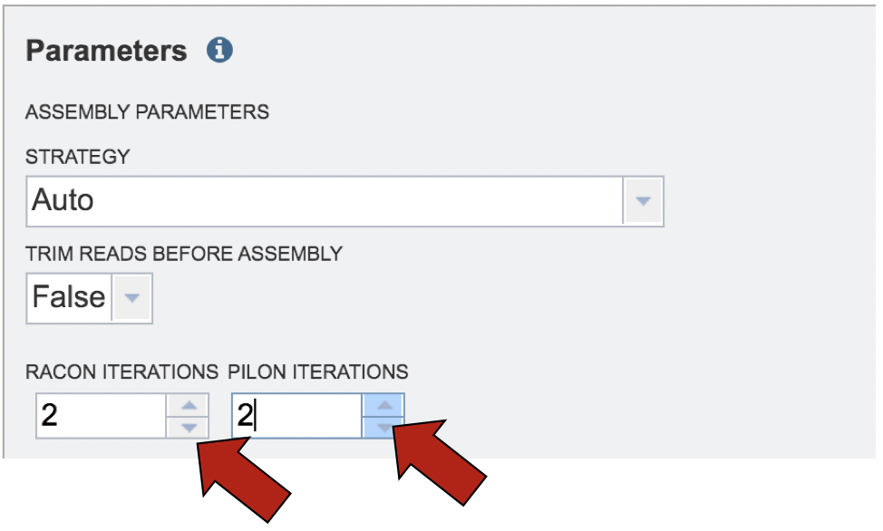

4. The assembly service also provides the ability to change the minimum contig length and coverage.  
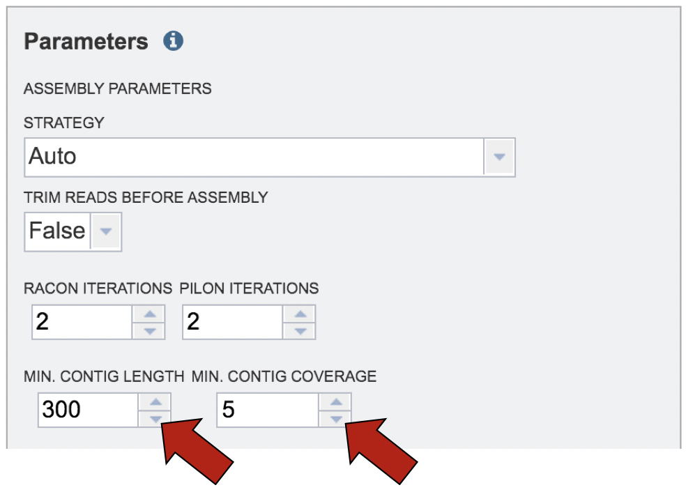

5. Annotation parameters must be selected next.  PATRIC provides annotation for Bacteria, Archaea and Bacteriophages, and all genomes are annotated by the RASTtk program[9].  To select a particular annotation strategy from one of those taxa, click on the down arrow at the end of the text box. Bacteriophages must be annotated using the Virus selection (Note: At this time bacteriophages are the only viruses that can be annotated in PATRIC. 
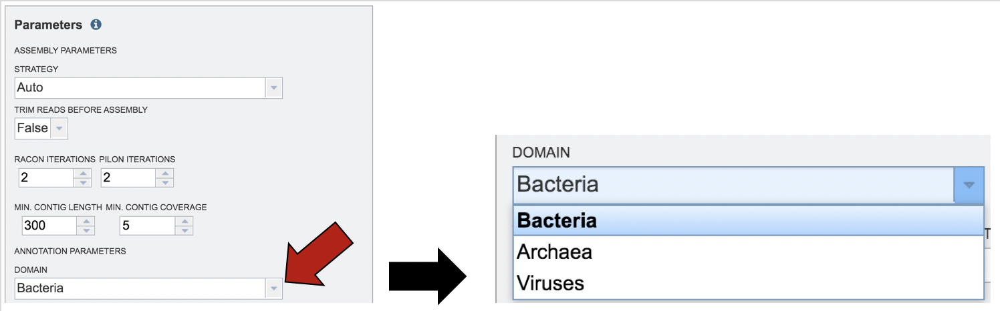

6. The taxonomic name must next be selected.  Begin typing in the lowest ranked taxonomic name known for the sequenced isolate.  It is best to be able to get to Genus, if possible.  Once typing begins, a drop-down box will automatically appear with the taxonomic names in PATRIC that match the entered text.  Click on the most appropriate name. This will fill the text box under Taxonomy Name with the selected name, and also include the Taxonomy ID.  If the Taxonomy ID is known, that can be filled in and the ID and matching taxonomy name will be auto filled.  PATRIC provides two different version of protein families, called PATtyFams[10]. If a taxonomic level above the genus level is selected, the annotation will only have global protein families (PGFams) assigned.  If a genus or species is selected, the annotation will include the both PGFams, and the local protein families (PLFams), which are genus-specific.
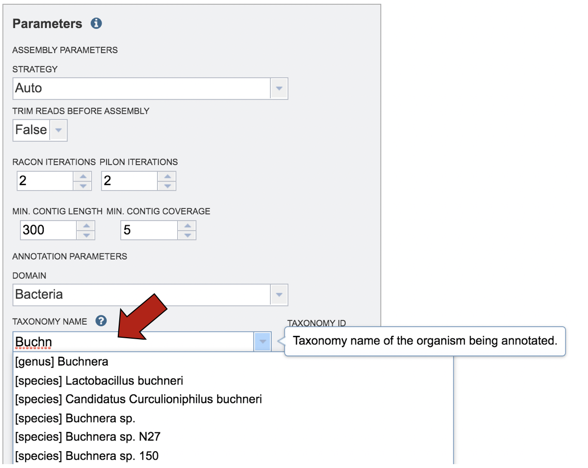

7. Give the genome a unique name by entering text in the box underneath My Label.  The name that is entered will appear in the Output Name in the lowest text box.
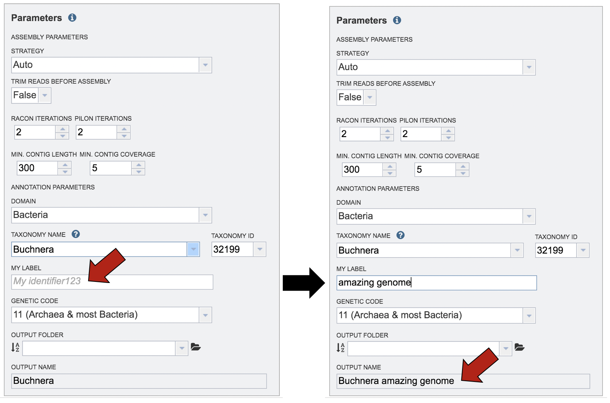

8. An output folder must be selected for the assembly job.  Typing the name of the folder in the text box underneath the words Output Folder will show a drop-down box that shows close hits to the name, and clicking on the arrow at the end of the box will open a drop-down box that shows the most recently created folders.  To find a previously created folder, or to create a new one, click on the folder icon at the end of the text box.  This will open a pop-up window that shows all the previously created folder.
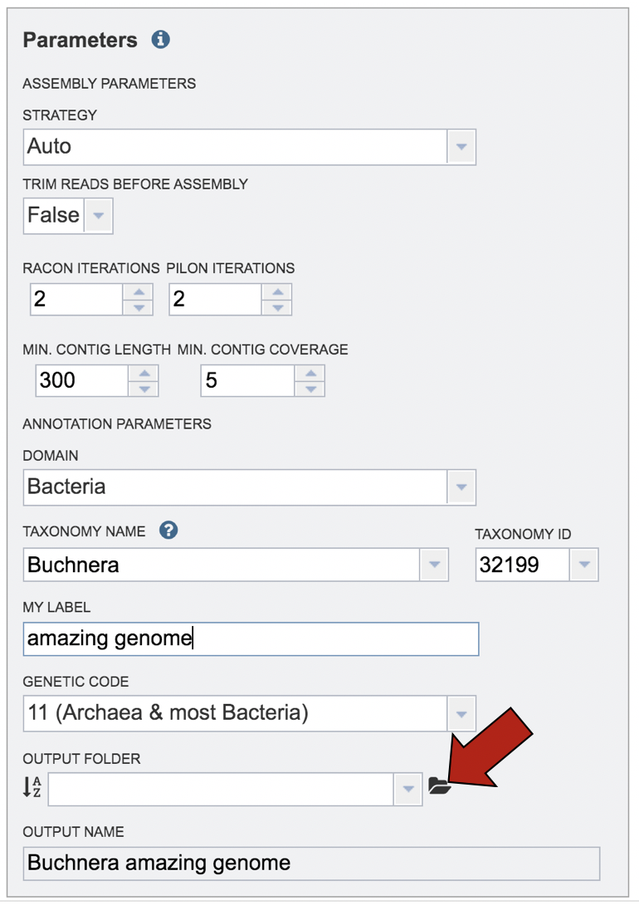

9. Click on the folder of interest, and then click the OK button in the lower right corner of the window.
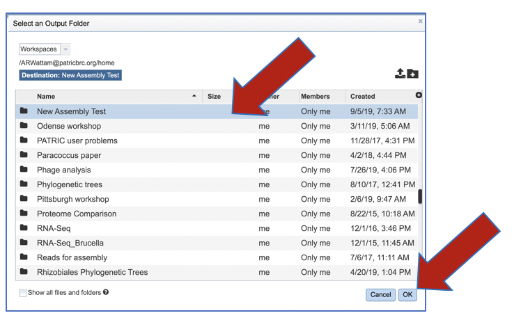

11. A name for the job must be included prior to submitting the job.  Enter the name in the text box underneath the words Output Name.

12. The correct genetic code must also be selected. To choose the correct code, click on the down arrow in the text box underneath Genetic Code.  This will show the three possibilities.
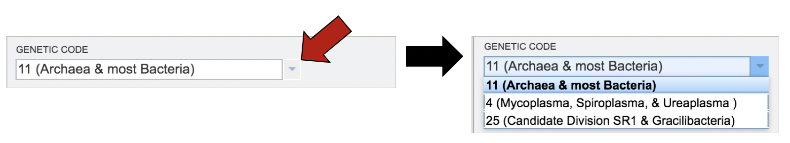

## Submitting contigs to the Comprehensive Genome Analysis.

1. To submit contigs for an annotation job, click on the check box in front of Assembled Contigs at the top of the service.

2. If a contig file has previously been uploaded in PATRIC, click on the down arrow next to the text box underneath the word Contigs.  This will open a drop-down box that has all the fasta files that are available from your workspace.  Either begin typing in the text box, or scroll down until you find the file of interest. Click on the name when it is located.
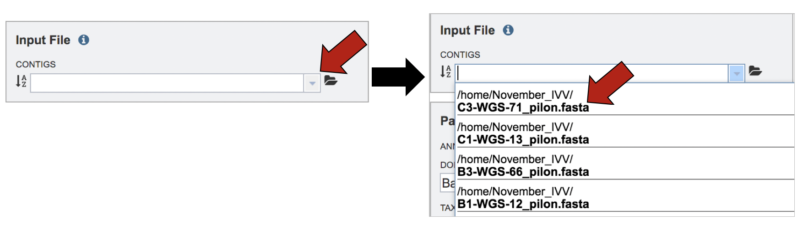

3. The name will appear in the text box.
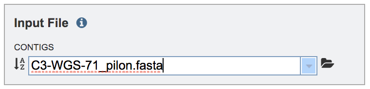

4. As described above, select the correct annotation parameters, including the Domain, the Taxonomy name, a label, the genetic code, and an output folder.
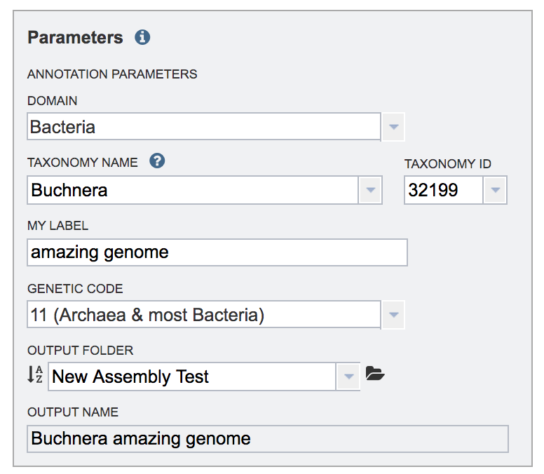

## Submitting the Comprehensive Genome Analysis job

1. When all the parameters are entered correctly, the Submit button at the bottom of the page will turn blue.  Click on that button, and the will enter the queue.  You can monitor the progress on the Jobs page. 
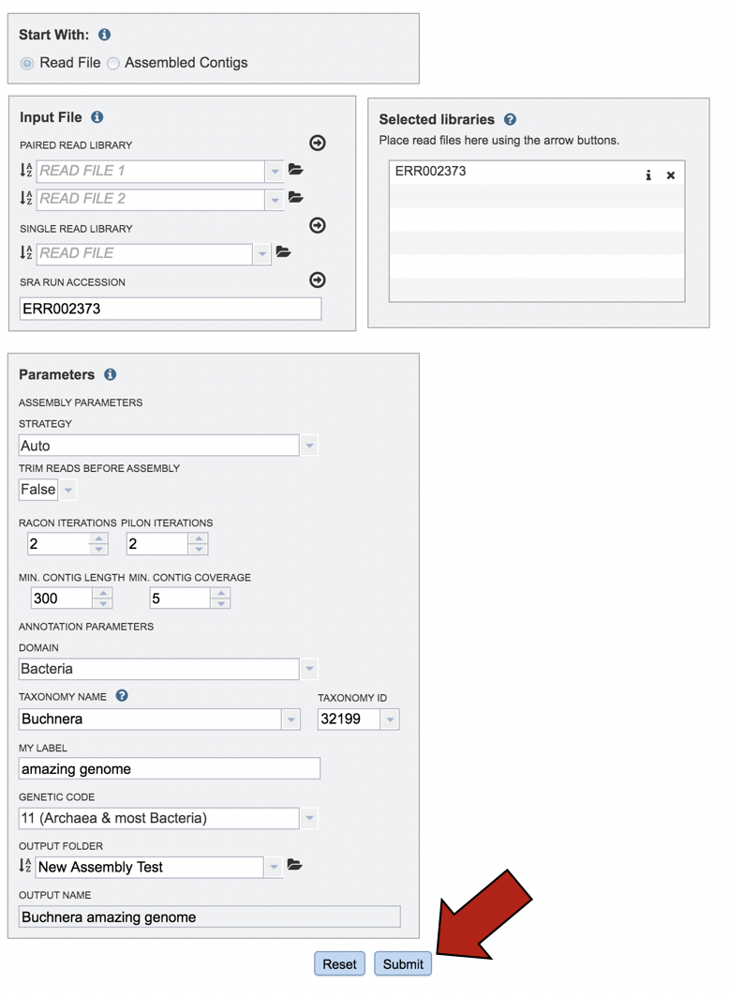

## Finding the Comprehensive Genome Analysis job

1. Click on the Jobs monitor at the bottom right of any PATRIC page.
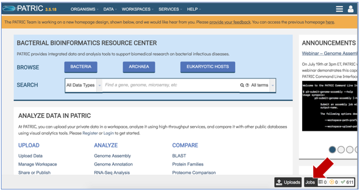

2. This will open the page where all jobs submitted to PATRIC are listed.  Every Comprehensive Genome Analysis (CGA) job also launches an assembly and annotation job, which can be found immediately below the row that list the CGA job.  To find out more information about the CGA job, click on the job of interest, and then on the view icon in the vertical green bar.
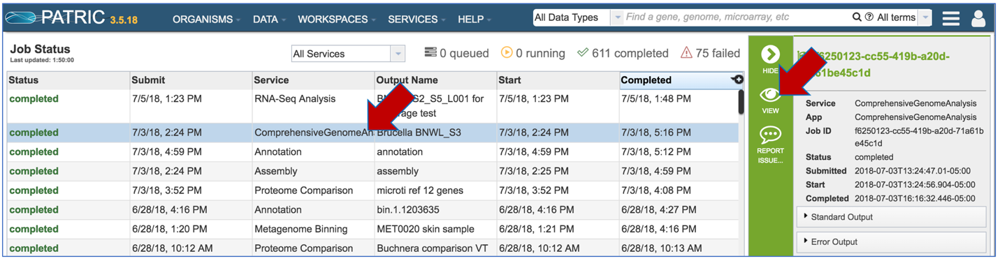

3. PATRIC now provides a genome announcement style document for any genome annotated using the Comprehensive Genome Analysis service.  To see this document, select the row that contains the FullGenomeReport.html and click on the download icon in the vertical green bar.
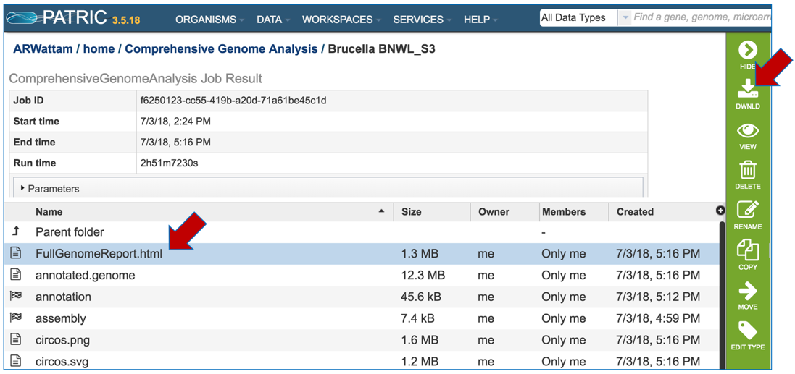

4. Select an appropriate location on your computer and save the document, and then open it.  You can view the document in any web browser
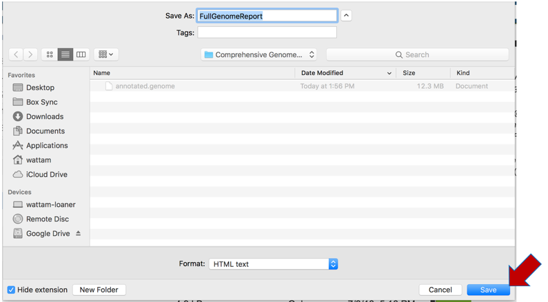

5. The full genome report provides a detailed summary of the genome.  It begins with a summary of the genome quality, and then provides information for each step of the service, which includes assembly, annotation, and analysis of specialty genes and functional categories, and a phylogenetic tree of the new genome and its closest high-quality relatives.
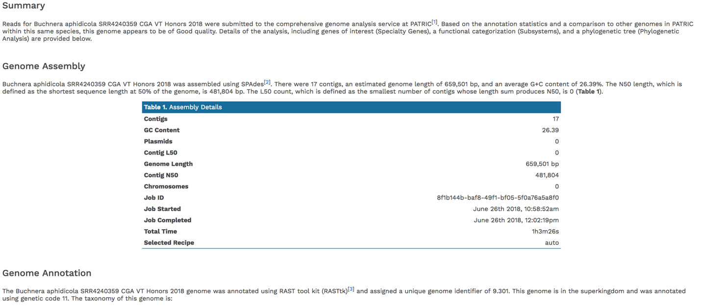

6. The summary will indicate is the genome is of good or poor quality.
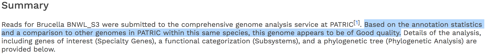

7. Scrolling down to Genome Assembly will summarize the method selected for assembly and provide the statistics of interest.  These statistics are those commonly provided when a genome is submitted as part of a publication.
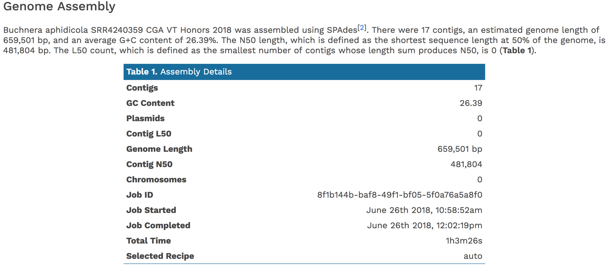

8. The Genome Annotation section describes the taxonomy of the genome, and genes and their functional divisions.
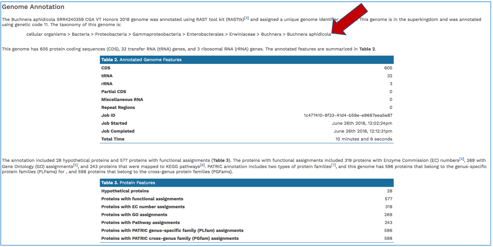

9. The Genome Annotation section also includes a circular diagram of the genes, their orientation, homology to AMR genes and virulence factors, and GC content and skew.  Genes on the forward and reverse strands are colored based on the subsystem[11] that they belong to. A separate, downloadable svg or png of the circular graph image is available in the jobs list.
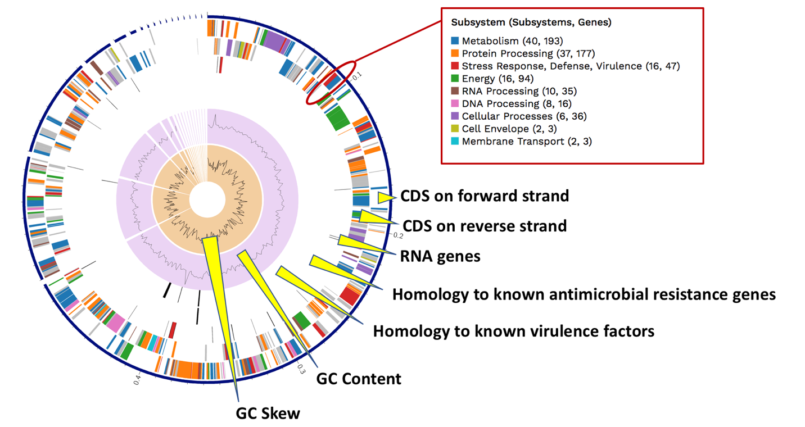

10. PATRIC BLASTs all genes in a new genome against specialty gene databases, including genes known to provide antibiotic resistance, virulence factors, and known drug targets.  The CGA service shows the hits in the new genome have to those databases in a tabular form.
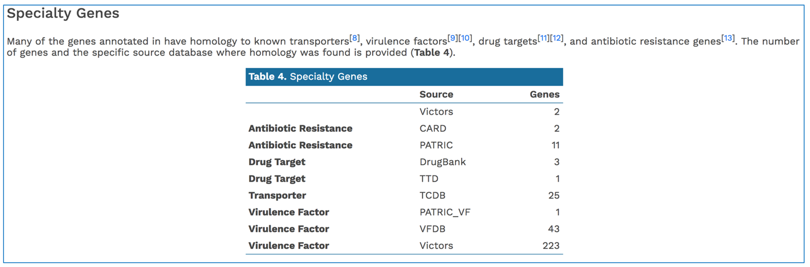

11. In addition, PATRIC provides a k-mer based detection method for antimicrobial resistance genes and shows the number of genes that share these k-mers.
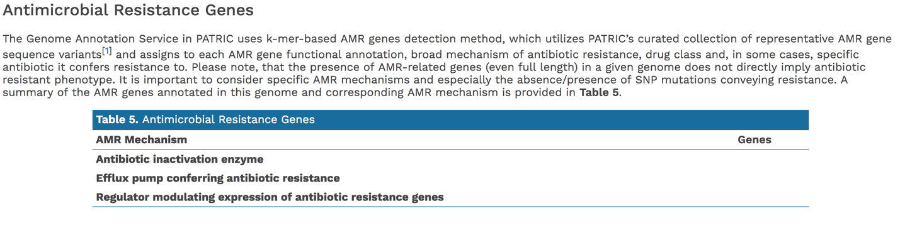

12. PATRIC’s subsystem analysis identifies genes based on specific biological processes that they are hypothesized to be active in.  The full genome report includes a pie chart showing the subsystems superclasses[11], and an indication of the number of subsystems within that superclass (first number) and the number of annotated genes that are part of the superclass (second number).
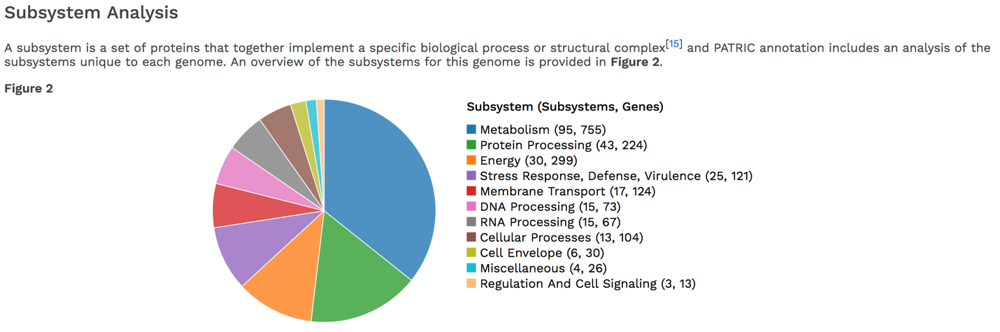

13. The CGA service identifies the closest relatives to the selected genome. It picks the closest reference and representative genomes using Mash/MinHash[12], and then takes twenty of PATRIC’s global protein families[13] that are shared across all the selected genomes to build a tree based on the amino acid and nucleotide alignments of those proteins, which are aligned using MUSCLE[14], and RaxML[15] is used to build the tree.. The genome submitted to the CGA is in red.
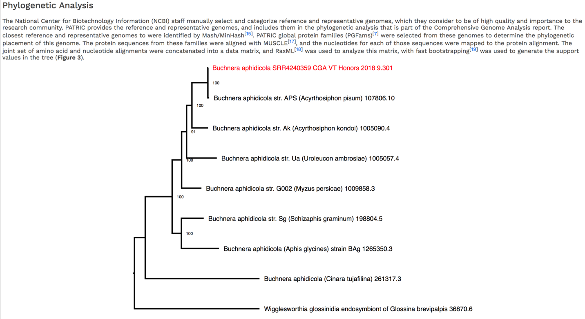

14. The newick file (.nwk) for the tree is available in the jobs list and can be used to construct the tree in another tree viewing program like FigTree (http://tree.bio.ed.ac.uk/software/figtree/) or the Interactive Tree of Life (https://itol.embl.de/).
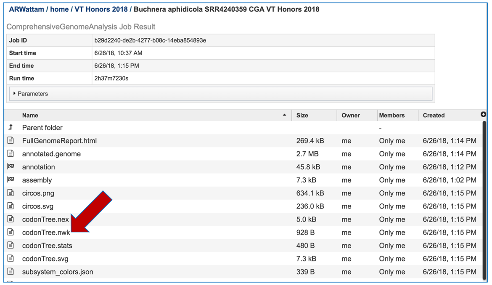

## Viewing the genome in PATRIC

1. To view the integrated genome in PATRIC, double click on the row that has the flag icon and annotation in the landing page for the CGA job.
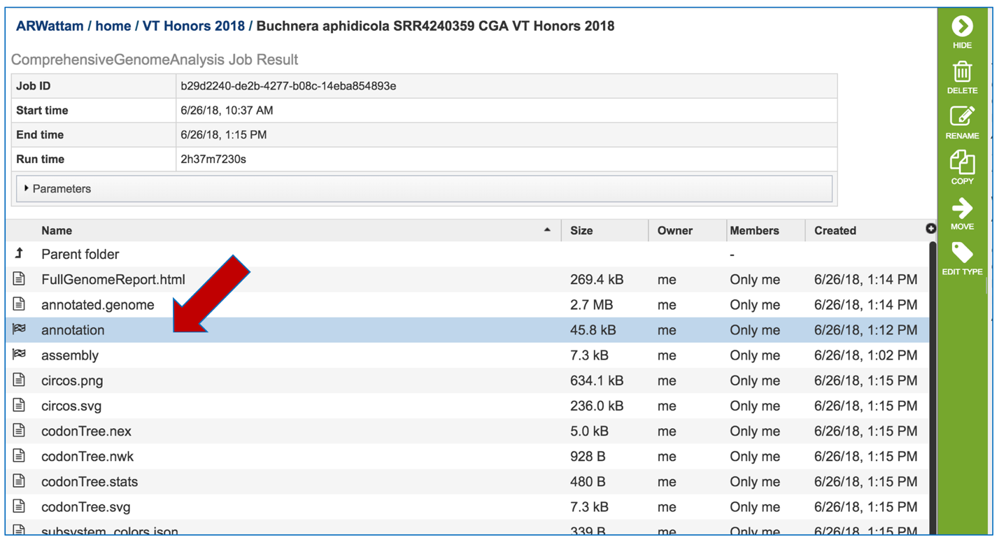

2. This will open a new page.  Click on the view icon at the top right of the table.
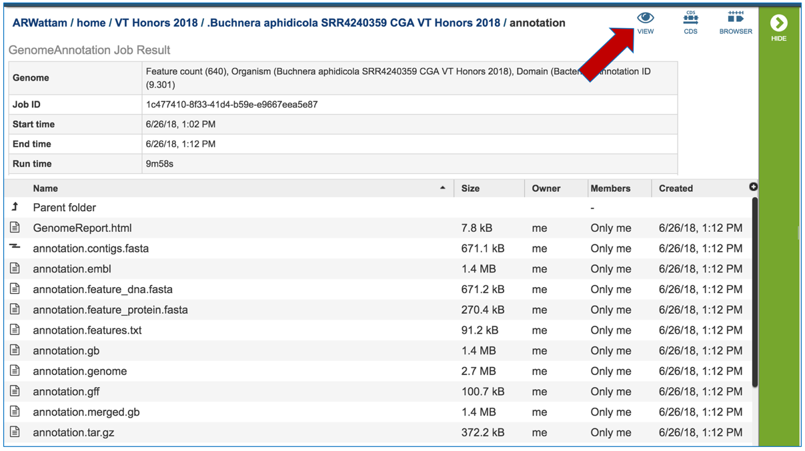

3. This will open the genome landing page for the genome that was assembled, annotated and analyzed using the CGA service.  
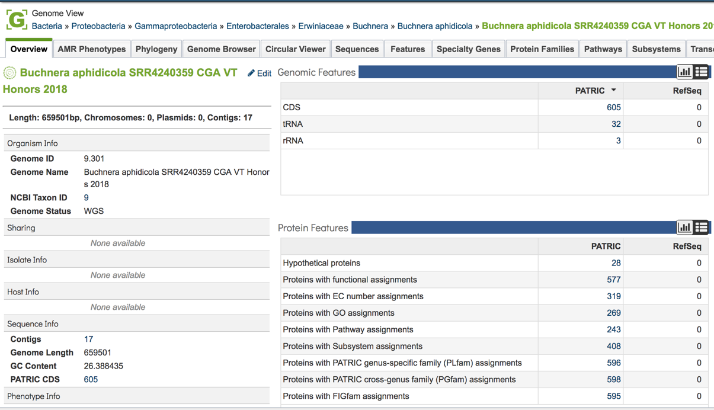

## References

1.	Wick, R.R., et al., Unicycler: resolving bacterial genome assemblies from short and long sequencing reads. PLoS computational biology, 2017. 13(6): p. e1005595.
2.	Bankevich, A., et al., SPAdes: a new genome assembly algorithm and its applications to single-cell sequencing. Journal of computational biology, 2012. 19(5): p. 455-477.
3.	Koren, S., et al., Canu: scalable and accurate long-read assembly via adaptive k-mer weighting and repeat separation. Genome research, 2017. 27(5): p. 722-736.
4.	Nurk, S., et al., metaSPAdes: a new versatile metagenomic assembler. Genome research, 2017. 27(5): p. 824-834.
5.	Antipov, D., et al., plasmidSPAdes: assembling plasmids from whole genome sequencing data. bioRxiv, 2016: p. 048942.
6.	Krueger, F., Trim Galore: a wrapper tool around Cutadapt and FastQC to consistently apply quality and adapter trimming to FastQ files, with some extra functionality for MspI-digested RRBS-type (Reduced Representation Bisufite-Seq) libraries. URL http://www. bioinformatics. babraham. ac. uk/projects/trim_galore/.(Date of access: 28/04/2016), 2012.
7.	Vaser, R., et al., Fast and accurate de novo genome assembly from long uncorrected reads. Genome research, 2017. 27(5): p. 737-746.
8.	Walker, B.J., et al., Pilon: an integrated tool for comprehensive microbial variant detection and genome assembly improvement. PloS one, 2014. 9(11): p. e112963.
9.	Brettin, T., et al., RASTtk: a modular and extensible implementation of the RAST algorithm for building custom annotation pipelines and annotating batches of genomes. Scientific reports, 2015. 5: p. 8365.
10.	Davis, J.J., et al., PATtyFams: Protein families for the microbial genomes in the PATRIC database. 2016. 7: p. 118.
11.	Overbeek, R., et al., The SEED and the Rapid Annotation of microbial genomes using Subsystems Technology (RAST). Nucleic Acids Res, 2014. 42(Database issue): p. D206-14.
12.	Ondov, B.D., et al., Mash: fast genome and metagenome distance estimation using MinHash. Genome biology, 2016. 17(1): p. 132.
13.	Davis, J.J., et al., PATtyFams: Protein Families for the Microbial Genomes in the PATRIC Database. Front Microbiol, 2016. 7: p. 118.
14.	Edgar, R.C., MUSCLE: multiple sequence alignment with high accuracy and high throughput. Nucleic acids research, 2004. 32(5): p. 1792-1797.
15.	Stamatakis, A., RAxML version 8: a tool for phylogenetic analysis and post-analysis of large phylogenies. Bioinformatics, 2014. 30(9): p. 1312-1313.
