# How to enable Adobe Flash Player

## Google Chrome

[Download Google Chrome](https://www.google.com/chrome/)

The Adobe Flash Player plugin is built into Google Chrome. You do not need to download it. Chome will prompt you to "Allow" Adobe Flash to run if you haven't given it authorization to do so yet.

To "Allow" Flash on your current website click the **lock** or **info** button in your URL bar and select **Site Settings**:

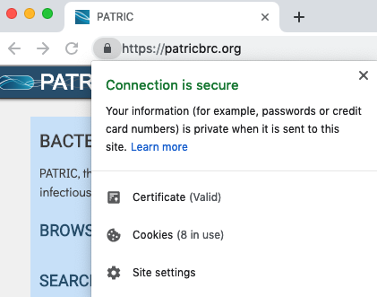

Locate the Flash menu dropdown in the new tab that opens and select **Allow**:

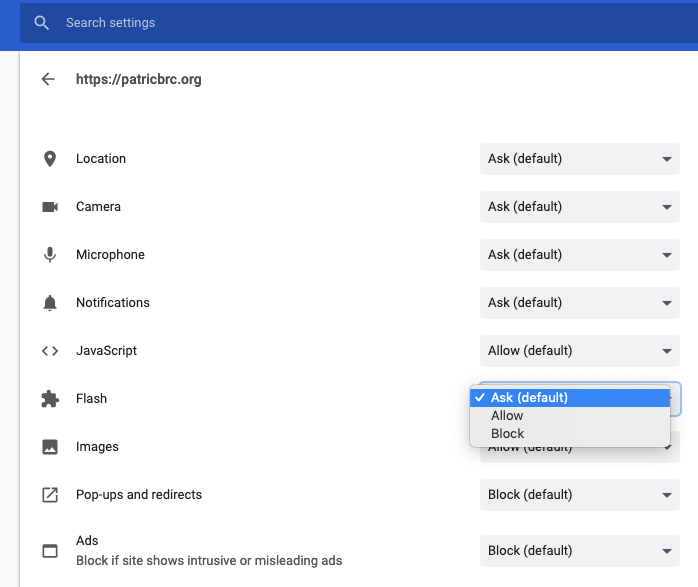

Go back to your previous tab and you'll be prompted to reload the page:

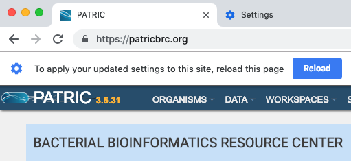

The Adobe Flash Player plugin is now set to "Always" allow for this website.

To set it back to "Ask (default)" or "Block" you may click the **lock** or **info** button in your URL bar again and modify your Flash setting (you will need to reload the page again):

## Mozilla Firefox

[Download Mozilla Firefox](https://www.mozilla.org/en-US/firefox/new/)

If you do not have the Adobe Flash Player plugin for Firefox you may download it [here](https://get.adobe.com/flashplayer/). Please try to keep Mozilla Firefox and the Adobe Flash Player plugin up to date to avoid troubleshooting problems and security issues.

Starting with Firefox 55 the Flash plugin is "click to play" by default. When prompted using a service that requires Flash that you haven't given authorization to yet please click "Allow" to run Adobe Flash:

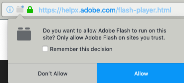

## Apple Safari

Apple Safari comes installed by default on your MacOS machine. It's not offered natively on Windows. 

If you do not have the Adobe Flash Player plugin for Safari you may download it [here](https://get.adobe.com/flashplayer/). Please try to keep Apple Safari and the Adobe Flash Player plugin up to date to avoid troubleshooting problems and security issues.

To enable the plugin to **Safari > Preferences**:

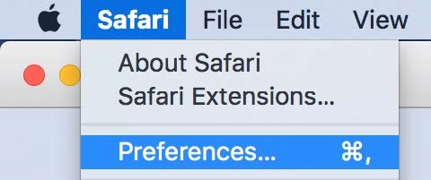

Select the **Websites** tab and locate the **Plug-ins** section. Click the check box to enable the Adobe Flash Player plugin:

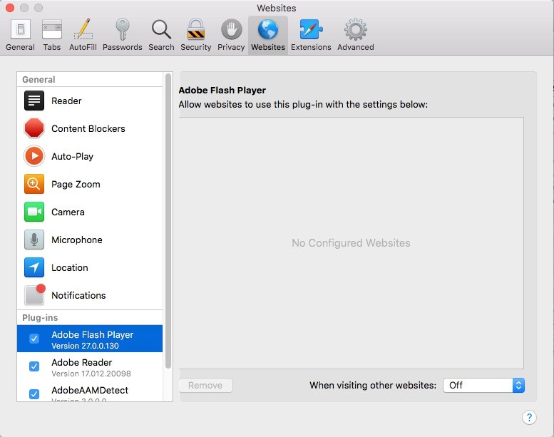

From here select a setting to use Flash Player when you visit other websites:

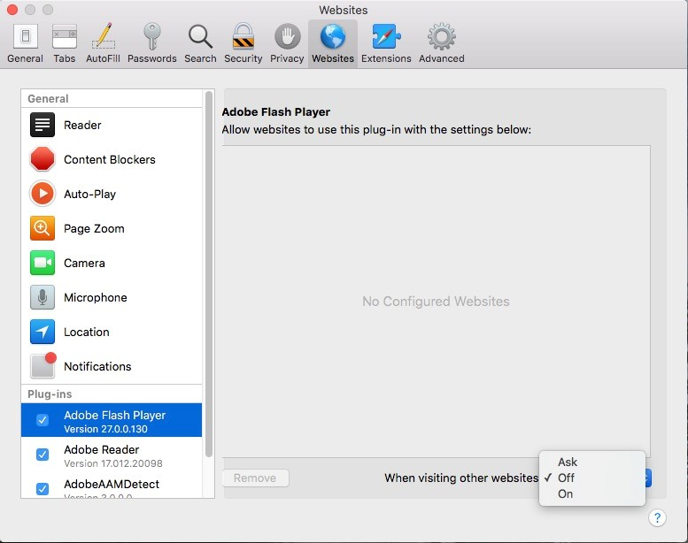

You may also configure the settings for individual domains: 

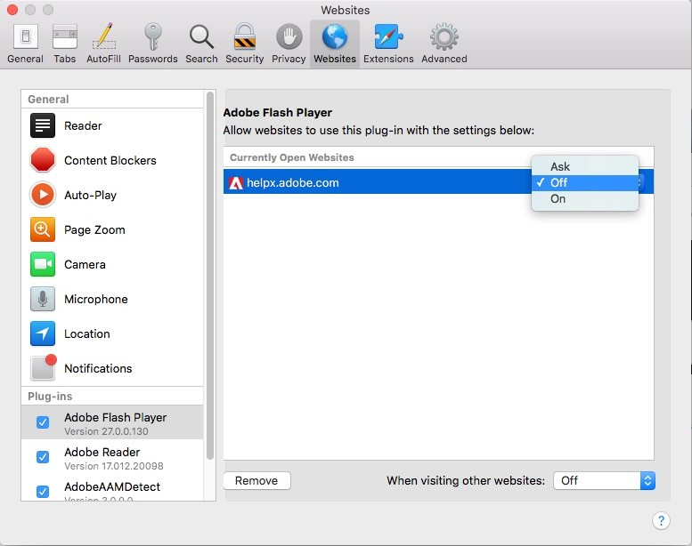

## Microsoft Edge

Microsoft Edge comes installed by default on your Windows 10 machine. It's not offered natively on MacOS.

The Adobe Flash Player plugin is built into Microsoft Edge. You do not need to download it. When viewing a website for the first time that requires the plugin you may receive this message:

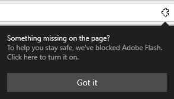

Click the jigsaw icon and select "Allow once" or "Always allow":

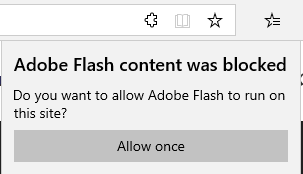

The page will refresh and Adobe Flash Player will run.

If for some reason the plugin is not enabled by default within your browser open your Edge settings here:

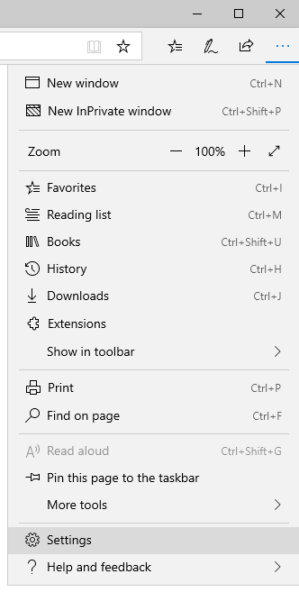

Click on the "Advanced" tab and toggle Adobe Flash Player to "on":

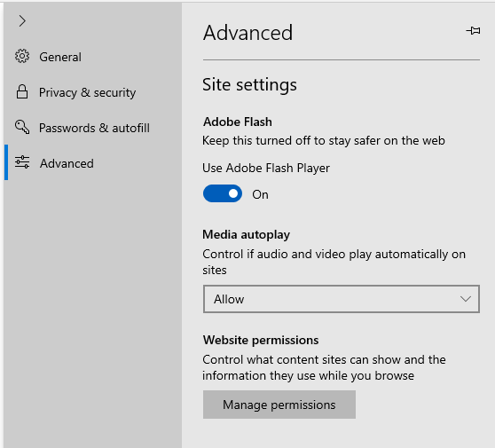
