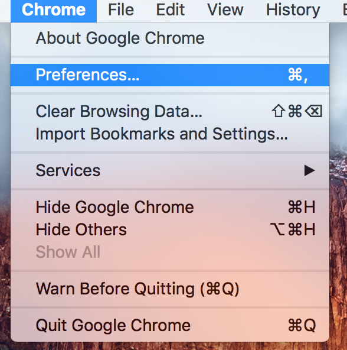
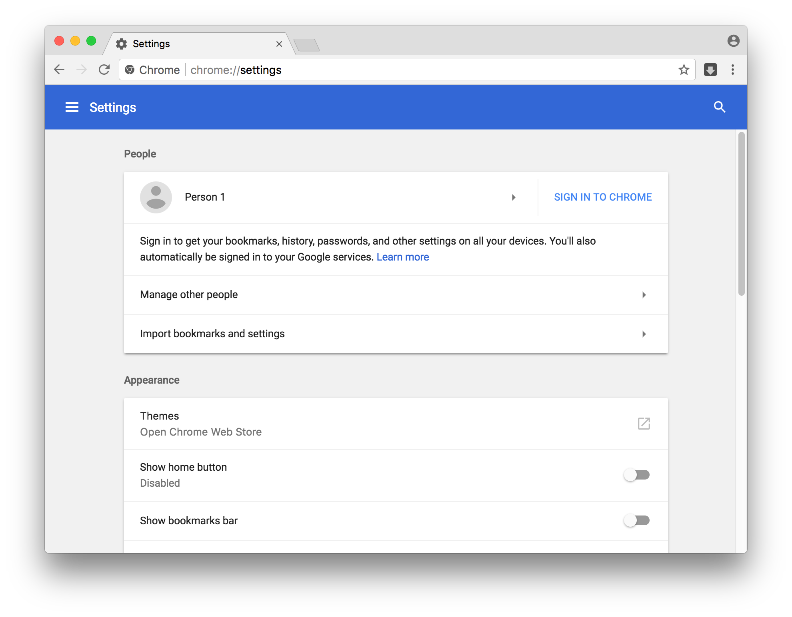
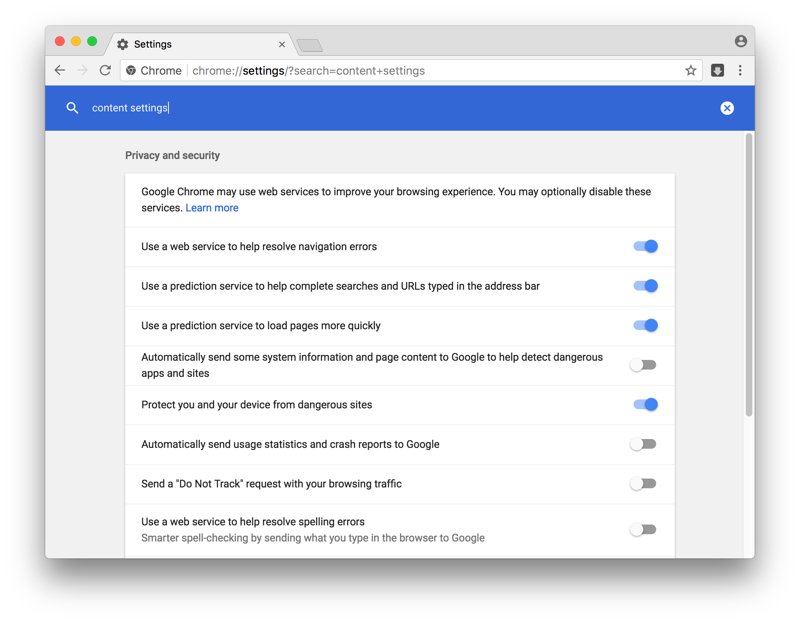
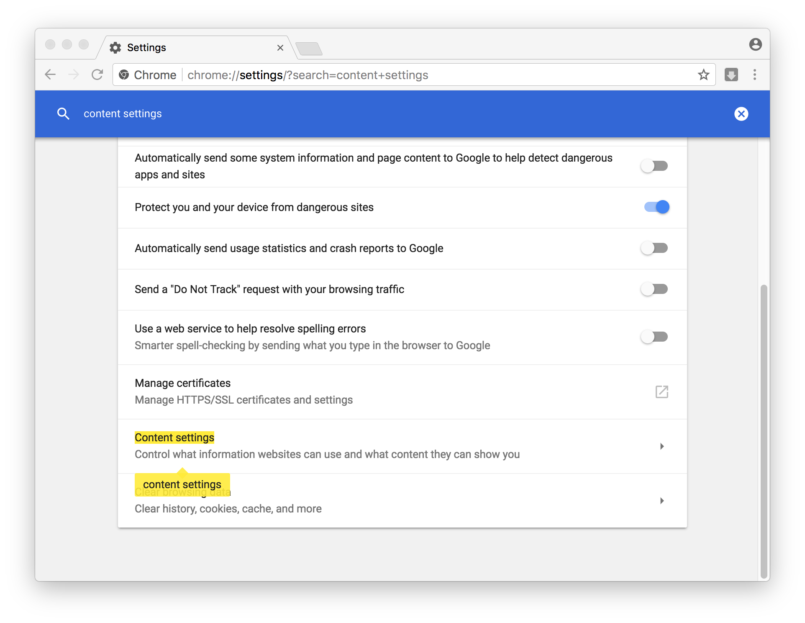
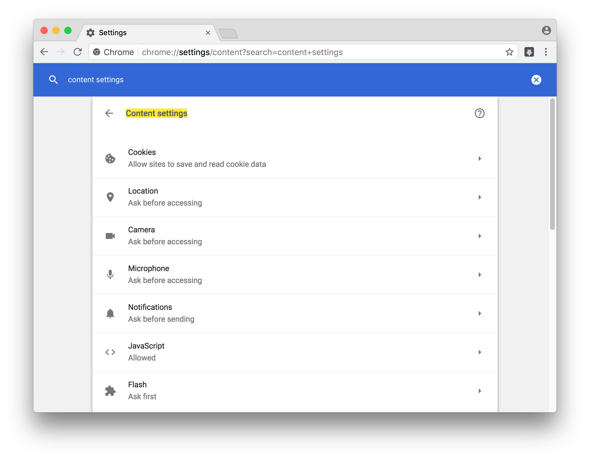
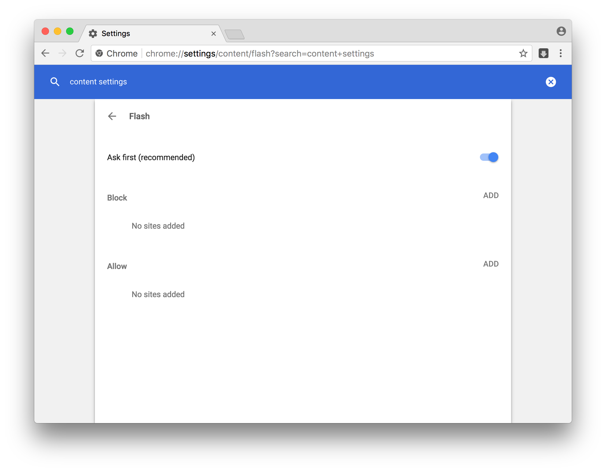
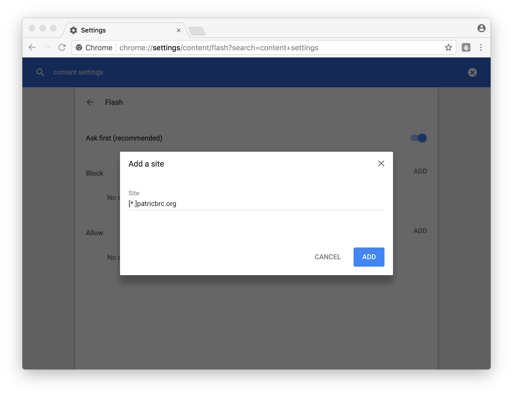
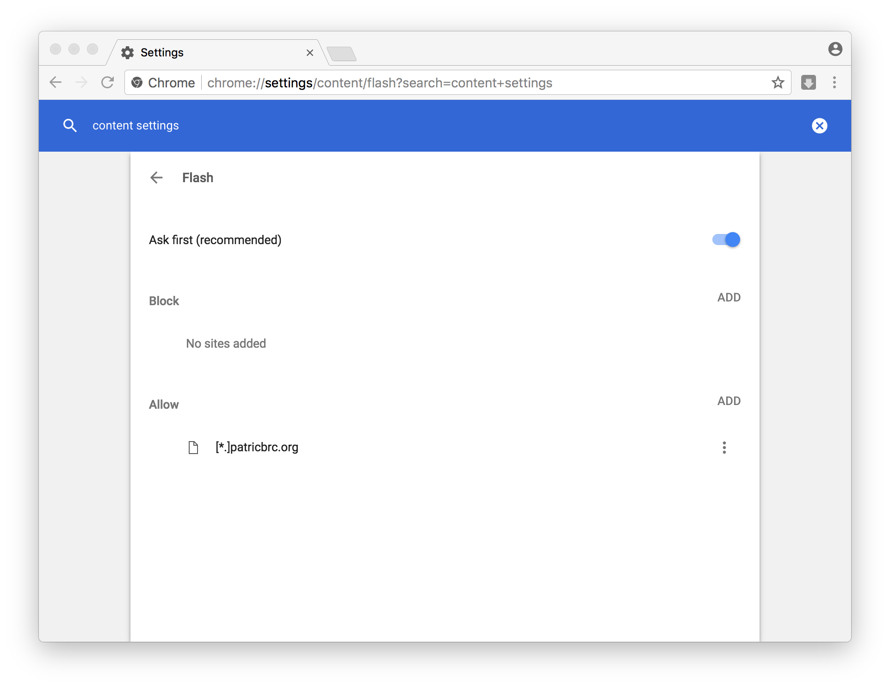

# How to enable Adobe Flash Player

## Google Chrome
1. Start Chrome, and go to the Chrome menu. Click on the Preferences


2. You will see a settings window:


3. Click the magnifying glass to search. The text field should be selected, and you can type "content settings" into the box.


4. Scroll down to find the content settings item:


5. and click on Content settings:


6. Find where it says Flash, and click on that:


7. We are going to add a setting for patricbrc.org to always be allowed to run flash without asking. Click the "Add" button to the right of "Allow":


8. and type this into the Site item:
```
[*.].patricbrc.org
```
Click "ADD" and you should see the PATRIC site in the allow list:
