# Examining Transcriptomics Data

## I. Finding Experimental Data available in PATRIC
1. PATRIC has imported experimental data from several prominent genera, most notably Escherichia and Mycobacterium.  To find this data, click on a genus of interest on the Organisms tab (or use the global search) and select a genus of interest.

    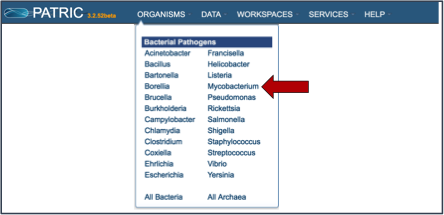

2. This will take you to the landing page for that genus.  To see if any transcriptomic data is available, click on the Transcriptomics tab (red arrow).

    

3. This will open a new page that shows all the experimental data available for that genus.
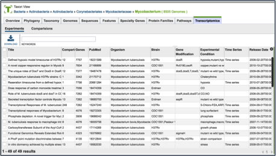

## II.  Finding Specific Experiments to Examine
1. PATRIC provides filter to help find specific experimental data.  To find that, click on the Filters icon, which is located on the far right side of the page (red arrow).
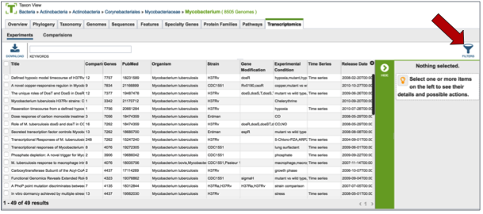

2. This will open up a filter that is on top of the table.  It allows researchers to filter on the experimental conditions, the type of mutant, the species, the strain, and if the experiment is a time-series or not.
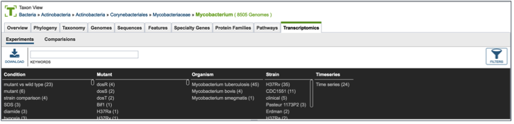

3. Clicking on any of the text in the filter will highlight it (red arrow).

4. This will re-filter the table to show all the experiments that have that particular tag.

## III. Examining a single experiment-Experiment filter
1. Clicking on the check box in front of the name of an experiment will highlight it (red arrow) and will also give information about the selected experiment in the area beyond the vertical green bar.
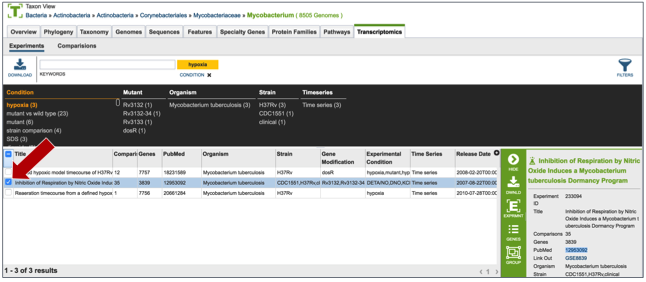

2. Once an experiment is selected, the green bar becomes populated with downstream processes that you can do with that selection.  In this case it includes downloading the information about the selection, creating a group that includes the selection, see the genes in that particular experiment, and viewing the experiment.  Click on the Genes icon.
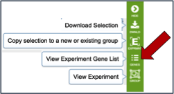

3. This opens a new tab that shows all the genes and conditions from that particular experiment.
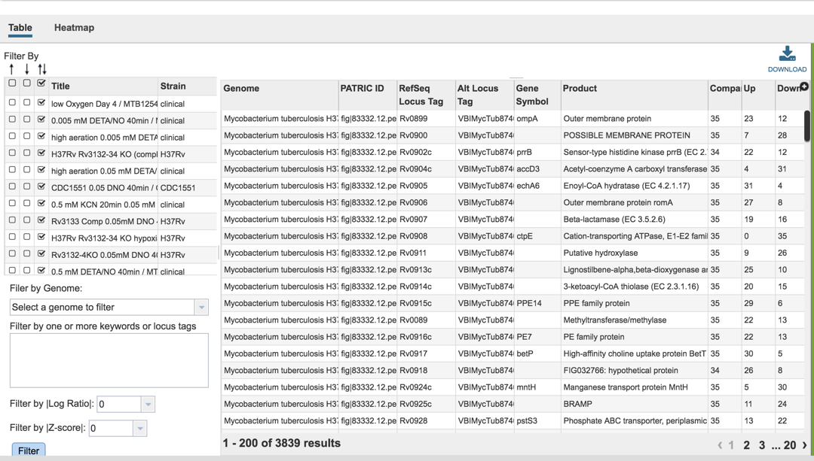

## IV. Examining genes within an experiment: Gene filter
1. A filter on the right side of the gene table where the genes in each experimental condition can be filtered on up- or down-regulation.  Clicking on one of the check boxes in front of a single experiment will re-filter the tables to meet that selection.

    

2. Clicking on a checkbox above this list of experimental conditions will auto-select all the conditions together, re-filtering the table to show all the genes that are similarly expressed across all conditions.

3. Many of the experiments examined more than one genome.  The filter table also provides the means to select specific genomes used within the experiment.  To do this, researchers need to click on the down arrow under Filter by Genome.  This will show all the genomes used in the experiment.  Clicking on one will re-filter the table to show only the results for that genome.

    

4. A text box provides the ability to search for the names of specific genes.  Entering text in that box and clicking on the Filter button will re-sort the table to show the genes that contained that word(s) in their functional description.

5. Researchers can also filter on the level of expression of specific genes by selecting a log ratio or Z score, and then clicking on the Filter button.  This will re-sort the table to show the number of genes that match that level of expression.

    

## V. Visualizing the genes and their expression on a heatmap
1. PATRIC also provides a way to visualize gene expression with a heatmap. Click on the Heatmap tab above the filter.

    

2. This will open a page that shows all the conditions and gene expression levels that match the selections made on the filter.

    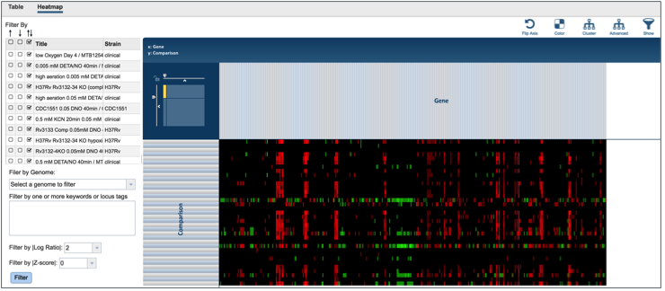

4.  Several buttons on the upper right above the heatmap allow researchers to flip the axis, putting experimental conditions on the x-axis and the genes on the y-axis.  The colors used in the heatmap can be changed. The genes can be clustered, which at the default Pearson correlation with pairwise average-linkage as the clustering type.  There is also an advanced clustering method, and a way to see the significant genes, or all the genes in the genome.

    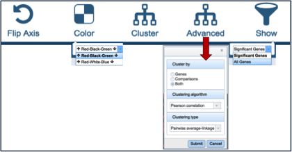

5. Clicking on advanced clustering open a pop=up window that allows researchers to cluster by genes, comparisons, or both.  In addition, there are several clustering algorithms and clustering types to choose from.

    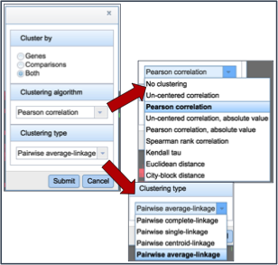

6. Clicking on any of the clustering algorithms will re-sort the heat map to group genes that are expressed similarly together across the conditions.

    

## VI. Getting the data about the genes from the heatmap visualization
1. To find further information on a group of genes in the heatmap, researchers can use their mouse to draw a box around genes, or patterns, of interest.

    

2. This action will generate a pop-up window that provides several options for viewing the data, including download the genes, showing them, adding them to a group, or downloading the heatmap data.

    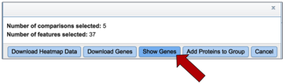

3. Clicking on Show Genes will open a new tab that shows the list of genes from the selection. Clicking on the check box next to Genome Name at the top of the table head will auto-select all the genes that where selected in the heatmap.
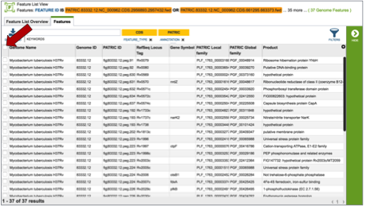

4. Once any, or all the genes are selected, a list of downstream analysis tools will appear in the vertical green bar.

    

5. These downstream tools or processes include the ability to download all the features in the table, go to the feature list view (Features icon), go to a view showing all the genomes that are the genes from the original selection belong to (Genomes icon), get the amino acid or nucleotide fasta files for all genes selected (FASTA icon), generate a multiple sequence alignment (MSA icon), map the PATRIC genes to other identifiers like UniProt (ID Map icon), find out any pathways that the selected genes belong to (Pathway icon), or to add the genes to an existing group, or create a new group with the selected genes (Group icon).

    

6. If the Pathway Summary icon is selected, a new tab will open with a table showing this information.  This may take some time, depending on the number of genes selected.  A page with a spinning wheel will be displayed while PATRIC recovers the information.

    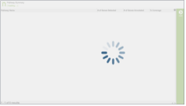

7. Once the table loads, a list of the pathways, the number of genes from the original selection, the number of genes in the genome that are part of the pathway, and the percent coverage (the selected genes as opposed to the total genes in the genome that are part of the pathway) are displayed.

    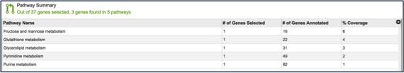

8. Clicking on an individual pathway open a list of downstream processes in the vertical green bar.
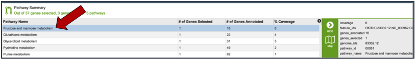

9. Clicking on the pathway map icon will open a new page that shows a list of genes based on their EC number on the left, and a KEGG pathway map with the genes from that genome displayed on the right.  Clicking on the legend at the top right of the page shows the genes with those specific EC numbers that are annotated in the genome (green box).  The genes that were part of the original selection from the heatmap will be colored blue.
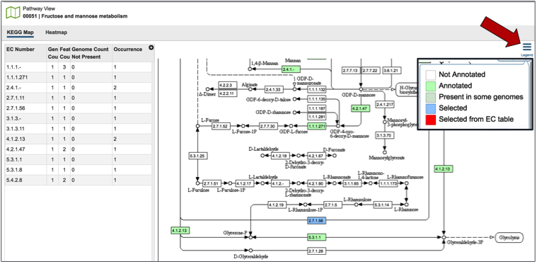

## VII. Examining multiple experiments
1. Researchers can compare more than one experiment for the same organism by clicking on the experiment titles in front of the name.
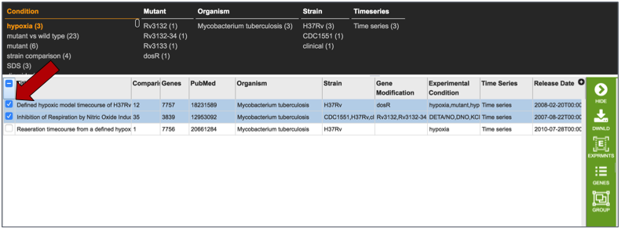

2. This may take some time, so the spinning wheel will show that PATRIC is working to display the data selected.
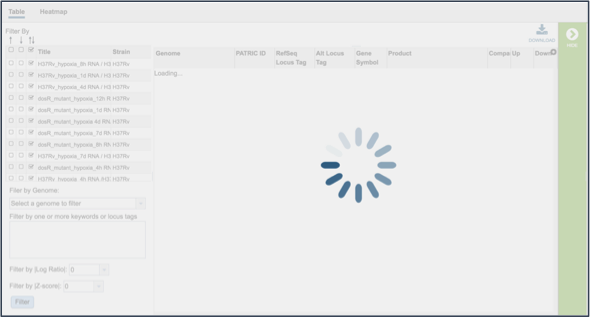

3. This opens a new tab that shows all the genes and conditions from that selected experiments.

4. The same ability of filtering by up- or down-regulation, genome name, or log-ratio/Z-score can be deployed by making a selection and clicking on the Filter button.

    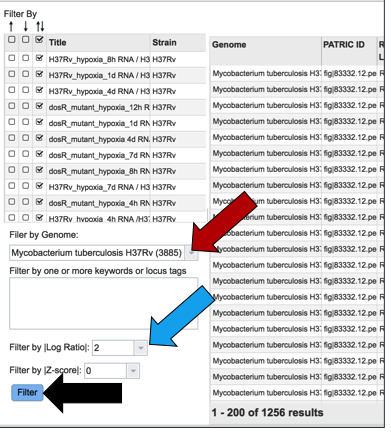

5. The heatmap view shows the results of the filtering on the various experiments selected.  Clicking on the Cluster icon will cluster the results across all experiments and conditions.
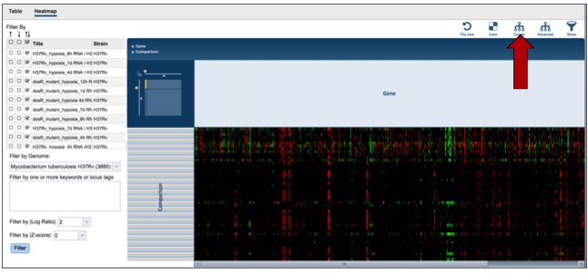

6. The information on specific genes can be viewed by using the mouse to draw a box over the selection, as described above.

    
