# Formatting an Excel file to rapidly scan comparison genomes – Proteome Comparison

## Mac Format (Windows format is below)
### 1. Highlighting cells that have unidirectional BLASTP hits
a. Once the text file downloaded from the Proteome Comparison job results has been opened in excel, scroll to the right to find all the comparison genomes that were used in the analysis.
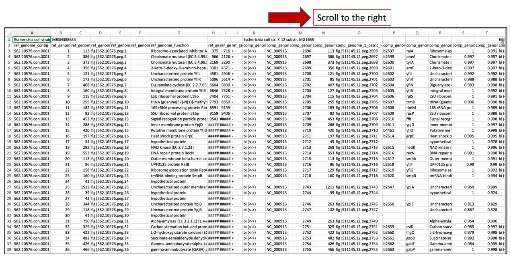

b. The names of the comparison genomes will be in the first row, and where one ends and the other begins will be differentiated by the name of the next comparison genome.
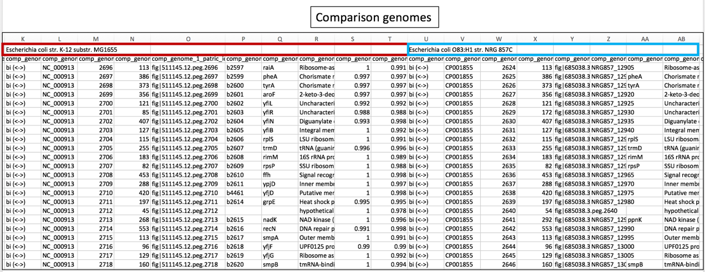

c. Click on the column head of the first comparison genome that indicates if the hits to the reference genome were bi- or uni-directional.  This will select the entire column
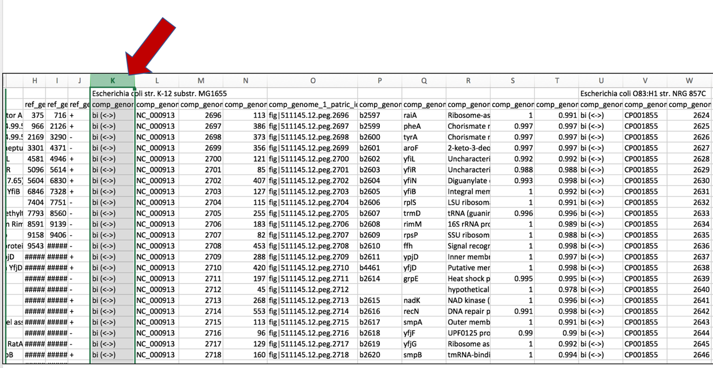

d. Scroll to the right and select this same column for each of the comparison genomes.  Add additional columns by using Command click.
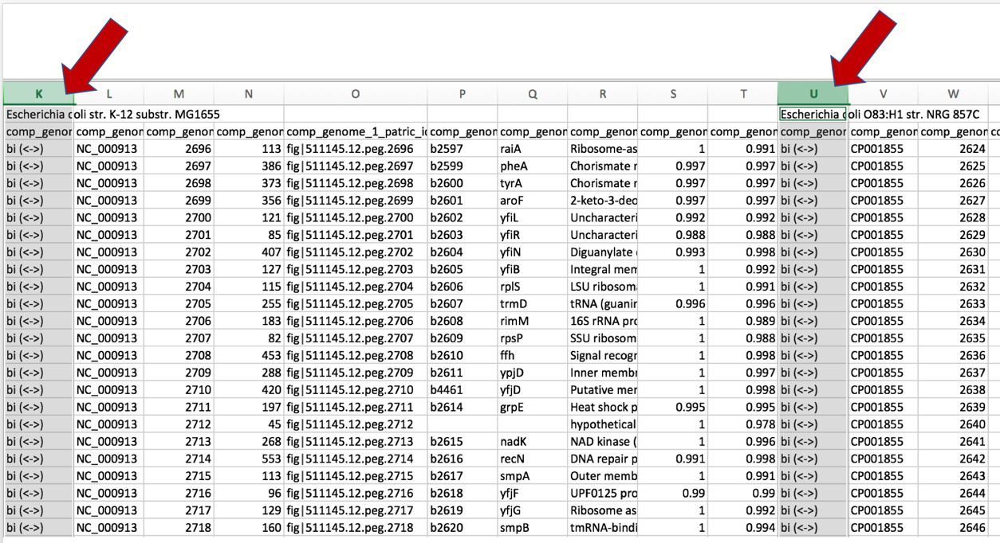

e. Once all the columns of interest have been selected, click on the Conditional Formatting button.  This is found in the header for the excel table.
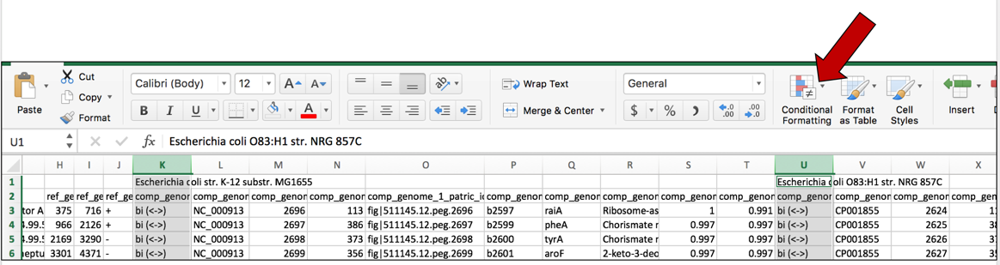

f. A drop-down box will open when the Conditional Formatting button is selected.  Click on Highlight Cell Rules.  This will open a list.  Click on the option that says "Text that Contains…"
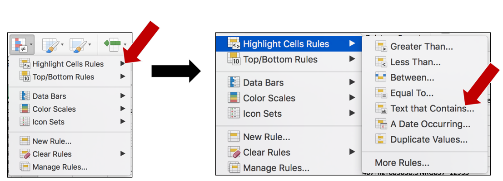

g. This will open a pop-up window.  In the empty text box (the one that follows the boxes that say "Specific text" and "containing", type in uni.

h. To color the cells that have that word in them, click on the arrow at the end of the text box that says "light red fill with dark red text".  This will open a drop-down box, where you can select how you would like the cells containing that specific text to look.
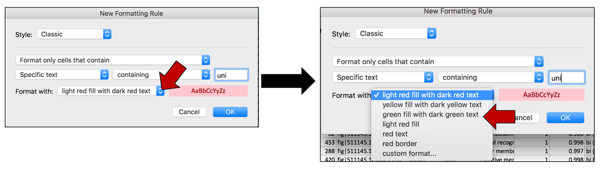

i. Once the color or formatting has been selected, click on the OK button at the bottom right of the box.
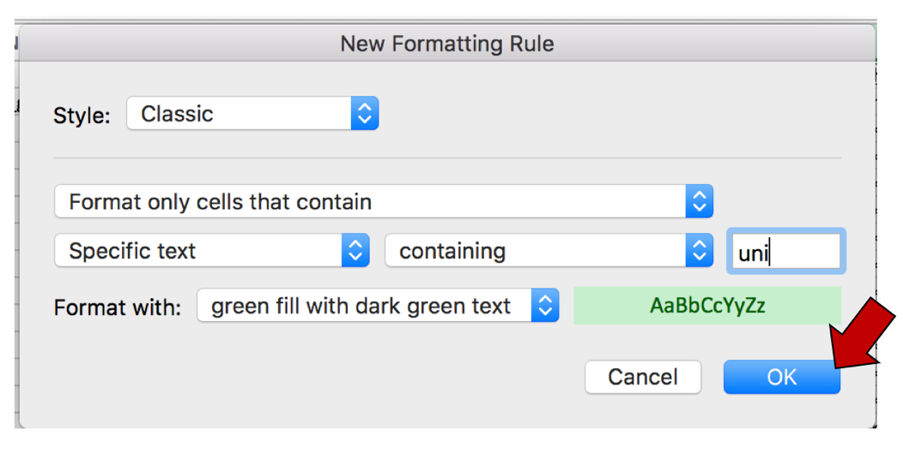

j. This will color all the cells in the selected columns that contain that text with the color that was chosen.
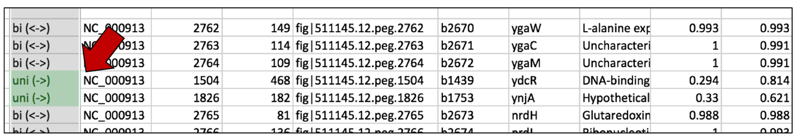

### 2. Highlighting cells that have no BLASTP hits
a. Keep the selected columns, and click on the Conditional Formatting icon again.  This will open the same drop-down box.  Click on Highlight Cell Rules.  This will open a list.  Click on the option that says "Equal to..."
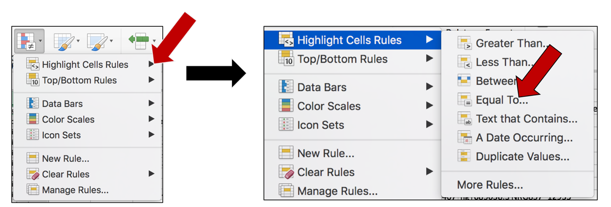

b. This will open a pop-up window.  Click on the down arrow at the end of the box that says "Cell value".  This will open a drop-down list.  Click on Blanks.
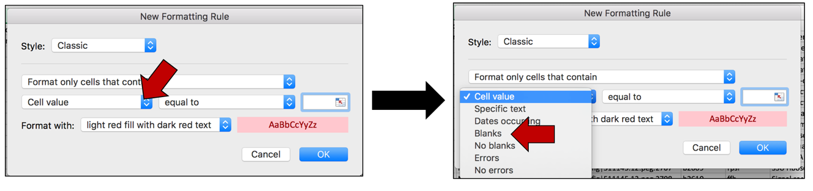

c. To color the cells that have that word in them, click on the arrow at the end of the text box that says "light red fill with dark red text".  This will open a drop-down box, where you can select how you would like the cells containing that specific text to look. Click on "custom format..."
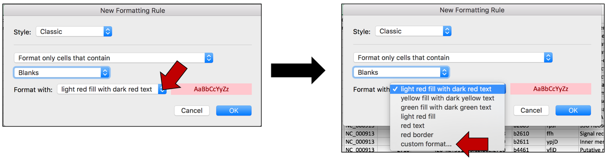

d. This will open a new window where you can customize how you want the cells to look.  In this example where the Fill color is selected, click on the arrow at the end of the text box under Background color.  This will open a window with color choices.  Click on the color of interest, and then click the OK button that is found at the bottom right of the window.
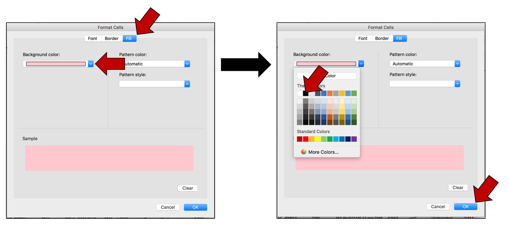

e. This will select the color that was chosen, and the Background color will now match that color. Click OK at the bottom right of the Format Cells window. The first pop-up window will appear with the selections.  Click OK to finalize the selection.
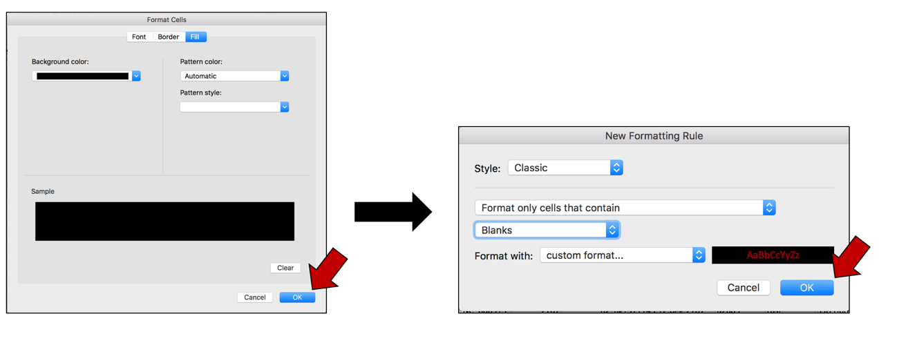

f. The blank cells in the selected columns will now be colored to match that selection.
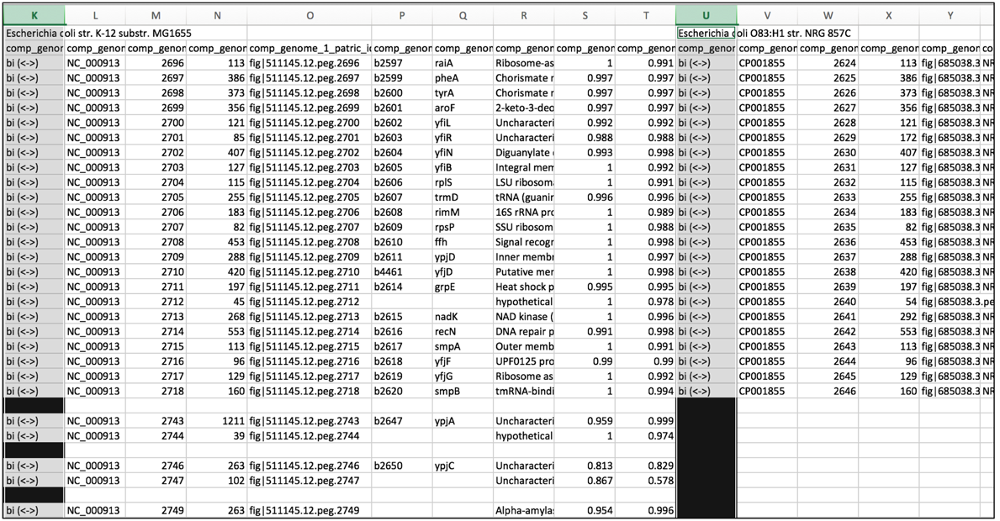

### 3. Narrowing comparison genome columns for rapidly scanning many genomes simultaneously
a. To enable the ability to rapidly screen the comparison genomes for uni-directional hits, and also for genes that do not have a close hit in the reference genome, select all the columns that contain the reference genomes.  Pick any individual column, and decrease the width.  As long as all the columns are selected, the width of each of those columns will match the width selected in the single column.

b. This will enable the ability to rapidly scroll down the excel sheet and visualize areas where the comparison genomes differ from the reference genome.
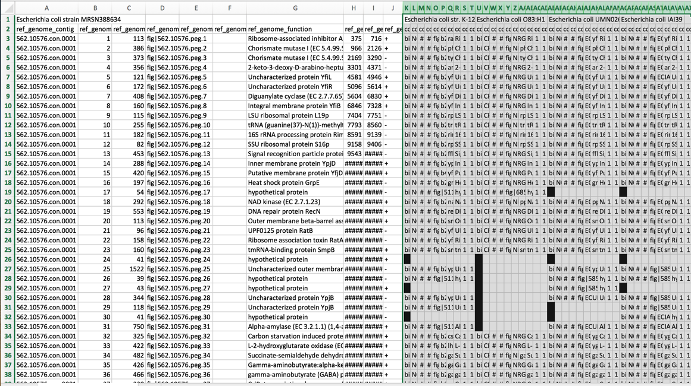

### 4. Freezing panes-ability to rapidly access informational rows
a. One difficulty with excel is that while scroll down the rows, the information in the top rows remain at the top of the sheet.  Excel can be formatted to freeze those rows, and allow scrolling to occur, showing the information about the genomes and the blast hits in the top rows.  To freeze these rows, click on the row immediately below the information of interest (row 3 in the example below).
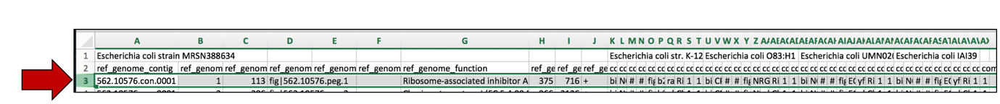

b. At the very top of the excel sheet, click on the Window tab.
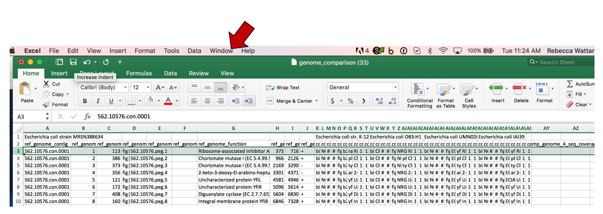

c. This will open a drop-down list.  Click on Freeze Panes.

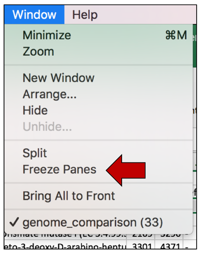

d. Now scrolling can occur and the information in the top rows can be seen while looking at patterns that occur further down in the excel sheet.
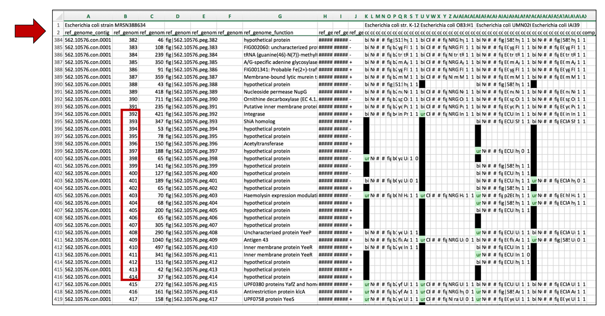

## Windows format
### 1. Highlighting cells that have unidirectional BLASTP hits
a. Once the text file downloaded from the Proteome Comparison job results has been opened in excel, select the columns of interest.
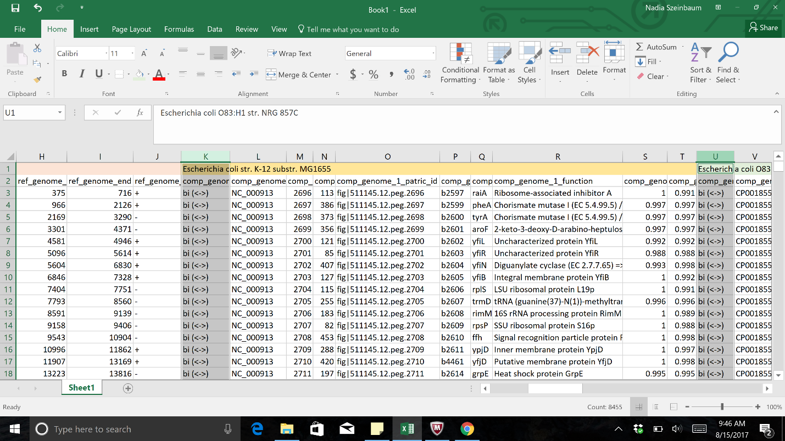

b. Once all the columns of interest have been selected, click on the Conditional Formatting button.  This is found in the header for the excel table. This will open the same drop-down box.  Click on Highlight Cell Rules.  This will open a list.  Click on the option that says "Equal to…"

c. In the pop-up window, type "blank" into the text box underneath the words "Formal cells that are EQUAL to" in the pop-up window. Click OK, and this will color the blank cells with the selected color.
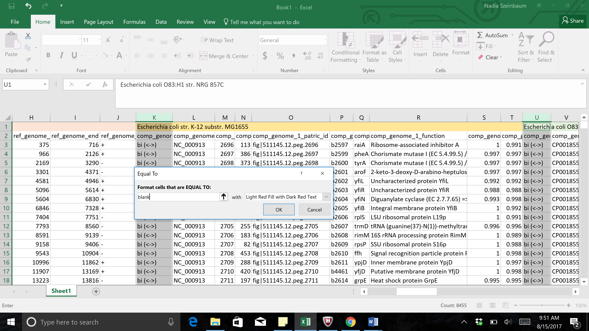

d. To select uni-directional hits, maintain the selected columns.  Click on the Conditional Formatting button, then select Highlight Cell Rues.  In the list that appears, click on "Text that Contains."
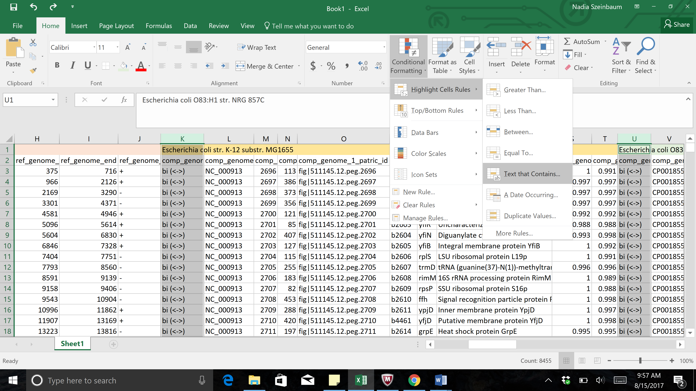

e. Type the word "uni" into the text box, and then select a different color in the next text box by clicking on the down arrow that follows "Light Ref Fill with Dark Red Text"
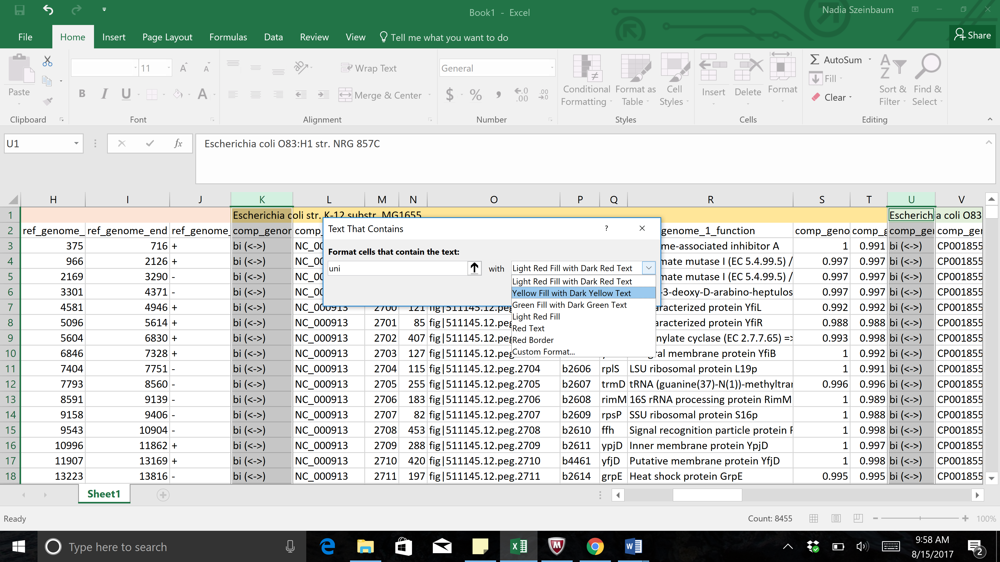

f. Both colors will be shown in the excel sheet in the cells that match the formatting conditions selected.
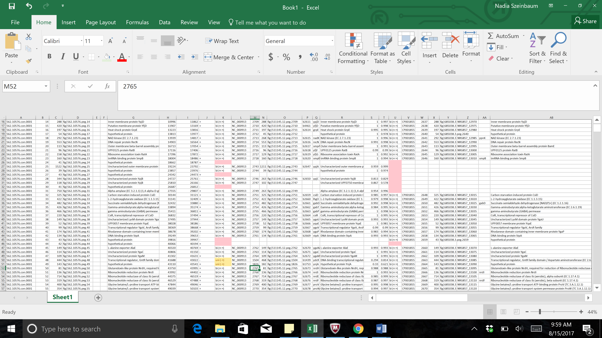

