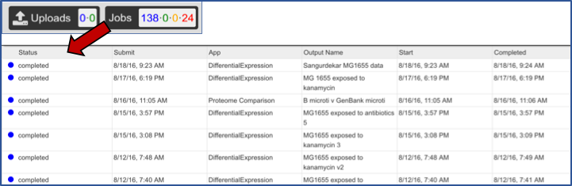
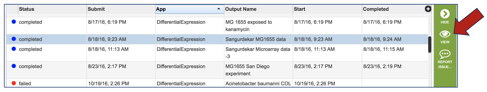
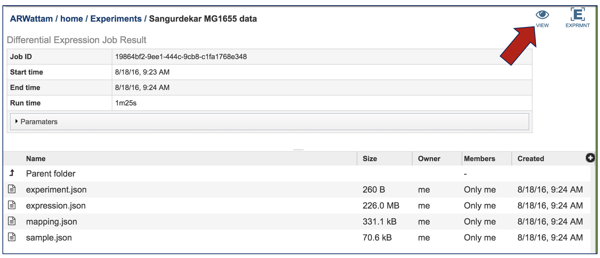
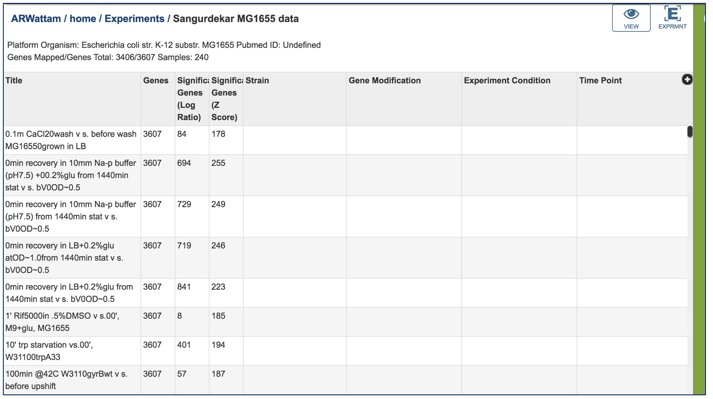
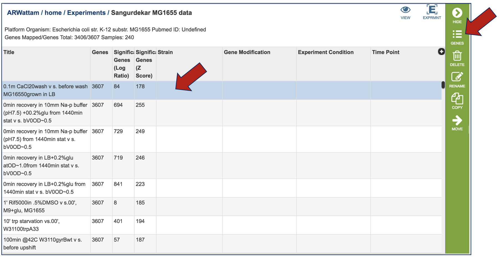
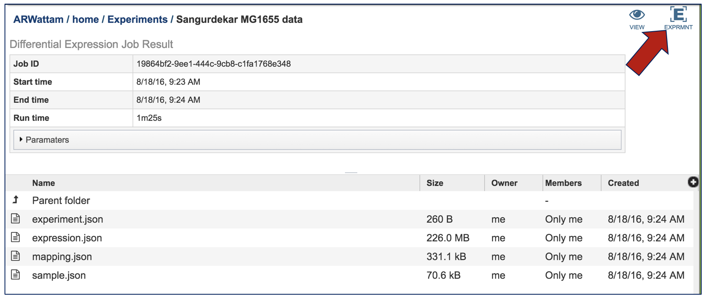
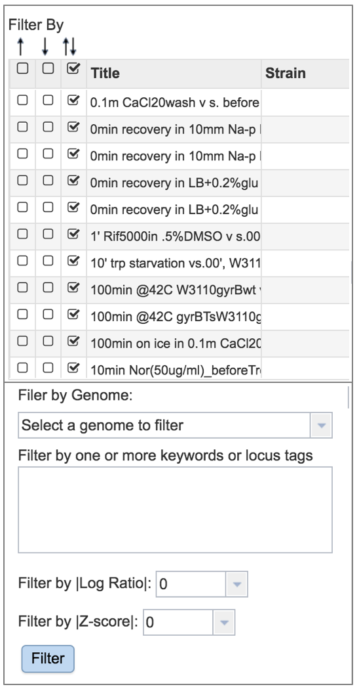
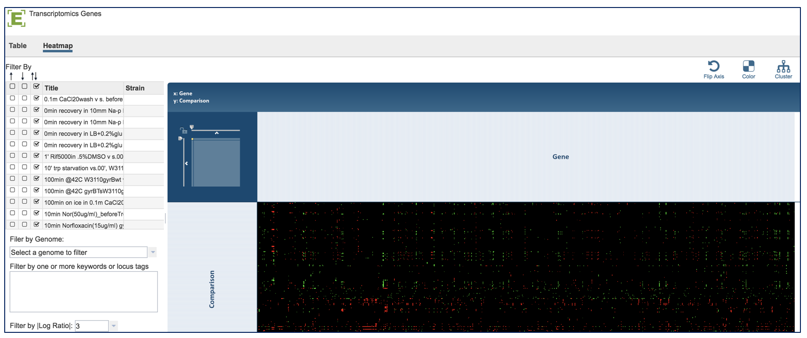

# Expression Import

## I. Using the Expression Import Service at PATRIC
1. Find an article of interest, a dataset at the Gene Expression Omnibus (GEO, http://www.ncbi.nlm.nih.gov/geo/), or prepare your own data.  In this example, we are using a paper (PMID: 16626502) that examines transcriptional responses in Escherichia coli MG1655 to a variety of stimuli.  This strain has been designated as a reference strain by NCBI.

2.The Sangurdekar paper has a link to all the log expression data for 3046 genes across 246 different conditions.

3.To upload this data into a private workspace, open the Services tab in PATRIC. Click on Experiment Import.

4. This opens a page where experimental data can be uploaded.

## II. Data Format
1. To find out more information about the type of data that can be uploaded in the Expression Import service, click on the information icon.  This will open a pop-up window that describes the format and types of data that can be uploaded.

2. The data should be loaded into a particular format into PATRIC, an example of which can be seen below (A).  The first column has the gene locus tag (RefSeq, GenBank, or PATRIC), and the second and later columns will have the log ratios for each gene in each condition.  The column headers in the first row can have the name of that condition.  You can see in B below that the second column has the gene name.  That must be deleted before it can be uploaded.

## III. Uploading the Experimental Data
1. To upload the data sheet, which can either be txt or excel, click on the folder in the “Experiment Data” box that follows the text box under the words “Experiment Data File”.

2. This will open a window that shows you data you have in uploaded or collected in PATRIC. If you had previously uploaded this data, you could find it here.  To upload new data, click on the upload icon.

3. The pop-up widow will flip, and you will be able to select a file.  Make sure you have the right type of data selected (Blue arrow).  Then click on the blue “Select File” bar (Red arrow).

4. Select the file you want to upload (Red arrow) and then open it (Blue arrow).

5. The name of the file you selected will now appear on the page (Blue arrow).  To complete the upload, click on the “Upload Files” button (Red arrow).

## IV. Choosing Parameters
1. Selecting the Experiment Type.  Click on the down arrow that follows the text box under Experiment Type.  The Expression Import service can be used for transcriptomic, proteomic, or phenomic datasets.  Click on the type that applies to the dataset.

2. Selecting the Genome Type. Click on the down arrow that follows the text box under Genome Type.  The Expression Import service can be used for Bacteria, Archaea, or Eukaryotic host data. Click on the type that applies to the dataset.

3. Selecting the Source ID Type. Click on the down arrow that follows the text box under Source ID Type.  The Expression Import service can be used  with PATRIC feature IDs, NCBI GI numbers, NCBI gene  and protein IDs, Refseq locus tags, and Alternative locus tags, which were used previously in PATRIC and begin with VBI (ex. VBIBruMic92249_0001). Click on the type that applies to the dataset.

4. Selecting the Target Genome.  The target genome has to be the same as the genome in the experimental data that has been uploaded.  In this instance, the reference genome was Escherichia coli MG1655.  If you start typing MG1655 in the text box under “Target Genome”, PATRIC will display the best hits.  There are quite a few there, but if you are choosing the Reference genome, that will be indicated by [Ref] that you can see in front of the name of the genome.  The other genomes are all versions of Escherichia coli MG1655 genomes that are available in the PATRIC database.  These can be distinguished by the Genome ID, which directly follows the name of the genome (ex. [511145.180]). Click on the genome that is most appropriate to use as the reference for the individual dataset that has been selected.

## V. Optional Metadata
1. To find out more information about the type of metadata that can be uploaded in the Expression Import service, click on the information icon.  This will open a pop-up window that describes the format and types of metadata, and the format that is required for it to be uploaded.  Uploading those files follow the same protocol described above.

## VI.Experiment Information and Job Submission
1. Next you will need to fill in all the metadata in the “Experiment Information” box (Red arrow).  The PubMed ID is optional.  When the information is filled out, click the submit button at the bottom of the page (Blue arrow).

2. A message appears underneath indicating that the data has been submitted (Red arrow).

3. Clicking on the Jobs button at the bottom of the page will show you the status of the job you submitted.

## VII.Viewing the Expression Import job
1. From the jobs page, click on an Expression Import job of interest.  Then click on the View icon in the vertical green bar.

2. This will open up the landing page for the results of that job.  At the top right corner, there are two icons.  Click on the View icon.

3. This will open a page that shows each of the conditions that are part of the experiment.

4. Clicking on a condition of interest will populate the vertical green bar with the downstream options that can be done with the data.  Clicking on the Genes icon would, for example, take researchers to a table where they could see the individual genes, if they were up or down expressed, and the values for that.

5. Click on the Experiment icon at the top of the landing page.

6. This will take the researcher to a table where all the results for the experiment across all the conditions are available.

7. A filter, where you can filter by up or down expression, the genomes, keywords, log ratio or Z score is available on the left side of the table.

8. A heatmap view of the data is also available.  Click on the word Heatmap that is directly above the filter.

9. This will load a heatmap view of the data can be filtered or clustered.
