# Genome Annotation at PATRIC

The Genome Annotation Service in PATRIC [1] uses the RAST tool kit (RASTtk) [2] to provide annotation of genomic features. All genomes in PATRIC have been annotated with this service, and researchers can submit their own private genome to the annotation service, where it will be deposited into their private workspace for their perusal.

**Keywords:** Bacterial genome annotation, Genome annotation, Automated annotation, Annotation service, Annotation pipeline, Annotation server, Bacteria, Archaea, Plasmid, Phage. 

## Locating the Annotation Service App
1. At the top of any PATRIC page, find the Services tab and then click on Genome Annotation
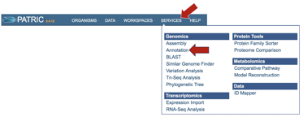

2. This will open up the Annotation Service landing page.

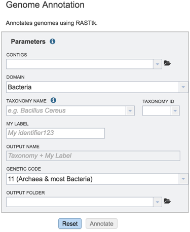

## Finding contigs from an assembly that have been uploaded
1.  Researchers can upload contigs from an assembly job completed in PATRIC or from an external source (see Assembling a genome in PATRIC, parts VII and VIII). Once contigs have been uploaded to the workspace, they need to be submitted to the annotation service. To do this, click on the down arrow that follows the text box underneath Contigs (Red arrow).

    

2. This will open up a drop-down box that will show all the assemblies that currently in the researcher’s private workspace. Click on the one of interest to upload it. The name will then appear in the text box beneath the word Contigs.

    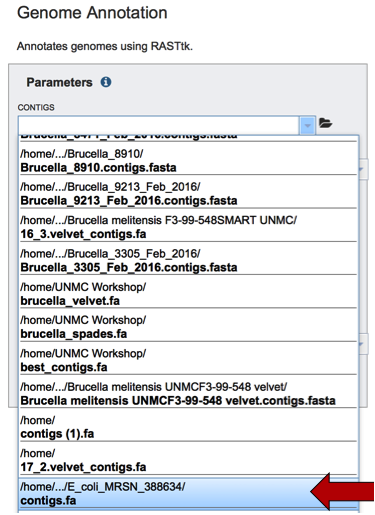

## Uploading contigs from an assembly to the PATRIC workspace
1. Reads that have been assembled into contigs can be uploaded to the PATRIC workspace, even if those assemblies occurred outside of PATRIC. To upload a contig file, click on the upload button at the bottom of any PATIC page (red arrow below).

    

2. This will open a pop-up window that allow you to select files for upload. Do upload contigs, first click on the arrow at the end of the text box with the word Unspecified in it. Then click on Contigs.

    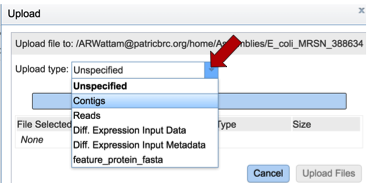

3. Once contigs have been selected, click on the Select Files bar.

    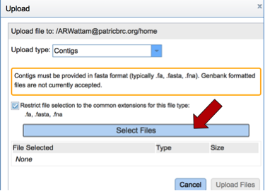

4. This will open a pop-up window where one or more files can be selected. Highlight the files of interest and then click the Open button at the bottom of the window.

    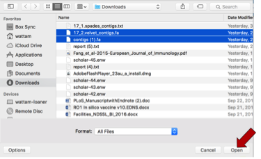

5. The selected files will appear in the upload window. Click on Upload Files to place those files in the workspace.

    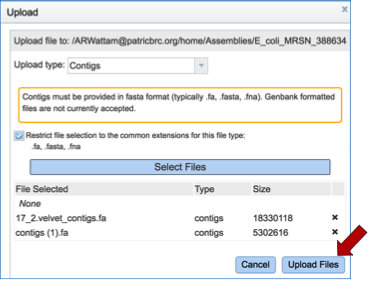

6. The Uploads information bar at the bottom of every PATRIC page will show the progress of the upload. The three columns show completed jobs (first column), jobs in progress (second), and the percent completion of the jobs in progress (third).

    

7. Mousing over the word “Uploads” will show a list of recent uploads. This indicates that the uploads are complete.

    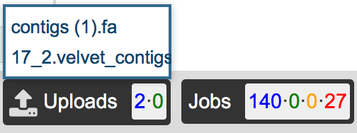

## Submitting an assembly for annotation
1. The taxonomy must be assigned.  To do this, begin typing the genus and species name in the text box below TAXONOMY NAME (red arrow).  This will start open a box that shows the closest matches to what have been typed.  Clicking on the closest match (blue highlight) will autofill the taxonomy id (red box).

    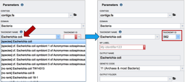

2. A specific name that will identify the genome in the workspace must be entered (red arrow). As the name is being entered under MY LABEL, the OUTPUT NAME will show the selected genus, species and identifier.

    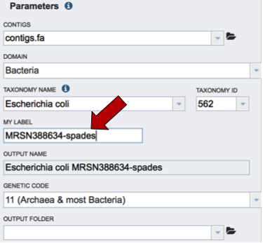

3. The default genetic code is 11, for Archaea and most Bacteria. The other option is genetic code 4, which should be used if Mycoplasma, Spiroplasma or Ureaplasma are the organisms used.

    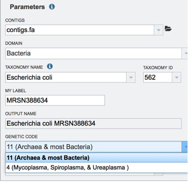

4. An Output Folder needs to be assigned. Click on the down arrow that follows the text box underneath Output folder (Red Arrow) and then select (or create) a folder where the annotation will be placed.

    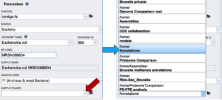

5. Start the annotation job by clicking on the Annotate button (Red arrow).

    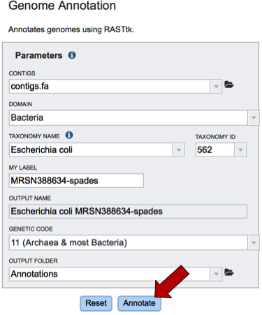

6. A message will appear below the box to indicate that the job is now in the queue.

    

## Checking the status of the annotation job
1. Click on the Jobs indicator at the bottom of the PATRIC page.

    

2. This will open the Jobs Status page where researchers can see the status of their annotation job.  The statuses of all the service jobs that have been submitted to PATRIC are also available.

    

## References

1. Wattam AR, Davis JJ, Assaf R, Boisvert S, Brettin T, Bun C, Conrad N, Dietrich EM, Disz T, Gabbard JL, Gerdes S, Henry CS, Kenyon RW, Machi D, Mao C, Nordberg EK, Olsen GJ, Murphy-Olson DE, Olson R, Overbeek R, Parrello B, Pusch GD, Shukla M, Vonstein V, Warren A, Xia F, Yoo H, Stevens RL. (2017) Improvements to PATRIC, the all-bacterial Bioinformatics Database and Analysis Resource Center. Nucleic Acids Res. 45(D1): D535-D542.

2. Brettin T, Davis JJ, Disz T, Edwards RA, Gerdes S, Olsen GJ, Olson R, Overbeek R, Parrello B, Pusch GD, Shukla M, Thomason JA 3rd, Stevens R, Vonstein V, Wattam AR, Xia F. (2015). RASTtk: a modular and extensible implementation of the RAST algorithm for building custom annotation pipelines and annotating batches of genomes. Scientific reports 5: 8365.
