# Assembling a genome at PATRIC

There are a variety of programs that can be used to assemble the reads that are produced from sequencing machines into contigs or chromosomes, but these can require an advanced programming ability that research biologists are sometimes lacking.  To meet this need PATRIC allows researchers to assemble short reads that are single or paired (typically from Illumina machines), and also long reads from PacBio or Nanopore [1] machines.   PATRIC provides several assembly tools and pipelines, the results of which are downloaded into a researcher's private workspace.  Below is the methodology showing the assembly for single reads using the default assembly method.

**Keywords:** Genome assembly, Bacterial genome assembly, Genome Assembly pipeline, Assembly service, Assembly server, De novo assembly, Contig assembly

##  Locating the Assembly Service App
1. At the top of any PATRIC page, find the Services tab, and click on Assembly
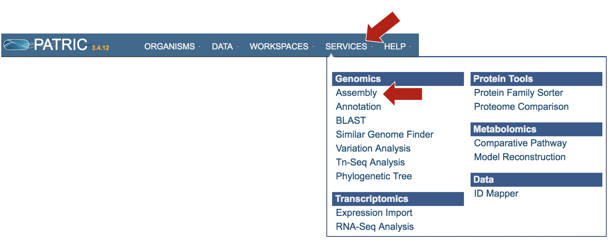

2. This will open up the Assembly landing page where researchers can submit long reads, single or paired read files.
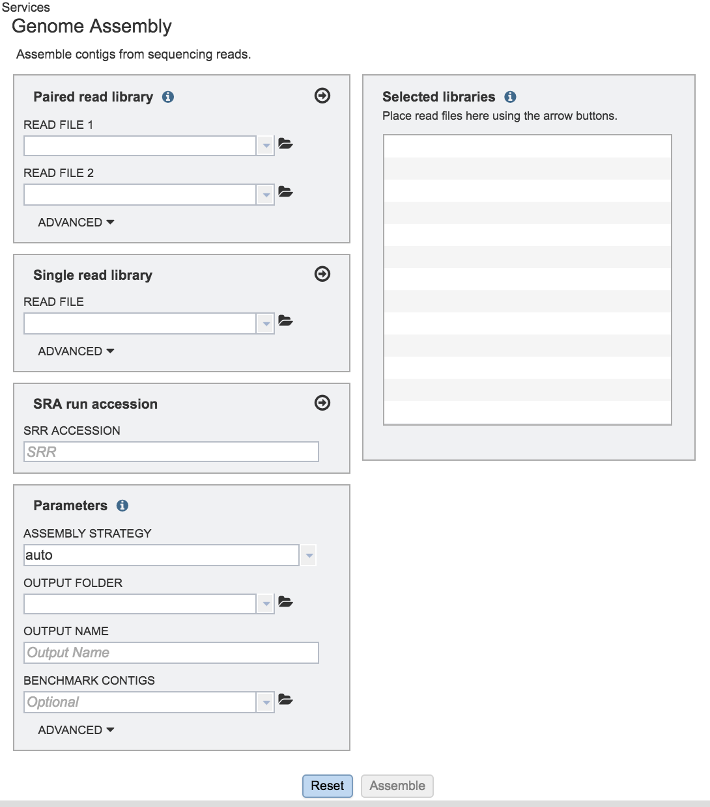

## Uploading sequence reads for a paired-read assembly job

Many paired read libraries are given as file pairs, with each file containing half of each read pair. Paired read files are expected to be sorted in such a way that each read in a pair occurs in the same Nth position as its mate in their respective files. These files are specified as READ FILE 1 and READ FILE 2. For a given file pair, the selection of which file is READ 1 and which is READ 2 does not matter.
Two examples of paired read libraries can be found in [the public PATRIC workspaces](https://patricbrc.org/workspace/public/PATRIC@patricbrc.org/PATRIC%20Workshop/Assembly).
Each pair of read files in this workspace is grouped with a job showing the results
of the assembly.

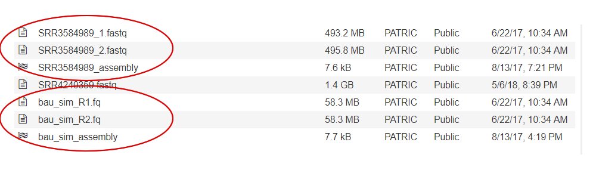

1. To upload a fastq file that contains paired reads, locate the box called *Paired read library*.
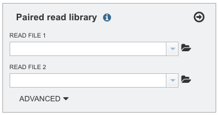

2. More information about the type of files that are permitted, click on the information icon. This will open a pop-up box that gives information on the type of reads that can be submitted, and also how to set the advanced parameters.

3. Clicking on Advanced extends the box, allowing researchers to adjust the parameters.
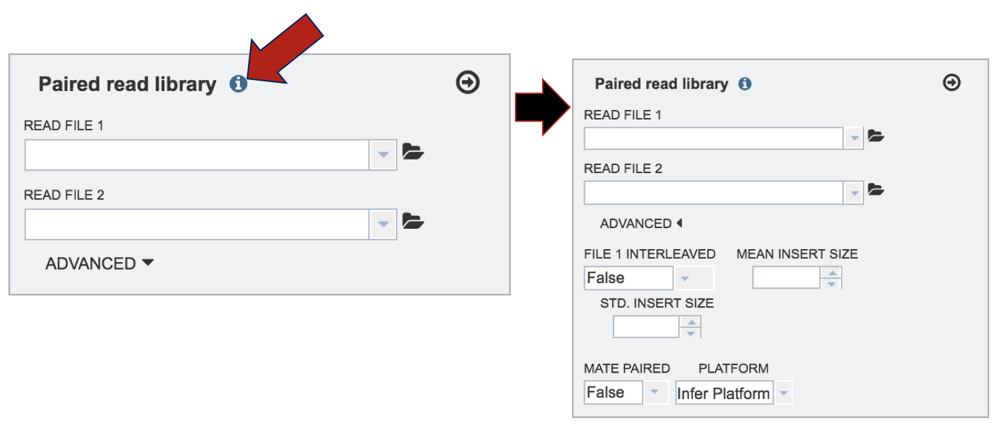
Specific information on the Advanced parameters are as follows.
    - **File 1 Interleaved:** Some paired libraries are available in a single file where each read in a pair occurs in succession. To specify such a file set this parameter to 'True'.
    - **Mean Insert Size:** This refers to the mean insert size between paired reads. If you have this information you may provide it. If not the assembly algorithm will make an attempt to determine this value.
    - **Std. Insert Size:** This refers to the standard deviation of the insert size between paired reads. If you have this information you may provide it. If not the assembly algorithm will make an attempt to determine this value.
    - **Mate Paired:** Defines the orientation of read pairs. Setting Mate Paired to true indicates that the sequencing direction of the two reads in each pair is outward facing.
    - **Platform:** The sequencing platform used for each library.
        * *infer*: Infer sequencing platform from read files;
        * *illumina*: Illumina short reads;
        * *pacbio*: PacBio long reads;
        * *nanopore*: MinION long reads

4. To submit reads, they must be located in the workspace. To initiate the upload, first click on the folder icon.
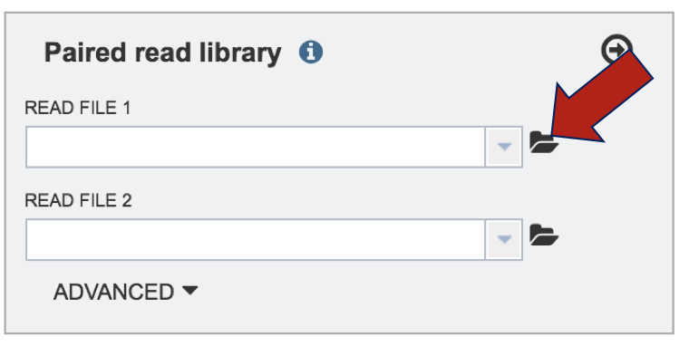

5. This opens up a window where the files for upload can be selected. If the files have been previously uploaded, clicking on an individual file will select it. Clicking Okay at the bottom of the page will load it into the interface
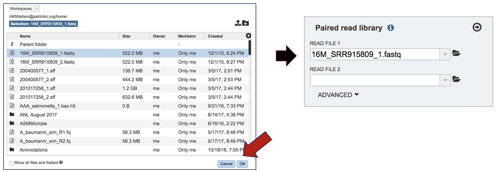

6. If the files have not previously been loaded into the workspace, click on upload button at the top right of the pop-up window.
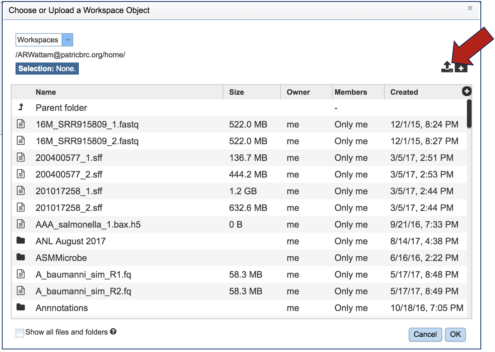

7. This opens a new window where the file you want to upload can be selected. Click on *Select File* in the blue bar, or drag and drop a file into that space.
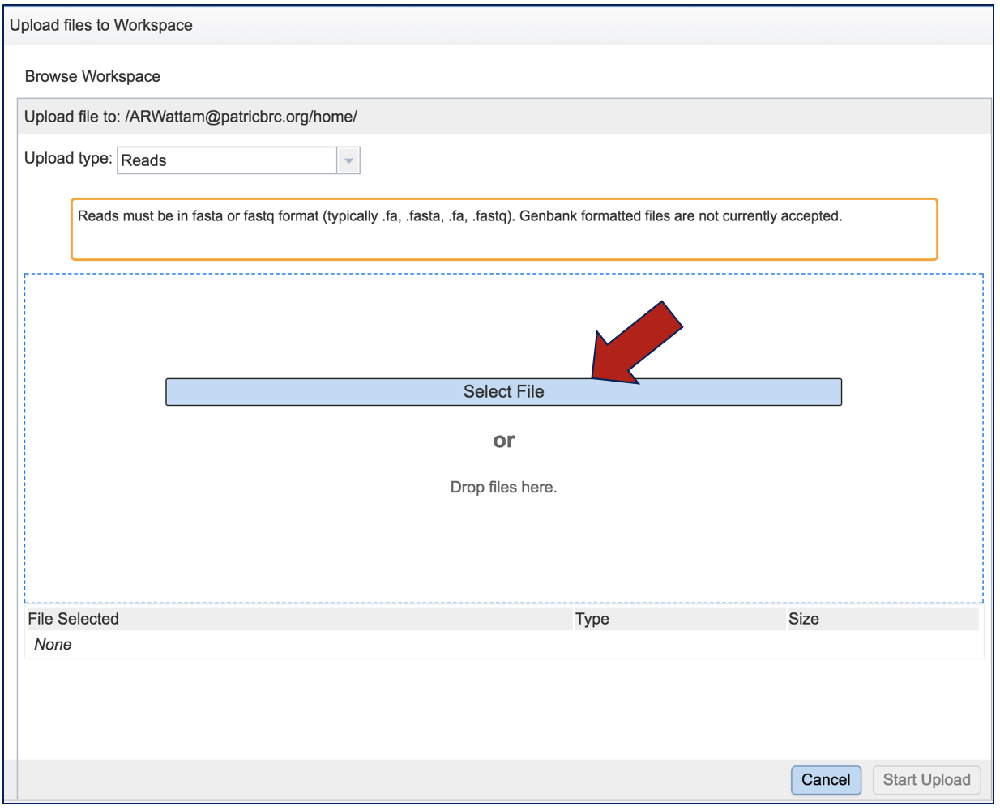

8. This will open a window that allows you to choose files that are stored on your computer. Select the file where you stored the fastq file on your computer (red arrow) and click *Open* (blue arrow).
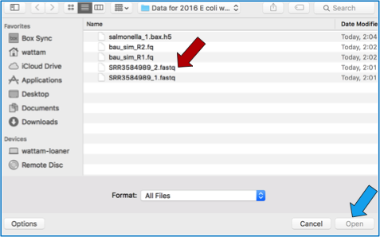

9. Once selected, it will autofill the name of the file. You can see it in the screenshot below. Click on the Upload Files button (red arrow in screenshot below).
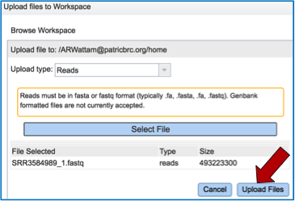

10. This will auto-fill the name of the document into the text box as seen below.
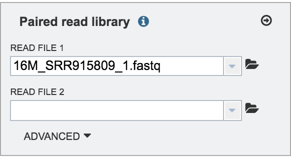

11. Repeat the steps to upload the second pair of reads.
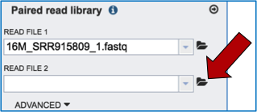

12. To finish the upload, click on the icon of an arrow within a circle (Red Arrow). This will move your file into the Selected libraries box (Blue Arrow).
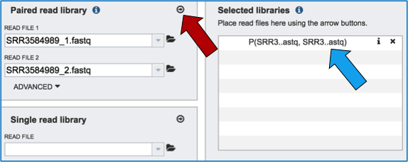

## Uploading single reads for an assembly job
1. To upload a fastq file that contains single reads, locate the box called *Single read library*.

    

2. If the reads have previously been uploaded, click the down arrow next to the text box below Read File.

    

3. This opens up a drop-down box that shows the all the reads that have been previously uploaded into the user account.  Click on the name of the reads of interest.

    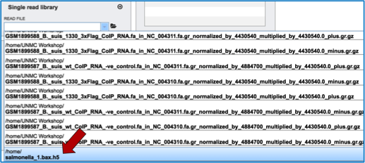

4. This will auto-fill the name of the document into the text box as seen below.

    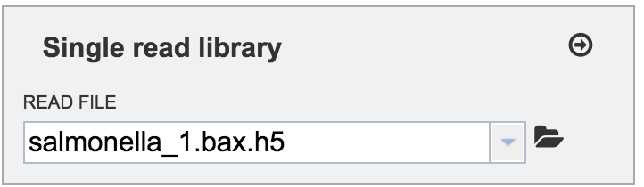

5. To finish the upload, click on the icon of an arrow within a circle (red arrow in screenshot below). This will move your file into the Selected libraries box (blue arrow in screenshot below), where it is ready to be assembled

    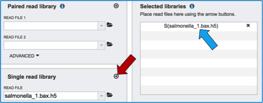

## Uploading files from the Sequence Read Archive (SRA)
1. PATRIC will directly load files from SRA for assembly. Enter the accession number into the text box and then click on the icon of an arrow within a circle.  This will move the file into the Selected libraries box where it is ready to be assembled.
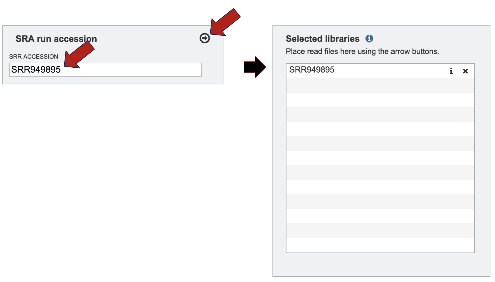

##  Selecting the right parameters for an assembly job
1. The last step of the assembly process is filling in the metadata parameters that define where the assembled contigs are placed in the workspace. PATRIC offers several different assembly strategies that can be viewed by clicking on the down-arrow following the text box under Assembly Strategy.

    - A description and diagram of the different assembly strategies is provided below.
    - The auto assembly strategy runs BayesHammer [2] on short reads, followed by three assembly strategies that include Velvet [3], IDBA [4] and Spades [5], each of which is given an assembly score by ARAST, an in-house script.
    - The fast assembly strategy runs MEGAHIT [6] and Velvet, with each assembly given a score determined by ARAST.
    - Users can also choose the full spades strategy, which runs BayesHammer followed by Spades.
    - Choosing kiki runs the Kiki assembler, an in-house script.
    - Illumina MiSeq reads should be assembled using miseq, which runs Velvet with hash length 35, and then BayesHammer on reads and assembles with SPAdes with k up to 99, followed by a score using ARAST.
    - Plasmid runs BayesHammer on reads and assembles with plasmidSPAdes [7].
    - The smart strategy can be used for long or short reads.  The strategy for short reads when using smart involves running BayesHammer on reads, KmerGenie [8] to choose hash-length for Velvet, followed by the same assembly strategy using Velvet [3], IDBA [4] and Spades [5].  Assemblies are sorted with an ALE score [9] and the two best assemblies are merged using GAM-NGS [10].
    - PacBio and Nanopore long reads only work with the auto and smart strategies. In either case, they are automatically assembled using Miniasm [11].
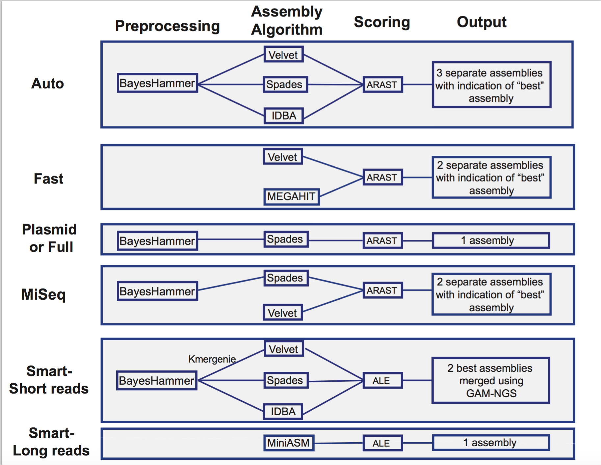

2. A folder must be selected to place the assembly results. A previously created folder can be seen by clicking on the down arrow under the Output Folder text box. Clicking on the folder of interest will select it, and the name will appear in the text box.
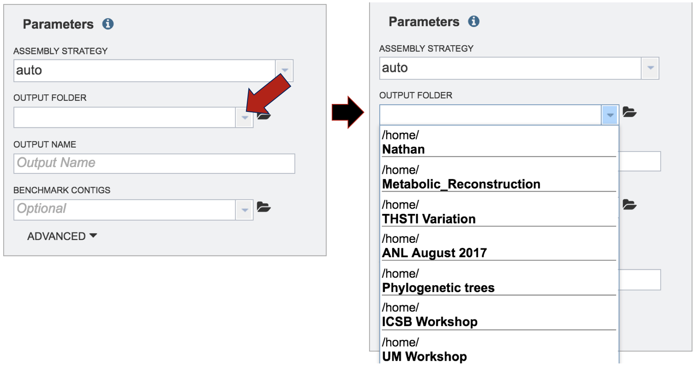

3. The folder icon next to the text box must be clicked on to create a new folder.
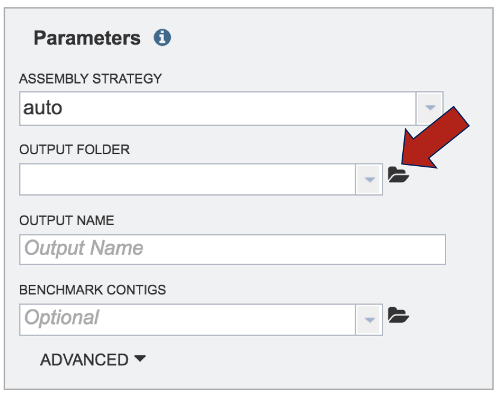

4. This will open a pop-up window. To create the new folder, click on the folder icon in the top right corner.
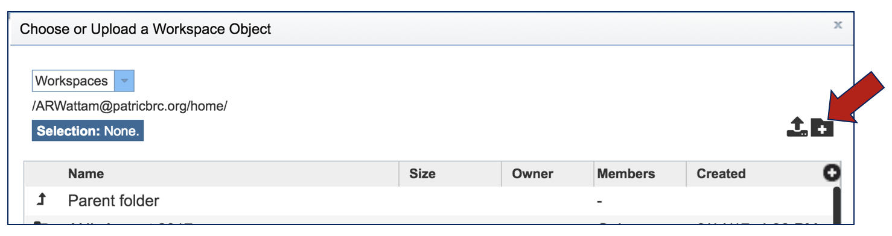

5. This will open a new pop-up window where the folder can be named and created.
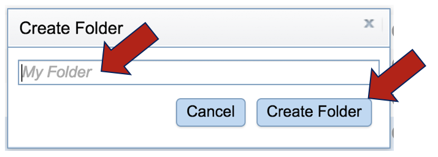

6. Enter the name of the folder in the text box and click Create Folder. This will close the pop-up, showing the previous window. To select the new folder, click on the name and then click OK at the lower right.
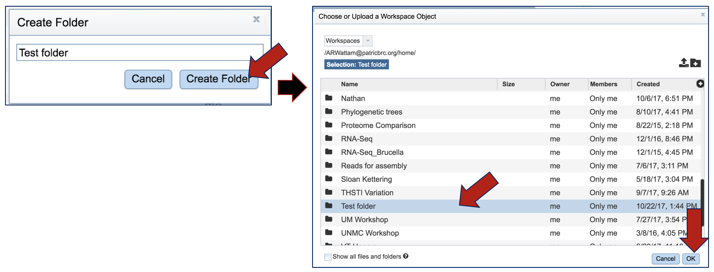

7. The name of the selected folder will appear in the text box under Output Folder.
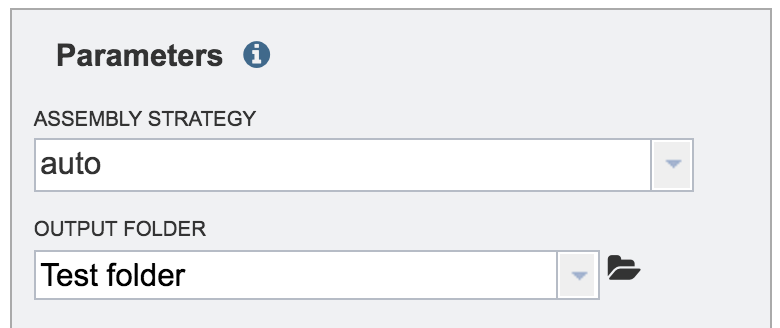

8. Enter the name of the assembly under Output Name.
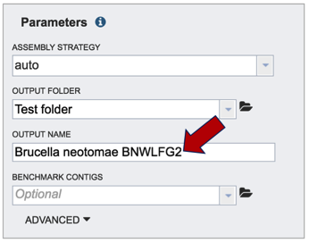

9. To compare the PATRIC assembly to a known assembly, click on the down-arrow next to the text box under Benchmark Contigs and follow the same upload instructions above.
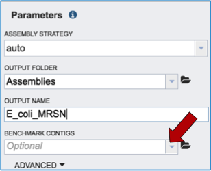

10.	Adjustments can be made to the parameters. Click on the down arrow next to Advanced at the bottom of the box. The minimum contig length can be adjusted, and the short contigs can be filtered out of the final assembly. In addition, the pipeline parameter can be changed. This is an advanced way to customize the assembly workflow by mixing and matching a variety of modules. Each module works at one of the three stages of the pipeline: preprocessing, assembly, and post-processing. In general, you can compose a pipeline by concatenating one or more of the preprocessing modules, one assembler, and optionally one postprocessor. Examples can be seen by clicking the information icon that follows Assembly Pipeline Arguments.
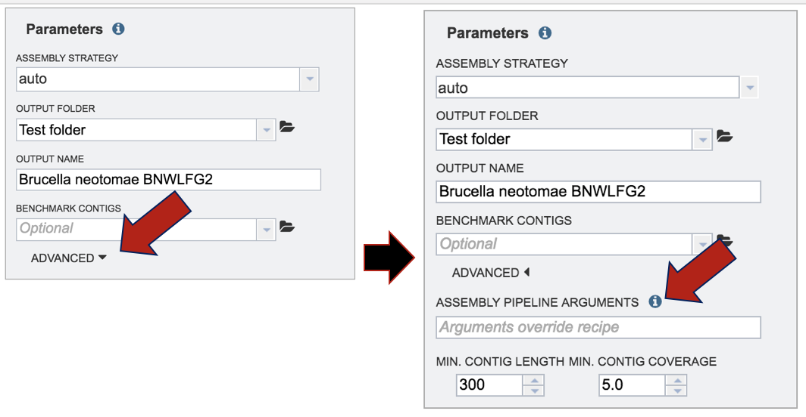

## Submitting the assembly job
1. To submit the job, click on the Assemble button.

    

2. If the job was submitted successfully, a message will appear that indicates that the job has entered the assembly queue.

    

3. To check the status of the assembly job, click on the Jobs indicator at the bottom of the PATRIC page.

    

4. Clicking on Jobs opens the Jobs Status page, where researchers can see the progression of the assembly job as well as the status of all the previous service jobs that have been submitted.

    

## Viewing the assembly job
1. Researchers must monitor the Jobs Status page to see when an assembly job has completed. Jobs that were successful have a blue circle followed by the word *completed*. Those that were not successful have a red circle, followed by the word *failed*.
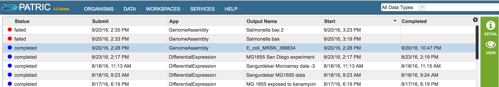

2. To view the assembly job, the row must be selected (it will turn blue). This will open the view icon in the vertical green bar.  Double clicking on this icon will open a page with all the information about the assembly.
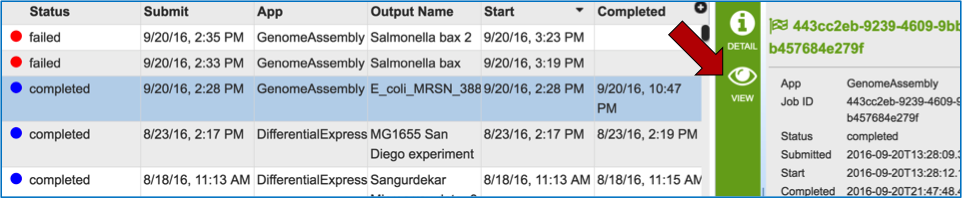

3. PATRIC provides several different ways to assess the quality of the assembly, and provides the contigs files from each of the assembly algorithms that were run.
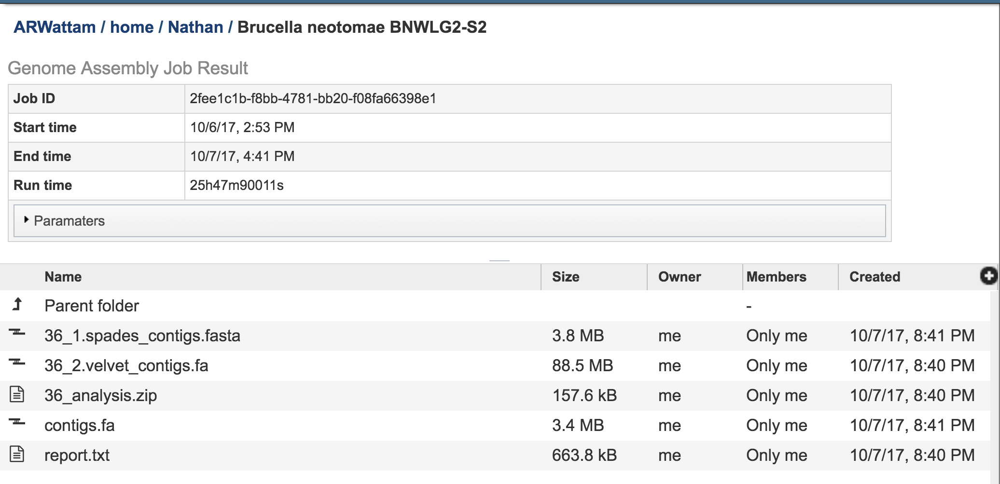

4. Clicking on the Parameters file will provide the details of the assembly job.
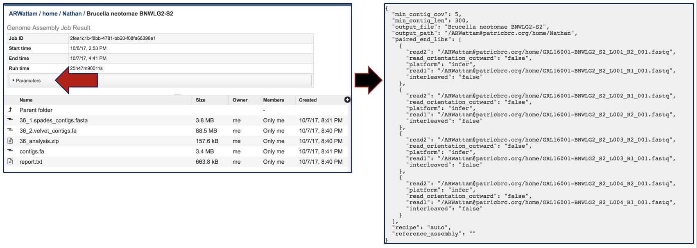

5. Contigs files have been generated for each of the assembly algorithms that ran. PATRIC also provides contigs files of the best assembly, which is identified as contigs.fa.
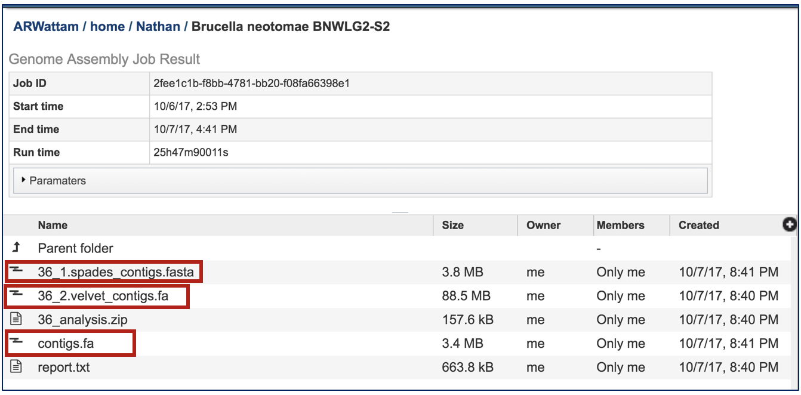

6. Clicking on the line that contains a contig file and then clicking on the Download icon in the vertical green bar can be used to save and view a contig file.
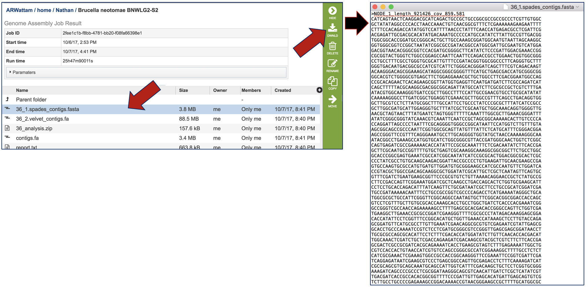

7. There is no need to download the contig files. They will be provided in the drop-down box to submit contigs for the Annotation service.
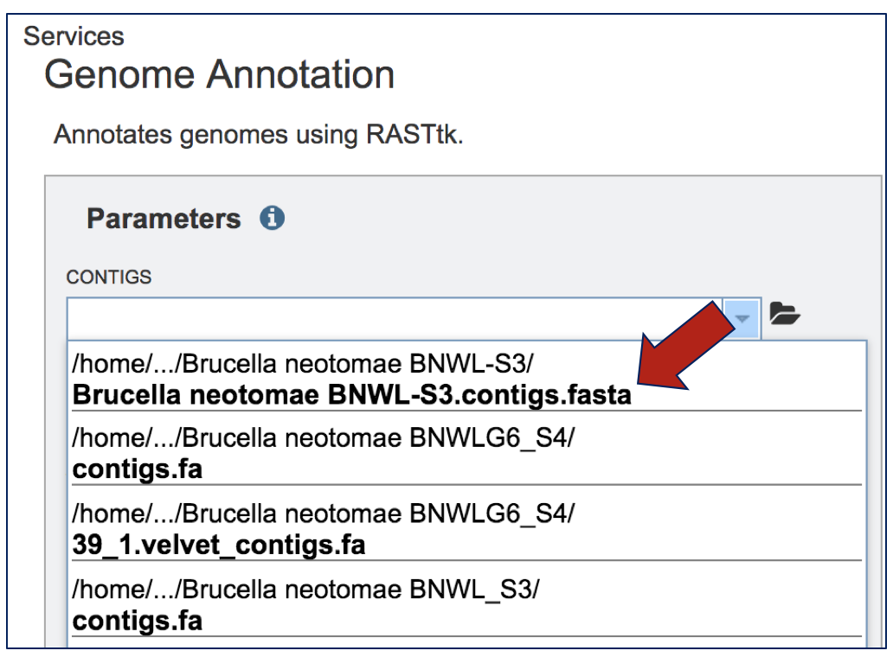

8. To view an assessment of the quality of the assembly, click on the analysis.zip file and then on the download button.
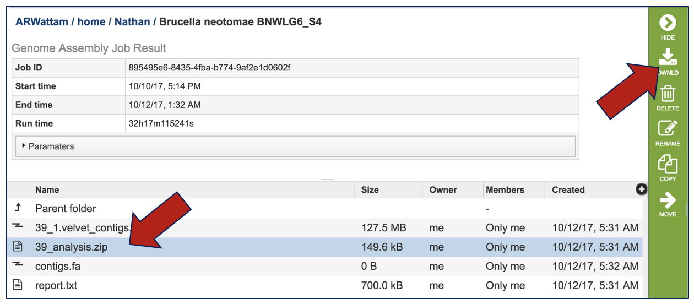

9. Unzipping the analysis file will reveal a number of files. The Quast (Quality Assessment Tool for Genome Assemblies) algorithm [12] is used to compare and show the different values assigned to the different assemblies that have generated. Clicking on quast.out downloads a text file that can be examined.
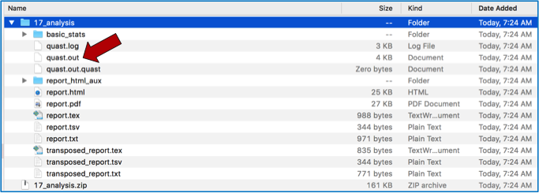

10. The quast.out file provides the details of how the program ran.
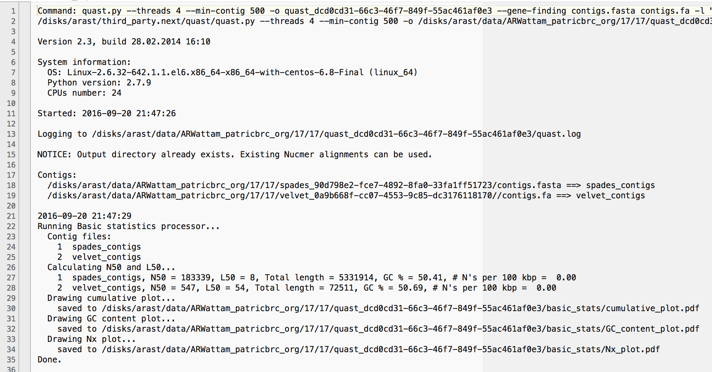

11.	Reports on the assembly are available in a variety of formats.
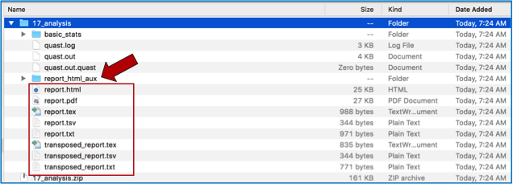

12.	Clicking on the report.html will open a page that summarizes the statistics across the assembly algorithms.
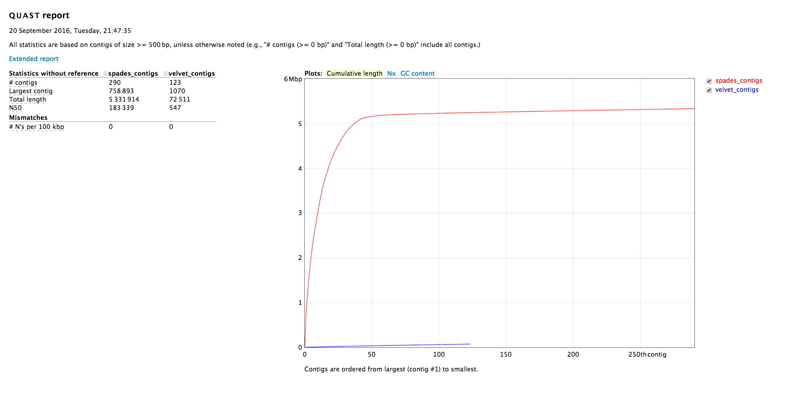

13.	Clicking on the Extended report will show all the statistics.
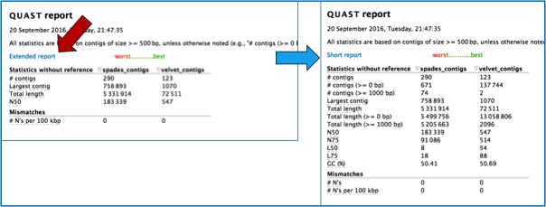

14.	Quast generates several different plots that summarize the quality of the different assemblies, including a cumulative length, Nx and GC content.  These plots can be viewed with normal or logarithmic scales.
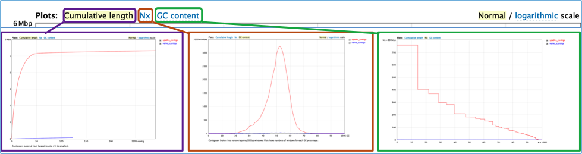

## References

1. Branton, D., et al., The potential and challenges of nanopore sequencing. Nature biotechnology, 2008. 26(10): p. 1146-1153.
2. Nikolenko, S.I., A.I. Korobeynikov, and M.A. Alekseyev, BayesHammer: Bayesian clustering for error correction in single-cell sequencing. BMC genomics, 2013. 14(1): p. 1.
3. Zerbino, D.R. and E. Birney, Velvet: algorithms for de novo short read assembly using de Bruijn graphs. Genome research, 2008. 18(5): p. 821-829.
4. Peng, Y., et al. IDBA: a practical iterative de Bruijn graph de novo assembler. in Research in Computational Molecular Biology. 2010. Springer.
5. Bankevich, A., et al., SPAdes: a new genome assembly algorithm and its applications to single-cell sequencing. Journal of Computational Biology, 2012. 19(5): p. 455-477.
6. Li, D., et al., MEGAHIT: an ultra-fast single-node solution for large and complex metagenomics assembly via succinct de Bruijn graph. Bioinformatics, 2015: p. btv033.
7. Antipov D, Hartwick N, Shen M, Raiko M, Lapidus A, Pevzner PA. 2016. plasmidSPAdes: assembling plasmids from whole genome sequencing data. Bioinformatics32(22):3390-3397.
8. Namiki, T., et al., MetaVelvet: an extension of Velvet assembler to de novo metagenome assembly from short sequence reads. Nucleic acids research, 2012. 40(20): p. e155-e155.
9. Clark, S.C., et al., ALE: a generic assembly likelihood evaluation framework for assessing the accuracy of genome and metagenome assemblies. Bioinformatics, 2013: p. bts723.
10.	Vicedomini, R., et al., GAM-NGS: genomic assemblies merger for next generation sequencing. BMC bioinformatics, 2013. 14(7): p. 1.
11.	Li, H., Minimap and miniasm: fast mapping and de novo assembly for noisy long sequences. arXiv preprint arXiv:1512.01801, 2015.
12.	Gurevich, A., et al., QUAST: quality assessment tool for genome assemblies. Bioinformatics, 2013. 29(8): p. 1072-1075.
