# Assembling a Genome

A genome assembly is the sequence produced after chromosomes from the organism have been fragmented, those fragments have been sequenced, and the resulting sequences have been put back together. This is currently needed as DNA sequencing technology cannot read whole genomes in one go, but rather can read small pieces of between 20 and 30,000 bases, depending on the technology used. Typically the short fragments, called reads, result from shotgun (random) sequencing of genomic DNA.

De novo sequence assemblers are a type of program that assembles short nucleotide sequences into longer ones without the use of a reference genome. These are commonly used in bioinformatic studies to assemble genomes or transcriptomes.

Different assemblers are designed for different type of read technologies. Second generation sequencing technologies like Illumina (called “short-read” technologies) produce short reads on the order of 50-200 base pairs and have low error rates of around 0.5-2%, with the errors chiefly being substitution errors. Third generation technologies like PacBio and fourth generation technologies like Oxford Nanopore (called “long-read” technologies) provide read lengths in the thousands or tens of thousands but have much higher error rates of around 10-20%, with errors being chiefly insertions and deletions. These differences necessitate different algorithms for assembly from short and long read technologies.

What follows is a tutorial showing how to submit reads of various types for assembly, and selecting parameters for the assembly algorithm.  Note that reads from different sequencing platforms of the same organism can be submitted in one job.  If PacBio and Illumina reads are available, both would be combined to generate the best assembly.

## Locating the Assembly Service App

1. At the top of any PATRIC page, find the Services tab and click on it

2. In the drop-down box, underneath Genomics, click on Assembly.
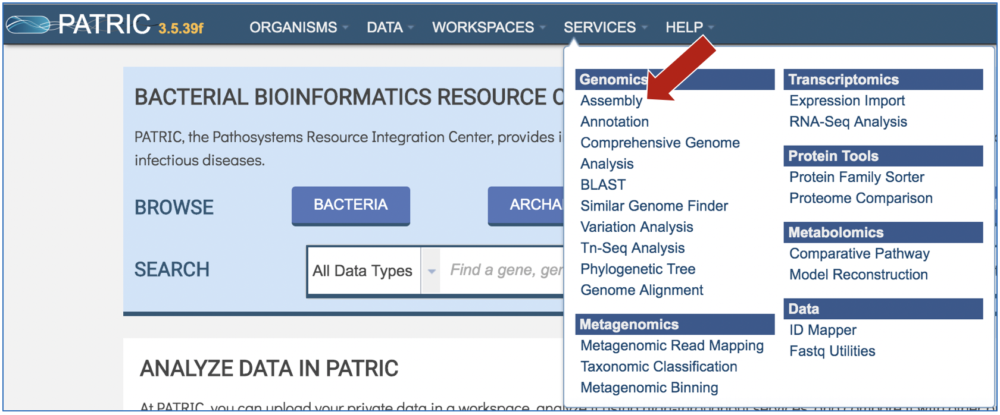

3. This will open up the Assembly landing page where researchers can submit single or paired read files, a combination of the two, and/or an SRA run accession number to the service.
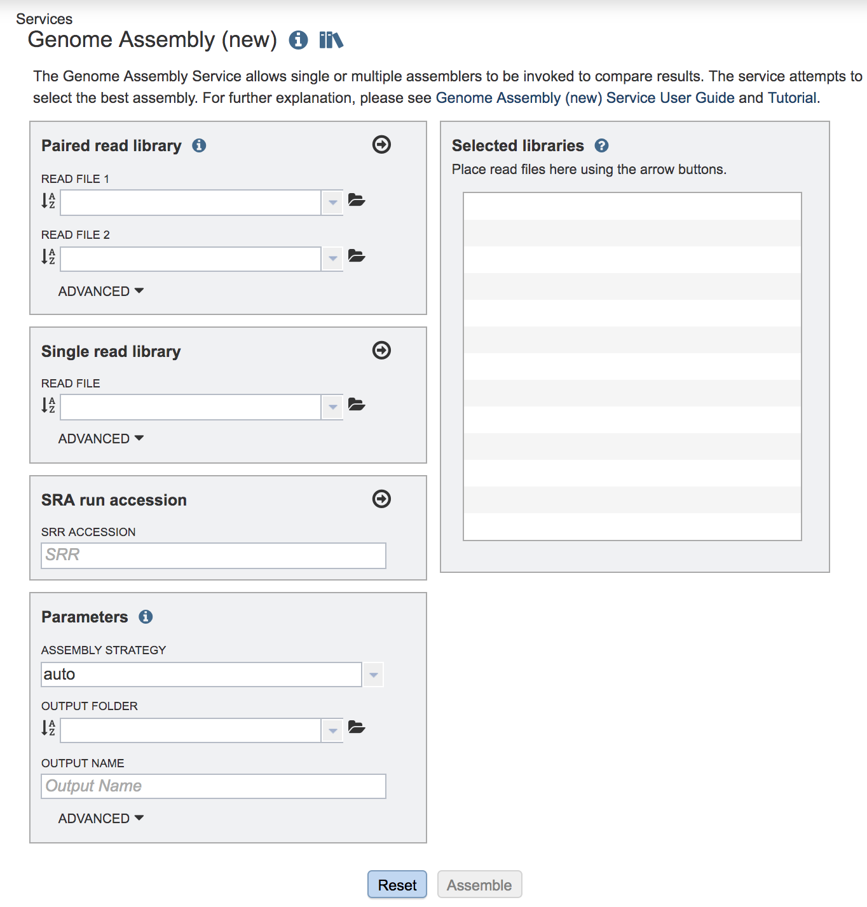

### Uploading paired end reads

1. To upload a fastq file that contains paired reads, locate the box called “Paired read library.” 

2. The reads must be located in the workspace. To initiate the upload, first click on the folder icon. 

3. This opens up a window where the files for upload can be selected. Click on the icon with the arrow pointing up. 

4. This opens a new window where the file you want to upload can be selected. Click on the “Select File” in the blue bar. 
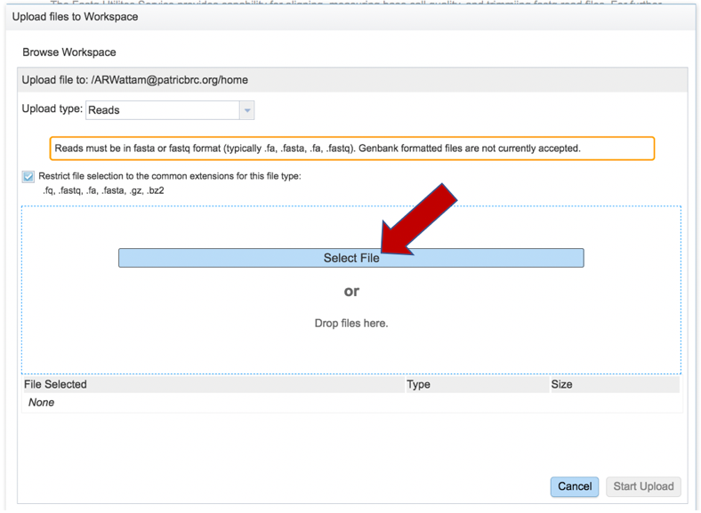

5. This will open a window that allows you to choose files that are stored on your computer. Select the file where you stored the fastq file on your computer and click “Open”.  
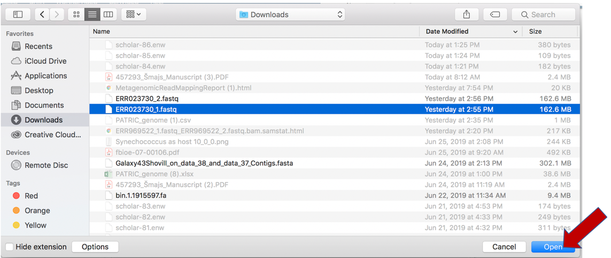

6. Once selected, it will autofill the name of the file. Click on the Start Upload button.

7. This will auto-fill the name of the document into the text box. 
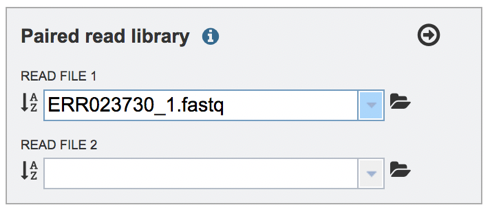

8. Pay attention to the upload monitor in the lower right corner of the PATRIC page. It will show the progress of the upload. Do not submit the job until the upload is 100% complete.

9. Repeat to upload the second pair of reads.
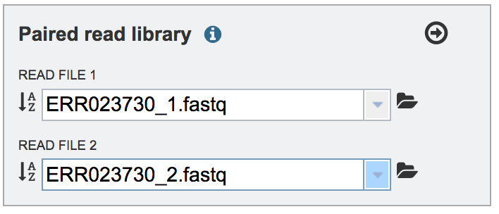

10. To finish the upload, click on the icon of an arrow within a circle. This will move your file into the Selected libraries box.
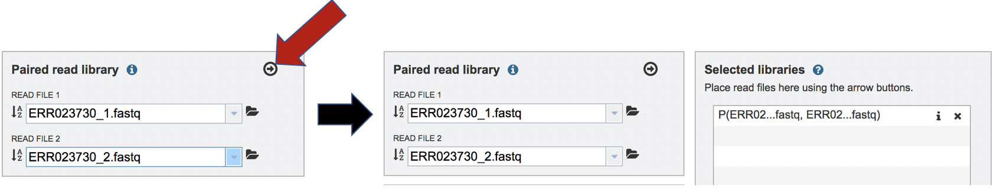

11. The assembly protocol in PATRIC assumes that the paired end reads are not interleaved and that the library creation was standard.  It will also infer the platform from the type of reads that it sees.  If one wishes to change these parameters, click on the down arrow following Advanced in the Paired read library box.  This will extend the box to show three additional parameters that can be selected.
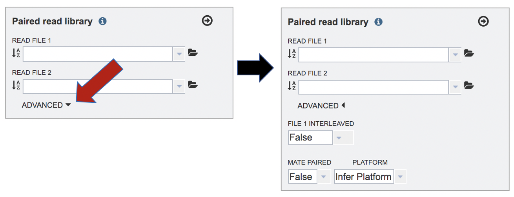

12. Interleaved files occur when the R1 and R2 reads are combined in one file, so that for each read pair, the R1 read in the file comes immediately before the R2 read, followed by the R1 read for the next read pair, and so on.  This happens rarely, but if the read files are interleaved, click on the arrow at the end of the text box underneath the words “File 1 Interleaved” and click on True.
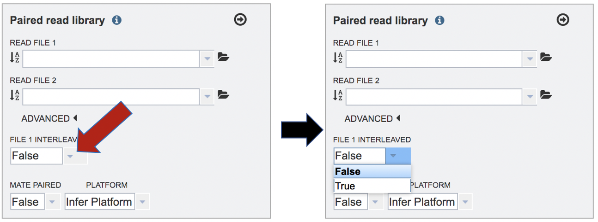

13. Mate-pair is a specific type of library. Mate pair allows you to have your pairs be much farther apart, which can be more informative than the standard paired-end protocol. Mate pair requires a completely different sample preparation protocol and is typically over longer distances such as 2-5kb. If you want to sequence a 5kb mate pair library, then 5kb fragments of DNA are isolated on the gel, the ends are biotinylated, the fragment is circularized and sheared. So now when you select using streptavidin, you'll get the fragment that has the ENDS of the original 5kb fragment. This fragment is then sequenced. Mate pair is more relevant in genome assembly, especially for covering repetitive sequences.  If the read files come from a mate-paired generated library, click on the down arrow next to False under the words Mate Paired and click on True in the drop-down box.
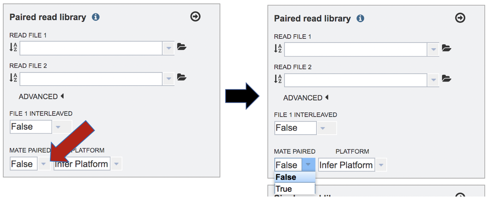

14. To change the sequencing platform, click on the down arrow following the words “Infer Platform”.  Click on either Illumina or Ion Torrent, depending upon the sequencer that was used to generate the reads.
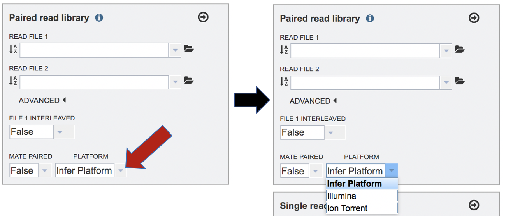

### Uploading single reads

1. To upload a fastq file that contains single reads, locate the text box called “Single read library.” If the reads have previously been uploaded, click the down arrow next to the text box below Read File. 
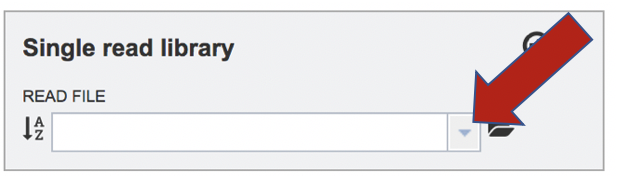

2. This opens up a drop-down box that shows the all the reads that have been previously uploaded into the user account. Click on the name of the reads of interest.

3. This will auto-fill the name of the file into the text box.

4. To finish the upload, click on the icon of an arrow within a circle. This will move the file into the Selected libraries box.
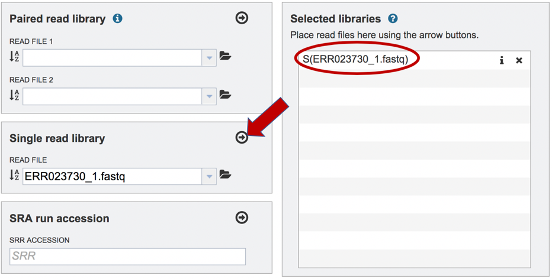

5. The assembly algorithm will attempt to infer the platform that was used to generate the reads based on the format of the files.  If the type of sequencing is known, click on the down arrow following Advanced in the Single read library box.  This will extend the box to show three an additional box where the platform can be selected.
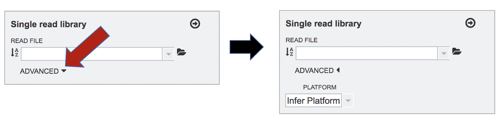

6. To change the sequencing platform, click on the down arrow following the words “Infer Platform”.  Click on either Illumina, Ion Torrent, PacBio or Nanopore, depending upon the sequencer that was used to generate the reads.

### Submitting reads that are present at the Sequence Read Archive (SRA)

1. PATRIC also supports analysis of existing datasets from SRA. To submit this type of data, locate the Run Accession number that you will find at SRA and copy it.

2. Paste the copied accession number in the text box underneath SRA Run Accession, then click on the icon of an arrow within a circle.  This will move the file into the Selected libraries box.

## Setting Parameters

1. The assembly strategy for the reads must be selected.  Clicking on the down arrow that follows the text box under Assembly Strategy will open a drop-down box that shows all the strategies that PATRIC offers.  A description of each strategy is listed below. Clicking on one of the strategies will autofill the text box with that selection.

- Unicycler[1] is an assembly pipeline that can assemble Illumina-only read sets where it functions as a SPAdes-optimizer. It can also assembly long-read-only sets (PacBio or Nanopore) where it runs a miniasm plus Racon pipeline. For the best possible assemblies, give it both Illumina reads and long reads, and it will conduct a hybrid assembly.  Unicycler builds an initial assembly graph from short reads using the de novo assembler and then uses a novel semi-global aligner to align long reads to it. The latest version of Unicycler is available here (https://github.com/rrwick/Unicycler).

- SPAdes[2] is an assembler that is designed to assemble small genomes, such as those from bacteria, and uses a multi-sized De Bruijn graph to guide assembly. The latest version of the SPAdes toolkit is available here (http://cab.spbu.ru/software/spades/).

- Canu[3] is a long-read assembler which works on both third and fourth generation reads. It is a successor of the old Celera Assembler that is specifically designed for noisy single-molecule sequences. It supports nanopore sequencing, halves depth-of-coverage requirements, and improves assembly continuity. It was designed for high-noise single-molecule sequencing (such as the PacBio RS II/Sequel or Oxford Nanopore MinION).  The algorithm is available here (https://github.com/marbl/canu).

- The metaSPAdes [4] software combines new algorithmic ideas with proven solutions from the SPAdes toolkit to address various challenges of metagenomic assembly.  The latest version of the SPAdes toolkit that includes metaSPAdes is available here (http://cab.spbu.ru/software/spades/).

- Plasmids are stably maintained extra-chromosomal genetic elements that replicate independently from the host cell's chromosomes. The plasmidSPAdes[5] algorithm and software tool for assembling plasmids from whole genome sequencing data and benchmark its performance on a diverse set of bacterial genomes. The latest version of the SPAdes toolkit that includes plasmidSPAdes is available here (http://cab.spbu.ru/software/spades/).

- Single-cell[2]: SPAdes, a new assembler for both single-cell and standard (multicell) assembly, and it improves on the recently released E+V−SC assembler (specialized for single-cell data). The latest version of the SPAdes toolkit that includes the assembly algorithm for reads from single cell is available here (http://cab.spbu.ru/software/spades/).

- Selecting Auto will use Canu if only long reads are submitted. If long and short reads, as or short reads alone are submitted, Unicycler is selected. 
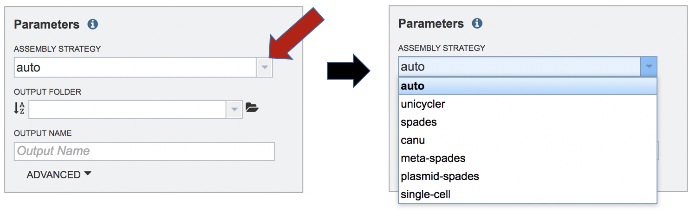

2. An output folder must be selected for the assembly job.  Typing the name of the folder in the text box underneath the words Output Folder will show a drop-down box that shows close hits to the name, and clicking on the arrow at the end of the box will open a drop-down box that shows the most recently created folders.  To find a previously created folder, or to create a new one, click on the folder icon at the end of the text box.  This will open a pop-up window that shows all the previously created folder.
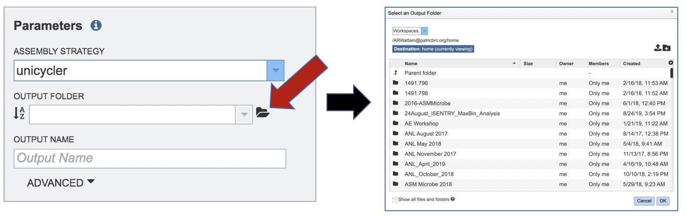

3. Click on the folder of interest, and then click the OK button in the lower right corner of the window.
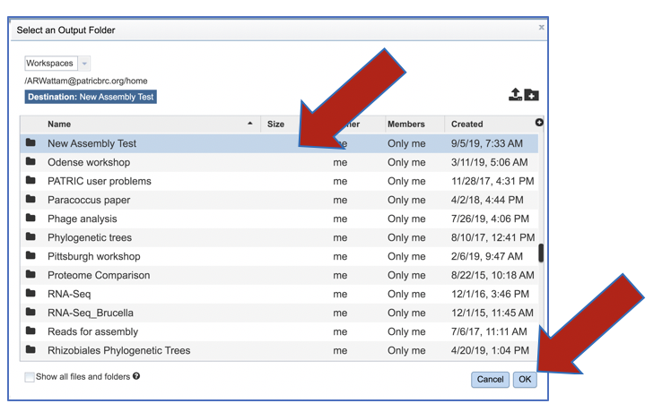

4. A name for the job must be included prior to submitting the job.  Enter the name in the text box underneath the words Output Name.
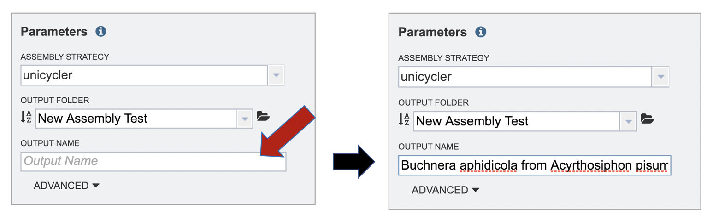

5. The PATRIC assembly service also has options to trim the reads using TrimGalore[6], correct assembly errors (or “polish) using Racon[7] and/or Pilon[8], and also provides the ability to change the minimum contig length and coverage.  Adjusting these parameters can be accomplished by clicking on the down arrow next to the word “Advanced” in the Parameters box.

Both racon and pilon take the contigs and the reads mapped to those contigs, and look for discrepancies between the assembly and the majority of the reads.  Where there is a discrepancy, racon or pilon will correct the assembly if the majority of the reads call for that.  Racon is for long reads (PacBio or Nanopore) and pilon is for shorter reads (Illumina or Ion Torrent).  Once the assembly has been corrected with the reads, it is still possible to do another iteration to further improve the assembly, but each one takes time.  PATRIC allows for 0 to 4 racon or pilon iterations.
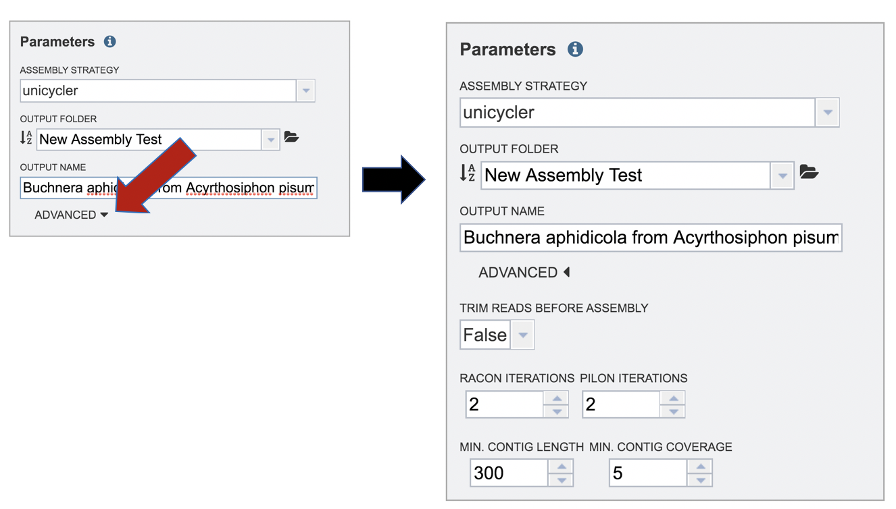

## Submitting the Assembly job

1. Once reads are in the Selected libraries and all the parameters have been selected, the Assemble button at the bottom of the page will turn blue.  The assembly will be submitted once this button is clicked.
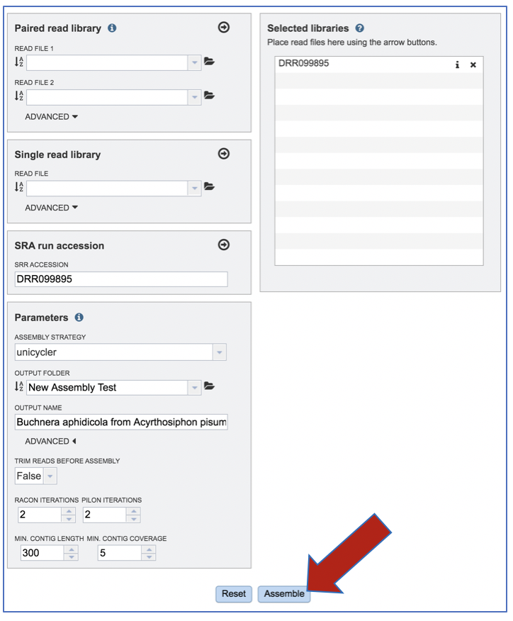

2. A message will appear at the bottom of the page, indicating that the submitted job has entered the PATRIC queue.

## Monitoring progress on the Jobs page

1. Clicking on the Jobs box at the bottom right of any PATRIC page/

2. This will open the Jobs Landing page where the status of submitted jobs is displayed.
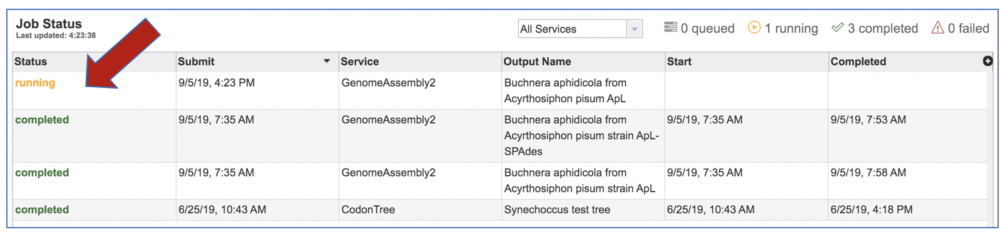

## Viewing the Assembly job results

1. On the jobs page, click on the row that has the assembly of interest.
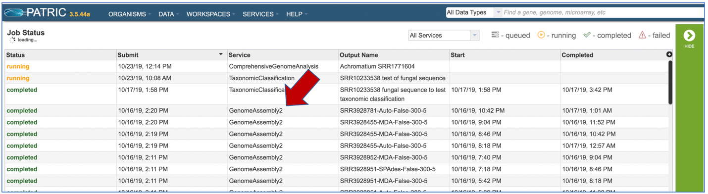

2. This will populate the vertical green bar on the right with possible downstream steps, which include viewing the results of the job, or reporting an issue that was experienced (like a job failure).  Click on the View icon.

3. This will rewrite the page to show the information about the assembly job, and all of the files that are produced when the pipeline runs.  
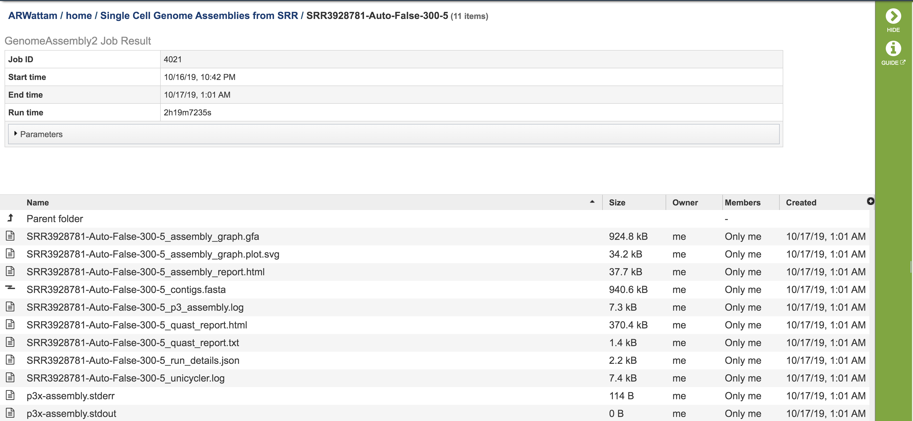

4. The information about the job submission can be seen in the table at the top of the results page.  To see all the parameters that were selected when the job was submitted, click on the Parameters row.
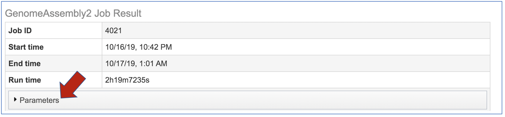

5. This will show the information on what was selected when the job was originally submitted.
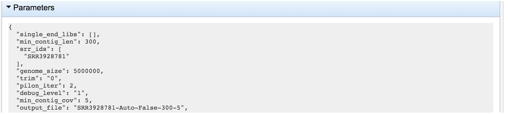

6. The “Graphical Fragment Assembly” (GFA) is an emerging format for the representation of sequence assembly graphs, which can be adopted by both de Bruijn graph- and string graph-based assemblers.  This file can be viewed or downloaded, but it is not meant to be human readable.  It is used to generate the assembly plot graph (see below)
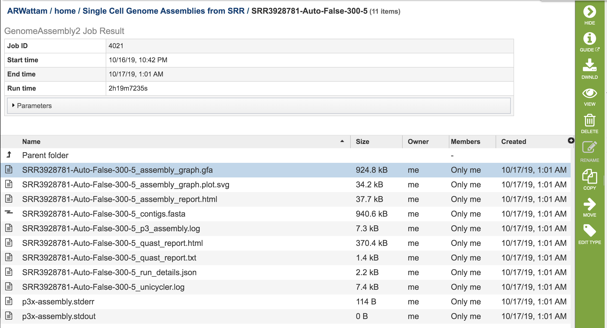

7. Assembly Graph Plot. A graph of the assembly is provided as part of the standard output.  Bandage (a Bioinformatics Application for Navigating De novo Assembly Graphs Easily)[9], a tool for visualizing assembly graphs with connections is used.  To see the Bandage plot, click on the row that has the .svg file and then click on the View icon in the vertical green bar.
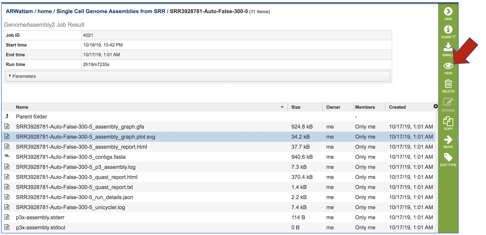

8. The page that opens the Bandage plot.  By visualizing both nodes and edges, Bandage gives users easy, fast access to the connection information contained in assembly graphs. This is particularly useful when the assembly contains many short contigs, as is often the case when assembling short reads, and empowers users to examine and assess their assembly graphs in greater detail than when viewing contigs alone. 
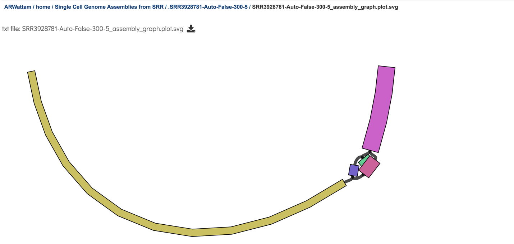

9. An Assembly report is provided. To view the report, click on the row where the file ends in report.html, and then on the View icon in the vertical green bar.
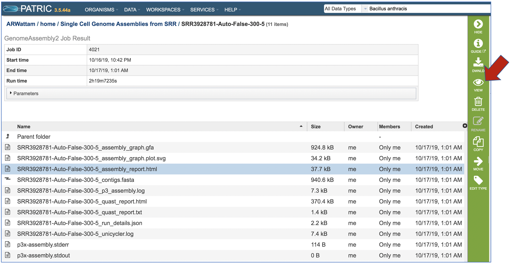

10. This will open the Genome Assembly report.  It begins with the Input Reads, which is a description of the reads that were submitted.  This is followed about details on the Assembly pipeline.  
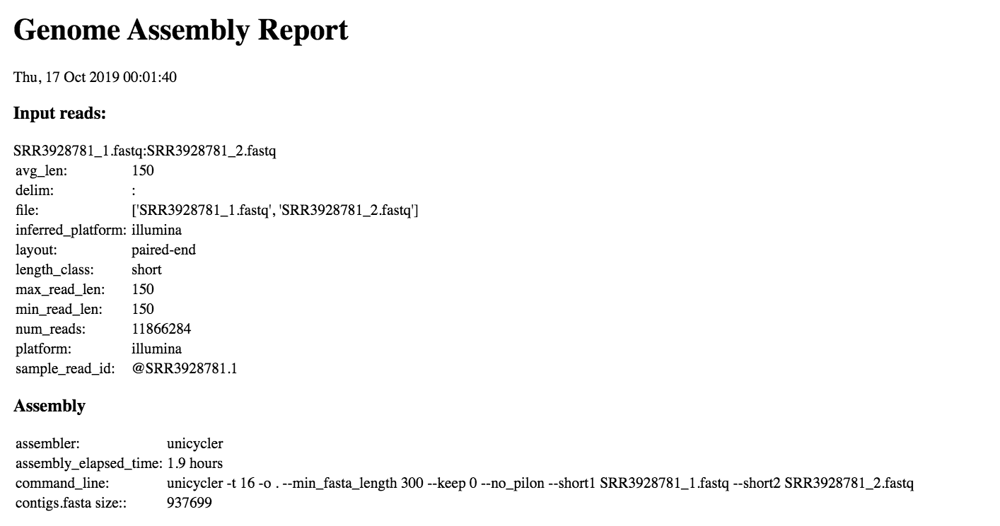

11. A Quast report is also included in the Genome Assembly report. Quast is a quality assessment tool for evaluating and comparing genome assemblies[10], and it produces many reports, summary tables and plots to help scientists in their research and in their publications.  
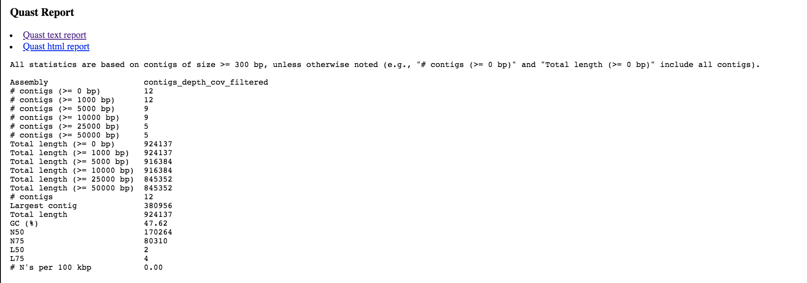

12. The Post-Assembly Transformations of the Genome Assembly Report details of trimming, racon or pilon iterations, and the contigs and/or minimum coverage were selected when then job was selected. The Unicycler assembler will suggest if a contig is circular[1], which will be identified under the heading Circular Contigs. The Contig Filtering section of this report shows details on the contigs and coverage that fell above and below the thresholds that were selected.
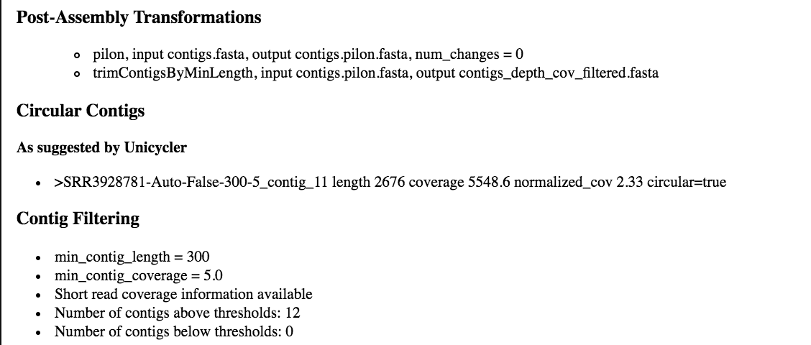

13. The end of the Genome Assembly Report also shows the Bandage Plot.
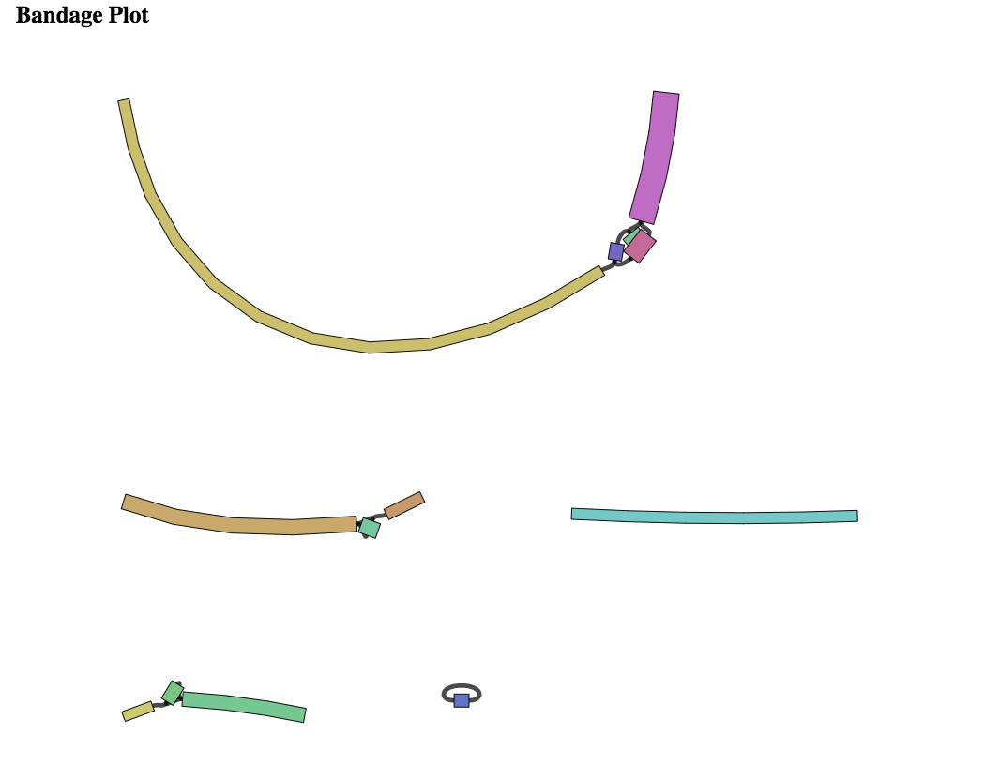

14. To see the contigs generated by the assembly, click on the row that has the file ending in contigs fasta and click on the download icon.
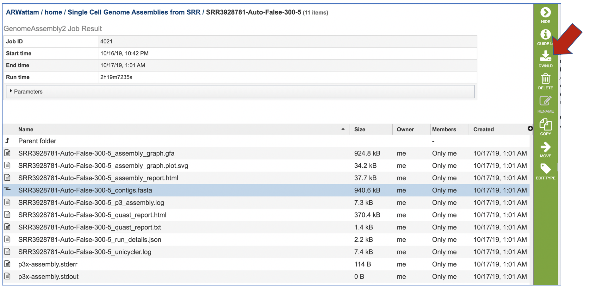

15. Opening the contigs file will show the contigs, each of which begin with a “>” and includes the length, coverage and normalized coverage statistics on the first row. Coverage means the average number of original reads that align to each position of the contig. The normalized coverage has a mean of 1.0 and helps identify contigs of unusually high or low coverage.  When both long and short reads are combined in a “hybrid assembly”, separate coverage statistics are provided for the two read categories. The sequence for the contig starts on the second row. 
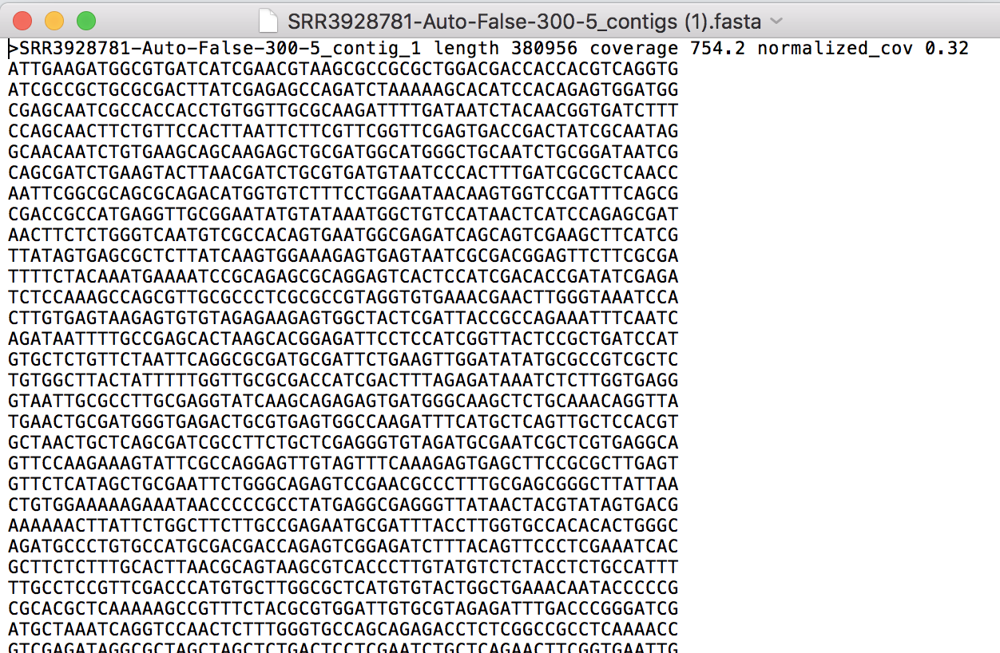

16. The assembly log file is also provided for viewing or downloading.  Clicking on the row that ends in assembly.log and then the view icon will open this file
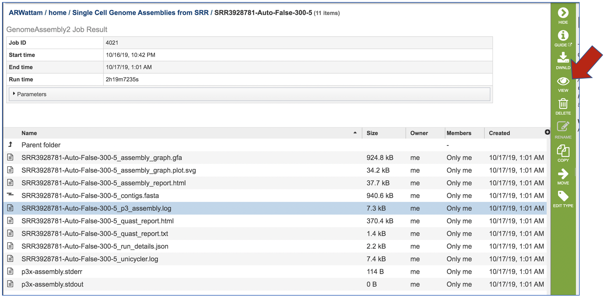

17. While the Quast[10] report is included in the Genome Assembly report, a separate, downloadable format is provided as an html.  

18. When the quast_report.html is downloaded and opened, details on the assembly including the Cumulative length per contig is provided. The cumulative length plot shows the number of bases in the first x contigs, as x varies from zero to the number of contigs
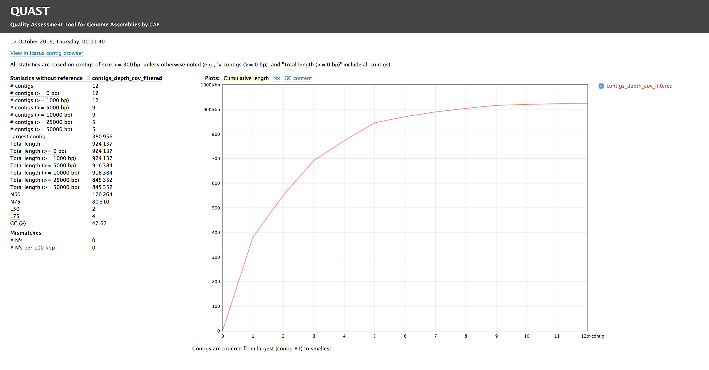

19. Clicking on Nx shows the percentage of bases on each of the contigs.
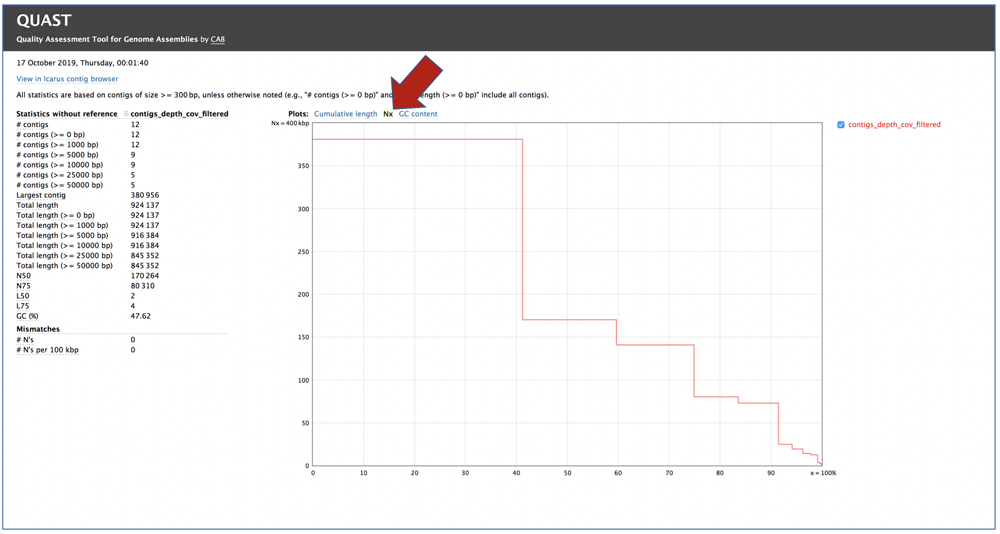

20. Clicking on GC content shows the total number of G and C nucleotides in the assembly, divided by the total length of the assembly.
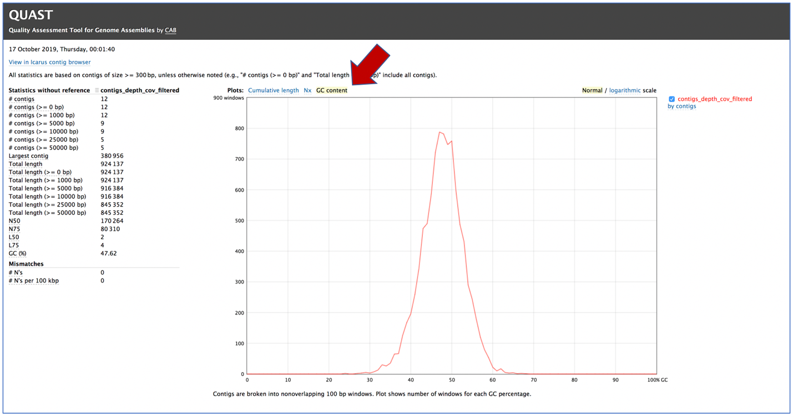

21. This Quast report is also available as a text file.  To view this, click on the line that has the quast_report.txt and then on the View icon in the vertical green bar.
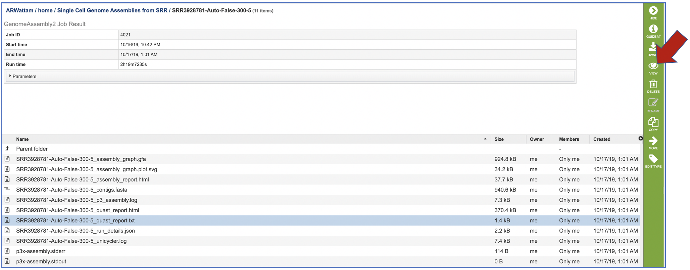

22. This will open the text format of the that report.
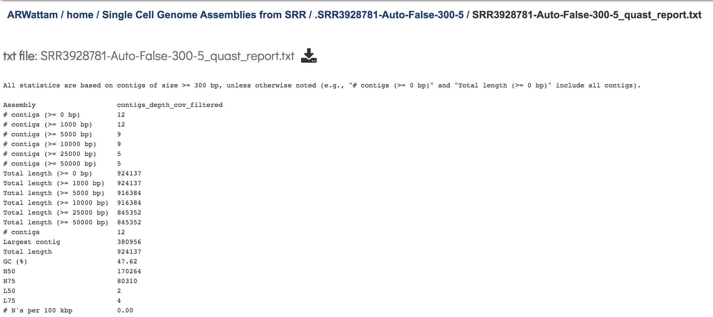

23. A JSON file is a file that stores simple data structures and objects in JavaScript Object Notation (JSON) format, which is a standard data interchange format. It is primarily used for transmitting data between a web application and a server.  While it is not recommended for viewing (it is a computer-readable file), the file is both downloadable and viewable.
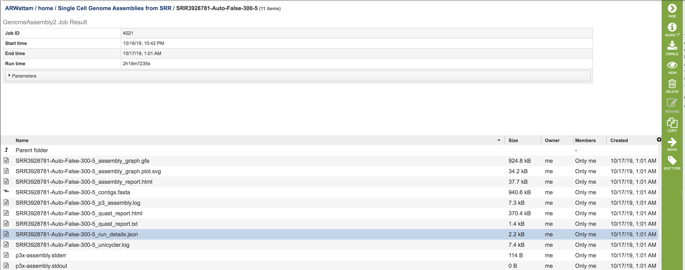

24. Unicycler provides a log file for each time it is run.  While it is not recommended for viewing, the file is both downloadable and viewable. Similarly, the p3x-assembly.stderr and p3x-assembly.stout are provided, but not generally examined.
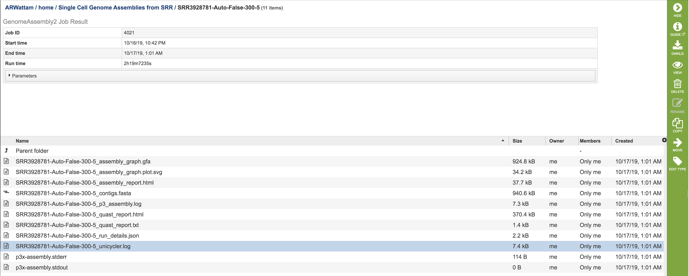

## References

1.	Wick, R.R., et al., Unicycler: resolving bacterial genome assemblies from short and long sequencing reads. PLoS computational biology, 2017. 13(6): p. e1005595.
2.	Bankevich, A., et al., SPAdes: a new genome assembly algorithm and its applications to single-cell sequencing. Journal of computational biology, 2012. 19(5): p. 455-477.
3.	Koren, S., et al., Canu: scalable and accurate long-read assembly via adaptive k-mer weighting and repeat separation. Genome research, 2017. 27(5): p. 722-736.
4.	Nurk, S., et al., metaSPAdes: a new versatile metagenomic assembler. Genome research, 2017. 27(5): p. 824-834.
5.	Antipov, D., et al., plasmidSPAdes: assembling plasmids from whole genome sequencing data. bioRxiv, 2016: p. 048942.
6.	Krueger, F., Trim Galore: a wrapper tool around Cutadapt and FastQC to consistently apply quality and adapter trimming to FastQ files, with some extra functionality for MspI-digested RRBS-type (Reduced Representation Bisufite-Seq) libraries. URL http://www. bioinformatics. babraham. ac. uk/projects/trim_galore/.(Date of access: 28/04/2016), 2012.
7.	Vaser, R., et al., Fast and accurate de novo genome assembly from long uncorrected reads. Genome research, 2017. 27(5): p. 737-746.
8.	Walker, B.J., et al., Pilon: an integrated tool for comprehensive microbial variant detection and genome assembly improvement. PloS one, 2014. 9(11): p. e112963.
9.	Wick, R.R., et al., Bandage: interactive visualization of de novo genome assemblies. Bioinformatics, 2015. 31(20): p. 3350-3352.
10.	Gurevich, A., et al., QUAST: quality assessment tool for genome assemblies. Bioinformatics, 2013. 29(8): p. 1072-1075.

