# Creating Genome Groups

## I. Creating a group using PATRIC’s Global Search
1. Enter the word(s) or numbers of interest in the search box and hit enter.

2. This will return a page that shows the results of that search, divided into Genomes, Genome Features, Taxonomy, Transcriptomics Experiments and Specialty Genes.  To find the genomes that match the text entered, click on the number that follows the word Genomes (at either location, as indicated by the Red Arrows).
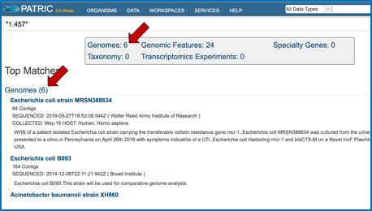

3. Clicking on the number opens a new page that shows the list of genomes that match the search term.
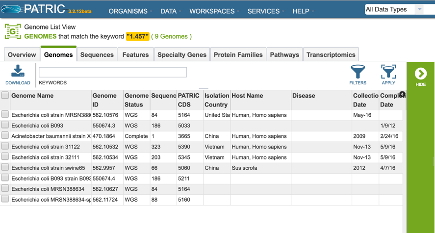

4. Clicking on the box in front of Genome Name will select all of the genomes (Red Arrow), or they can be selected individually.  Once a genome is selected, the green banner on the right becomes populated with icons that show next steps that can be taken.  To create a group of the selected genomes, click on the Group icon (Blue Arrow). 
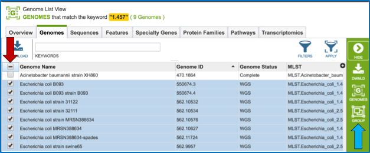

5. This will open a pop-up widow where the selected genomes can be added to an existing group, or to a new group.  The create a new group, click on the blue arrow that follows the text box that says Existing Group (Red Arrow).  This will open a drop down box (Blue Arrow) where New Group should be selected (Green Arrow).
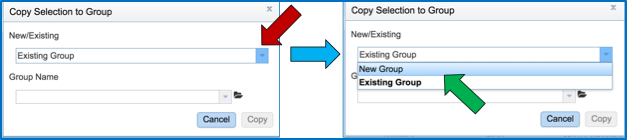

6. Enter the desired name for the new group in the text box under the words Group Name (Red Arrow) and then click the blue Copy button (Blue Arrow).  This will create a group of the selected genomes with the name that was entered.
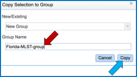

## II. Creating a group with public and private genomes by taxonomy
1. To find genomes within a specific taxonomy, search for the taxon name using global search.  If the genomes belong to one of the NIAID genera of category A, B or C pathogens, click on the Organism tab and select a genus of interest (Red Arrow).

    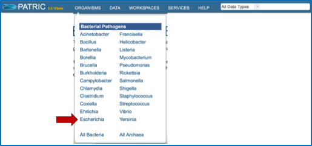 

2. This opens the landing page for the genus.
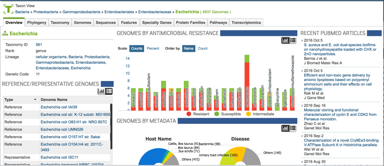

3. To find specific genomes, click on the Genomes tab at the top of the page (Red Arrow).
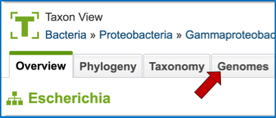

4. This will open a page with a list of all the genomes available in PATRIC for that genus.
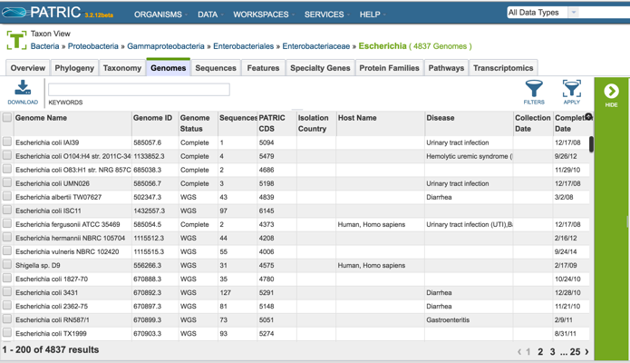

5. One of the ways to find specific genomes, especially when a genus has hundreds or thousands of genomes, is to use the text box at the top of the page (Red Arrow).  Enter the desired text to identify specific genomes and hit return.
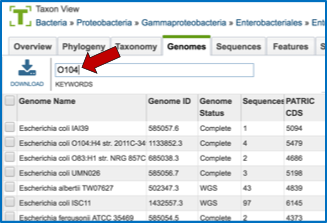

6. This will return a page that lists all the genomes in that genus that has that specific text, somewhere in its record.  It can be part of the name of the genome, or it could be part of the description that was entered when the genome was originally submitted to GenBank.  To create a group of these genomes, they must first be selected.  To do this, click on the box in front of Genome Name at the top of the table on the left (Red Arrow). This will select all the genomes in the table.

    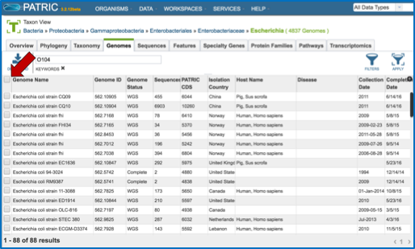

7. Once the genomes are selected, the green banner on the right becomes populated with icons that show next steps that can be taken.  To create a group of the selected genomes, click on the Group icon (Red Arrow).
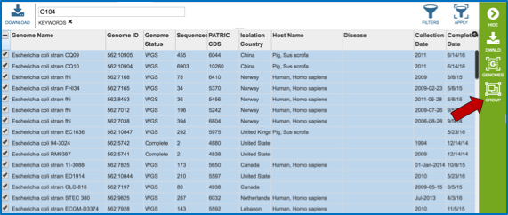

8. This will open a pop-up widow where the selected genomes can be added to an existing group, or to a new group.  The create a new group, click on the blue arrow that follows the text box that says Existing Group (Red Arrow).  This will open a drop down box (Blue Arrow) where New Group should be selected (Green Arrow).

9. Enter the desired name for the new group in the text box under the words Group Name (Red Arrow) and then click the blue Copy button (Blue Arrow).  This will create a group of the selected genomes with the name that was entered.
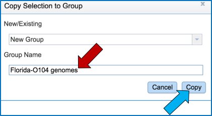

## III.  Creating a genome group from a collection of genes
1. Sometimes researchers are starting with a particular gene, and they are interested in finding all the genomes that have that gene present.  Furthermore, they might want to create a group of those genomes to see if there are any other characteristics that they share.  To find a specific gene, enter a name, gene symbol, or other identifier into the global search box.

2. This will return a page that shows the results of that search, divided into Genomes, Genome Features, Taxonomy, Transcriptomics Experiments and Specialty Genes.  To find the genes that match the text entered, click on the number that follows the word Genomic Features (at either location, as indicated by the Red Arrows).
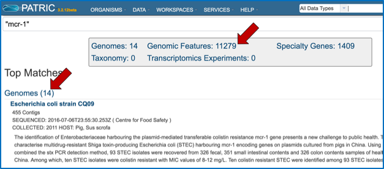

3. Clicking on the number opens a new page that shows the list of genes, or genomic features that match the search term.
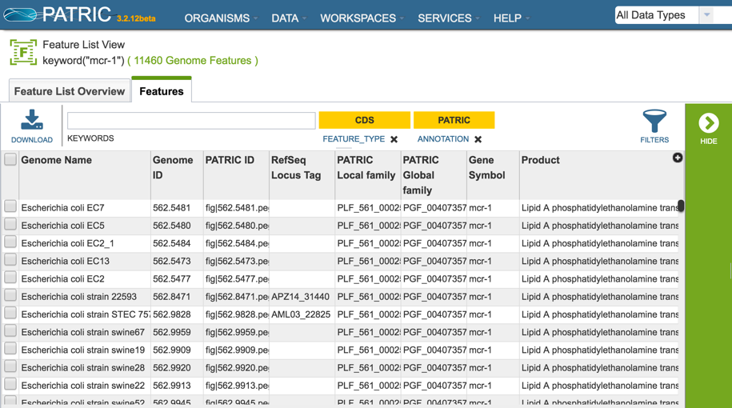

4. To further refine the search, perhaps by finding the protein family that has that genes as a member, an individual gene must be looked at.  To do this, click on the check box in front of one of the genome names (Red Arrow).  This will populate the green banner on the right becomes populated with icons that show next steps that can be taken.   To find more information on that gene, click on the Feature icon (Blue Arrow).
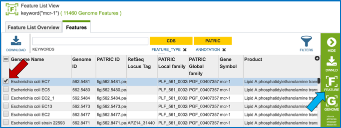

5. This opens a page that summarizes all the data integrated into PATRIC for that gene.  To examine the protein family that it belongs to, click on the hyperlink for the protein family that is built across the genus that the particular genome belongs to (Green Arrow).
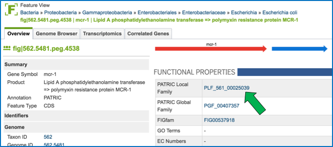

6. This will open a page that shows all the genes in that protein family, and all the genomes that they belong to.  Clicking on the box in front of Genome Name (Red Arrow) will select all of the genes.  This is the first step to creating a genome group.

    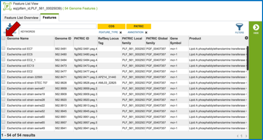

7. Once all the genes are selected, the green banner on the right becomes populated with icons that show next steps that can be taken.   To create a genome group, click on the Genomes icon (Blue Arrow).
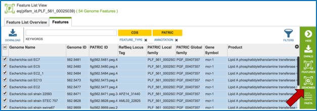

8. This is necessary for creating a genome group.  This opens a page that shows the genomes (the genes are no longer visible).  To create a group of the genomes that had genes in that specific protein family, click on the check box in front of one of the genome names (Red Arrow).  
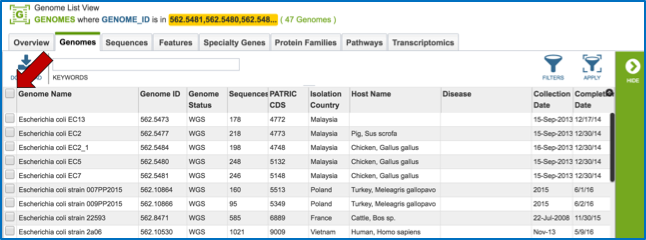

9. This will populate the green banner on the right becomes populated with icons that show next steps that can be taken.   To create a group of the selected genomes, click on the Group icon (Red Arrow).
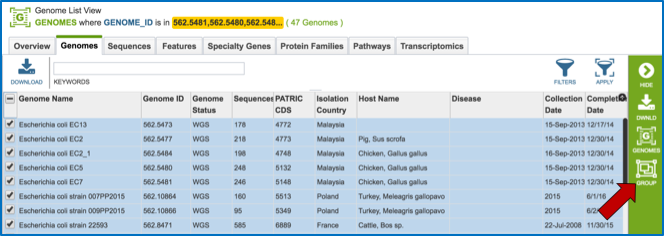

10. This will open a pop-up widow where the selected genomes can be added to an existing group, or to a new group.  The create a new group, click on the blue arrow that follows the text box that says Existing Group (Red Arrow).  This will open a drop down box (Blue Arrow) where New Group should be selected (Green Arrow).

11. Enter the desired name for the new group in the text box under the words Group Name (Red Arrow) and then click the blue Copy button (Blue Arrow).  This will create a group of the selected genomes with the name that was entered.
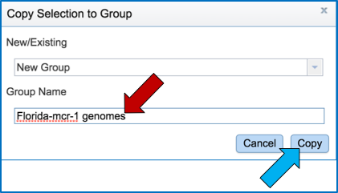

