=========================
 Analyzing Genome Quality
=========================

Introduction
============

Genome quality analysis is automatically performed when :doc:`/tutorial/metagenomic_binning/metagenomic_binning`
or :doc:`/tutorial/genome_annotation/annotation`.

The genome quality tools look at the functional roles present in an annotated genome to determine if the genome looks correct.
Two separate mechanisms are used to predict the number of times each role should be found in the genome. A role is *good* if it
occurs the predicted number of times; otherwise it is *problematic*.

The first quality tool (**EvalG**) checks the *completeness* and *contamination* of the genome using a re-implementation of the
`checkM algorithm <http://genome.cshlp.org/content/early/2015/05/14/gr.186072.114>`__ described
in the paper

        Parks DH, Imelfort M, Skennerton CT, Hugenholtz P, Tyson GW.
        2014.  Assessing the quality of microbial genomes recovered from
        isolates, single cells, and metagenomes.  Genome Research, 25:
        1043-1055.

EvalG identifies *universal roles* that are expected to occur exactly once in all genomes
of a particular taxonomic grouping. Missing roles indicate the genome is less complete; extra roles indicate the genome may be
contaminated.

The second quality tool (**EvalCon**) checks the *consistency* of the genome annotation. Over 1300 roles that have a predictable relationship
to other roles were identified by a machine learning process. EvalCon determines how many instances of each role
are expected given the list of other roles in the genome. If a role in the genome is unexpected, or an expected role is missing,
this is considered *coarse inconsistency*. If a role occurs a different number of times than predicted, this is
*fine inconsistency*.

The four numbers-- *completeness*, *contamination*, *coarse consistency*, and *fine consistency*-- express measures of the quality of the
genome. **EvalG** and **EvalCon** tell us not only the numbers, but also identify the problematic roles that occur an unexpected number of times.
The preceding are summarized in the Quality Report web page. The report is divided into three sections-- the `Summary Section`_ that
describes the genome itself, the `Problematic Roles Report`_ that lists the roles whose expected and actual occurrence numbers
do not match, and the `Contig Report`_ that lists the contigs containing problematic roles.

The Genome Quality Report
=========================

Summary Section
---------------

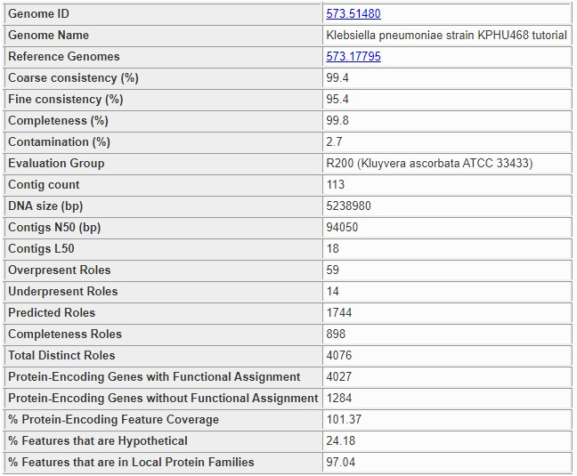

The summary section at the top of the page contains basic information about the whole genome. The following information is presented.

Genome ID:
    This is the PATRIC ID number of the genome being analyzed. The link takes you to the main :doc:`/user_guides/organisms_genome/overview`
    for the genome.

Genome Name:
    The name assigned to the genome. This is the official name for a public genome, or the name assigned during annotation for a private genome.
    It almost always includes the species name. A name ending in *clonal population* means the genome was created by the binning service.

Reference Genomes:
    Normally, this is the ID of the highest-quality genome of the same species or genus. If it is blank, then either no quality genomes were
    found, or the genome itself is the one that would be normally chosen for this species. If the genome was produced by the binning service,
    then the genome is the closest genome believed to be of the same species. There may be multiple genomes listed for a binning result genome
    in rare circumstances. The reference genomes are always public PATRIC genomes, and the links lead to each genome's main page.

Coarse Consistency:
    This is the percentage of roles whose presence or absence was correctly predicted by EvalCon. A higher number indicates the genome annotation
    is more self-consistent. A lower number means the genome annotation is less self-consistent.

Fine Consistency:
    This is the percentage of roles whose exact number of occurrences was correctly predicted by EvalCon. A higher number indicates the genome is
    more self-consistent. A lower number means the genome is less self-consistent. This number is always less than or equal to the coarse consistency.
    The roles whose predicted and actual numbers did not match will all appear in the `Problematic Roles Report`_.

Completeness:
    This is the percentage of universal roles that appeared in the genome. A higher number indicates the genome is more complete. A lower number
    indicates that roles normally in this taxonomic grouping are missing. The missing roles will be listed in the `Problematic Roles Report`_ with
    the notation **Universal Role**. If the genome is not a Bacteria or Archaea, this number will always be 0.

Contamination:
    This is an estimate of the percentage of the genome's DNA that does not belong, computed by locating universal roles that occur more than once.
    A higher number indicates the genome is contaminated. A lower number indicates the genome is relativaely clean. Unlike the other three numbers, this one
    is better when it is lower. The roles with extra occurrences will be listed in the `Problematic Roles Report`_ with the notation **Universal Role**.
    If the genome is not a Bacteria or Archaea, this number will always be 100.

Evaluation Group:
    This is the taxonomic grouping that was used by EvalG to determine the universal roles. The smaller this grouping, the more accurate the completeness
    and contamination will be.

Contig Count:
    The number of contigs in the genome. For a given assembly size, a lower number indicates a better-quality assembly.

DNA size (bp):
    The number of base pairs in the genome. This number provides context for the N50.

Contigs N50 (bp):
    The number of base pairs in the smallest contig such that half of the genome's DNA is in contigs of this size or larger. The closer this number is to the DNA
    size in a bacterial or archaeal genome, the better the quality of the assembly.

Overpresent Roles:
    The number of roles that were found too many times. All of the roles in this set will be listed in the `Problematic Roles Report`_.

Underpresent Roles:
    The number of roles that were found too few times. All of the roles in this set will be listed in the `Problematic Roles Report`_.

Predicted Roles:
    The total number of roles that were examined by either EvalG or EvalCon. EvalCon uses a set of roughly 1300 roles. EvalG uses between 60 and 2000 roles
    depending on the taxonomic grouping chosen. The two sets frequently overlap.

Problematic Roles Report
------------------------

The **Problematic Roles Report** is the heart of the genome quality report. The main table lists all the roles whose predicted number of occurrences was different
from the actual number, along with an analysis of the individual features implementing those roles. Below you can see a sample report table for a genome with six
problematic roles. It should be noted that not all these roles represent errors in the genome or its annotation, they merely indicate features that should be
examined more closely.

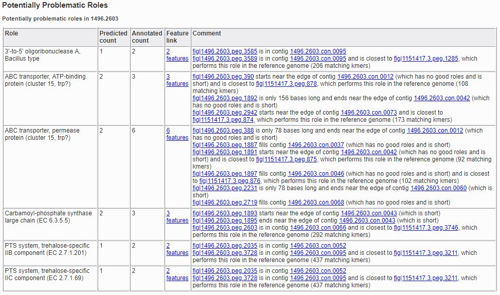

The report has five columns.

Role:
    The description of the functional role that is potentially problematic. This corresponds to the value of the *Product* column on the
    :doc:`/user_guides/organisms_taxon/features`.

Predicted Count:
    The number of features implementing the role, as predicted by the quality tools.

Annotated Count:
    The actual number of features annotated as implementing the given role.

Feature Link:
    A link for viewing the features implementing the role. If there are no such features, no link will be present. If there is a single feature implementing the role,
    the link will go to that feature's :doc:`/user_guides/organisms_gene/overview`. If there are multiple feature's implementing the role, the link will
    go to a :doc:`/user_guides/organisms_taxon/features` listing all the features.

Comment:
    The comment contains text designed to help you determine why the role is problematic. There are numerous items that can appear in here, and they will be
    discussed below.

Types of Comments
*****************

Universal Role
++++++++++++++

If the comment includes **Universal Role**, then the role is considered a universal role for the genome's taxonomic grouping by EvalG: that is, it is expected to occur
exactly once. Universal roles are used to compute the completeness and contamination scores.

Basic Present-Feature Comments
++++++++++++++++++++++++++++++

If a feature is present in the genome, a comment will tell you about the contig in which it was found. The simplest present-feature comment looks like this.

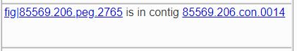

The link on the feature ID takes you to the :doc:`/user_guides/organisms_gene/compare_region_viewer` for the feature, which allows you to see the feature in
context and how that context compares to other genomes that have similar proteins. The link on the contig ID takes you to a :doc:`/user_guides/organisms_gene/compare_region_viewer`
for all the features in the contig.

Short features sometimes indicate that the feature was incorrectly called. If the feature is 180 base pairs or less in length, this fact will be noted as shown below.

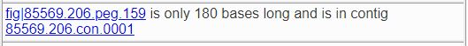

You will also be told if the contig is short if 70% or more of the DNA is in longer contigs, as shown below.

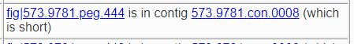

Our experience has shown that in genomes formed by binning metagenomic samples, short contigs are more likely to be placed in the wrong bin.
Another indication of contamination during binning is if there are no good roles in the contig; that is, all of the roles found for features
in the contig were problematic roles. This is a much looser criterion than the short-contig rule, since many of the features in the contig may
implement roles for which EvalG and EvalCon have no information.

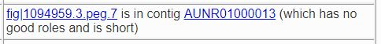

If the feature starts or ends near the edge of the contig, this is also noted in the comment.

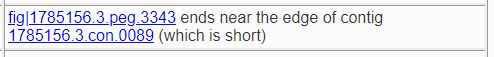

Advanced Comments When Reference Genomes Are Available
++++++++++++++++++++++++++++++++++++++++++++++++++++++

If a reference genome is available, the features implementing the role in the reference genome are extracted and compared, which can tell us when the quality tools are
giving us a false indication. In the example below, EvalCon predicted a single occurrence of the *LSU ribosomal protein L31p*, but two were found. We see from the comments,
however, that two instances of the role were found in the reference genome as well, and each one is close to a different feature in our genome. This correspondence tells
us that the role is very likely not a problem. In this case, the genome being evaluated is an instance of Vibro haemolyticus, one of a few species that has two versions
of `LSU ribosomal protein L31p`-- a version that is used when zinc is present and a version that is used when zinc is not present.

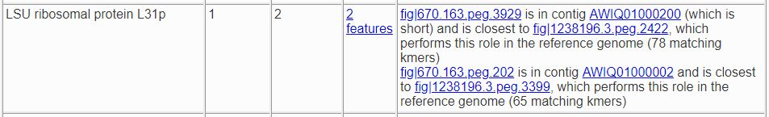

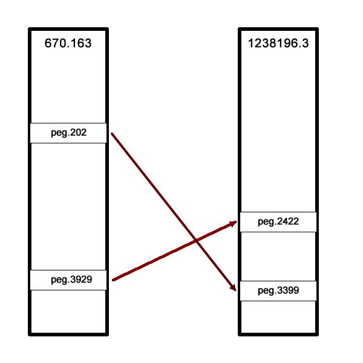

In this next example, only one of the two features had a correspondent in the reference genome. We presume this feature (``fig|610.163.peg.2490``) is good, while the
other one is suspicious.

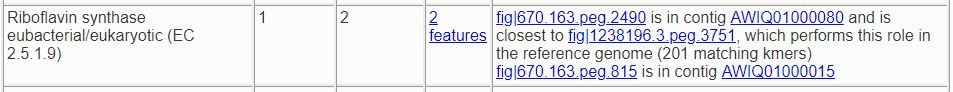

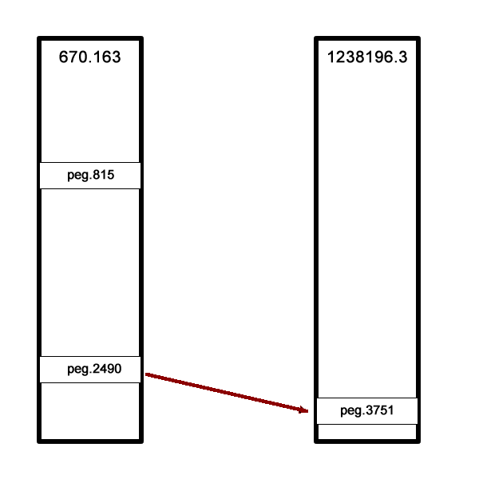

Sometimes there are fewer implementing features than expected. In the example below, there were three implementing features in the reference genome (the expected number)
but only two in our genome. The third feature has no similar proteins in our genome.

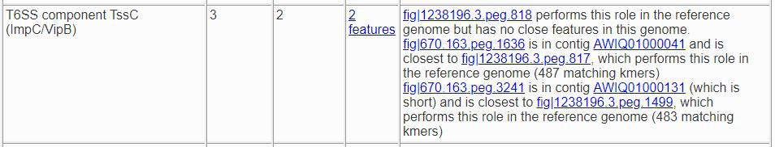

The reference genome comparison is especially useful when the role is not implemented in our genome. In the examples below, both roles were predicted to occur once. The
first role is not present in the reference genome, so we presume it is not a problem. The second one is found, so we presume its absence is suspicious.

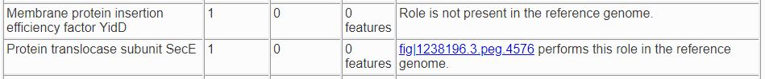

Sometimes an extra feature is present because a frame shift or an assembly error has split a gene in two. In the next example, one *TolA protein* was expected, but two were
found. One of them starts at the edge of a contig and the other ends at the edge of a contig. Only one implementation of the role was found in a reference genome, and it
is close to one of the features.

.. image:: images/split_feature.JPG

If you click on the feature links, you will be taken to the :doc:`/user_guides/organisms_gene/compare_region_viewer` for each feature, where the nature of the split is
obvious. ``fig|85569.206.peg.350`` matches the beginning of the protein, while ``fig|85569.206.peg.4875`` matches the end.

.. image:: images/compare_regions2.JPG

Contig Report
-------------

The Contig Report lists all of the contigs containing features that implement potentially problematic roles.

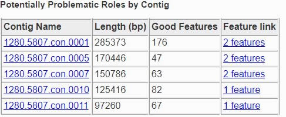

The four columns are as follows.

Contig Name:
    The name of the contig. This is its PATRIC ID normally, but may be its node identifier if the report was produced during binning. The link takes you to a list of
    all the features in the contig.

Length:
    The number of base pairs in the contig.

Good Features:
    The number of features implementing good roles, plus the features implementing problematic roles that have similar features in the reference genome. In a binning
    genome, good features are considered an indication that the contig was correctly placed.

Feature Link:
    Indicates the number of features implementing problematic roles. If there is only one, the link will take you to the feature's :doc:`/user_guides/organisms_gene/overview`.
    If there is more than one, the link will take you to the :doc:`/user_guides/organisms_taxon/features` for the features in question.

