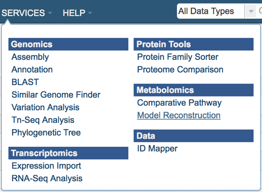
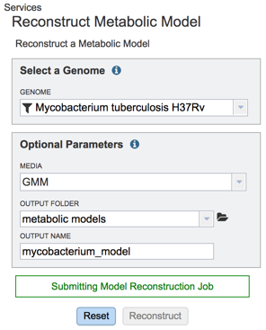
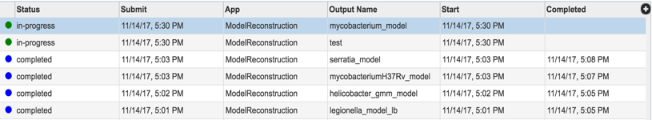
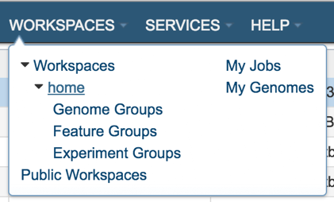
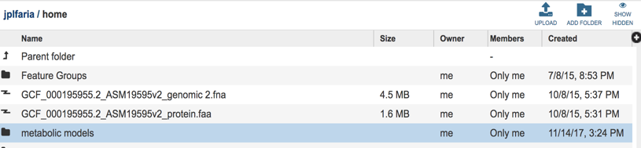
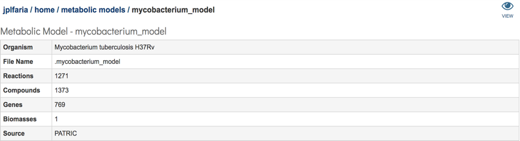
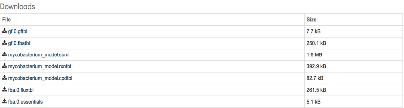

# Metabolic Model Reconstruction

## Constructing a genome scale metabolic model of bacteria: What is the metabolic capability of bacteria?

A genome-scale metabolic network of chemical reactions occurring within a living organism is primarily reconstructed from protein functional annotations originally derived from literature and subsequently propagated from genome to genome by sequence similarity. When a genome is functionally annotated, its metabolic genes are mapped onto biochemical reactions. This information is integrated with data on reaction stoichiometry, subcellular localization, biomass composition, estimation of energy requirements (directionality of reactions), and other constraints into a detailed stoichiometric model of metabolism. This model can be subsequently used for detailed analysis of the metabolic potential of the organism using constraint-based modeling approaches such as Flux Balance Analysis (FBA)[1]. So what you can do with metabolic models? Using metabolic models we are able address important biological questions such as: 1.) Can the organism grow on a certain media formulation? 2.) What is the minimal media condition for particular strain? 3) Can an organism be optimized to produce an important biofuel or a medically important drug molecule? What biochemical pathways being utilized when grown under certain environment?

The model construction methodology in PATRIC is primarily based on the Model SEED framework[2] and the RAST genome annotation pipeline[3]. Biochemistry data used in the model construction pipeline have been gathered from multiple published metabolic models and from public databases such as KEGG, MetaCyc, EcoCyc, Plant BioCyc, Plant Metabolic Networks, and Gramene. Currently, the biochemistry database in PATRIC includes more than 13,000 biochemical reactions and over 16,000 metabolic compounds. 

## Model construction and analysis workflow in PATRIC involves following steps:

1.	Reconstruction of metabolic model based on the genome annotations
2.	Fill the gaps in the metabolic network (Gapfilling)[4] based on a specific media condition (e.g Glucose minimal media)
3.	Simulate FBA in specified media condition 
4.	Simulate single gene knockouts and predict essential genes in specified media condition
5.	Create downloadable files for viewing flux profile, gapfill reactions, essential genes, SBML version of the model, model reactions and compounds.

## Here are the steps in constricting a genome scale metabolic model in PATRIC:

1.	Login to the PATRIC website so that you can use your workspace in the downstream analysis.

2.	On the PATRIC homepage (patricbrc.org), open the SERVICES dropdown in the navigation bar at the top of the page.

3.	Using the dropdown menu that appears click on Model Reconstruction. (Underlined in the picture below).

4.	This will open up the model reconstruction app where user will select:
  - Genome – select a genome from a drop-down list of publically available genomes (Reference, Representative or All Public Genomes) or from your private genome (My Genomes) where a model will be constructed.

  

  - Media - select a predefined media formulation from a dropdown list of media formulations that this model be *gapfilled and simulated FBA. (e.g GMM – Glucose Minimal Media, NMS- Nitrate Mineral Salts Medium, LB - Luria-Bertani Medium) 
  - Output Folder – select an existing workspace folder or create a new one. Your model will be located on this folder. 
  - Output Name – A user given output name for the newly constructed metabolic model.

  *Gapfilling - Draft metabolic models usually have missing reactions (gaps) due to incomplete or incorrect functional genome annotations. As a result, these models are unable to generate biomass on media where the organism typically is capable of growing. Gapfilling algorithms can be used to overcome this problem. These algorithms tentatively fill metabolic gaps by identifying the minimal number of biochemical reactions to add to the draft metabolic model to enable it to produce biomass in a specified media. Gapfilling is an optimization procedure that can produce multiple solutions.

  As an example, for this tutorial we decide for to use the following parameters:

  - Genome – Mycobacterium tuberculosis H37Rv (as the suggested by the e.g. tooltip in the input field).
  - Media – Glucose Minimal Media (GMM).
  - Output Folder – We created a folder named “metabolic models”.
  - Output Name – We named our model “mycobacterium_model”.

5. Upon selecting the fields click the ‘Reconstruct’ button to construct your metabolic model. You will notice the ‘Model Reconstruction Job has been started’ message in green at the bottom of the app suggesting you have successfully submitted the model reconstruction app.

 6. Now you started the model reconstruction job, you can view the status of this job and any previous jobs by clicking the jobs icon at the bottom right corner of the page. This page provides a summary of jobs that are queued, started, in progress and completed.

7. Now you have constructed a new metabolic model from your selected genome, you can explore the details of the metabolic model such as reactions and compounds. Your newly constructed model will be stored in ‘metabolic models’ folder in your workspace.  To navigate to your model folder click the WORKSPACES the navigation bar at the top and navigate to your home (underlined in the picture below) folder.

8. Upon selecting WORKSAPCES:home you will see multiple folders appear in your screen including ‘models’ folder where your models are stored (Highlighted with dark blue).

9. Select the ‘metabolic models” folder, you can find all of your metabolic model files listed by the user assigned names.

10.	Select the desired model by clicking on the model file, in this case “mycobacterium_model”. A table will be displayed consisting of a summary of model information consisting of organism name, number of genes, reactions, compounds and biomass equations in the model.

Additionally, a download section is available where all model relevant data can be downloaded. This section consists of a total of 7 files:

1.	gf.0.gftbl – Gapfill reactions table. This table contains the list of the reactions added to the model by the gapfilling algorithm during reconstruction.
2.	gf.0.fbatbl – FBA flux distribution for the gapfilling simulation.
3.	mycobacterium_model.sbml – The model in SBML format.
4.	mycobacterium_model.rxntbl – The list of all reactions in the model.
5.	mycobacterium_model.cpdtbl – The list of all compounds in the model.
6.	fba.0.fuxtbl -  FBA flux for all model reacttions.
7.	fba.0.essentials – List of genes in the model characterized as essential by the FBA simulation in the specified media.

11.	In addition, users can explore the metabolic model in detail by a user-friendly searchable table by clicking the ‘eye’ sign that appears on the top right corner of the page.

12.	This will open the ModelSEED model viewer consisting¬ of multiple tabs representing Reactions, Compounds, Genes, Compartments of the model and the weighted components of the Biomass. Each column in the table is sortable by clicking the heading of the column. Any information of the model is searchable by using a search bar that appears on the top left corner of the table.

## References

1.	Orth, J.D., I. Thiele, and B.O. Palsson, What is flux balance analysis? Nat Biotechnol. **28**(3): p. 245-8.
2.	Henry, C.S., et al., High-throughput generation, optimization and analysis of genome-scale metabolic models. Nat Biotechnol, 2010. **28**(9): p. 977-82.
3.	Overbeek, R., et al., The SEED and the Rapid Annotation of microbial genomes using Subsystems Technology (RAST). Nucleic Acids Res, 2014. **42**(Database issue): p. D206-14.
4.	Orth, J.D. and B.O. Palsson, Systematizing the generation of missing metabolic knowledge. Biotechnol Bioeng. **107**(3): p. 403-12.

