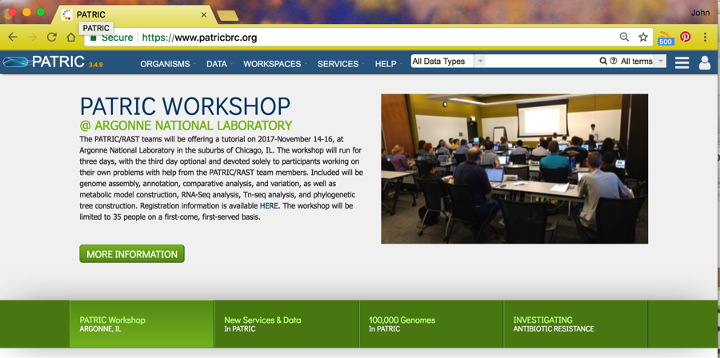
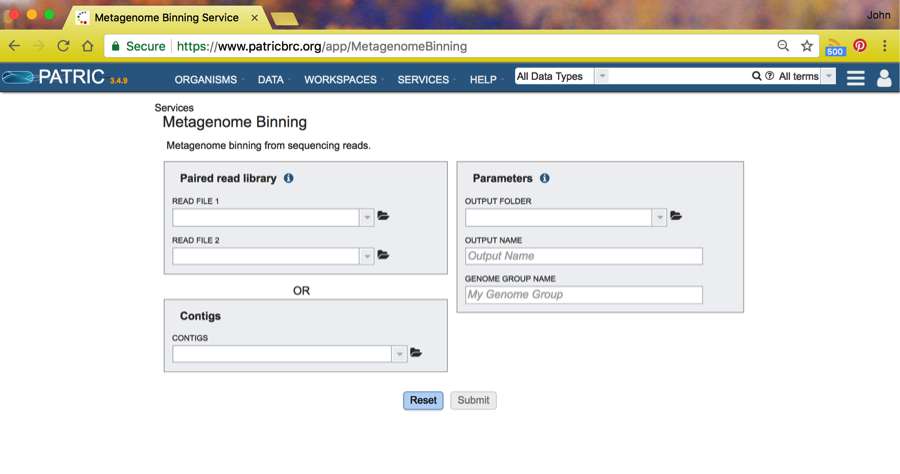
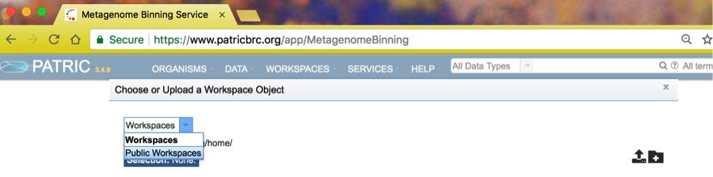
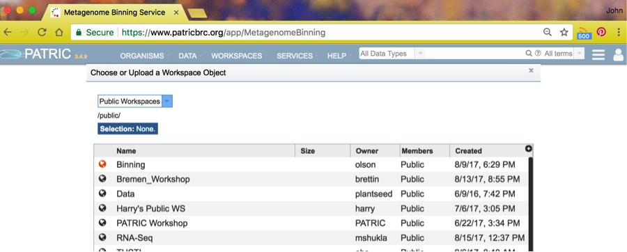
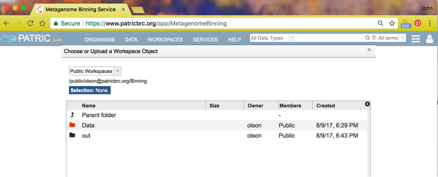
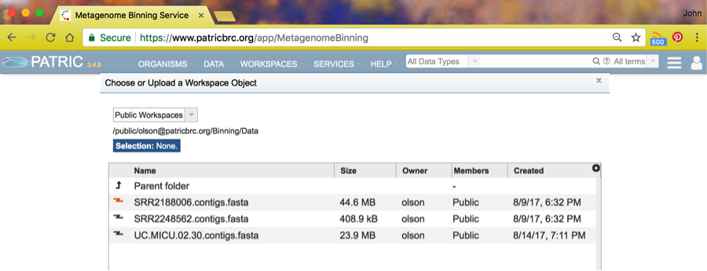
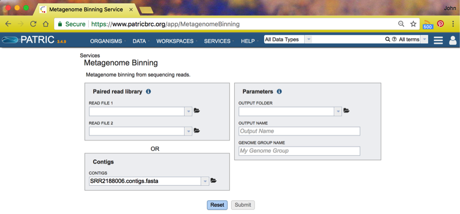
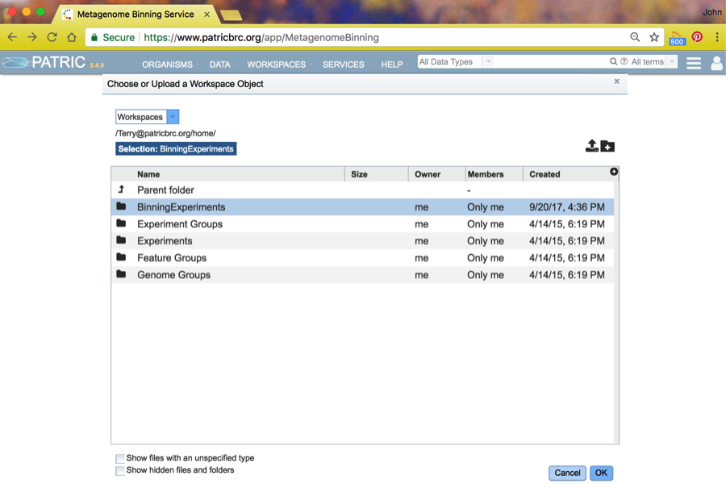
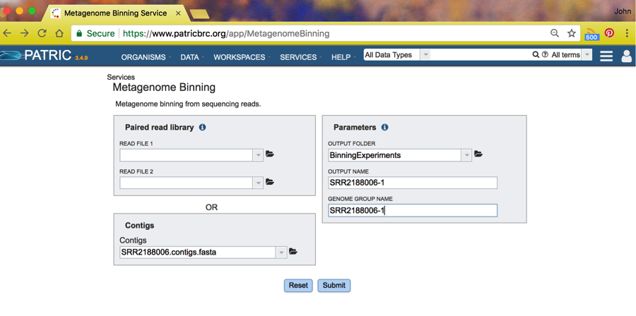
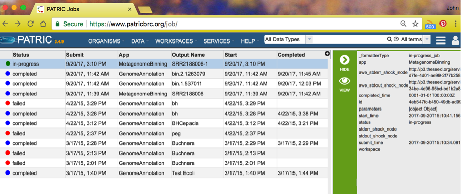

==============================================
 Using the PATRIC Metagenomic Binning Service
==============================================

Basic Steps
===========

1. Log in to the PATRIC web site with your PATRIC credentials.

2. Provide an input file.

3. Open the Binning Service

4. Run Binning

5. Examine Output

Log in to the PATRIC Website
----------------------------

See `Registration User Guide
<https://docs.patricbrc.org/user_guides/registration.html>`_ for information on logging in to the PATRIC website.
Once you are registered and logged in, you should see something like this:

Provide an input file
---------------------

Input to the Binning Service must be found in a PATRIC workspace. You
can upload files or use pre-existing files in your Workspace or
in other Workspaces available to you. See `Workspace User Guide
<https://docs.patricbrc.org/user_guides/workspaces/workspace.html>`_ for more information about using the PATRIC Workspaces.

You can supply paired reads for assembly,
or you can supply assembled contigs.

Open the Binning Service
------------------------

The binning service is found under *Services*. Click on *Services* and
find *Binning Service* in the dropdown. Click on that and you will see
the Binning Service page, like this:

For these tutorial purposes, we will assume you are using a set of
contigs found in a public workspace.

Start by clicking the folder symbol next to the contigs box. This will
open a Workspace browser.

Click on the Workspaces dropdown and choose Public Workspaces.

You will see a number of public workspaces. Choose the binning
workspace by clicking on the icon to the left of the name *Binning*.

Choose the *Data* folder

And finally, choose the dataset ``SRR2188006.contigs.fasta``.
This will then take you back to the Binning Service start page.

If you specify contigs as input, the coverage information is computed from
the contig IDs or comments. Inside the contig ID, we look for the keywords
``cov``, ``covg``, or ``coverage``. The coverage value is taken from the
following number, with an underscore expected as the separator. Thus,
a contig ID of ``NODE_20_LENGTH_8732_COV_21.5064_ID_287776`` would indicate
a coverage of 21.5064. Most assemblers produce contig IDs of this form.
We will also look for keywords in the comment field.
The keyword can be any of the above or the word ``multi``. The coverage number
should follow the keyword with an equal sign expected as a separator. Thus,
``coverage=21.5064`` in the comment would indicate a coverage of 21.5064.
If no coverage information can be found, a value of 50 is assumed for everything.

Next, choose an output folder by clicking on the folder icon next the
*Output Folder* choice. This will take you to the workspace browser
where you should choose whatever Workspace folder you like. In this
case, we have already created a folder named *BinningExperiments*, and
we will select it and click on OK.

This will return you to the Binning Service start page where you will
fill in the output file name and genome group name you want for this
run. We chose ``SRR2188006-1`` for both. These are the names of the
respective folders where you will find the result of the Binning run.

Click *Submit* and your job will start. To check on the progress of the
job, click on the Jobs icon in the lower right of your browser window:

The binning job will start annotation jobs, as you can see in the
above screenshot. The run we made previously today was job SRR218806
and spawned two annotation jobs. When all the spawned jobs are
complete, the Binning Service run is complete. Refresh your page to
see the updated status in the right-side panel.
