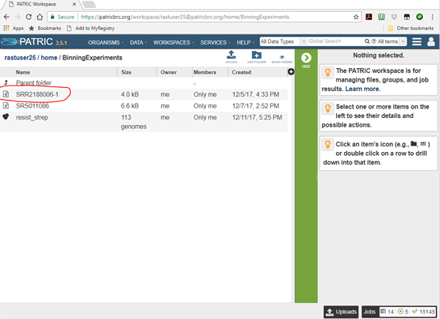
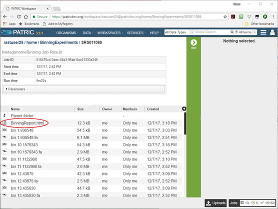
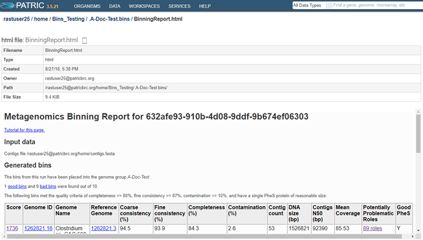
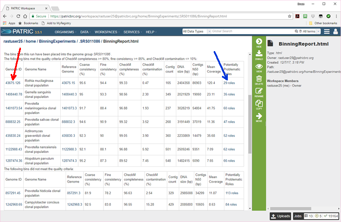
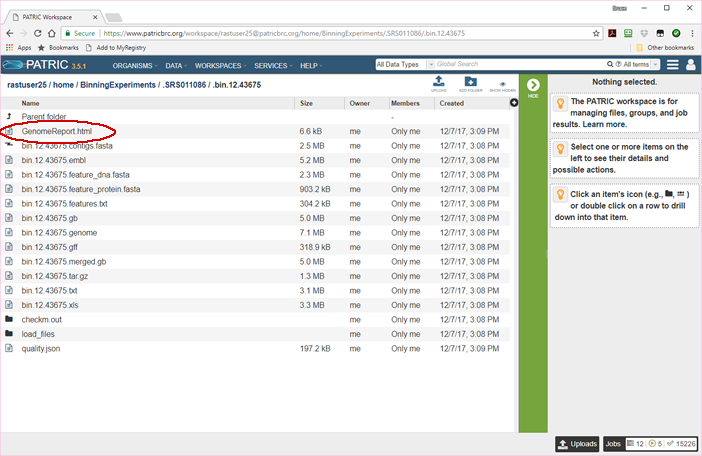
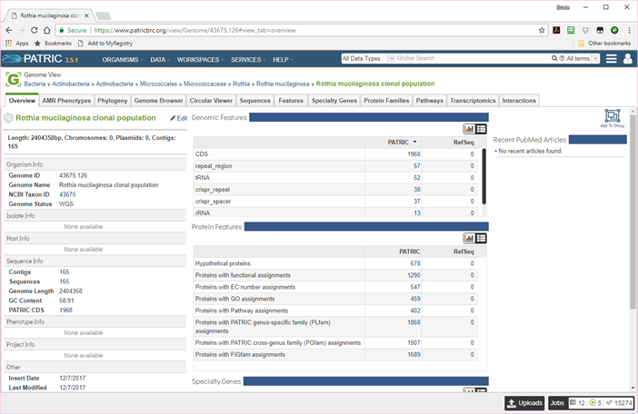

===============================
 Analyzing Your Metagenome Bins
===============================

Basic Steps
===========

1. Open the binning output directory in your workspace and look at the binning report.

2. View the individual bin reports.

3. View the bin as a genome in PATRIC.

The Binning Output Directory
----------------------------

Once all the binning jobs have completed, the output folder you selected will have a new
entry with the name you gave your binning output. In our tutorial example (see :doc:`metagenomic_binning`)
we specified an output folder of *BinningExperiments* and an output name of *SRR2188006-1*.
To get to it, click on *WORKSPACES* in the top bar of the PATRIC website and choose *home*.
Select the folder *BinningExperiments* and click on the folder icon. You will see a list of
the documents in that folder, as shown below. One of them will be ``SRR2188006-1``, the output
from our binning job.

Click on the document icon to open it, and you will see some overview information and a list of all
the bins.

For each bin, there is a FASTA file containing the bin's contigs (lightning bolt icon) and a
job result folder containing all the files produced in creating the bin (checkered flag icon).
There is also a single document named **BinningReport.html** at the top. This contains a list
of the bins, and is where you want to start your investigation of the results. Click on the
document icon next to it and the binning report will appear.

The top part of the page shows information about the binning job. Immediately below is a brief
description of the results.  The binning report shows all of the bins found by the PATRIC metagenome processor.
The bins are divided into two categories-- those of high quality (good) and those of questionable quality (bad).
Two internal PATRIC tools are used-- EvalG, which
computes completeness and contamination using marker roles, and EvalCon, which determines whether
the proteins found in the genome make sense together. A genome that is sufficiently complete (80%), with
sufficiently low contamination (10%), and sufficiently consistent proteins (87%) is considered *good* and
is shown in the first table.

Each bin occupies a single row in its respective table. The first, second, and last columns are hyperlinked. The
links in the first and last column (blue arrows) allow you to view the detail report on the bin.  The link in the
second column (red arrow) allows you to view the bin as a genome in PATRIC.

It is worth noting that each bin is created as a genome in your PATRIC workspace. When you perform queries
or use command-line tools, the bins show up in the results. All the tools available in PATRIC for working
with genomes can also be used to work with your bins.

The columns of the report are as follows.

:Score:
    A weighted sum of the completeness and consistency scores, less the contamination score. The contamination is
    weighted very heavily, so a highly contaminated bin may have a negative score. The maximum score is 2090 and
    the minimum score is -5000. The bins are sorted from the highest score to the lowest. Clicking on this number
    takes you to the detail report on the bin.
:Genome ID:
    The ID number assigned to the genome in PATRIC that represents the bin. Clicking on this number takes you
    to the genome.
:Genome Name:
    The name given to the bin. This is usually the species of the closest reference genome followed by the
    phrase *clonal population*.
:Reference Genome:
    The ID of the reference genomes used to create the bin. There is usually only one. Sometimes there are
    two, indicating that the bin represents multiple strains that could not be easily distinguished during
    the binning. Clicking on a reference genome ID takes you to its display page in PATRIC. The reference
    genomes are always publicly-available PATRIC genomes.
:Coarse consistency (%):
    The percent of predictable roles whose presence or absence matches the computations of the consistency tool.
    A high coarse consistency indicates the bin is either a single genome or a cluster of very close strains.
:Fine consistency (%):
    The percent of predictable roles whose number of occurrences matches the computations of the consistency tool.
    This number is always lower than the coarse consistency. A high fine consistency indicates a bin that can
    be treated like a functioning genome. A fine consistency of 87% is the minimum required for a bin to be
    considered a good genome.
:Completeness (%):
    The percent completeness of the bin. A completeness of 80% is the minimum required for
    a bin to be considered a good genome.
:Contamination (%):
    The percent of extra material in the bin. This is relative to the total size of the bin, so a value of
    20% means that we estimate 20% of the DNA to be improperly placed. A contamination of 10% is the maximum allowed for a bin
    to be considered a good genome.
:Contig count:
    The number of contigs from the assembled sample that were placed in the bin.
:DNA size (bp):
    The number of DNA base pairs in the bin.
:Contigs N50 (bp):
    A statistical measure of the relative contig sizes: a higher number indicates a better assembly. This is the size
    of the longest contig such that half of the base pairs are in contig this size or larger.
:Mean Coverage:
    The average coverage for contigs in the bin. If no coverage information was provided, this will be 50 for every
    bin.
:Potentially Problematic Roles:
    The number of roles that failed the consistency or completeness/contamination checks. Clicking on the numbers in
    this column takes you to the bin's detail report, which includes a list of the roles in question.
:Good PheS:
    ``Y`` if the bin contains a single PheS protein of reasonable size, otherwise blank. Because the PheS is used to
    identify the reference genomes of the bin, a questionable PheS protein is considered a serious problem with the
    bin.

To view an individual bin, click on the role count in the last column.

The Genome Report
-----------------

The bin report can be found by clicking in the *Potentially Problematic Roles* column of the master Binning Report. It can
also be found in the bin's individual folder under the name *GenomeReport.html*, as shown below.

You will probably never need to see the above page. Its primary utility is that it offers access to the bin in alternate
forms, such as General Feature Format (``bin.12.43675.gff``). It also contains FASTA files for all the features in the bin's
genome, both in DNA format (``bin.12.feature_dna.fasta``) and protein format (``bin.12.feature_protein.fasta``). But the
most important document is the first one, the bin's Genome Report. This is also what you see when you click in the
*Potentially Problematic Roles* or *Score* columns of the master Binning Report.
This report is described in :doc:`/tutorial/genome_quality_report/genome_quality_report`.

The Bin Genome
--------------

The binning service creates a private genome in your workspace for each bin. This genome is fully integrated into the database and
subject to all the analysis and query tools built into the PATRIC system. You can look for virulence factors, identify AMR genes,
and analyze pathways and protein families.

The following image shows the genome page for the a bin.

There will, of course, be no PUBMED articles or RefSeq annotations.  All of the sequences will be contigs. Nonetheless, you can list
and browse all the features, and both pathways and protein families are filled in. From this page, you can compare the bin to other
genomes, list the specialty genes, and submit the genome to any of the genome-based services available in PATRIC.