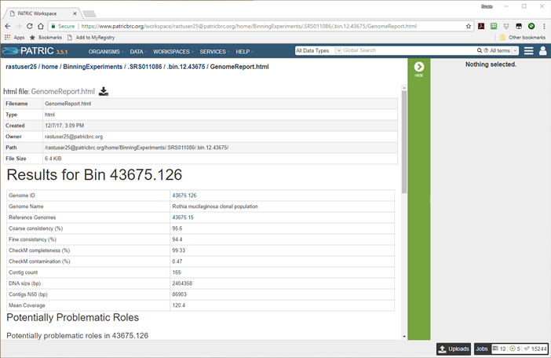
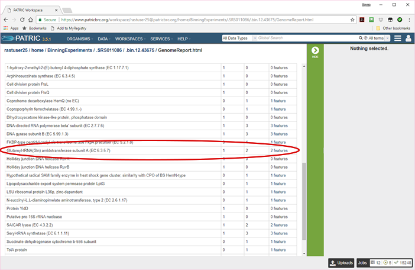
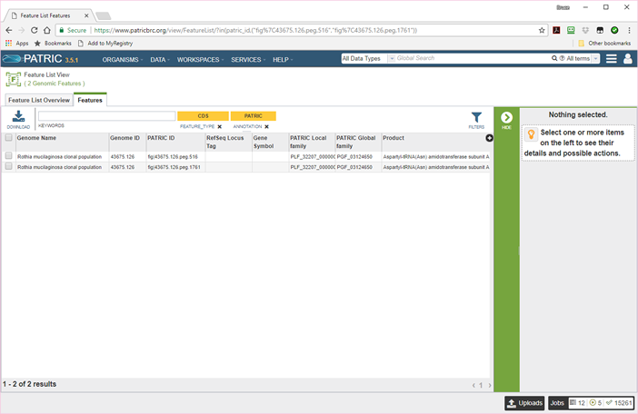

===============================
 Analyzing Your Metagenome Bins
===============================

Basic Steps
===========

1. Open the binning output directory in your workspace and look at the binning report.

2. View the individual bin reports.

3. View the bin as a genome in PATRIC.

The Binning Output Directory
----------------------------

Once all the binning jobs have completed, the output folder you selected will have a new
entry with the name you gave your binning output. In our tutorial example (see :doc:`metagenomic_binning`)
we specified an output folder of *BinningExperiments* and an output name of *SRR2188006-1*.
To get to it, click on *WORKSPACES* in the top bar of the PATRIC website and choose *home*.
Select the folder *BinningExperiments* and click on the folder icon. You will see a list of
the documents in that folder, as shown below. One of them will be ``SRR2188006-1``, the output
from our binning job.

.. image:: images/analysis-page-1.png

Click on the document icon to open it, and you will see some overview information and a list of all
the bins.

.. image:: images/analysis-page-2.png

For each bin, there is a FASTA file containing the bin's contigs (lightning bolt icon) and a
job result folder containing all the files produced in creating the bin (checkered flag icon).
There is also a single document named **BinningReport.html** at the top. This contains a list
of the bins, and is where you want to start your investigation of the results. Click on the
document icon next to it and the binning report will appear.

.. image:: images/analysis-page-3.png

The binning report shows all of the bins found by the PATRIC metagenome processor. The bins are
divided into two categories-- those of high quality (good) and those of questionable quality (bad).
Two tools are used-- CheckM <http://genome.cshlp.org/content/early/2015/05/14/gr.186072.114>, which
computes completeness and contamination using marker genes, and a PATRIC tool that determines whether
the proteins found in the genome make sense together. A genome that is sufficiently complete (80%), with
sufficiently low contamination (10%), and sufficiently consistent proteins (85%) is considered *good* and
is shown in the first table.

The consistency tool was produced by applying a machine learning algorithm to a database of close to a
thousand genomes whose annotations are known to be of high quality. For each role that had consistent
associations with other roles, a classifier was produced that could predict, based on the presence or
absence of the other roles, how many times the role should appear in the genome. The consistency numbers
indicate the percent of roles whose occurrence counts match the classifier predictions.

Each bin occupies a single row in its respective table. The first and last columns are hyperlinked. The
link in the first column (red arrow) allows you to view the bin as a genome in PATRIC. The link in the
last column (blue arrow) allows you to view the detail report on the bin.

It is worth noting that each bin is created as a genome in your PATRIC workspace. When you perform queries
or use command-line tools, the bins show up in the results. All the tools available in PATRIC for working
with genomes can also be used to work with your bins.

The columns of the report are as follows.

:Genome ID:
    The ID number assigned to the genome in PATRIC that represents the bin. Clicking on this number takes you
    to the genome.
:Genome Name:
    The name given to the bin. This is usually the species of the closest reference genome followed by the
    phrase *clonal population*.
:Reference Genome:
    The ID of the reference genomes used to create the bin. There is usually only one. Sometimes there are
    two, indicating that the bin represents multiple strains that could not be easily distinguished during
    the binning. Clicking on a reference genome ID takes you to its display page in PATRIC. The reference
    genomes are always publicly-available PATRIC genomes.
:Coarse consistency (%):
    The percent of predictable roles whose presence or absence matches the computations of the consistency tool.
    A high coarse consistency indicates the bin is either a single genome or a cluster of very close strains.
:Fine consistency (%):
    The percent of predictable roles whose number of occurrences matches the computations of the consistency tool.
    This number is always lower than the coarse consistency. A high fine consistency indicates a bin that can
    be treated like a functioning genome. A fine consistency of 85% is the minimum required for a bin to be
    considered a good genome.
:CheckM Completeness (%):
    The percent completeness of the bin as estimated by CheckM. A completeness of 80% is the minimum required for
    a bin to be considered a good genome.
:CheckM Contamination (%):
    The percent of extra material in the bin. This is relative to the material believed by CheckM to be the DNA
    that belongs, not relative to the entire bin. Thus, if one-sixth of the bin is considered to be a complete
    genome, the contamination will be a staggering 500%. A contamination of 10% is the maximum allowed for a bin
    to be considered a good genome.
:Contig count:
    The number of contigs from the assembled sample that were placed in the bin.
:DNA size (bp):
    The number of DNA base pairs in the bin.
:Contigs N50 (bp):
    A statistical measure of the relative contig sizes: a higher number indicates a better assembly. This is the size
    of the longest contig such that half of the base pairs are in contig this size or larger.
:Mean Coverage:
    The average coverage for contigs in the bin. If no coverage information was provided, this will be 50 for every
    bin.
:Potentially Problematic Roles:
    The number of roles that failed the fine-consistency check. Clicking on the numbers in this column takes you to the
    bin's detail report, which includes a list of the roles in question.

The bins are roughly sorted from highest quality to lowest. For the purposes of the sort, the quality is equal to 1.2
times the fine consistency plus the completeness minus five times the contamination.

To view an individual bin, click on the role count in the last column.

The Genome Report
-----------------

The bin report can be found by clicking in the *Potentially Problematic Roles* column of the master Binning Report. It can
also be found in the bin's individual folder under the name *GenomeReport.html*, as shown below.

.. image:: images/analysis-page-4.png

You will probably never need to see the above page. Its primary utility is that it offers access to the bin in alternate
forms, such as General Feature Format (``bin.12.43675.gff``). It also contains FASTA files for all the features in the bin's
genome, both in DNA format (``bin.12.feature_dna.fasta``) and protein format (``bin.12.feature_protein.fasta``). But the
most important document is the first one, the bin's Genome Report. This is also what you see when you click in the
*Potentially Problematic Roles* column of the master Binning Report. The top section looks like this.

Here the information about the bin from the master Binning Report is recapitulated. Included are the genome ID, the genome name,
the reference genome, the DNA and contig counts, the coverage, and the various quality measures. Clicking on the genome ID takes
you to the PATRIC genome page for the fully-annotated genome constructed from the bin. Clicking on the ID of the reference genome
takes you to its genome page.

Below this summary is the list of potentially problematic roles. These are roles that occurred too frequently or too rarely in the
genome's annotations. Looking at these roles can help you to understand potential problems with the binning. The image below shows
a section in the middle of the report for the above bin.

The first column contains a role description, the second contains the number of times that role is expected to occur, and the
third contains the number of times the role actually occurs. The fourth column contains a link. If the role occurred at least
once, you can click on the link to view the features in question. So, for example, we see that the role **Glutamyl-tRNA(Gln) amidotransferase subunit A (EC 6.3.5.7)**
should occur only once, but was found two times in the genome. If we click on the link, we will see the two features in the
genome on a standard PATRIC feature list page.

Here we see the two features, but it doesn't tell us a lot. To get more details, simply select one of the features and all of its
details will appear in the side panel, as shown below.

.. image:: images/analysis-page-8.png

Here you can see the feature's position on the contig, its length, and the start of its DNA and AA sequences. If we look at both
of these features closely, we see that they are on different contigs, both are at the very end, one is on the plus strand, and
one is on the minus strand. Further, the one on the minus strand is missing a start codon.  The DNA length of the feature with
this role in the reference genome is 1605. The lengths in the bin genome are 1113 and 516. We can therefore conclude that the two
features are very likely broken pieces of a single protein that were not stitched together during assembly.

After we have learned everything we want to know about the problematic roles in the bin, we click on the bin genome ID at the
top of this report and look at the bin genome in PATRIC itself.

The Bin Genome
--------------

The binning service creates a private genome in your workspace for each bin. This genome is fully integrated into the database and
subject to all the analysis and query tools built into the PATRIC system. You can look for virulence factors, identify AMR genes,
and analyze pathways and protein families.

The following image shows the genome page for the above bin.

.. image:: images/analysis-page-9.png

There will, of course, be no PUBMED articles or RefSeq annotations.  All of the sequences will be contigs. Nonetheless, you can list
and browse all the features, and both pathways and protein families are filled in. From this page, you can compare the bin to other
genomes, list the specialty genes, and submit the genome to any of the genome-based services available in PATRIC.