:github_url: https://github.com/PATRIC3/p3_docs/blob/master/docroot/tutorial/metagenomic_read_mapping/metagenomic_read_mapping.rst

========================
Metagenomic Read Mapping
========================

The Metagenomic Read Mapping Service uses KMA(k-mer alignment), [1] to align reads against antibiotic resistance genes or virulence factors. KMA maps raw reads directly against these databases, and uses k-mer seeding to speed up mapping and the Needleman-Wunsch algorithm to accurately align extensions from k-mer seeds.  Software for KMA was downloaded at the following location: https://bitbucket.org/genomicepidemiology/kma

I.  Locating the Metagenomic Read Mapping  Service App
-------------------------------------------------------

1. At the top of any PATRIC page, find the Services tab.

.. image:: images/Picture1.png

2. Click on Metagenomic Read Mapping.

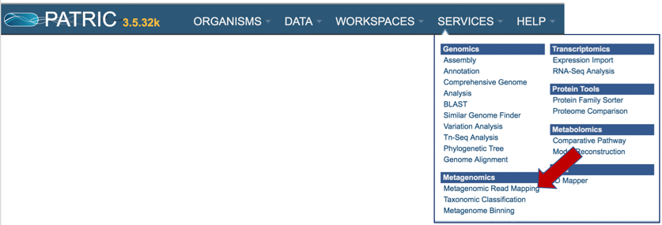

3. This will open up the Metagenomic Read Mapping landing page where researchers can submit long reads, single or paired read files, an SRA run accession number, or assembled contigs to the service.

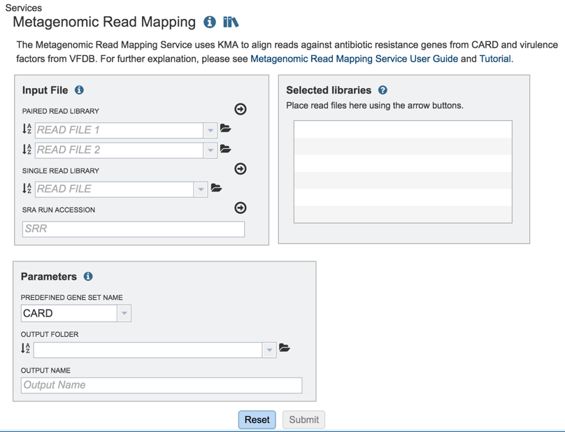

II. Uploading paired end reads
-------------------------------

Many paired read libraries are given as file pairs, with each file containing half of each read pair. Paired read files are expected to be sorted in such a way that each read in a pair occurs in the same Nth position as its mate in their respective files. These files are specified as READ FILE 1 and READ FILE 2. For a given file pair, the selection of which file is READ 1 and which is READ 2 does not matter.

1. To upload a fastq file that contains paired reads, locate the box called “Paired read library.”

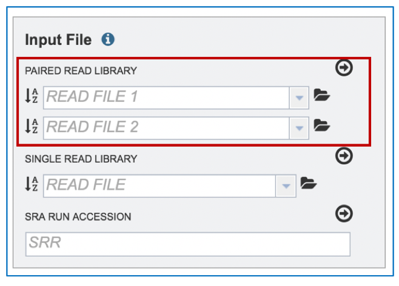

2. The reads must be located in the workspace. To initiate the upload, first click on the folder icon.

.. image:: images/Picture5.png

3. This opens up a window where the files for upload can be selected. Click on the icon with the arrow pointing up.

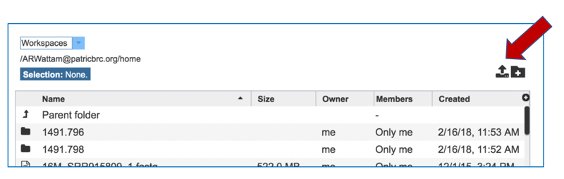

4. This opens a new window where the file you want to upload can be selected. Click on the “Select File” in the blue bar.

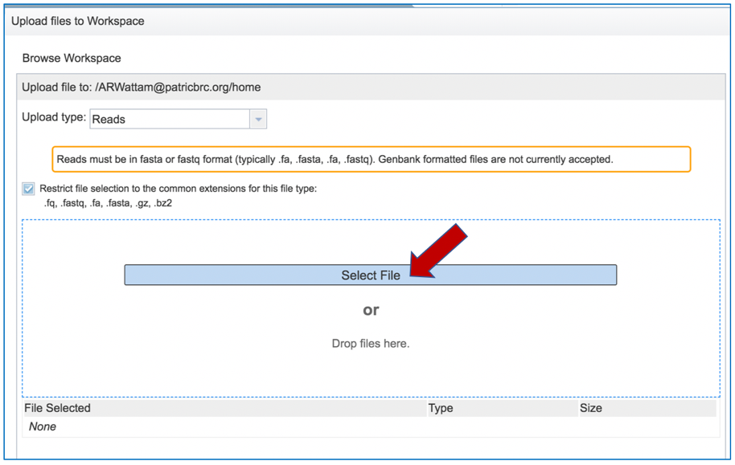

5. This will open a window that allows you to choose files that are stored on your computer. Select the file where you stored the fastq file on your computer and click “Open” .

.. image:: images/Picture8.png

6. Once selected, it will autofill the name of the file.  You can see it in the screenshot below. Click on the Start Upload button.

.. image:: images/Picture9.png

7.  This will auto-fill the name of the document into the text box as seen below.

.. image:: images/Picture10.png

8. Pay attention to the upload monitor in the lower right corner of the PATRIC page.  It will show the progress of the upload.  Do not submit the job until the upload is 100% complete.

.. image:: images/Picture11.png

9. Repeat steps 2-5 to upload the second pair of reads.

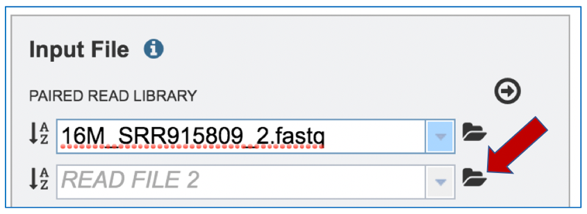

10.  To finish the upload, click on the icon of an arrow within a circle.  This will move your file into the Selected libraries box.

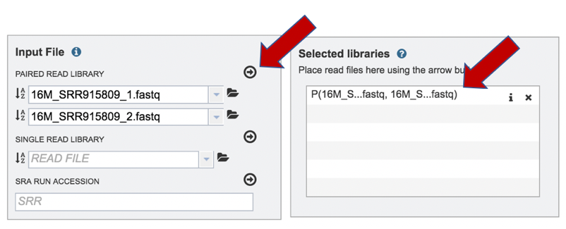

III.  Uploading single reads
-----------------------------

1.  To upload a fastq file that contains single reads, locate the text box called “Single read library.”

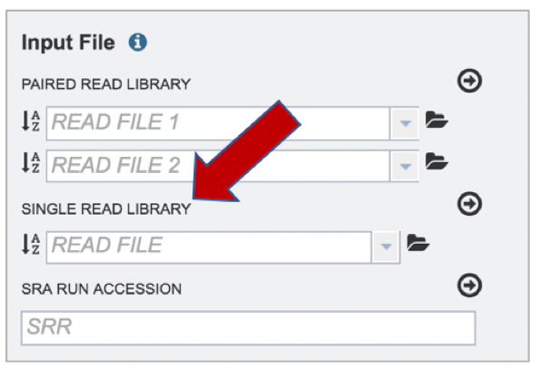

2. If the reads have previously been uploaded, click the down arrow next to the text box below Read File.

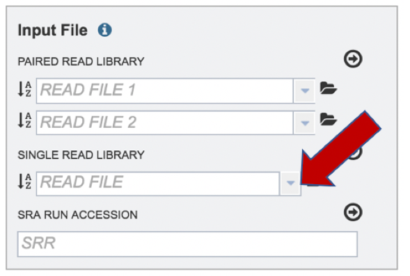

3. This opens up a drop-down box that shows the all the reads that have been previously uploaded into the user account.  Click on the name of the reads of interest.

.. image:: images/Picture16.png

4. This will auto-fill the name of the document into the text box as seen below.

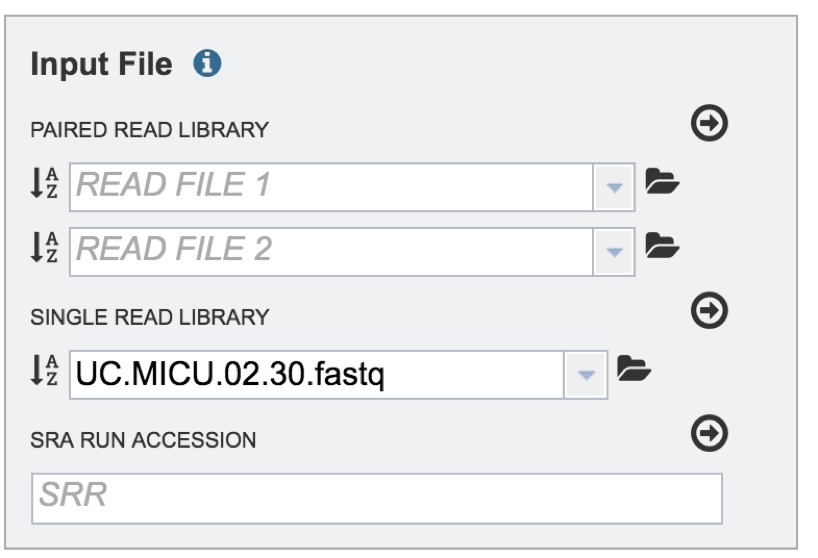

5. To finish the upload, click on the icon of an arrow within a circle.  This will move your file into the Selected libraries box where it is ready to be assembled.

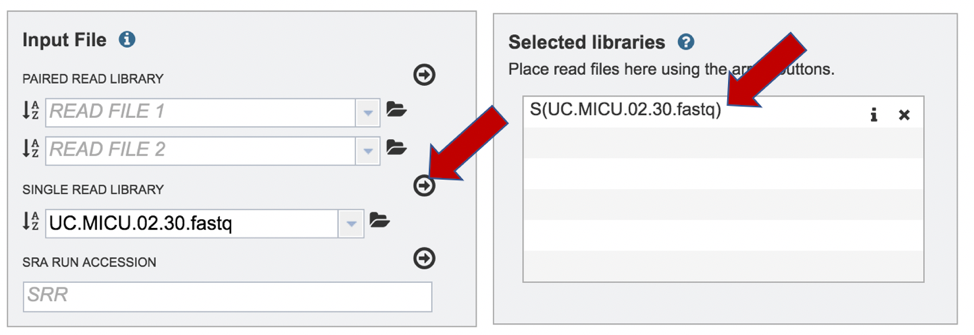

IV.  Submitting reads that are present at the Sequence Read Archive (SRA)
--------------------------------------------------------------------------

1. PATRIC also supports analysis of existing datasets from SRA. To submit this type of data, locate the Run Accession number and copy it.

.. image:: images/Picture19.png

2. Paste the copied accession number in the text box underneath SRA Run Accession, then click on the icon of an arrow within a circle.

.. image:: images/Picture20.png

3. This will move the file into the Selected libraries box where it is ready to be assembled

.. image:: images/Picture21.png

V. Selecting parameters and submitting the Metagenomic Read Mapping job
-------------------------------------------------------------------------

1.  Parameters must be selected prior to job submission.

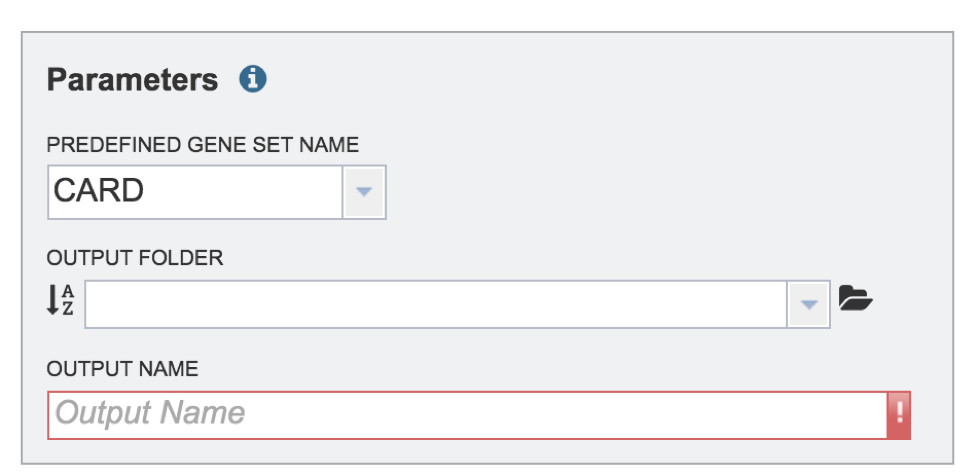

2.  Click on the down arrow at the end of the text box under Predefined Gene Set Name to see the possible selections.  The Metagenomic Mapping Read service has two gene sets to choose from.  The Comprehensive Antibiotic Resistance Database (CARD)[2] is the current gold standard for antimicrobial resistance genes.  It is a manually curated resource containing high quality reference data on the molecular basis of antimicrobial resistance (AMR) that emphasizes genes, proteins and mutations that are involved in AMR.  The Virulence Factor Database (VFDB)[3] is the current gold standard reference source for virulence factors (VFs), providing up-to-date knowledge of VFs from various bacterial pathogens.  Select either CARD or VFDB as the gene set.

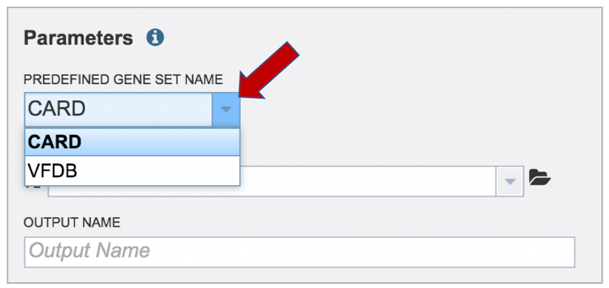

3.  A folder must be selected for the Metagenomic Read Mapping job. Clicking on the down arrow at the end of the text box underneath Output Folder will show recent folders that have been used.  Clicking on the folder icon at the end of the text box will open a pop-up window where all folders can be viewed, or new folders created.

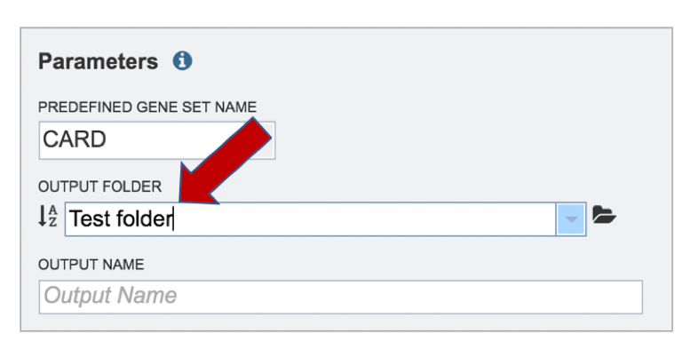

4. A name for the job must be entered in the text box under Output Name.  At this point, the Submit button turns blue and the job will be submitted once clicked.

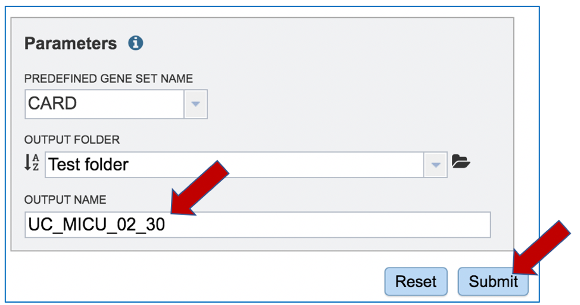

5.  A successful submission will generate a message indicating that the job has been queued.

.. image:: images/Picture26.png

6.  The bottom of each PATRIC page has an indicator that shows the number of jobs that are queued, running or completed.  Clicking on the word Jobs will rewrite the page to show the Job status.

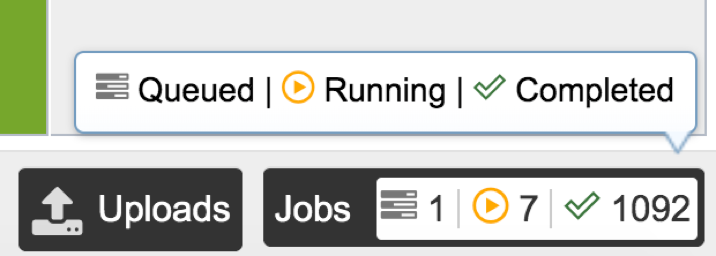

VI.  Viewing the Metagenomic Read Mapping job
----------------------------------------------

1.  Researchers must monitor the Jobs Status page to see the status of their job, which is indicated in the first column (Queued, Running, Complete, Failed).

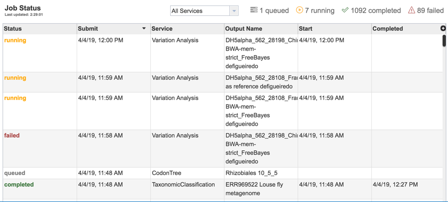

2.  Clicking on the row that contains the job of interest will open two icons in the vertical green bar.  If there is a problem with a particular job, the Report Issue icon should be clicked.

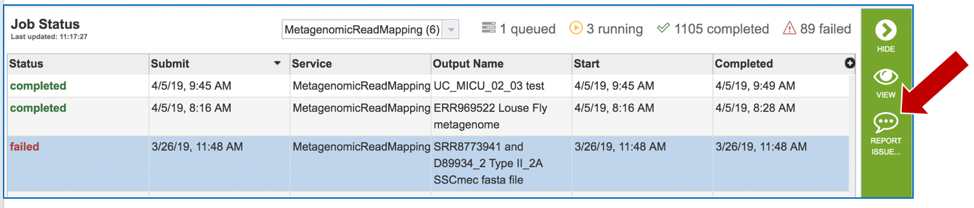

3.  This will open a pop-up window where issues with particular jobs can be reported.  A description of the particular problem can be provided, and clicking the submission button will generate a message to PATRIC team members, notifying them that there has been a problem.  We encourage researchers to report all failed jobs, or those that have results that are confusing.  In addition, researchers should report long waits that they are experiencing in the queue.

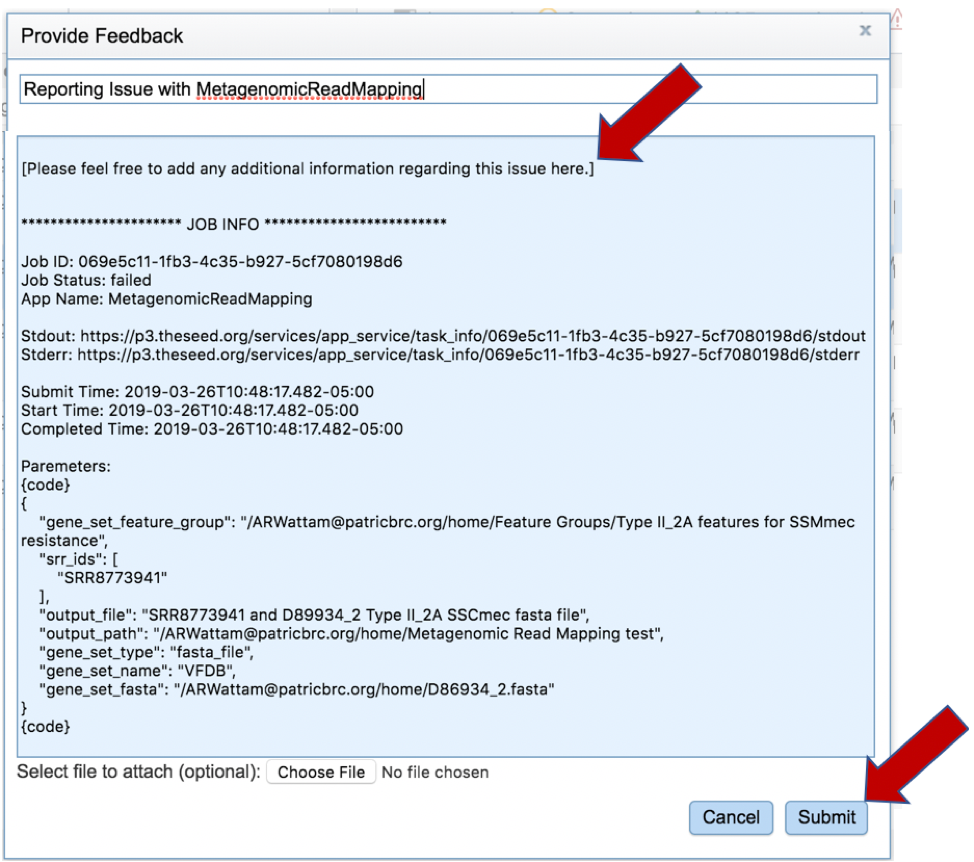

4.  A job that has been successfully completed can be viewed by clicking on the row and then clicking on the View icon in the vertical green bar.

.. image:: images/Picture31.png

5.  This will open page for the selected job.  The top box has the job ID number and gives pertinent information about the time it took to complete and the selected parameters. The lower table has five output files.

.. image:: images/Picture32.png

6.  Click on the MetagenomicReadMapping.html.  This will populate the vertical green bar with a number of icons.  Clicking the information icon (i) will open a new tab that has the Metagenomic Read Mapping tutorial.  There are icons for downloading the data, viewing it, deleting the file, renaming the file, copying or sharing with another PATRIC user, moving it to a different director, or changing the type tagged to the file.  To examine the MetagenomicReadMappingReport.html, click on the View icon.

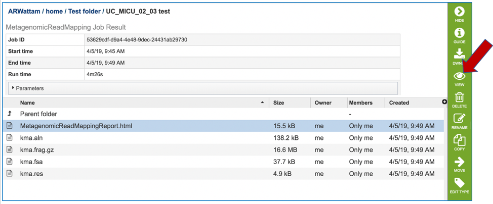

7.  This page shows KMA’s standard sample report format. The fields of the output, from left-to-right, are as follows:

- **Template:** Identifier of the template (reference gene) sequence that match the query reads
- **Function:** Template gene function
- **Genome:** Genome that contains template gene
- **Score:** Global alignment score of the template
- **Expected:** Expected alignment score if all mapping reads where smeared over all templates in the database
- **Template_length:** Template gene length in nucleotides
- **Template_Identity:** Percent identity between the query and template sequence, over the length of the matching query sequence
- **Template_Coverage:** Percent of the template that is covered by the query
- **Query_Identity:** Percent identity between the query and template sequence, over the length of the matching query sequence
- **Query_Coverage:** Length of the matching query sequnce divided by the template length
- **Depth:** Number of times the template has been covered by the query.
- **q_value:** Quantile from McNemars test, to test whether the current template is a significant hit.
- **p_value:** p-value corresponding to the obtained q_value

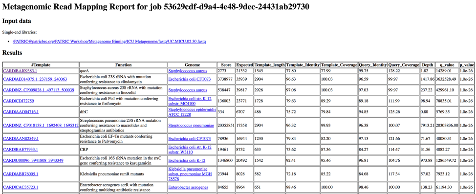

8.  Clicking on any of the template identifiers in the first column will open a Specialty Gene List View that shows all the genes in PATRIC that have BLAT[4] hits to the same template gene.

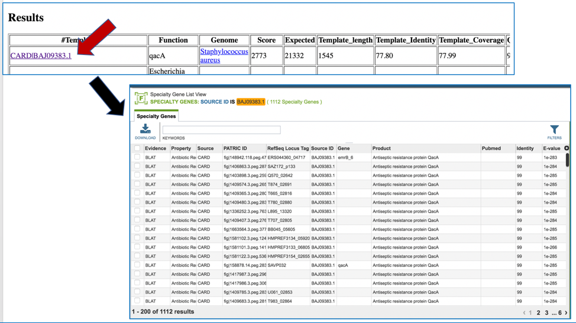

9.  Clicking on the name in the Genome column will open a new tab that shows the Genome List view, which shows all the genomes in PATRIC that fall under the same taxonomy of the selected name.

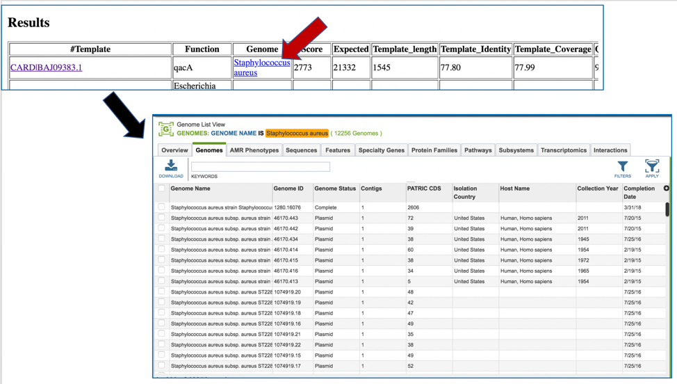

10.  To see an alignment details, click on the kma.aln and then on the View icon.

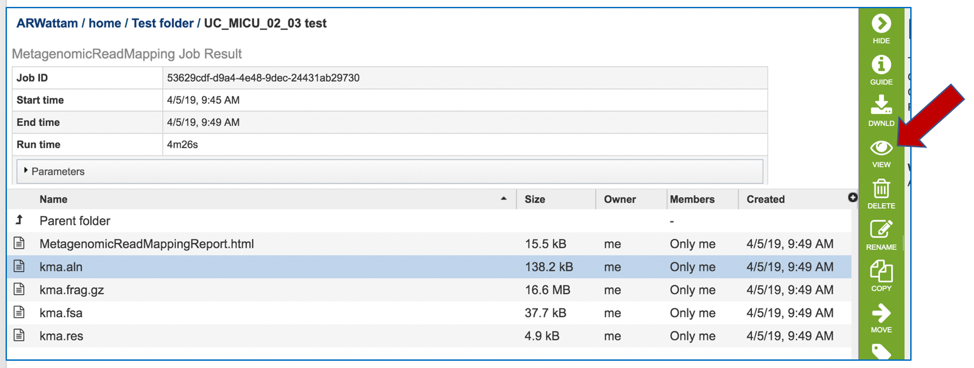

11.  This will open a text file that shows the alignment between the template and the submitted query sequence.

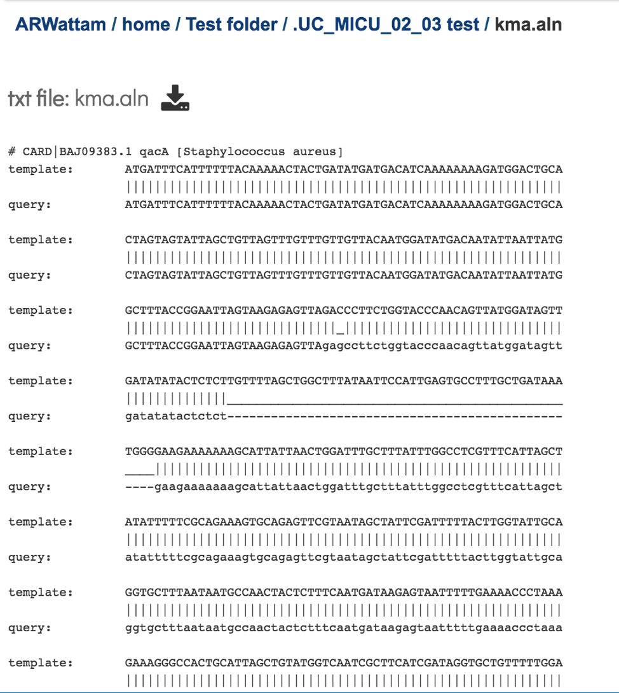

12.  The kma.frag.gz file should be downloaded.  It has mapping information on each mapped read, and the columns found in the download are as follows: read, number of equally well mapping templates, mapping score, start position, end position (w.r.t. template), the chosen template.

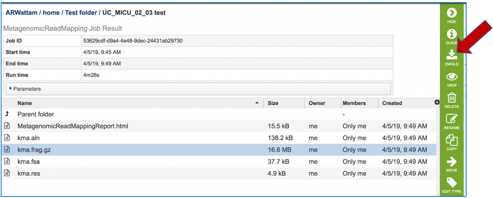

13.  The kma.fsa can be viewed in the workspace. Select the row and click on the View icon.

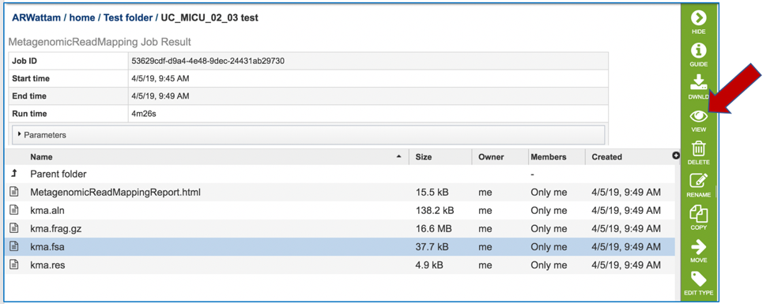

14.  The kma.fsa file shows the consensus sequence drawn from the alignment.

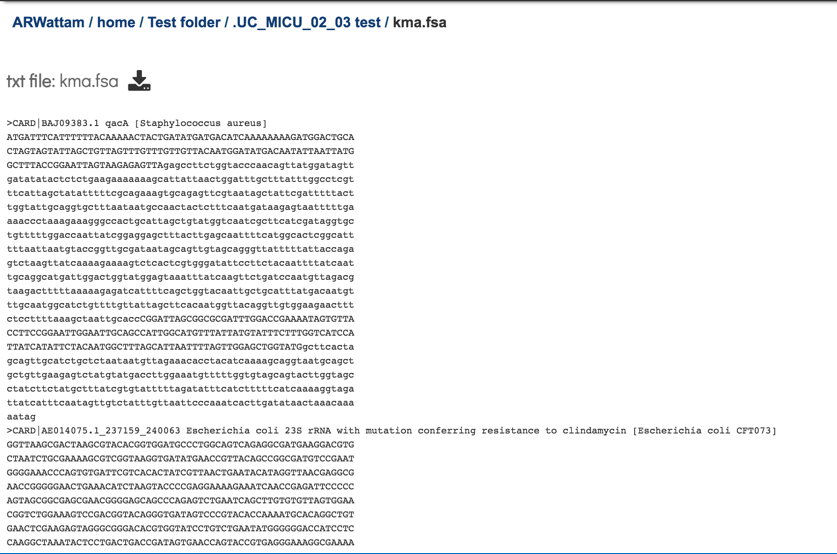

15.  The kma.res file can be downloaded, or viewed in the workspace.  Click on the row and click on the View icon.

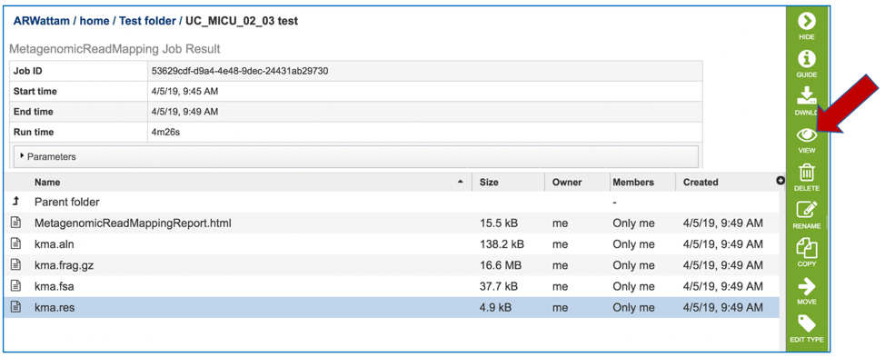

16.  This is a text file that matches the MetagenomicReadMapping.html

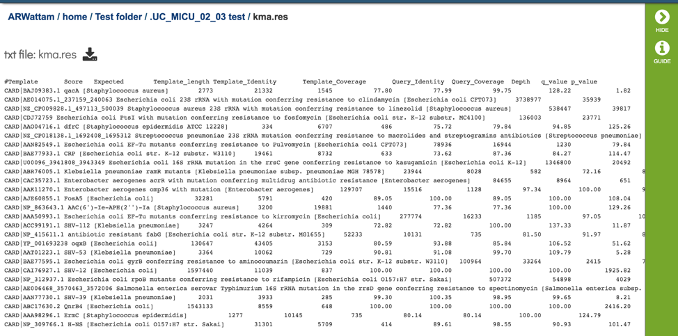

References
-----------

1.  Clausen, P.T., F.M. Aarestrup, and O. Lund, Rapid and precise alignment of raw reads against redundant databases with KMA. BMC bioinformatics, 2018. 19(1): p. 307.
2.  Jia, B., et al., CARD 2017: expansion and model-centric curation of the comprehensive antibiotic resistance database. Nucleic acids research, 2016: p. gkw1004.
3.  Chen, L., et al., VFDB 2016: hierarchical and refined dataset for big data analysis—10 years on. Nucleic acids research, 2015. 44(D1): p. D694-D697.
4.   Kent, W.J., BLAT—the BLAST-like alignment tool. Genome research, 2002. 12(4): p. 656-664.

