# Building Phylogenetic trees in PATRIC

The Phylogenetic Tree Building Service allows construction of custom phylogenetic trees for up to 50 user-selected genomes. 

**Keywords:** Phylogenetic tree, Phylogeny, Phylogenomics, Whole-genome tree, Phylogenetic tree contrustion, Evolutionary biology, Evolutionary analysis, Comparative genomics, Bacteria, Archaea. 

## 1. Selecting an “ingroup” of genomes for the tree.
1.1. In the Global text box, which is found at the right side of the header on any PATRIC page, enter the genus of interest, then hit return.

1.2. This will reload the page to show the search results.  Click on the number that follows the Genomes in these results.
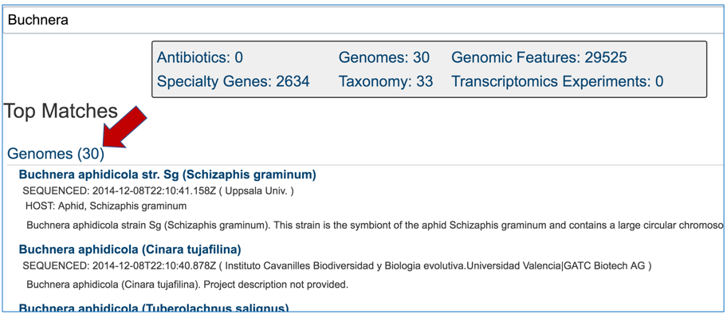

1.3. This will open a table that contains all the genomes that have a match with the word used in the search.
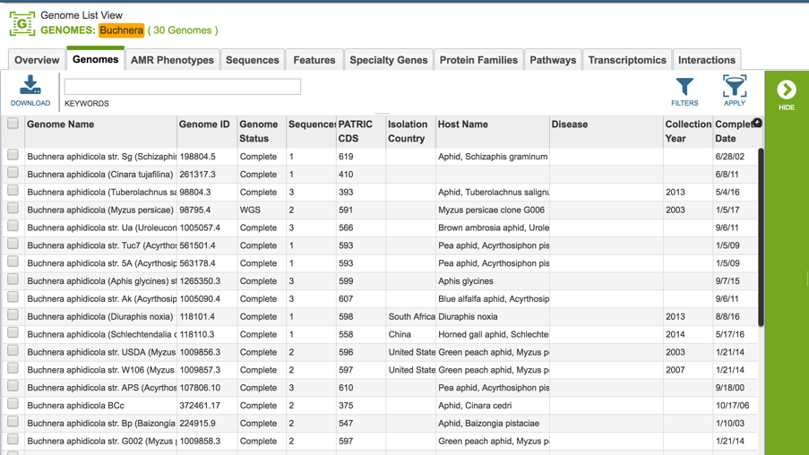

1.4. For this exercise, select 5 genomes by clicking on the check box in front of the name.   This will open icons in the vertical green bar that are can be used with this selection.  Click on the Group icon.
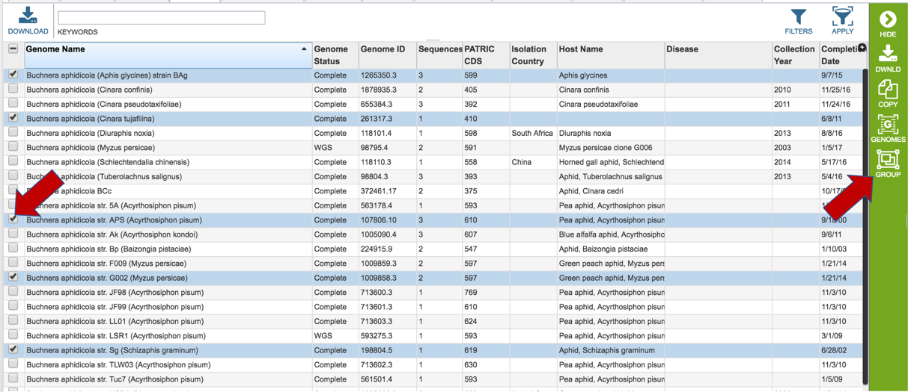

1.5. This will open a pop-up window where a group can be named.  Click on the down arrow at the end of the text box that has Existing Group in it.  This will open up a drop-down box.  Click on New Group.  This will change the text in that box to “New Group”.  Enter the name of the new group in the text box under Group Name and click the Add button.  The group will now be saved in the workspace.
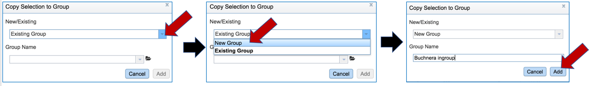

## 2. Selecting an “outgroup” of genomes for the tree from the Order level phylogenetic tree view.
2.1. Select any single genome from the genome table by clicking on the check box in front of its name.  This will open icons in the vertical green bar that are can be used with this selection.  Click on the Genome icon.
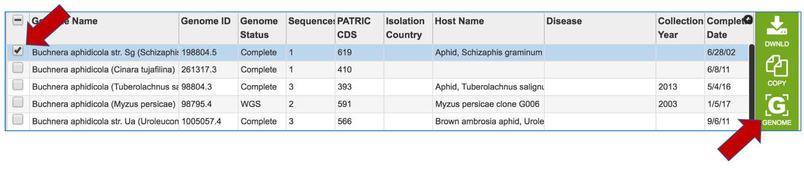

2.2. This will open the landing page for that genome.  Across the top a number of tabs can be seen.  Click on the Phylogeny tab.
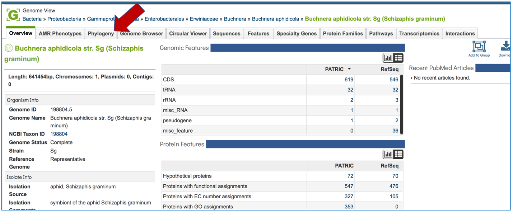

2.3. This will open up a phylogenetic tree that includes the higher quality genomes (those with the fewest contigs) for each of the major groups within the taxonomic Order that the genome belongs to.  Scroll down to find the genus of interest
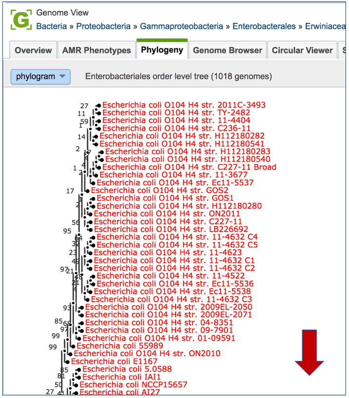

2.4.  Once the genus is located, look below it to find the closest genera that are not part of the named genus.
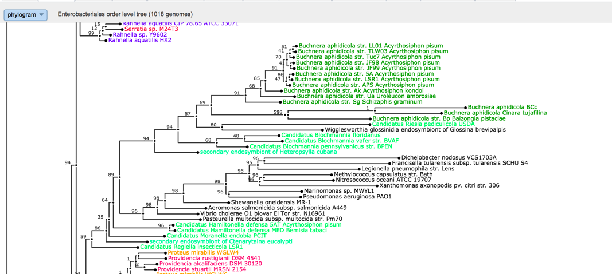

2.5. To select genomes of interest, locate the genome and click on the black dot immediately in front of the name of that genome.  Wait several seconds.  The branch that points to that genome will turn red.
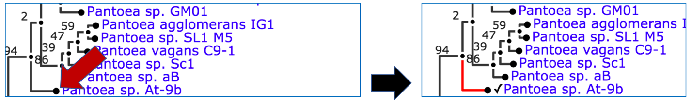

2.6. Use Command click to select a total of up to 5 genomes. Once selected, click on the Group icon in the vertical green bar.
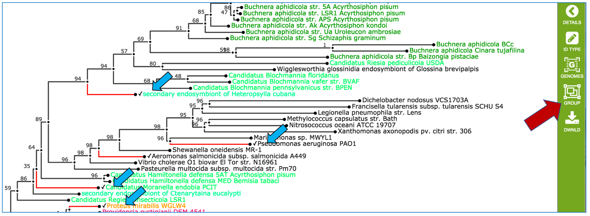

2.7. This will open a pop-up window where a group can be named.  Click on the down arrow at the end of the text box that has Existing Group in it.  This will open up a drop-down box.  Click on New Group.  This will change the text in that box to “New Group”.  Enter the name of the new group in the text box under Group Name and click the Add button.  The group will now be saved in the workspace.
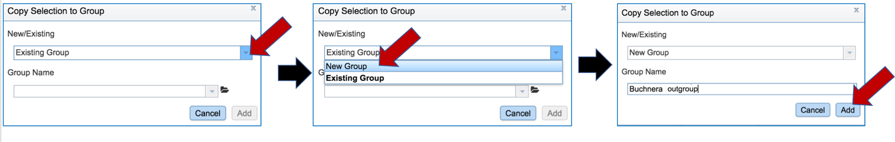

## 3. Launching the phylogenetic tree job with selected genomes
3.1. Click on the Services tab at the top of the page, and then on Phylogenetic Tree, which can be found underneath the Genomics header.
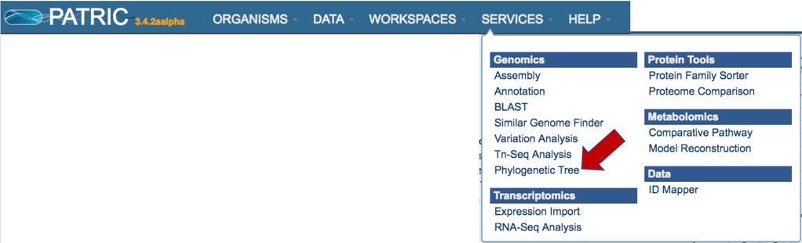

3.1.1. Selecting the ingroup genomes.  Find the box for Ingroup genomes.
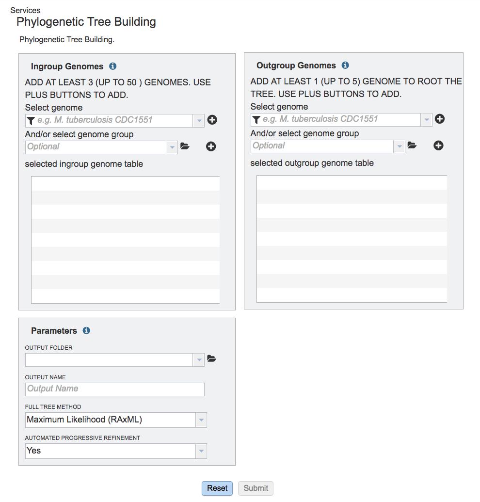

3.1.2. To select a genome group that contains the ingroup genomes, click on the down arrow next to the text box under And/Or Select Genome Group. This will open a drop-down list that shows the names of all the genome groups.  Select the group of interest by clicking on it.
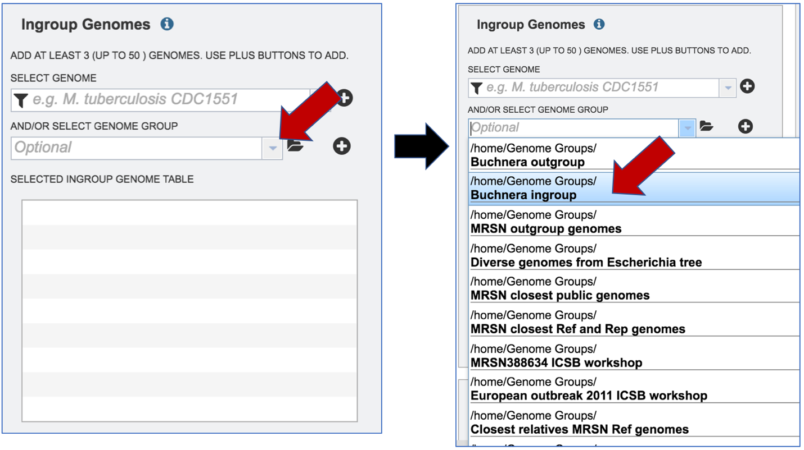

3.1.3. The name of the group will be in the text box.  Click on the plus icon to move that genome into the selected ingroup genome table.
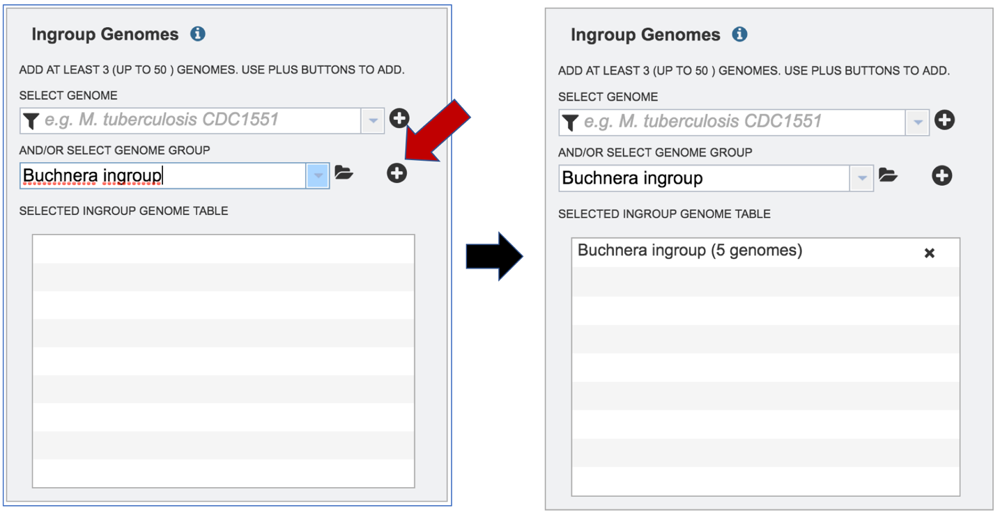

3.2. Selecting the outgroup genomes.  Find the Outgroup genomes box.  To select a genome group that contains the outgroup genomes, click on the down arrow next to the text box under And/Or Select Genome Group. This will open a drop-down list that shows the names of all the genome groups.  Select the group of interest by clicking on it.
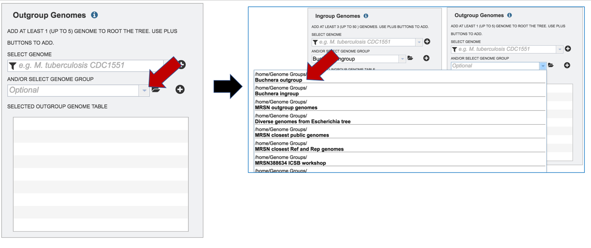

3.2.1. The name of the group will be in the text box.  Click on the plus icon to move that genome into the selected outgroup genome table.
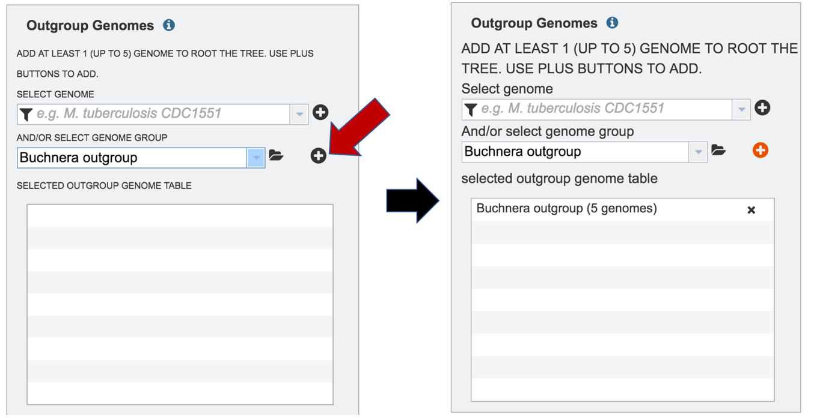

3.3. Selecting the parameters 

3.3.1. Creating a folder

3.3.1.1. A folder must be selected to hold the phylogenetic tree job.  To create a folder, click on the folder icon that is next to the text box under Output Folder.  This will open a pop-up window where all the folders in the workspace are displayed.
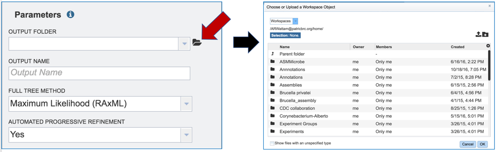

3.3.1.2. To create a new folder, click on the folder icon at the top right of the table.
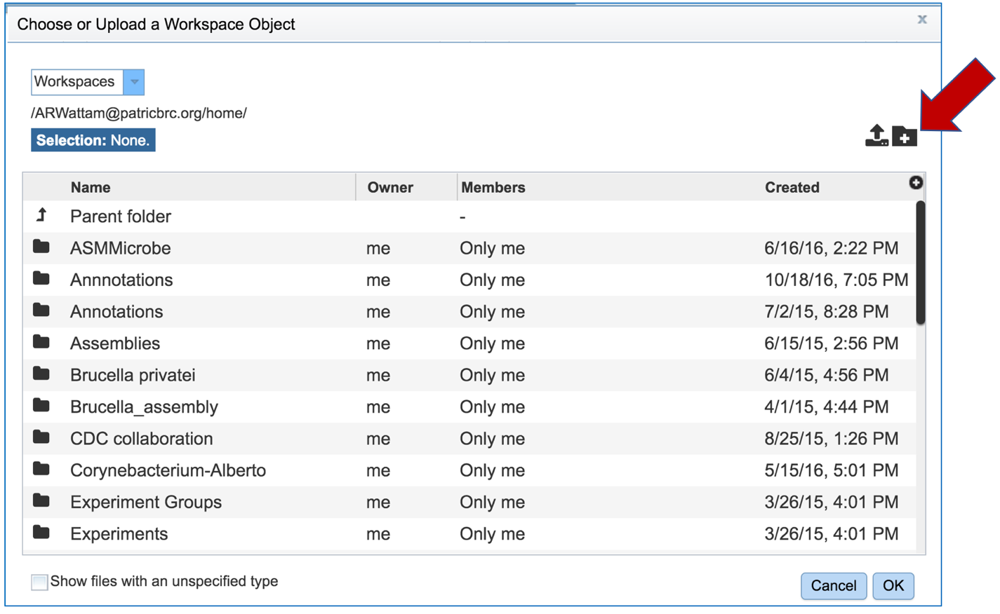

3.3.1.3. This will open a pop-up window where the new folder can be named.  Enter the desired name, and then click on the Create Folder button.

3.3.1.4. The name of the new folder will appear in the folder table.  Select that folder, and then click the OK button.
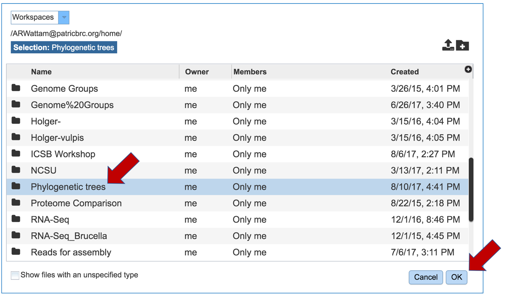

3.3.1.5. The name of the selected folder will now appear in the textbox under Output Folder.
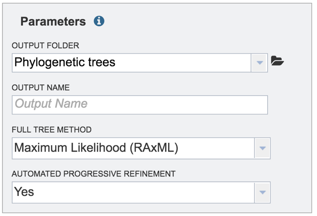

3.3.2. Naming the tree.  Enter the name of the tree in the text box under Output Name. This will be the identifier displayed in the jobs list.
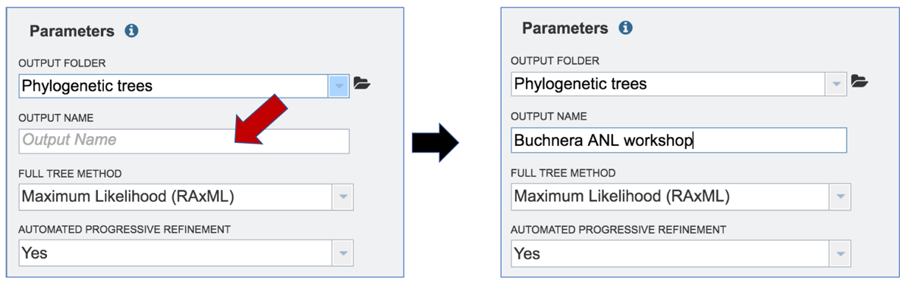

3.3.3. Selecting the tree building algorithm.  The PEPR software is packaged to run on Linux and on Mac. The software pipeline makes use of several third-party tools. These include, BLAST[1], MCL[2], Muscle[3], hmmbuild[4], hmmsearch[4], Gblocks[5], FastTree[6], and RAxML[7]. The pipeline begins with the set of ingroup genome protein files. These are filtered to remove duplicate species, resulting in a distinct-species subset of the ingroup genomes. This is done to reduce biasing the homolog sets with overrepresented species. BLAST searches are used to find bi-directional best hit protein pairs between genomes, and these bidirectional best hit pairs are clustered using MCL. Clusters containing members from at least half of the distinct genomes are chosen as initial, or seed, homolog sets. These seed sets are expanded to include members from all ingroup and outgroup taxa using tools from the HMMer suite. A hidden Markov Model (HMM) is built from each seed set using hmmbuild. These HMMs are used to search each genome, with hmmsearch, to find the best match from each genome for each homolog set model. The final, expanded, homolog sets are created from the hmmsearch results. Homolog sets representing fewer than 80% of ingroup genomes are removed. The remaining sets are aligned using Muscle, and the alignments are trimmed using Gblocks. The trimmed alignments are concatenated and this concatenated alignment is used to build the main tree with either RAxML or FastTree.

3.3.3.1. Selecting the tree building algorithm.  FastTree and RAxML use different methods, allowing a more stringent test of the robustness of the tree.  Fast Tree runs much more quickly than RAxML, and for this reason should be the first choice.
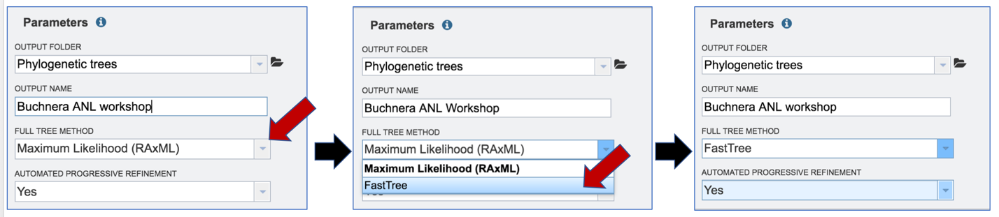

3.3.4. Progressive refinement.  The progressive refinement method helps resolve questionable branches by targeting poorly-resolved subtrees for more detailed analysis, typically incorporating additional protein families in the process. This allows trees spanning hundreds of genomes to contain subtrees based on thousands of protein families.  This option allows for a much more thorough analysis is possible (at the cost of a much longer run time).  When this option is selected, the tree with branch support values is searched breadth-first for branches with <100% support that have parent branches with 100% support, which we call “weakly supported and confidently bounded.” The less than 100% support value indicates uncertainty in the details of a subtree, and the 100% support value indicates confidence in the placement of that subtree within the larger tree. The genomes in the subtree, with an outgroup genome chosen from the sister clade, are submitted to PEPR to have a refined tree constructed for just that subset, following the procedure described above. The refined tree is then grafted into the full tree. This process of prune-refine-graft is repeated until refinement has been attempted for all weakly-supported and confidently-bounded subtrees.  The support trees are constructed with FastTree by default for two reasons. First, FastTree is significantly faster than RAxML. Second, FastTree and RAxML use different methods, allowing a more stringent test of the robustness of the tree, because the same result from a different method is more reassuring.
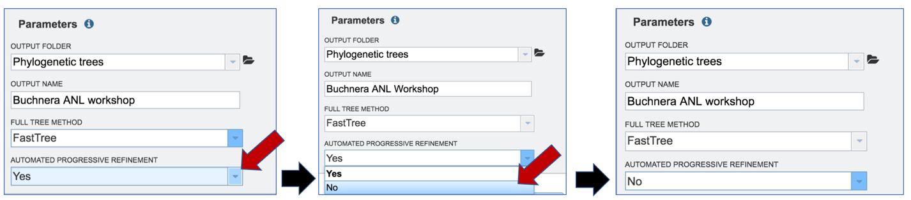

3.4. Launching the job

3.4.1. Once the ingroup and outgroup genomes have been selected, and the parameters have been chosen, the phylogenetic tree job is ready to be submitted.  Click on the Submit button at the bottom of the page.
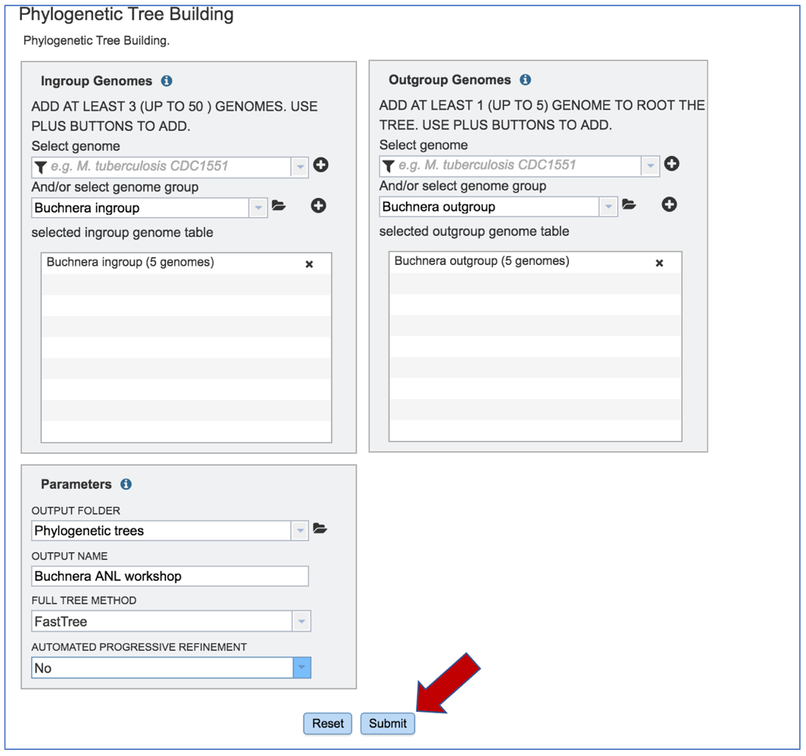

3.4.2. A message will appear over the submit button warning the user that this particular pipeline takes some time to run, especially if progressive refinement was selected.

## 4. Viewing the results
4.1. To view the results of the tree building pipeline, click on the Jobs box at the bottom right of any PATRIC page.

4.2. This will rewrite the page to show the list of jobs that have been submitted, and their progress.
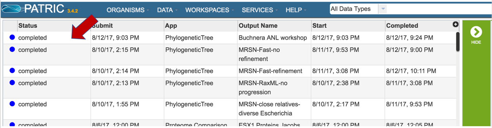

4.3. To see the results of any tree job, highlight the row by selecting it.  This will open icons in the vertical green bar that are can be used with this selection.  Click on the view icon.
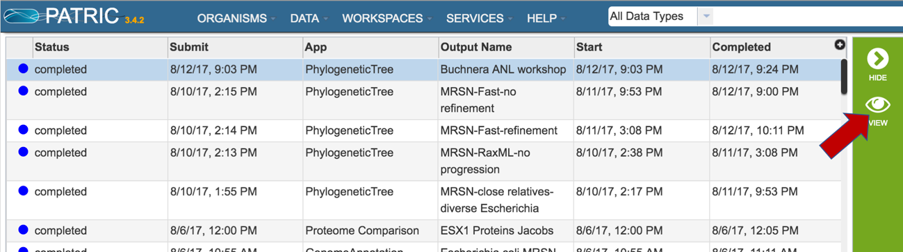

4.4. This will rewrite the page to show the results of the phylogenetic tree job that was submitted. Click on the tree icon at the top right of this table.
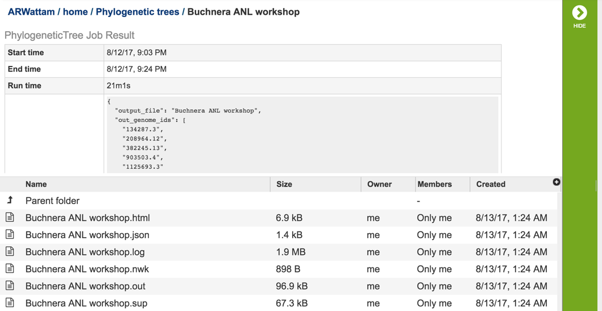

4.5. This will re write the page to show the phylogenetic tree in the PATRIC viewer.
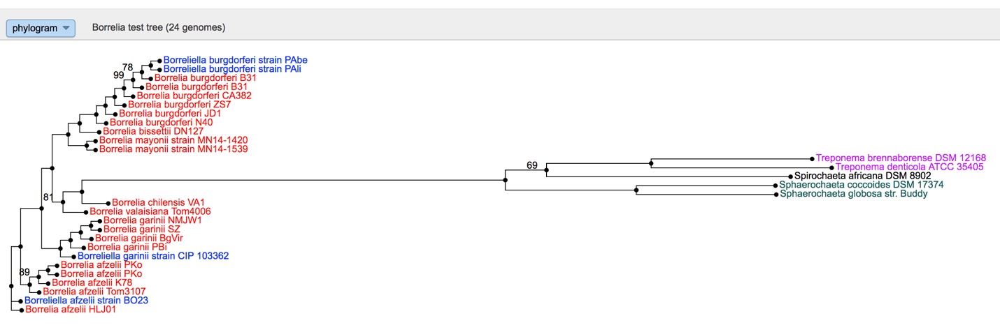

4.6. The Job page has a variety of other files available for download or viewing.

4.7. Newick files.  In mathematics, Newick tree format (or Newick notation or New Hampshire tree format) is a way of representing graph-theoretical trees with edge lengths using parentheses and commas. It was adopted by James Archie, William H. E. Day, Joseph Felsenstein, Wayne Maddison, Christopher Meacham, F. James Rohlf, and David Swofford, at two meetings in 1986, the second of which was at Newick's restaurant in Dover, New Hampshire, US.  This file can be used in other software, like FigTree[8], to visualize a phylogenetic tree.  To view the Newick file, highlight the rows where it is listed.  This will open icons in the vertical green bar that are can be used with this selection.  Click on the View icon.  This will rewrite the lower part of the page, showing the Newick file.
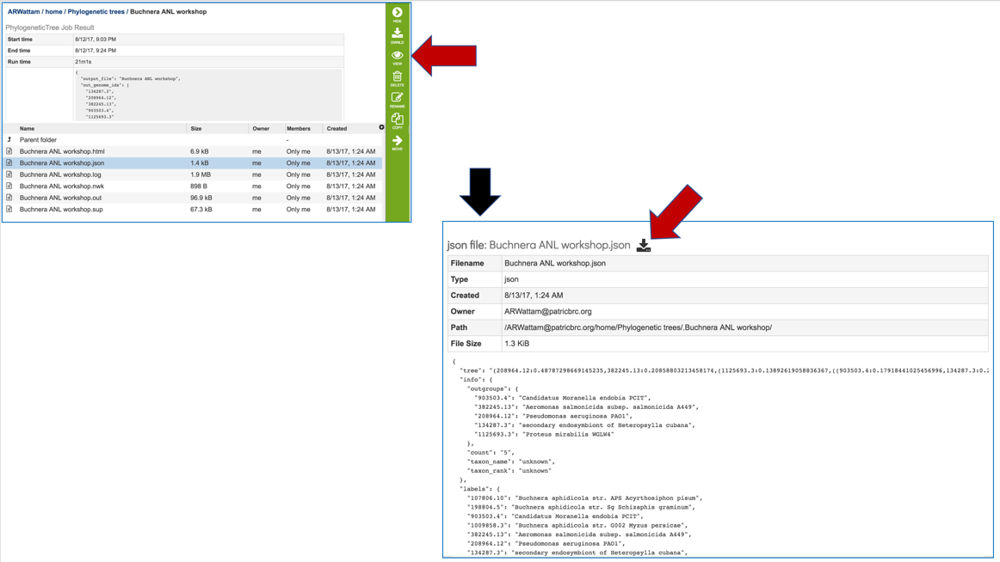

4.8. To download the Newick file, click on the download icon in this page.
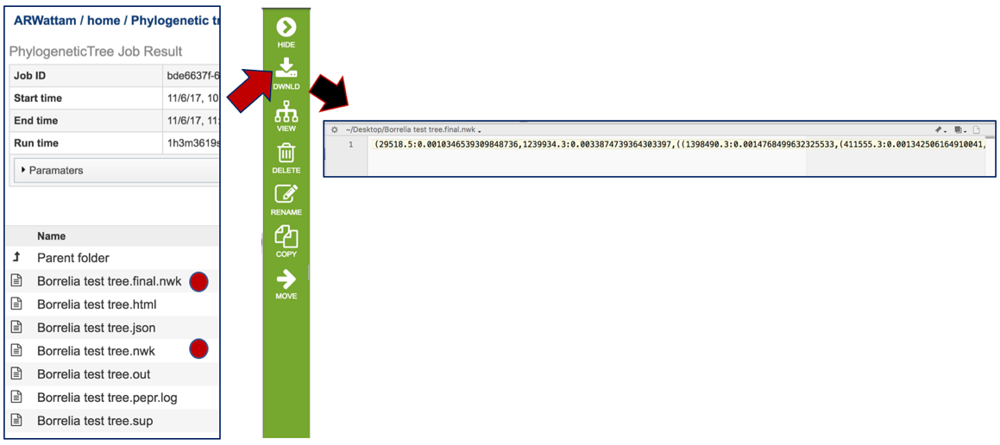

4.9. JSON file.  JSON (JavaScript Object Notation) is an open, text-based data exchange format. Like XML, it is human-readable, platform independent, and enjoys a wide availability of implementations. Data formatted according to the JSON standard is lightweight and can be parsed by JavaScript implementations with incredible ease, making it an ideal data exchange format for Ajax web applications. Since it is primarily a data format, JSON is not limited to just Ajax web applications, and can be used in virtually any scenario where applications need to exchange or store structured information as text.  To see the JSON file generated by the tree building pipeline, highlight the row that lists that file.  This will open icons in the vertical green bar that are can be used with this selection.  Click on the View icon.  This will rewrite the lower part of the page, showing the JSON file. To download the JSON file, click on the download icon in the vertical green bar, or at the top of the page (blue arrow).
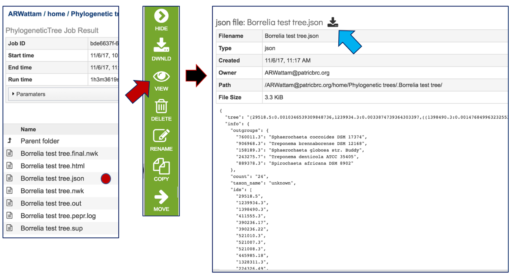

4.10. Log file.  The log file details all the steps that occurred during the construction of the tree.  To view that file, highlight the row where it is listed.  This will open icons in the vertical green bar that are can be used with this selection.  Click on the View icon.  This will rewrite the lower part of the page, showing the log file.  To download the log file, click on the download icon in the vertical green bar, or at the top of this page (blue arrow).
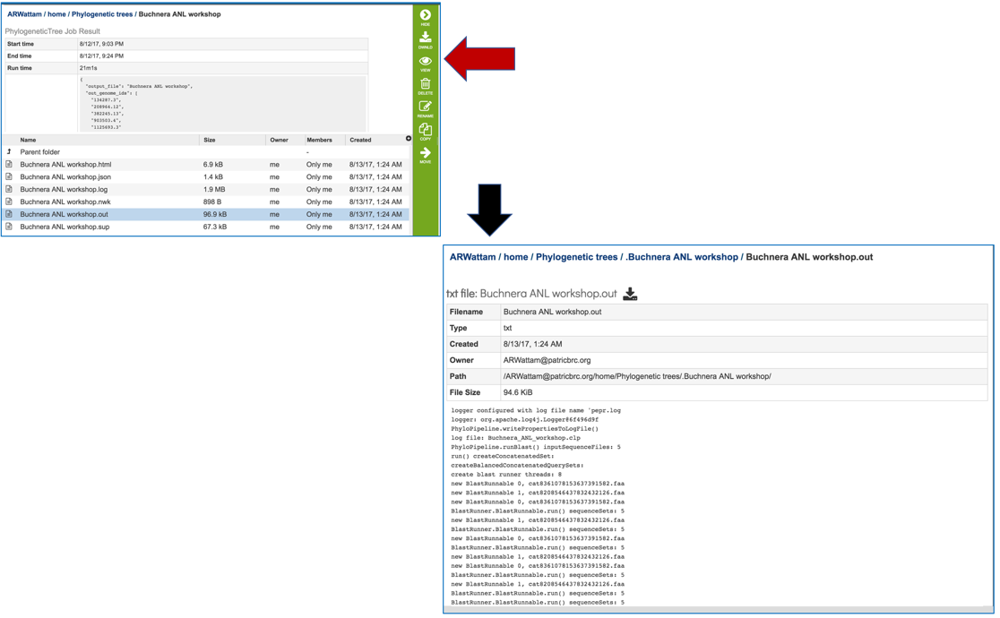

4.11. Out file.    To view the Out file, highlight the row where it is listed.  This will open icons in the vertical green bar that are can be used with this selection.  Click on the View icon.  This will rewrite the lower part of the page, showing the Out file.  To download the Out file, click on the download icon in the vertical green bar or at the top of this page (blue arrow).
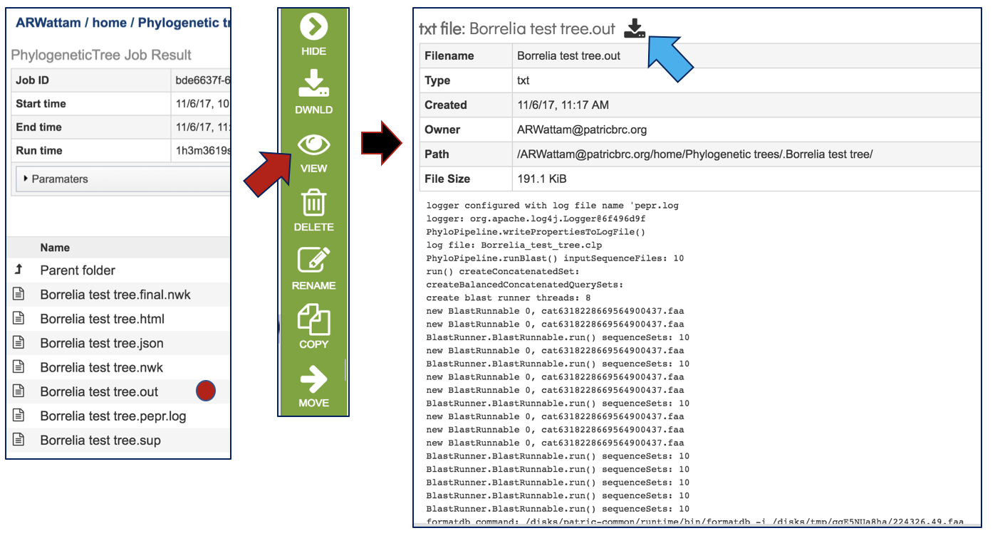

4.12. Branches where refinement was engaged (Support file).  The progressive refinement method helps resolve questionable branches by targeting poorly-resolved subtrees for more detailed analysis, typically incorporating additional protein families in the process. This allows trees spanning hundreds of genomes to contain subtrees based on thousands of protein families.  The subtrees for each file are available.  To view this file, highlight the row where it is listed.  This will open icons in the vertical green bar that are can be used with this selection.  Click on the View icon.  This will rewrite the lower part of the page, showing the file.  To download the file, click on the download icon in this page.

## References
1. Boratyn GM, Camacho C, Cooper PS et al. BLAST: a more efficient report with usability improvements, Nucleic Acids Res 2013;41:W29-33.
2. Van Dongren S. Graph Clustering by Flow Simulation. Utrecht,  Netherlands: University of Utrecht, 2001.
3. Edgar RC. MUSCLE: multiple sequence alignment with high accuracy and high throughput, Nucleic Acids Res 2004;32:1792-1797.
4. Eddy SR. Profile hidden Markov models, Bioinformatics (Oxford, England) 1998;14:755-763.
5. Talavera G, Castresana J. Improvement of phylogenies after removing divergent and ambiguously aligned blocks from protein sequence alignments, Systematic biology 2007;56:564-577.
6. Price MN, Dehal PS, Arkin AP. FastTree 2–approximately maximum-likelihood trees for large alignments, PLoS One 2010;5:e9490.
7. Stamatakis A. RAxML version 8: a tool for phylogenetic analysis and post-analysis of large phylogenies, Bioinformatics 2014;30:1312-1313.
8. Rambaut A. FigTree. 2009.
