# Proteome Comparison: Comparing annotated proteins across genomes.
PATRIC’s Proteome Comparison tool can be used to readily identify insertions and deletions in up to nine target genomes that are compared with one reference, which can be a researcher’s private genome in PATRIC, a genome that has been annotated outside PATRIC, any of the publicly available genomes in PATRIC, or a set of proteins that you have saved in PATRIC as a feature group.

The Proteome Comparison tool is based on the original Sequence-based Comparison tool that was part of RAST[1].  This tool colors each gene based on protein similarity using BLASTP and marks each gene as either unique, a unidirectional best hit or a bidirectional best hit when compared to the reference genome. The output includes a whole-genome schematic that is colored based on BLAST. A table that details all the results can be downloaded for further analysis, as can a scalable vector graphic (svg) diagram of the results that is publication quality.

An example from a comparison of two genomes can be found [here](https://patricbrc.org/workspace/PATRIC@patricbrc.org/PATRIC%20Workshop/Proteome%20comparison).
The input set is the genome group **MRSA_MSSA** (red arrow).  Immediately below it is
the output folder (blue arrow).  The file **circos.svg** inside the output folder contains the graphical
display.  Clicking on this file will display the diagram.

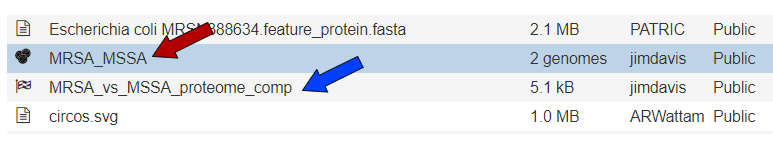

## I. Finding the tool.
1. At the top of any PATRIC page, find the Services tab and click on it.  Click on Proteome Comparison.

2. This will open up the landing page for where you can submit a Proteome Comparison job.  This tool is a best bidirectional BLAST comparison of the annotated proteins from up to nine different genomes.
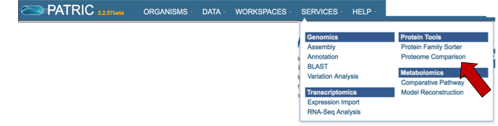

## II. Setting parameters and selecting an output folder
1. To see what the advanced parameters are in the proteome comparison, click on the information icon (Blue I as indicated by the Red Arrow).  This opens a pop-up window that describes what can be adjusted.
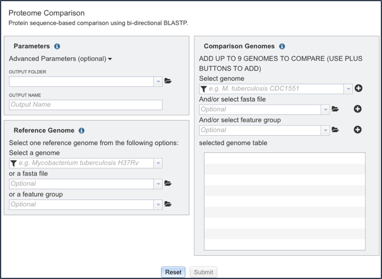

2. The box to adjust the advanced parameters can be opened by clicking on the down arrow that follows Advanced Parameters (optional) as indicated by the Red Arrow.  Researchers can adjust the minimum percent coverage, the minimum percent identity and the BLAST E-value.

    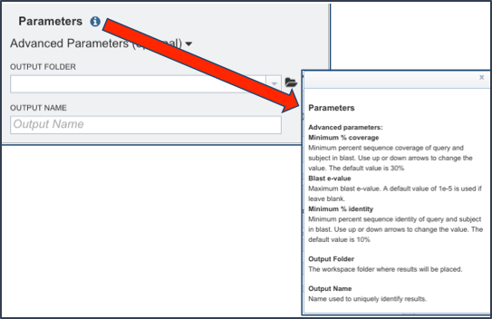

3. Next the researcher must select an output folder where the proteome comparison job will be placed.  To do this, click on the folder icon that follows the text box under the words Output Folder (Red Arrow) and click on preferred folder.
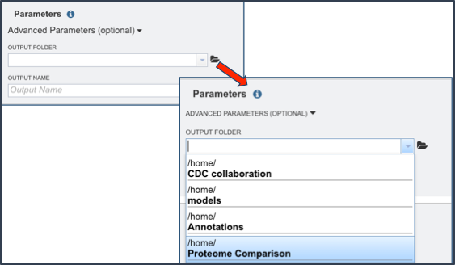

4. Provide a distinctive name for the proteome comparison in the text box underneath the words Output Name.

## III. Selecting the Reference Genome.
1. The proteome comparison tools allows researchers to select genomes or a specific feature group that contains a set of proteins to serve as a reference that other genomes will be BLASTed against.  To see and understand the available options, click on information icon (Blue I as indicated by the Red Arrow).  This opens a pop-up window that describes the types of selections that can be made.
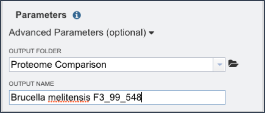

2.  Clicking on the filter in the text box directly below Select A Genome will open a box where the categories of genomes are available, allowing researchers to filter on reference, representative, public or private genomes. All categories are selected, and to de-select a category, click on the check box.
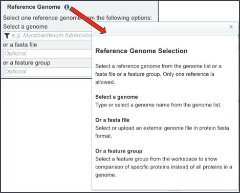

3. In the text box below Reference Genome, start typing some words that will identify the reference. A list will appear below the box, showing the possible choices that match the text.  Clicking on a name will auto-fill the name in the text box under Reference Genome.
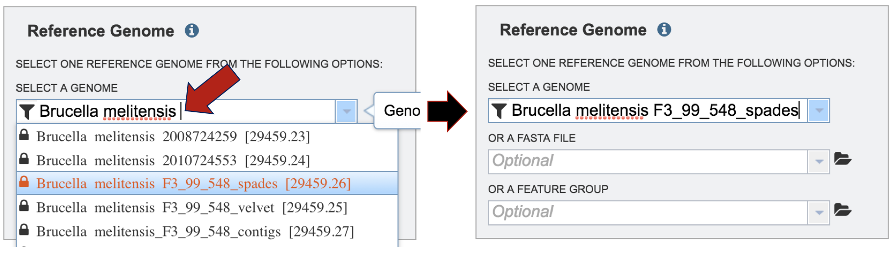

## IV. Selecting the Comparison Genomes.
1. Locate the panel for selecting a comparison genomes, or a set of proteins, that will be BLASTed against the selected reference.
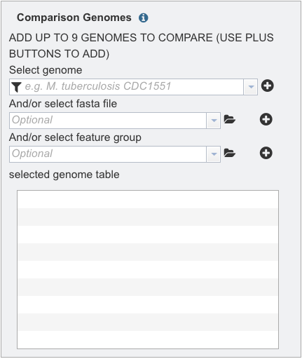

2. Comparison genomes can be public or private.  To select genomes that are publicly available, deselect the check box in front of Private Genomes.
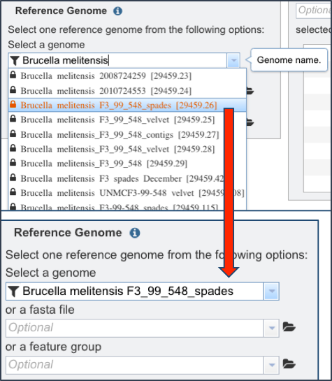

3. Start typing a name into the text box.  A list will appear below the box, showing the possible choices that match the text.  Clicking on a name will auto-fill the name in the text box under Comparison Genome.
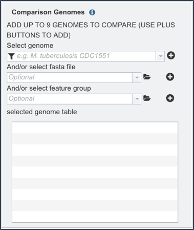

4. To finally selecting the genome, click on the + icon at the end of the text box that has the name of the selected genome.  Clicking on the icon will move the genome to the Selected Genome table.
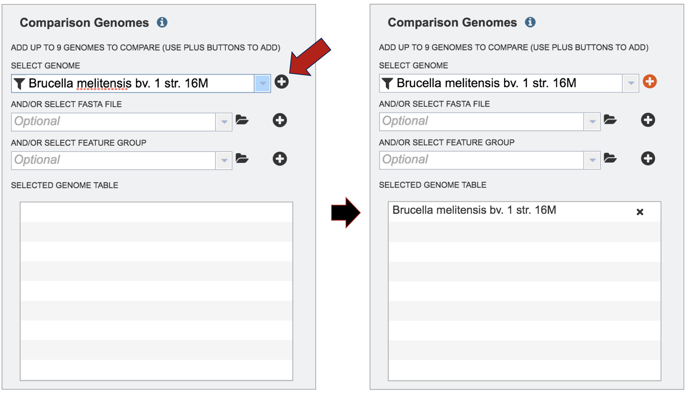

5.  Repeat step 3 to add as many genomes (up to 9) to compare to the reference genome.
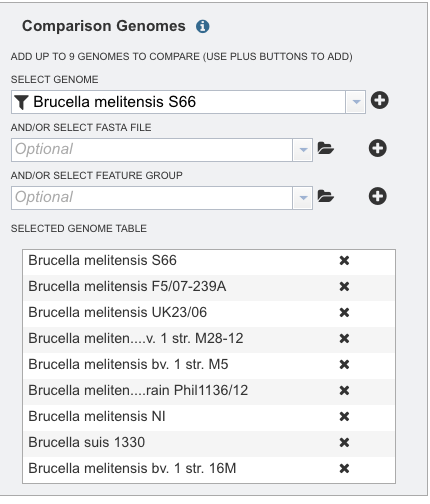

6. Genomes that have been annotated by a different service, or a specific group of proteins, can also be used in the comparison.  Those can be included as indicated by the red arrows as seen below.
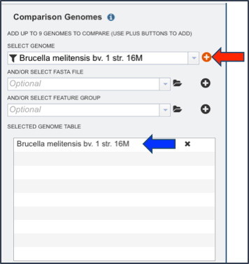

7.  Once the genomes (or feature groups) are included, the Comparison Genome box will show all the members that have been selected.
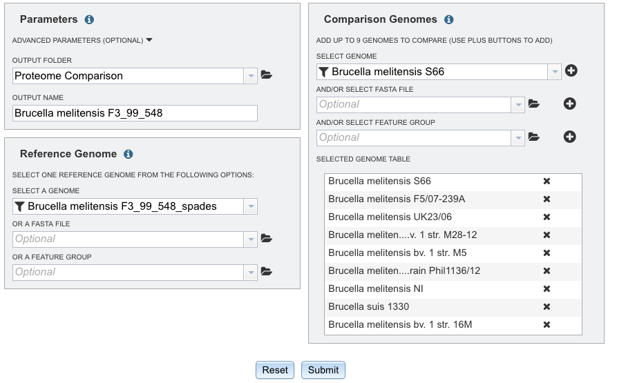

## V. Submitting the proteome comparison job.
1. Click the Submit button at the bottom of the page (Red Arrow)
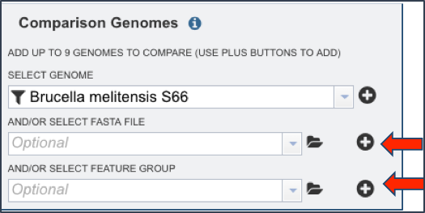

2. A message will appear that confirms that the job has been submitted.  This message is temporal and will disappear after several seconds.
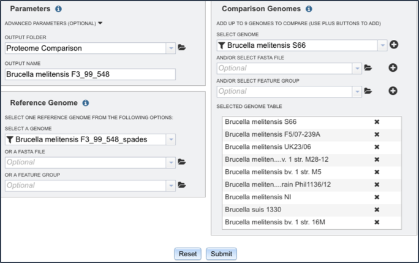

3. Check the status of the annotation job by clicking on the Jobs indicator at the bottom right of the PATRIC page.

4. Clicking on Jobs opens the Jobs Status page, which shows the status of the proteome comparison job.  The statuses of all the previous service jobs that have submitted to PATRIC are also available.

5.  You will be able to see when your job is complete.

## VI. Accessing the Proteome Comparison job.
1. Click on the Jobs indicator at the bottom right of the PATRIC page.

2. This will open the Jobs status page.

3. Select a job of interest, and then click on the view button in the vertical green bar.
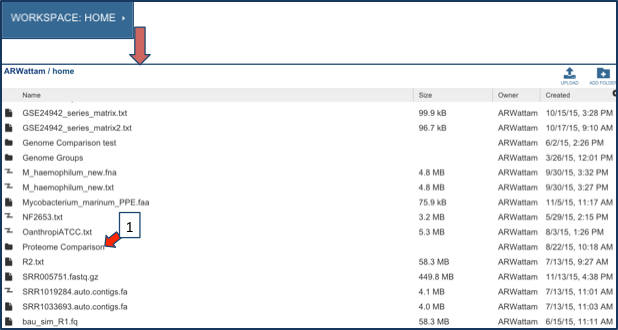

4. This will open up the Jobs landing page.  The easiest way to see the direct results of the Proteome Comparison job is to click on the View icon in the upper right corner.
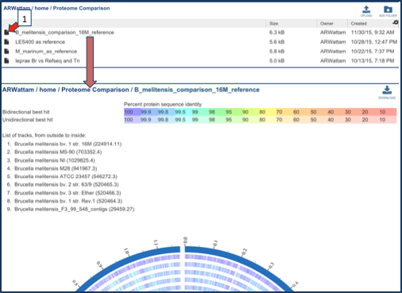

5. This leads to a visualization of the results.  The entire image can be viewed by scrolling down, but to download either the image or the underlying data, click on the Download icon at the upper right.
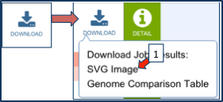

6. An SVG image is available, as is a text file that shows the results of the BLAST comparison.
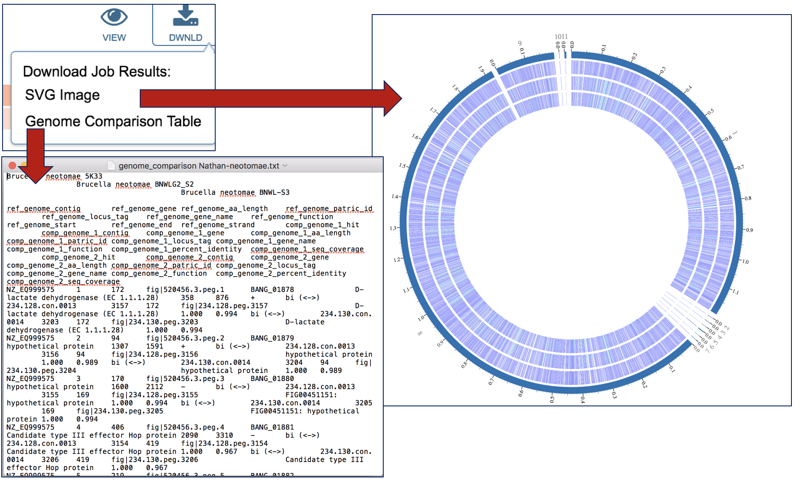

The text file can be opened with excel.  The document contains a lot of information that includes all the genes in the comparison genomes that have the best BLAST hits to the reference genome.  The first row will show the genome names in specific columns, and the column heading in the second row show the additional information.  Data begins with the genome that was used as a reference (Row 2, Columns A-J) and includes the following:
* Column A - Accession number for the contig in the reference genome
* Column B - The order number of this gene in the genome
* Column C - Size in amino acids
* Column D - PATRIC locus tag
* Column E - RefSeq locus tag
* Column F - Gene name
* Column G - Functional annotation
* Column H - Start location for the gene on the contig
* Column I - End of the gene on the contig
* Column J - Strand that the gene is located on

This is followed by information on the comparison genomes.  This data in columns K-T for row 2 (for the first comparison genome) include:
* Column K - Data on the type of BLAST hit (bi- or uni-directional, or missing)
* Column L - Contig that the gene is located on
* Column M - The order number of this gene in the genome
* Column N - Size in amino acids
* Column O - PATRIC locus tag
* Column P - RefSeq locus tag
* Column Q - Gene name
* Column R - Functional description
* Column S - Percent identity of the BLAST hit
* Column T - Sequence coverage compared to the reference
This pattern is repeated for all comparison genomes.
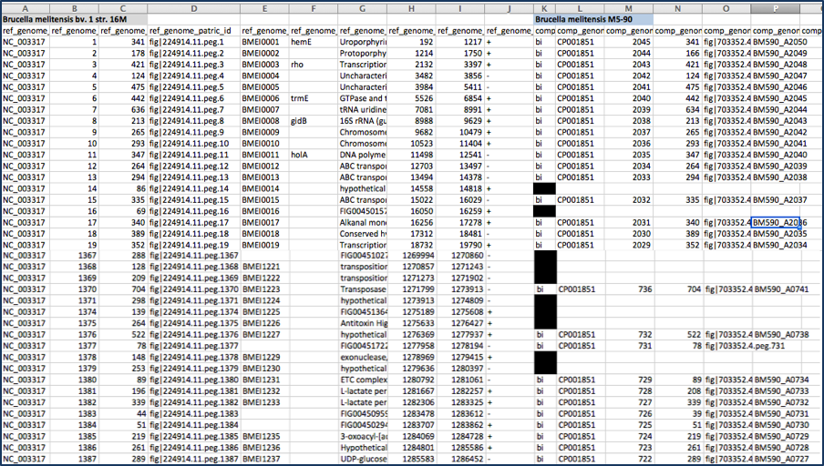

7. Other data is available from the Jobs landing page.
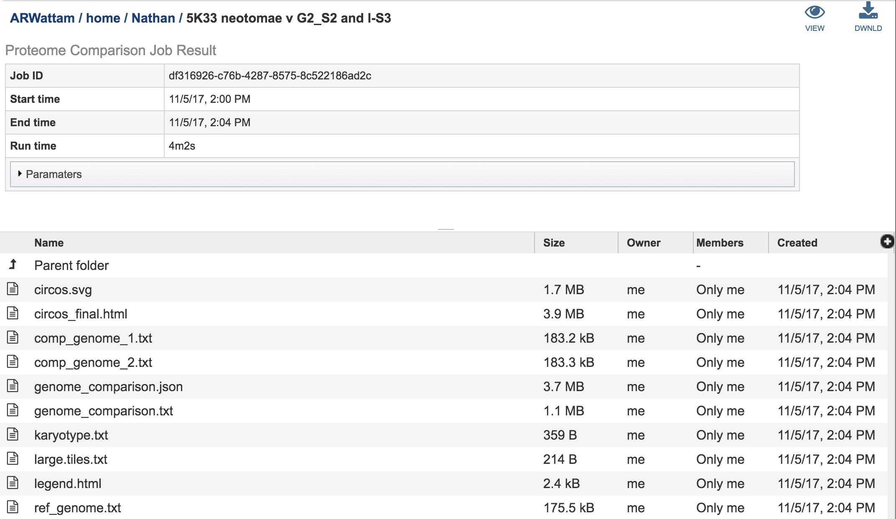

8.  Selecting the circus.svg and then clicking on the View icon will rewrite the page to show the scaled vector graph.
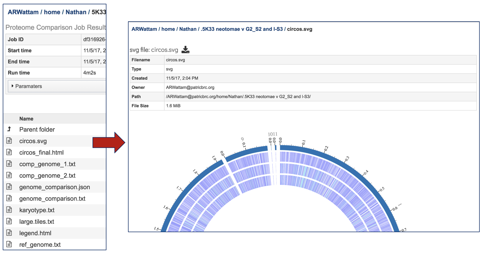

9. Selecting the circus.final.html and then clicking on the View icon will rewrite the page to show the scaled vector graph, the percent similarity, and the list of the genomes included in the analysis.
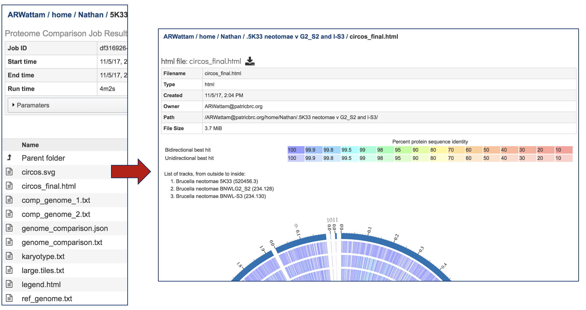

10. The Jobs landing page also has a number of text files, each of with can be selected by highlighting the row and then clicking on the View icon.  The data from the resulting page can be downloaded by clicking on the Download icon immediately above the table.
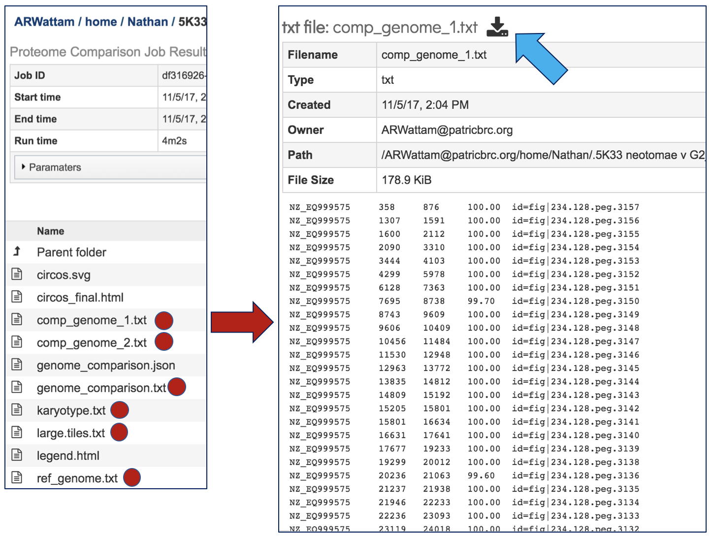

11. A JSON (JavaScript Object Notation) file is also provided.  This is a lightweight data-interchange format that is easy for humans to read and write. It is also easy for machines to parse and generate.
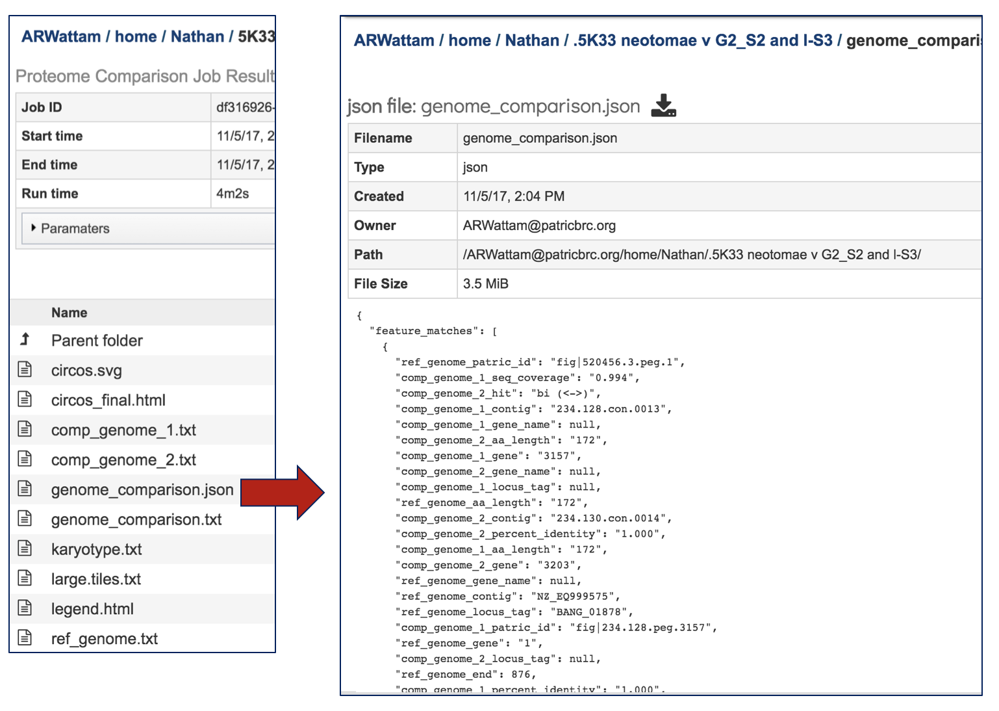

12. Selecting the legend.html and then clicking on the View icon will rewrite the page to show the percent similarity legend.
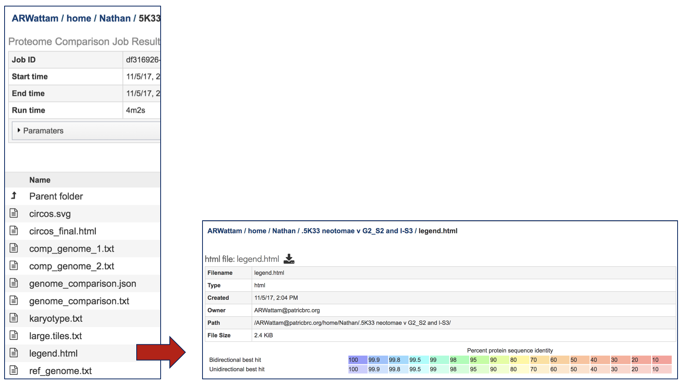

## References
1. Overbeek, R., et al., The SEED and the Rapid Annotation of microbial genomes using Subsystems Technology (RAST). Nucleic acids research, 2014. 42(D1): p. D206-D214.
