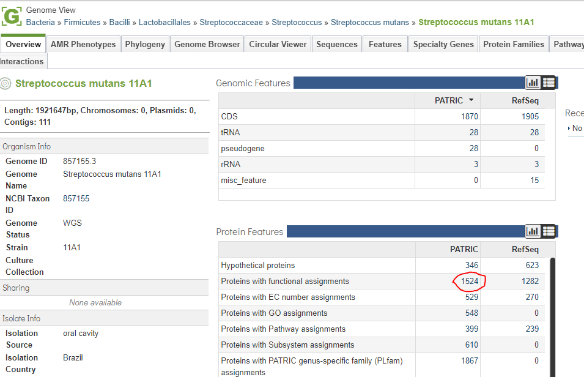
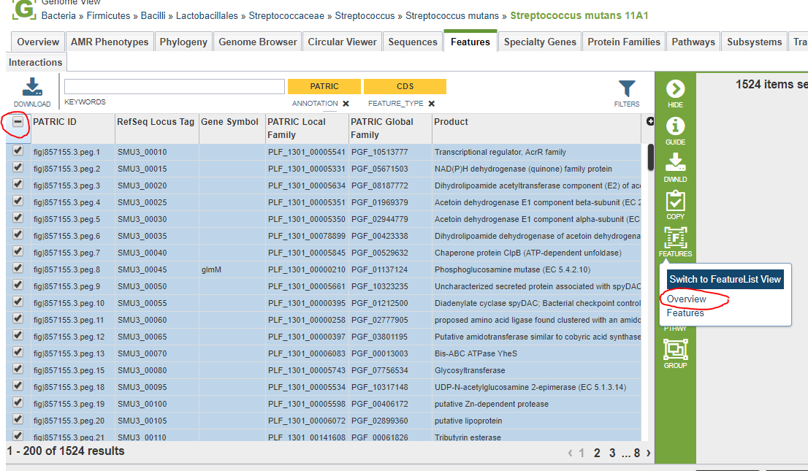
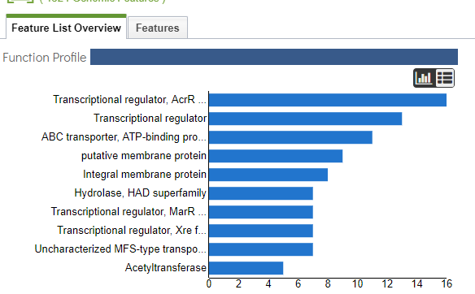
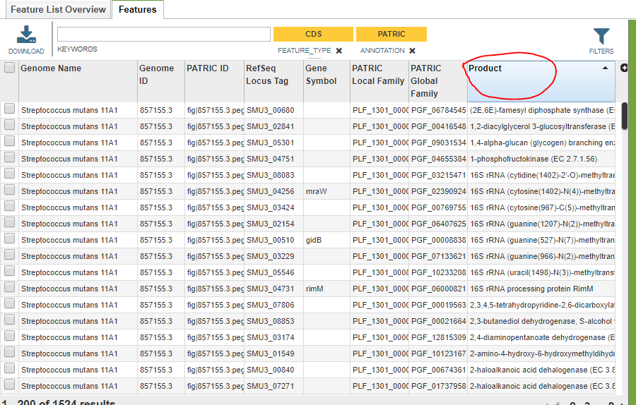

===============================
 Finding the Roles in a Genome
===============================

In this tutorial, we will show how to isolate the functional assignments for a particular genome.
To begin, select the desired genome and navigate to the :doc:`/user_guides/organisms_genome/overview`.

We want to eliminate hypothetical proteins from consideration, so we want a list of the features with
functional assignments.  To get that list, click on the number next to *Proteins with functional assignments*
in the lower section of the middle column.

We need the feature list view for these features.  Select all the features in the list, then click and hold the
**Features** icon in the green control bar.  This pops up a callout allowing you to select a tab in the feature
list view.  Select *Overview*.

The overview tab gives us a quick list of the most common functional roles.

For a complete list, switch to the *Features* tab.  This presents us with a standard feature list view.
The functional assignments are in the *Product* column.  Click on the column header to sort them in
lexical order.

