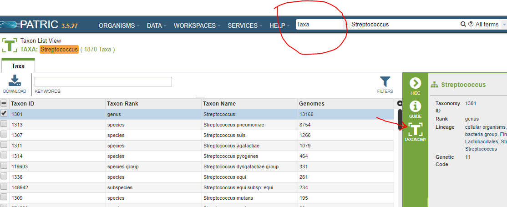
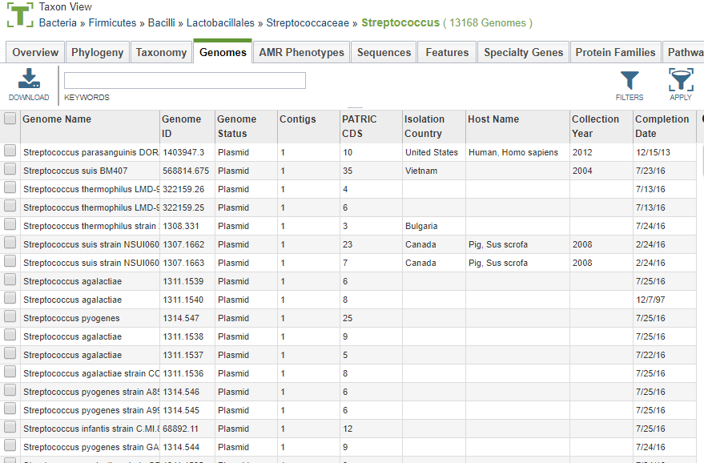
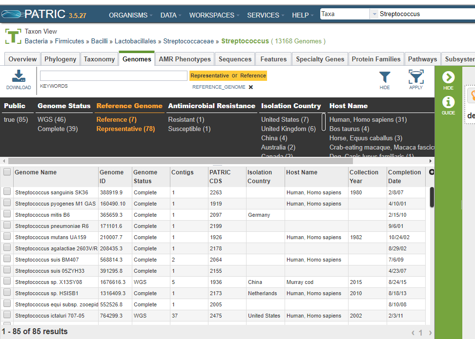
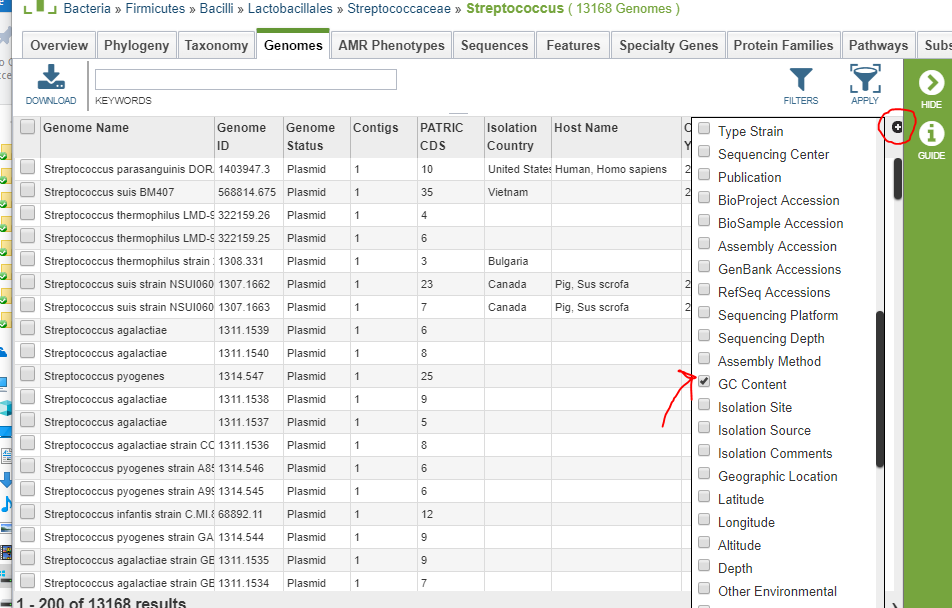
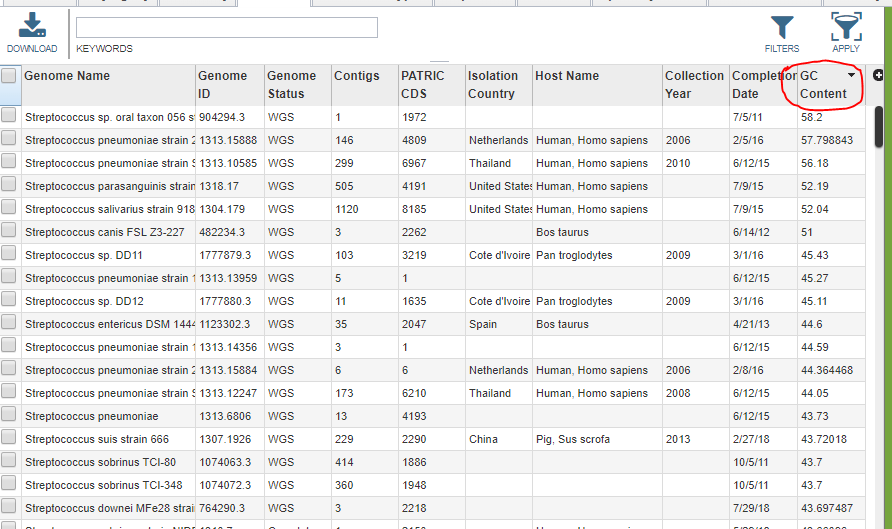
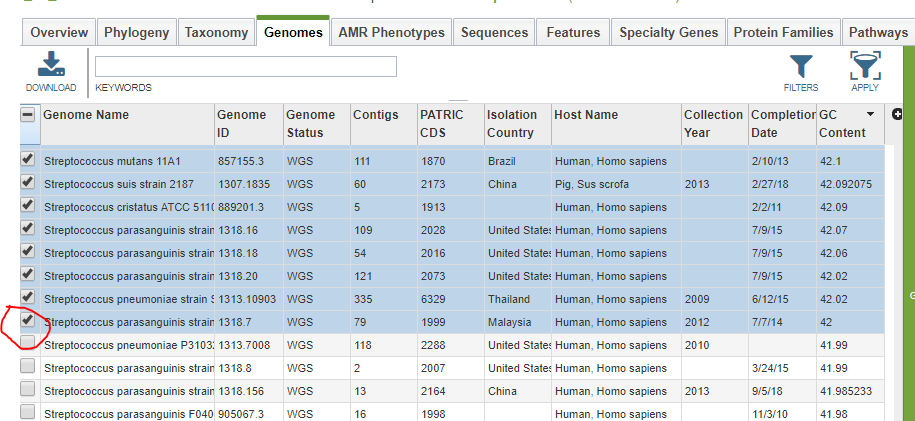

============================================
 Locating All Genomes for a Taxonomic Group
============================================

To find a particular taxonomic grouping in PATRIC, search by name using the **Taxa** option.
In the screen shot below, we searched for *Streptococcus*.  The search type is circled in red.

The taxonomic groupings are sorted by the number of genomes, from biggest to smallest.  The group you
want is usually the first one in the list.  If you check its checkbox, the **Taxonomy** button will
appear on the green control bar (see red arrow).  Click it to get the taxonomy page.

The taxonomy page is described in detail under *Taxon View* at :doc:`/user_guides/website_views`. The
genome list is available on the **Genomes** tab.

Once you have your genome list, you can filter it at will using :doc:`/user_guides/tables`.

.. _rep-ref-taxon-section:

Finding the Representative and Reference Genomes
------------------------------------------------

Use the *Filter* button on the top right to display the filter selection box.  Each column is an
OR-type filter:  that is, every genome that has at least one of the options is displayed.  So, to
show only the reference and representative genomes, both options should be selected.  Selecting an
option turns it orange, as shown below.

.. _taxon-exotic-filtering-section:

Filtering the Genomes
---------------------

The filtering system allows you to select genomes based on seven criteria.

# Ownership (public or private)
# Genome Status (WGS, complete, or plasmid)
# Reference/Representative Status
# Antimicrobial Resistance (susceptible, resistant, non-susceptible, or intermediate)
# Isolation Country
# Host name (e.g. human, pig, horse)
# Collection Year

More exotic filtering can be simulated by sorting the genome list.  For example, let us say we wish to
restrict ourselves to genomes with GC content at or over 42%.  To see the GC Content, click on the plus sign
at the top right of the table.  The *GC Content* field checkbox is in the middle of the field list, and the list
is long, so you will have to scroll.

Now click on the column header twice to get it sorted in descending order.  (The first click sorts in ascending order.)

To select only the desired genomes, you need to use a trick.  Click on the first genome to select it, then scroll down
to the last genome with GC percentage of 42 or more and click on its checkbox while holding down the SHIFT key.
All the intermediate genomes will be selected as well.

