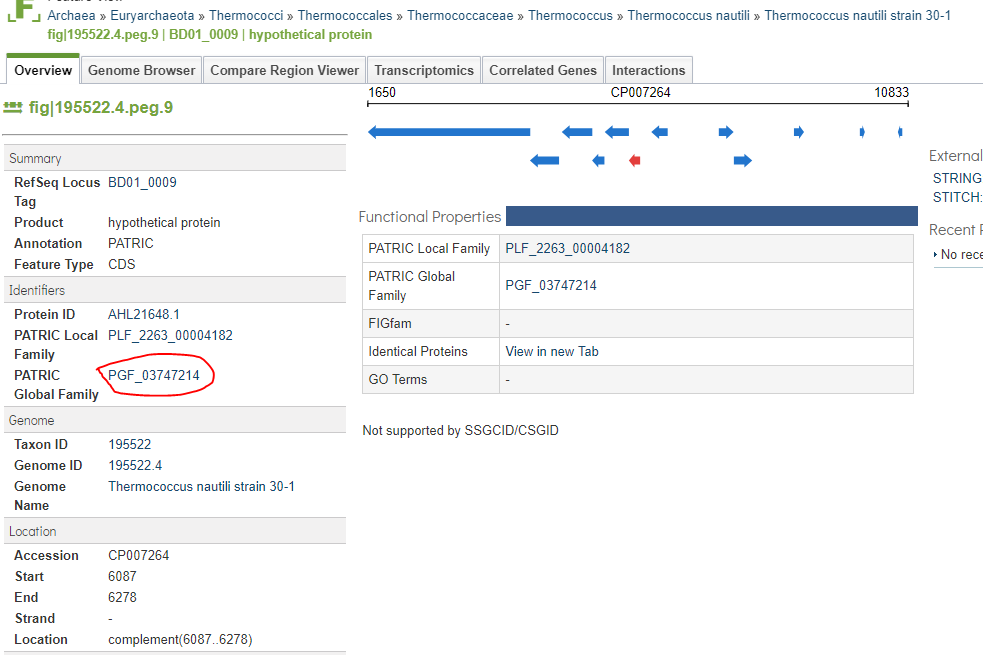
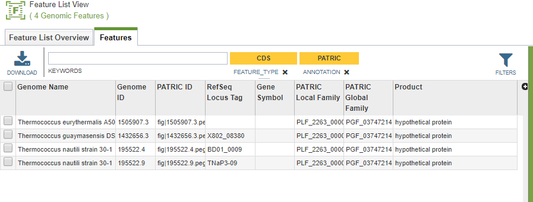
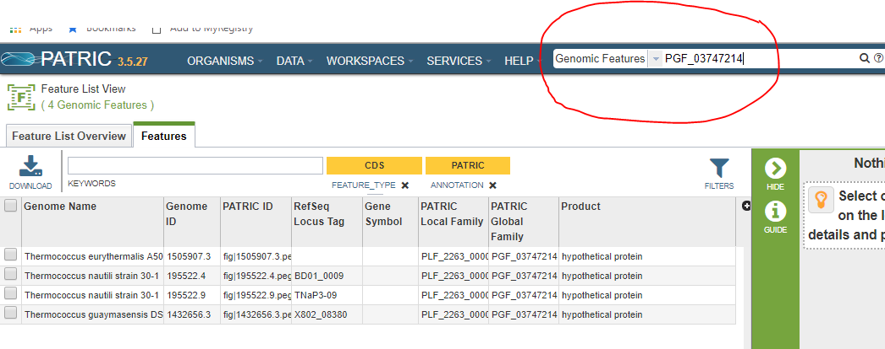
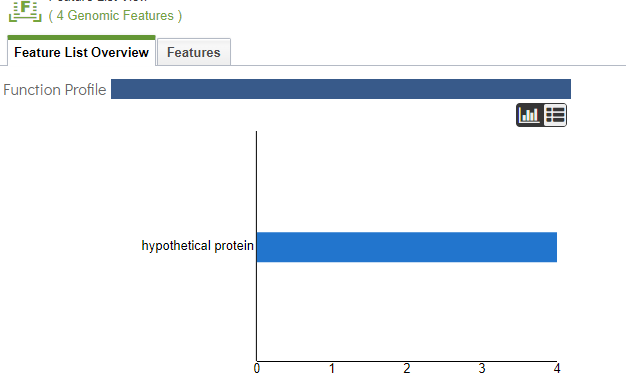

==========================================
 Searching for Features by Protein Family
==========================================

If you know the identifier for a protein family, you may want to work with the protein
family.  The PATRIC protein families contain similar proteins believed to perform the
same function.  They come in two flavors-- global families that spread across all genomes,
and local families restricted to a single genus.  The proteins in your private genomes
are also stored in protein families, but they are not visible to other users.

.. _feature-protein-family-list:

Finding a Feature's Protein Family
----------------------------------

On the Feature Overview tab for a particular feature, the protein family ID is listed if
one was found.

The ID is a clickable link.  Clicking it will take you to the protein family page.

.. _feature-protein-family-id:

Finding a Protein Family by ID
------------------------------

If you know the protein family ID, you can enter the ID in the search bar.  In the example below, we
are looking for the family **PGF_03747214**.  Select *Genomic Features* in
the drop down to get the list of features in the family.

.. _feature-protein-family-function:

Finding the Protein Family Function
-----------------------------------

Once you have listed all the features in a protein family by either of the above methods, you are on a feature
list page.  Simply switch to the *Feature List Overview* tab to see a list of all the functions implemented by
the family.  In almost every case, there will only be one.

