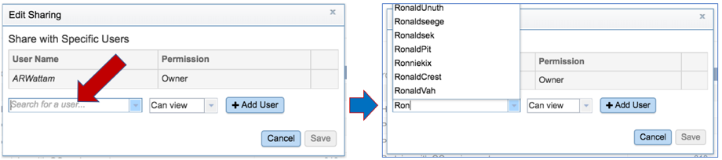
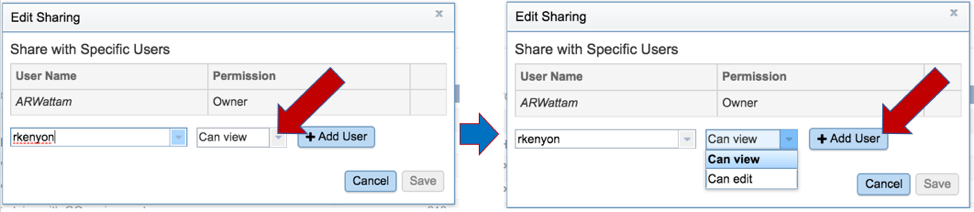
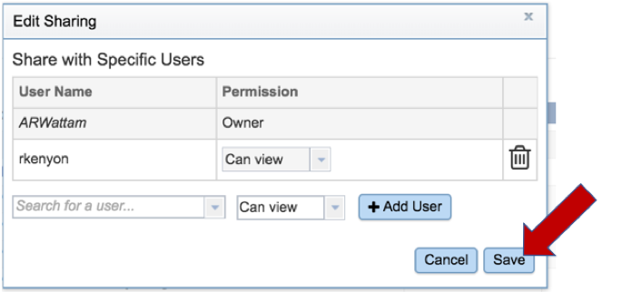

# Sharing a private genome in PATRIC

1.  Click on the Share icon, which is located on the upper far right
    corner of the landing page for your private genome.

2.  This will open a pop-up window that allows you to share your private
    genome with another registered PATRIC user. Start typing the name of
    the registered user in the text box. This will open a drop-down (or
    drop-up) box that shows the list of user names that match the text
    you have entered. Click on the name of the correct user.

3.  The name will now appear in the text box. You can limit that
    person's interaction with your private data to being able only to
    view it, or to edit it. Clicking on the down arrow at the end of the
    Can View text box will allow you to select the privileges that you
    wish the user to have. To add the user, click on the Add User
    button.

4.  Click the Save button at the lower right of the pop-up window. The
    data is now shared between you and the person you selected.

