# Sharing Data in the Workplace

1.	Go to the Workspaces tab, click on it, and then click on Workspaces.
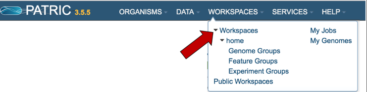

2.	This will open up your workspace.  Click on the new workspace icon (NEW WS) at the top right of the table.
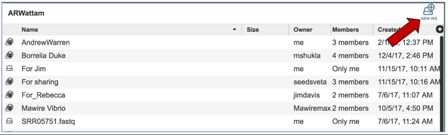

3.	This will open up a pop-up window that allows you to name the workspace.  Click the name of the workspace you will ultimately share in the text box, and then click the Create Workspace button.
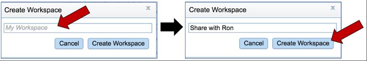

4.	When the new workspace has been created, a message will appear at the bottom left of your workspace indicating that a new workspace has been created.
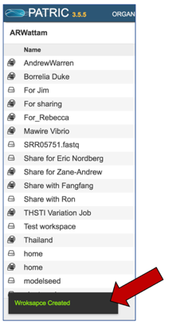

5.	You will see the new workspace under the list of your workspaces.
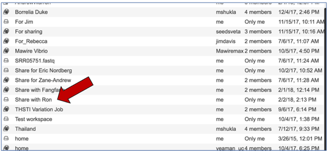

6.	When you want to share it, click on the name of the workspace.  This will populate the vertical green bar to the right with possible actions.  Click on the Share icon.
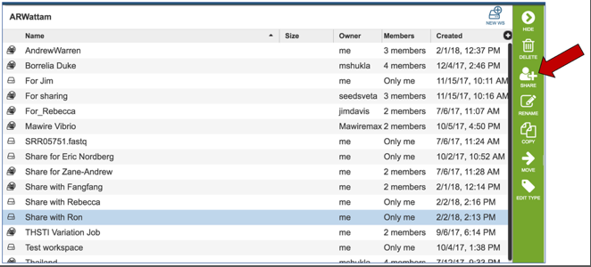

7.	Click on the arrow at the end of the text box that says "Search for a user"
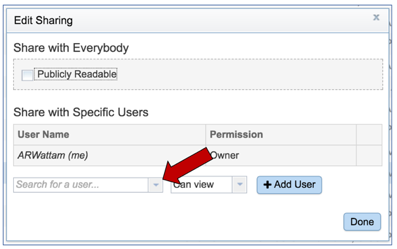

8.	This will open a drop-down list that lists all the PATRIC user IDs.  Pick the ID of the user you want to share with.
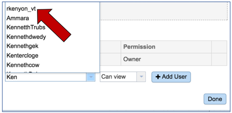

9.	The name of the user will appear in that box.  To restrict the new user to viewing items in the shared workspace, or allow them to edit the information, click on the arrow at the end of the text box that says Can View.  Choose to restrict, or to allow editing.
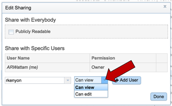

10.	Then click the Add User button.
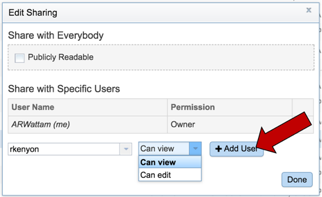

11.	The new name will now appear as one of the specific users.  Click the Done button to finalize the sharing.
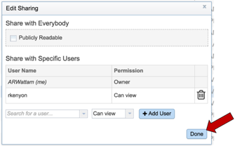

12.	All the workspaces will be visible.  Click on your home workspace.
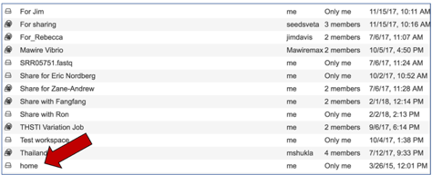

13.	Once you are in your home director, select the data you want to share.  You can share individual files, or folders.  To share a folder, click on the line that has the name of that folder.
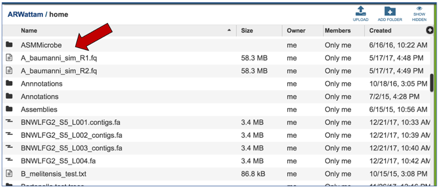

14.	Once you click on that line, the vertical green bar to the right will show all the  possible actions.  Click on the Copy icon.
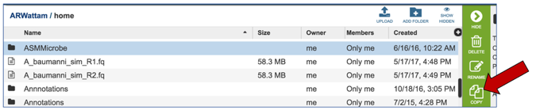

15.	This will open a list of all your workspaces.  Select the workspace you just created, and then click the Ok button.
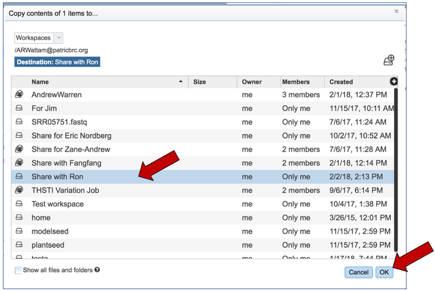

16.	When the folder has been copied, a message will appear at the bottom left of your workspace indicating that the folder has been copied and shared
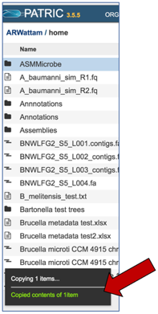