# Similar Genome Finder

## Finding close relatives to a select genome

When a researcher has a new genome sequence, one of the first things they want to identify is the closest relatives of their genome.  PATRIC provides a new service that allows researchers to do this using Mash/MinHash[1].  Mash reduces large sequences and sequence sets to small, representative sketches, from which global mutation distances can be rapidly estimated.  The MinHash dimensionality-reduction technique to include a pairwise mutation distance and P value significance test, enabling the efficient clustering and search of massive sequence collections.

1. At the top of any PATRIC page, find the Services tab. Click on Similar Genome Finder.
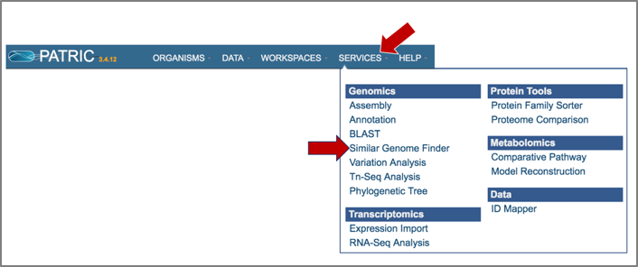

2. This will open up the Similar Genome Finder landing page.
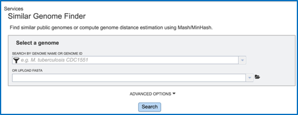

3. To load a genome that has been privately annotated in PATRIC, click on the filter icon that is at the left side of the text box under Search By Genome Name Or Genome ID.
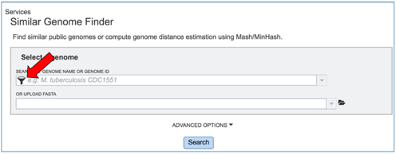

4. This will open a box that allows a researcher to search across all of the public genomes available in PATRIC, or across the genomes that they have annotated and that are stored in their private workspace. To select private genomes, deselect the Public Genomes box. This will leave the Public Genomes box selected.
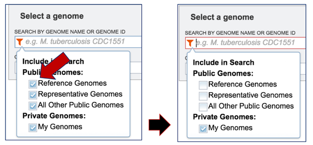

5. Click the down arrow at the right of the text box under Search By Genome Name Or Genome ID. This will open a drop-down box that shows all of the researcher’s private genomes.  Scroll down and find the genome of interest, and then click on it.
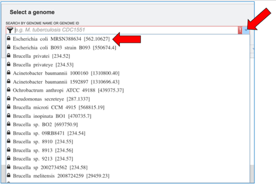

6. This will autofill the name of the genome in the text box. To see options that can be adjusted, click on the down arrow to the right of Advanced Options.
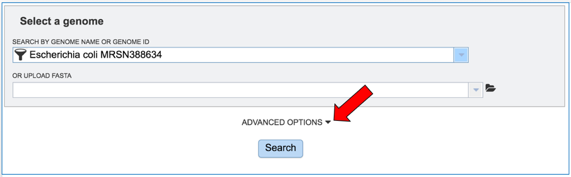

7. This will open a separate box that shows the parameters.
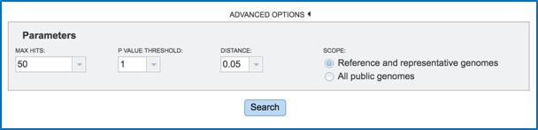

8. Researchers can adjust the number of hits that they want to see, adjust the P Value threshold, set the distance, and filter the search to compare against all the reference or representative genomes, or all the public genomes.
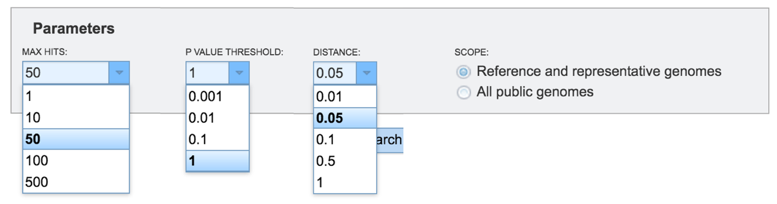

9. Once the parameters of interest have been selected, click the Search button at the bottom of the page.
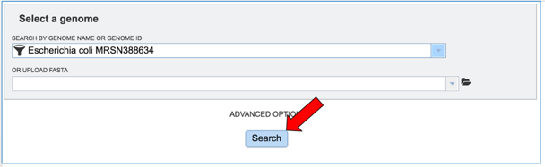

10. The tool will return the top hits to the selected genome. To select all those genomes and create them into a group for downstream analyses, click the check box to the right of the Genome Name column.
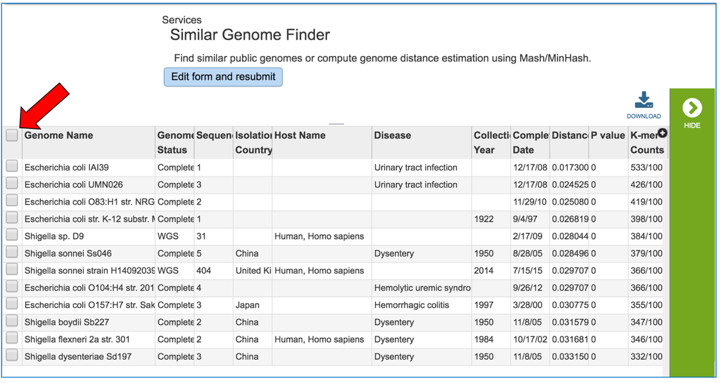

11. This will auto select all the genomes.  In the vertical green bar, click on the Group icon.
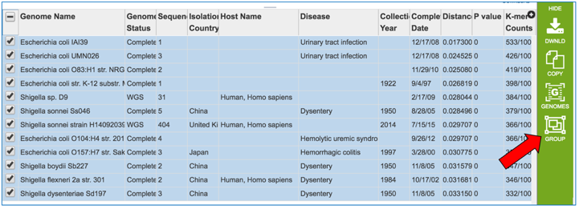

12. This will open a pop-up box.  To save these into a new group, click on the down arrow that follows Existing Group.
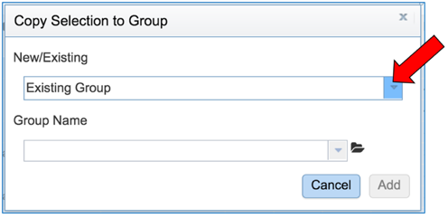

13. Click on New Group.
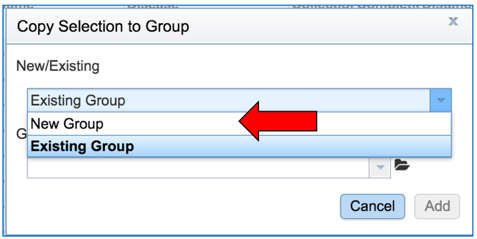

14. Give a name to the group by entering it in the text box under Group Name.  Save the group by clicking the Add button at the bottom of the box.  The group you created will now be saved in your workspace.
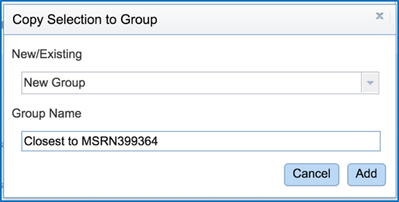

## References

1.	Ondov BD, Treangen TJ, Melsted P et al. Mash: fast genome and metagenome distance estimation using MinHash, Genome biology 2016;17:132.

