# Submitting the Comprehensive Genome Analysis job

1.  Finding the service.

    a.  Click on the Services tab at the top of the page, and then click
        on Comprehensive Genome Analysis (CGA).

    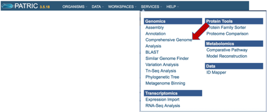

    b.  This will open the landing page for the service.

    

**Input files: Uploading Reads or Contigs.** The default setting is to
analyze reads. PATRIC accepts reads ending in .fq, .fastq, .fa, .fasta,
.fq.gz, .fastq.gz, .fa.gz, .fasta.gz

1.  **Input File-Uploading Paired End Reads.**

    a.  To upload **Paired End Reads**, click on the Folder icon at the
        end of the text box underneath Paired Read Library. This will
        open a pop-up window. Click on the Upload icon in the upper
        right corner.

    

    b.  This will open a new pop-up window. Click on the blue bar that
        says Select File. This will open a pop-up window that gives
        access to files on your computer. Select the file of interest
        and click Open.

    

    c.  The name of the selected file will appear below the grey bar
        that says File Selected. Click on the Start upload button at the
        bottom right of the window. Follow the progress of the upload by
        examining the Upload monitor at the bottom right of the PATRIC
        page. Do not submit the job until the upload progress registers
        100%.

    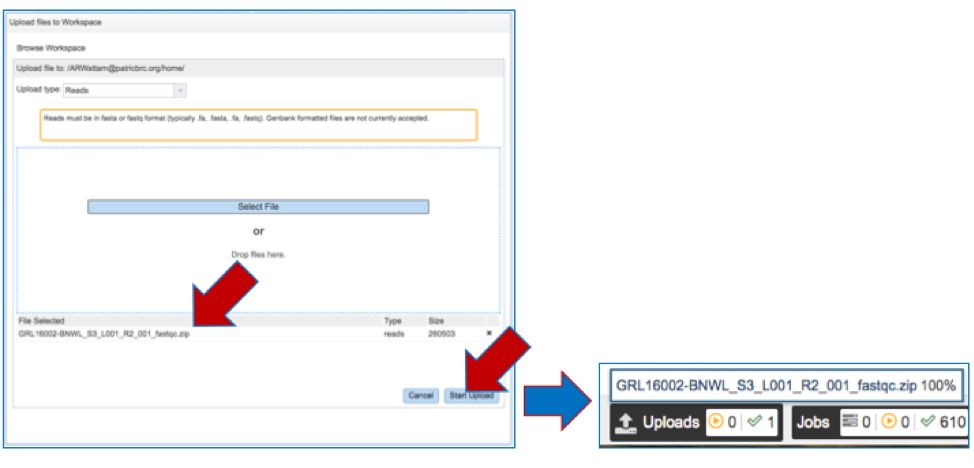

    d.  The name of the selected file will appear in the text box.

> {width="2.9444444444444446in"
> height="2.031948818897638in"}

e.  Repeat the process to upload the other read pair. **Make sure that
    the NAMES OF THE FILES MATCH!**

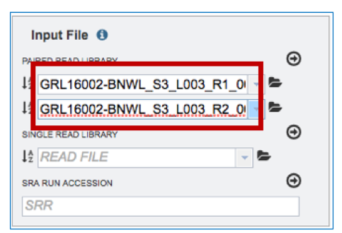

f.  Next move the reads into the Selected libraries box. Click on the
    arrow above the Paired Read library text boxes. Doing this will move
    the paired end reads to the Selected libraries box.

> {width="6.5in" height="1.4833333333333334in"}

g.  Ensure that the reads are correctly paired by clicking on the
    Information icon (i) in the Selected libraries text box.

> 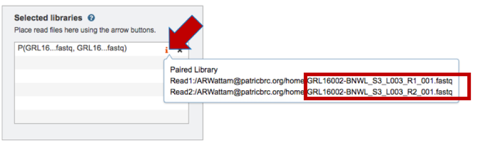{width="6.5in" height="1.9104166666666667in"}

h.  If a mistake has been made, delete the incorrectly matched pairs by
    clicking on the Delete icon (x).

> {width="3.4in" height="2.2547364391951006in"}

i.  Some sequencing labs run several lanes from the same library during
    the sequencing process. The duplicate reads could be uploaded as
    well, if they exist, to create a more robust assembly. If available,
    repeat the process to upload more reads from the same strain.

<!-- -->

2.  **Input File-Using previously uploaded Paired End Reads.** To upload
    previously loaded **Paired End Reads**, click on the down arrow at
    the end of the text box under Paired Read Library. This will open a
    drop-down box that shows all the files that have been uploaded and
    tagged as reads. Clicking on one to select it will load it into the
    text box.

    {width="6.5in" height="1.3972222222222221in"}

<!-- -->

2.  **Input File-Single End Reads**

    c.  To upload **Single End Reads**, follow the instructions listed
        above for Paired End reads, but upload the reads in the text box
        underneath Single Read Library.

    

3.  **Input File-SRR numbers.** To upload reads directly from the
    Sequence Read Archive\[1\], enter the SRR number into the text box
    underneath SRA Run Accession and follow the instructions listed
    above for Paired End reads.

    `

4.  **Input File -- Contigs**. To upload **Contigs**, click on Assembled
    Contigs in the Start With box above Input File.

    

    d.  This will change the display, enabling uploading of contigs to
        the Input File. To upload **Contigs,** follow the instructions
        listed above for Paired End reads, but upload in the text box
        underneath Contigs.

> `

**Selecting Parameters for Comprehensive Genome Analysis**

1.  **Assembly Strategy.** PATRIC offers a number of assembly strategies
    that are listed below.

-   The auto assembly strategy runs BayesHammer\[2\] on short reads,
    followed by three assembly strategies that include Velvet\[3\],
    IDBA\[4\] and Spades\[4\], each of which is given an assembly score
    by ARAST, an in-house script.

-   The fast assembly strategy runs MEGAHIT\[5\] and Velvet, with each
    assembly given a score determined by ARAST.

-   Users can also choose the full spades strategy, which runs
    BayesHammer followed by Spades.

-   Choosing kiki runs the Kiki assembler, an in-house script.

-   Illumina MiSeq reads should be assembled using miseq, which runs
    Velvet with hash length 35, and then BayesHammer on reads and
    assembles with SPAdes with k up to 99, followed by a score using
    ARAST.

-   Plasmid runs BayesHammer on reads and assembles with
    plasmidSPAdes\[6\].

-   The smart strategy can be used for long or short reads. The strategy
    for short reads when using smart involves running BayesHammer on
    reads, KmerGenie\[7\] to choose hash-length for Velvet, followed by
    the same assembly strategy using Velvet, IDBA and Spades. Assemblies
    are sorted with an ALE score\[8\] and the two best assemblies are
    merged using GAM-NGS\[9\].

-   PacBio and Nanopore long reads only work with the auto and smart
    strategies. In either case, they are automatically assembled using
    Miniasm\[10\].

> To select one of the strategies, click on the down arrow at the end of
> the text box under Assembly Strategy.
>
> 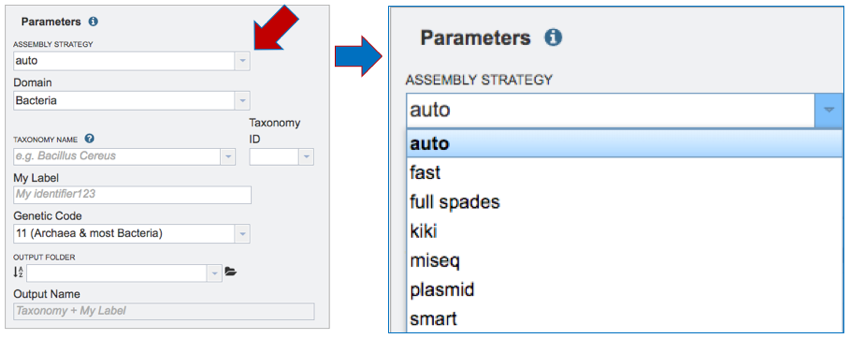

2.  **Domain.** Select Bacteria or Archaea for the Domain that reflects
    the sequenced genome.

    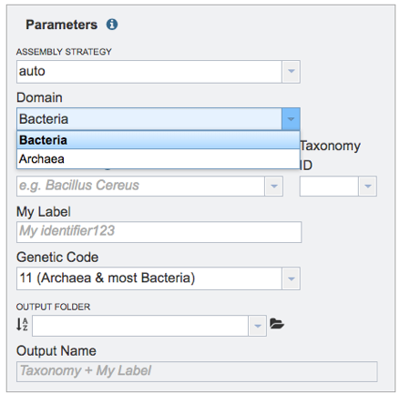

3.  **Taxonomy Name.** Begin typing in the lowest ranked taxonomic name
    known for the sequenced isolate. It is best to be able to get to
    Genus, if possible. Once typing begins, a drop-down box will
    automatically appear with the taxonomic names in PATRIC that match
    the entered text. Click on the most appropriate name. This will fill
    the text box under Taxonomy Name with the selected name, and also
    include the Taxonomy ID. If the Taxonomy ID is known, that can be
    filled in and the ID and matching taxonomy name will be auto filled.

    

4.  **My Label.** Give the genome a unique name by entering text in the
    box underneath My Label. The name that is entered will appear in the
    Output Name in the lowest text box.

    

5.  **Genetic Code.** Select the appropriate genetic code for the
    isolate.

    

6.  **Output Folder-Previously named.** If a folder has been previously
    created, start typing the name in the text box underneath Output
    Folder, which will open a drop-down list of all folders in the
    workspace that match that text. Click on the appropriate folder.

    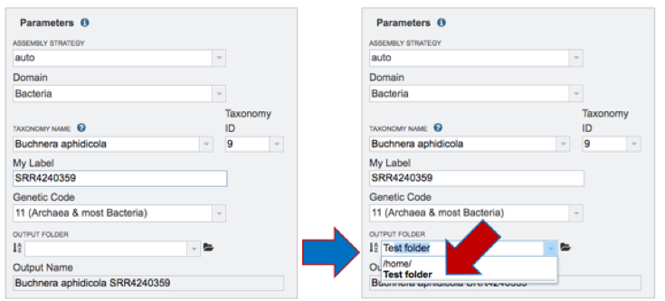

7.  **New Output Folder.** To create a new folder for the job, click on
    the folder icon at the end of the text box underneath Output Folder.
    This will open a pop-up window. Click on the folder icon at the top
    right.

> 

a.  This will open a new pop-up window. Enter the name of the folder in
    the text box, and then click the Create Folder button.

    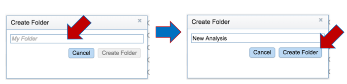

b.  The original pop-up window will appear. Find the name of the new
    folder, select it, and then click the OK button at the bottom right
    of the window. This will fill the name of the selected folder into
    the text box under Output Folder.

    

**Submitting the Comprehensive Genome Analysis job**

1.  When all the parameters are entered correctly, the Submit button at
    the bottom of the page will turn blue. Click on that button, and the
    will enter the queue. You can monitor the progress on the Jobs page.

> 

**Finding the Comprehensive Genome Analysis job**

1.  Click on the Jobs monitor at the bottom right of any PATRIC page.

> 

2.  This will open the page where all jobs submitted to PATRIC are
    listed. Every Comprehensive Genome Analysis (CGA) job also launches
    an assembly and annotation job, which can be found imimagestely below
    the row that list the CGA job. To find out more information about
    the CGA job, click on the job of interest, and then on the view icon
    in the vertical green bar.

> 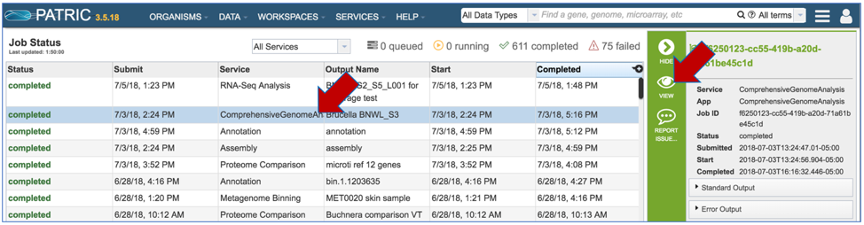

3.  PATRIC now provides a genome announcement style document for any
    genome annotated using the Comprehensive Genome Analysis service. To
    see this document, select the row that contains the
    FullGenomeReport.html and click on the download icon in the vertical
    green bar.

> 
4.  Select an appropriate location on your computer and save the
    document, and then open it. You can view the document in any web
    browser

> 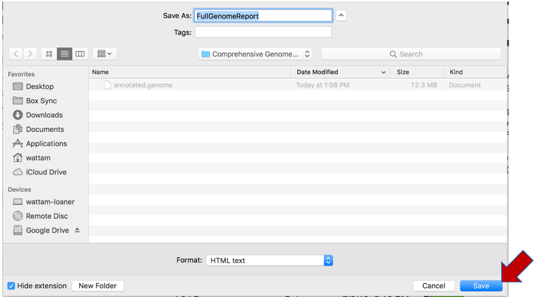
5.  The full genome report provides a detailed summary of the genome. It
    begins with a summary of the genome quality, and then provides
    information for each step of the service, which includes assembly,
    annotation, and analysis of specialty genes and functional
    categories, and a phylogenetic tree of the new genome and its
    closest high-quality relatives.

6.  The summary will indicate is the genome is of good or poor quality.

7.  Scrolling down to Genome Assembly will summarize the method selected
    for assembly and provide the statistics of interest. These
    statistics are those commonly provided when a genome is submitted as
    part of a publication.

8.  The Genome Annotation section describes the taxonomy of the genome,
    and genes and their functional divisions.

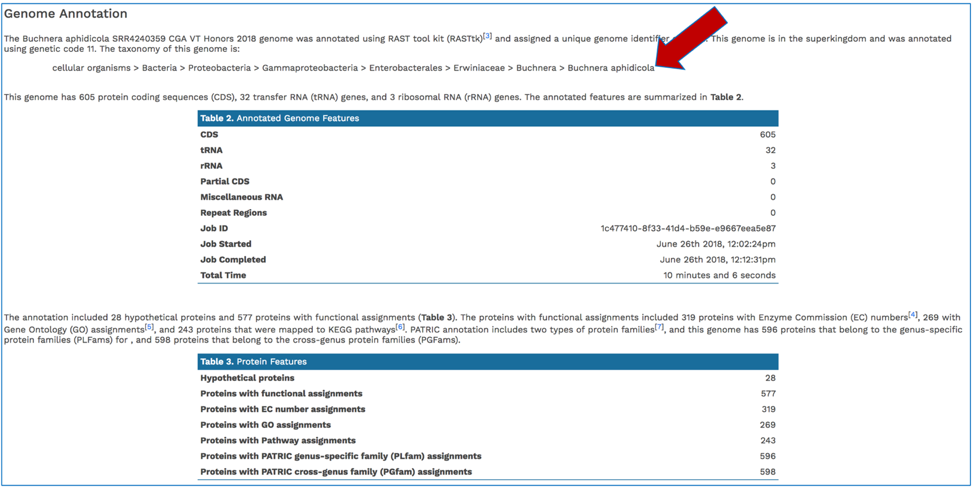

9.  The Genome Annotation section also includes a circular diagram of
    the genes, their orientation, homology to AMR genes and virulence
    factors, and GC content and skew. Genes on the forward and reverse
    strands are colored based on the subsystem\[11\] that they belong
    to. A separate, downloadable svg or png of the circular graph image
    is available in the jobs list.

10. PATRIC BLASTs all genes in a new genome against specialty gene
    databases, including genes known to provide antibiotic resistance,
    virulence factors, and known drug targets. The CGA service shows the
    hits in the new genome have to those databases in a tabular form.

11. In addition, PATRIC provides a k-mer based detection method for
    antimicrobial resistance genes and shows the number of genes that
    share these k-mers.

12. PATRIC's subsystem analysis identifies genes based on specific
    biological processes that they are hypothesized to be active in. The
    full genome report includes a pie chart showing the subsystems
    superclasses\[11\], and an indication of the number of subsystems
    within that superclass (first number) and the number of annotated
    genes that are part of the superclass (second number).

13. The CGA service identifies the closest relatives to the selected
    genome. It picks the closest reference and representative genomes
    using Mash/MinHash\[12\], and then takes twenty of PATRIC's global
    protein families\[13\] that are shared across all the selected
    genomes to build a tree based on the amino acid and nucleotide
    alignments of those proteins, which are aligned using MUSCLE\[14\],
    and RaxML\[15\] is used to build the tree.. The genome submitted to
    the CGA is in red.

    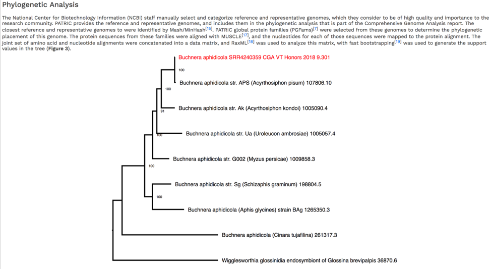

14. The newick file (.nwk) for the tree is available in the jobs list
    and can be used to construct the tree in another tree viewing
    program like FigTree (<http://tree.bio.ed.ac.uk/software/figtree/>)
    or the Interactive Tree of Life (https://itol.embl.de/).

    

**Viewing the genome in PATRIC**

1.  To view the integrated genome in PATRIC, double click on the row
    that has the flag icon and annotation in the landing page for the
    CGA job.

2.  This will open a new page. Click on the view icon at the top right
    of the table.

> 

3.  This will open the genome landing page for the genome that was
    assembled, annotated and analyzed using the CGA service.

**References**

1\. Kodama, Y., M. Shumway, and R. Leinonen, *The Sequence Read Archive:
explosive growth of sequencing data.* Nucleic acids research, 2012.
**40**(D1): p. D54-D56.2. Nikolenko, S.I., A.I. Korobeynikov, and M.A.
Alekseyev, *BayesHammer: Bayesian clustering for error correction in
single-cell sequencing.* BMC genomics, 2013. **14**(1): p. S7.3.
Zerbino, D.R. and E. Birney, *Velvet: algorithms for de novo short read
assembly using de Bruijn graphs.* Genome research, 2008. **18**(5): p.
821-829.4. Peng, Y., et al. *IDBA--a practical iterative de Bruijn graph
de novo assembler*. in *Annual international conference on research in
computational molecular biology*. 2010. Springer.5. Li, D., et al.,
*MEGAHIT: an ultra-fast single-node solution for large and complex
metagenomics assembly via succinct de Bruijn graph.* Bioinformatics,
2015. **31**(10): p. 1674-1676.6. Antipov, D., et al., *plasmidSPAdes:
assembling plasmids from whole genome sequencing data.* bioRxiv, 2016:
p. 048942.7. Namiki, T., et al., *MetaVelvet: an extension of Velvet
assembler to de novo metagenome assembly from short sequence reads.*
Nucleic acids research, 2012. **40**(20): p. e155-e155.8. Clark, S., et
al., *ALE: a generic assembly likelihood evaluation framework for
assessing the accuracy of genome and metagenome assemblies.*
Bioinformatics, 2013: p. bts723.9. Vicedomini, R., et al., *GAM-NGS:
genomic assemblies merger for next generation sequencing.* BMC
bioinformatics, 2013. **14**(7): p. S6.10. Li, H., *Minimap and miniasm:
fast mapping and de novo assembly for noisy long sequences.*
Bioinformatics, 2016. **32**(14): p. 2103-2110.11. Overbeek, R., et al.,
*The SEED and the Rapid Annotation of microbial genomes using Subsystems
Technology (RAST).* Nucleic Acids Res, 2014. **42**(Database issue): p.
D206-14.12. Ondov, B.D., et al., *Mash: fast genome and metagenome
distance estimation using MinHash.* Genome biology, 2016. **17**(1): p.
132.13. Davis, J.J., et al., *PATtyFams: Protein Families for the
Microbial Genomes in the PATRIC Database.* Front Microbiol, 2016. **7**:
p. 118.14. Edgar, R.C., *MUSCLE: multiple sequence alignment with high
accuracy and high throughput.* Nucleic acids research, 2004. **32**(5):
p. 1792-1797.15. Stamatakis, A., *RAxML version 8: a tool for
phylogenetic analysis and post-analysis of large phylogenies.*
Bioinformatics, 2014. **30**(9): p. 1312-1313.
