# Taxonomic Classification
Metagenomics is the study of genomic sequences obtained directly from an environment. For many metagenomic samples, the species, genera and even phyla present in the sample are largely unknown at the time of sequencing, and the goal of sequencing is to determine the microbial composition as precisely as possible. The PATRIC Taxonomic Classification service can be used to identify the microbial composition of metagenomic samples. Researchers can submit their metagenomic samples that are reads (paired-or single-end, long or short, zipped or not) or contigs to the service, as well as the Sequence Read Archive accession numbers. This service uses Kraken 21. Kraken, first released in 2014, has been shown to provide exceptionally fast and accurate classification for shotgun metagenomics sequencing projects. Kraken 2, which matches the accuracy and speed of Kraken 1, supports 16S rRNA databases.  Kraken uses exact-match database queries of k-mers, rather than inexact alignment of sequences.  Sequences are classified by querying the database for each k-mer in a sequence, and then using the resulting set of lowest common ancestor (LCA) taxa to determine an appropriate label for the sequence.

## I. Locating the Taxonomic Classification Service App

1. At the top of any PATRIC page, find the Services tab.

2. Click on Taxonomic Classification.
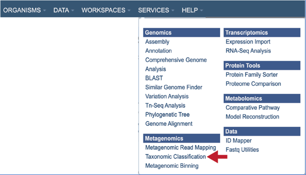

3. This will open up the Taxonomic Classification landing page where researchers can submit long reads, single or paired read files, an SRA run accession number, or assembled contigs to the service.

## II. Uploading paired end reads

Paired read libraries are usually given as file pairs, with each file containing the forward or reverse half of each read pair. Paired read files are expected to be sorted in such a way that each read in a pair occurs in the same Nth position as its mate in their respective files. These files are specified as READ FILE 1 and READ FILE 2. For a given file pair, the selection of which file is READ 1 or READ 2 does not matter.

1.	To upload a fastq file that contains paired reads, locate the box called “Paired read library.”

2.	The reads must be located in the workspace to submit them to a PATRIC service.  To initiate the upload, first click on the folder icon.

3.	This opens up a pop-up window where the files for upload can be selected.  Click on the icon with the arrow pointing up.
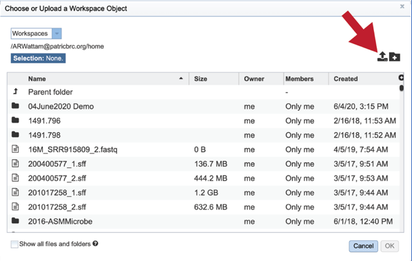

4.	This opens a new pop-up window where the file can be selected.  Click on the “Select File” in the blue bar.

5.	This will open a window that allows you to choose files that are stored on your computer.  Select the file where you stored the fastq file and click “Open”.
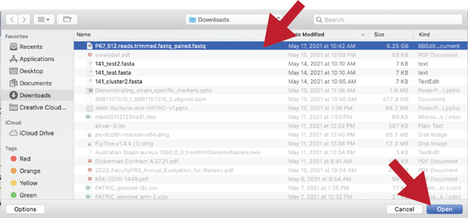

6.	Once selected, it will autofill the name of the file. You can see it in the screenshot below. Click on the Start Upload button.
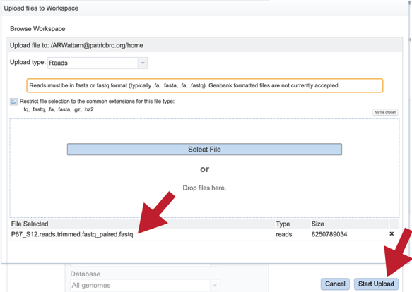

7.	This will auto-fill the name of the document into the text box as seen below.

8.	Pay attention to the upload monitor in the lower right corner of the PATRIC page. It will show the progress of the upload. Do not submit the job until the upload is 100% complete.

9.	Repeat steps 2-5 to upload the second pair of reads.
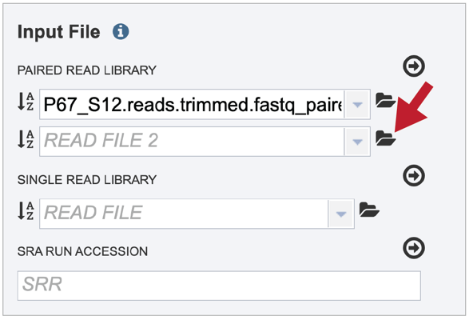

10.	To finish the upload, click on the icon of an arrow within a circle. This will move your file into the Selected libraries box.
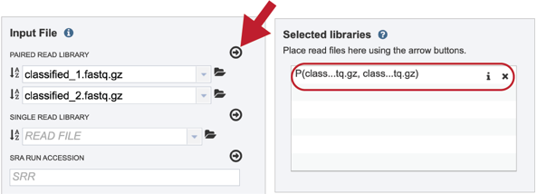

## III. Uploading single reads

1.	To upload a fastq file that contains single reads, locate the text box called “Single read library.”

2.	If the reads have previously been uploaded, click the down arrow next to the text box below Read File.

3.	This opens up a drop-down box that shows the all the reads that have been previously uploaded into the user account. Click on the name of the reads of interest.
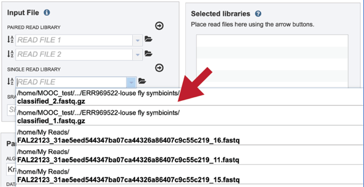

4.	This will auto-fill the name of the document into the text box as seen below.
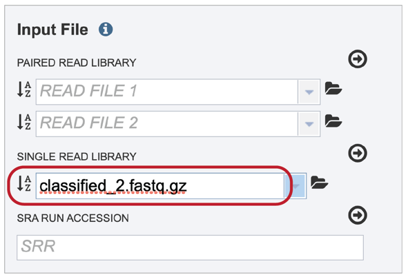

5.	To finish the upload, click on the icon of an arrow within a circle. This will move your file into the Selected libraries box.

## IV. Submitting reads that are present at the Sequence Read Archive (SRA)
1.	BV-BRC also supports analysis of existing datasets from SRA. To submit this type of data, locate the Run Accession number and copy it.

2.	Paste the copied accession number in the text box underneath SRA Run Accession, then click on the icon of an arrow within a circle.
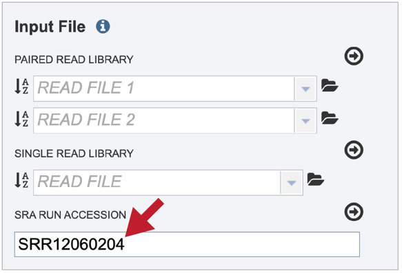

3.	This will move the file into the Selected libraries box.

## V. Submitting assembled contigs

1.	To submit a taxonomic classification job that uses contigs, click on the check box in front of Assembled Contigs in the upper box. Clicking on the folder icon.

2.	This will open a pop-up window that shows data in the private workspace that can be selected. The upload icon in the upper right can also be used to upload contig files that might exist on your computer.

3.	Clicking on the down arrow next to the contigs text box will show fasta files (ending in .fa or .fasta) that have been recently accessed in the private workspace.
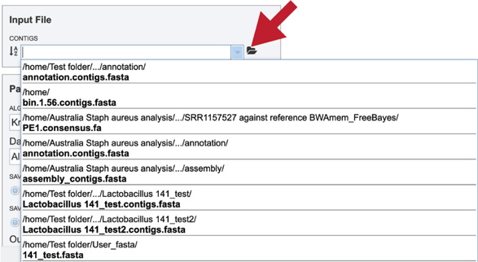

## VI. Selecting parameters

Parameters must be selected prior to job submission. The algorithm used for Taxonomic Classification is Kraken21, which uses exact alignment of k-mers for classification accuracy. The Kraken2 algorithm was downloaded from the following source: https://ccb.jhu.edu/software/kraken2/
The only database selection currently is only “All genomes”.

1.	You can choose to save the classified sequences (meaning that those reads or contigs that mapped to the k-mers in the all genomes database) and/or the unclassified sequences (those that do not map to those k-mers).  If either (or both) of those options are selected, the files will be available in the output folder when the job is completed.

2.	A folder must be selected for the Taxonomic Classification job. Clicking on the down arrow at the end of the text box underneath Output Folder will show recent folders that have been used. Clicking on the folder icon at the end of the text box will open a pop-up window where all folders can be viewed, or new folders created. You can also start typing the name of a folder in the text box.  A drop-down box will appear that shows folders that match what you entered.

3.	Click on the desired folder.
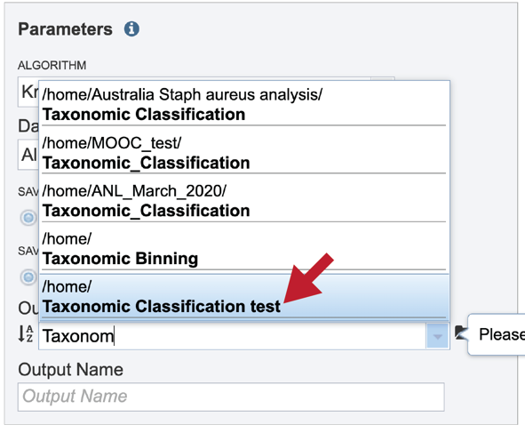

4.	The name of the folder will now appear in the box.  

5.	A name for the job must be entered in the text box under Output Name. At this point, the Submit button turns blue and the job will be submitted once clicked.  
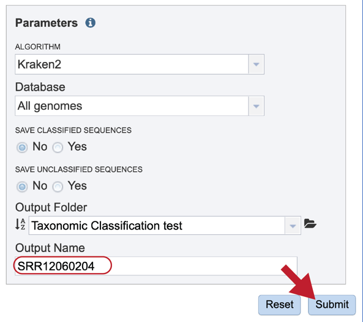

6.	After clicking the submit button, your job will be launched.  A successful submission will generate a message indicating that the job has been queued.  

The bottom of each PATRIC page has an indicator that shows the number of jobs that are queued, running or completed. Clicking on the word Jobs will rewrite the page to show the Job status. Researchers can monitor the Jobs Status page to see the status of their job, which is indicated in the first column (Queued, Running, Complete, Failed).

## VII. Viewing the Taxonomic Classification job – Output files

1.	To access your job, you can click on the Jobs part of your Jobs monitor.

2.	This will open your Jobs page.

3.	Clicking on the row that contains the job of interest will open two icons in the vertical green bar.  To view the job, click on the View icon.
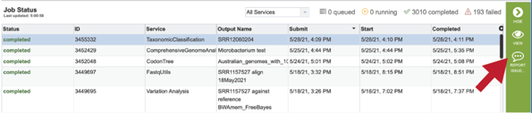

4.	This will open a pop-up window where issues with particular jobs can be reported. A description of the particular problem can be provided and clicking the submission button will generate a message to PATRIC team members, notifying them that there has been a problem. We encourage researchers to report all failed jobs, or those that have results that are confusing. In addition, researchers should report long waits that they are experiencing in the queue.

5.	A job that has been successfully completed can be viewed by clicking on the row (which will turn the row blue) and then clicking on the View icon in the vertical green bar.

6.	This will open a page for the selected job. The top box has the job ID number and gives pertinent information about the time it took to complete and the selected parameters. The lower table has five output file, but if the classified an/or unclassified reads are selected when the job was submitted, it will have one or two additional rows.
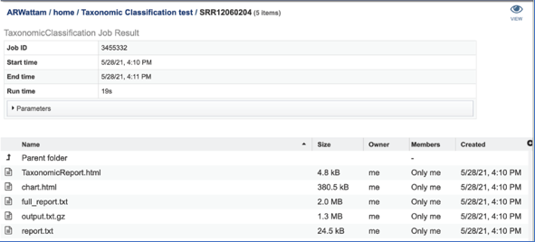

7.	Click on the TaxonomicReport.html. This will populate the vertical green bar with a number of icons. Click on the Guide icon.
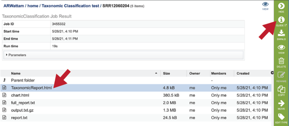

8.	This will open a new tab where you can see the user guide for this particular page, describing what you are seeing on the output page.

9.	Back on the output page, in the vertical green bar you will see icons for downloading the data, viewing it, deleting the file, renaming the file, copying or sharing it with another PATRIC user, moving it to a different director, or changing the type tagged to the file. With the TaxonomicReport.html file selected, click on the View icon.
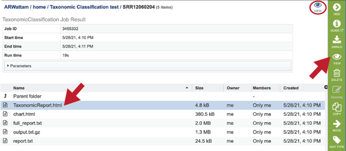

10. This will rewrite the page to show Kraken2’s standard output report format. 

11.	The top of the TaxonomicReport.html page includes the SRA run accession number (if that was used).  This is a hyperlink and clicking on it will open a new tab that shows the landing page for the data in the Sequence Read Archive.

12.	Further down in the TaxonomicClassification.html page, there is a line that says “Results: (Click here to view Interactive Chart).  Clicking on that will open an interactive, visual description of the results using Krona(2).

13.	This view has a search box at the top of the page.  Entering any text will search the graph for text that matches the entry.
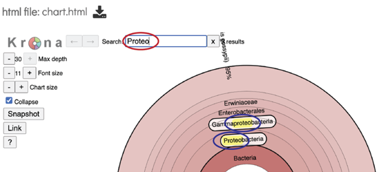

14.	At the top of the view, there are several controls that can be used to change the visualization or download the data.

15.	The image can be downloaded by clicking on the Download icon at the top of this page.

16.	The number of circles shown in the graph can be changed by increasing the number (+) or decreasing the number (-) using the Max depth function.

17.	The font size in the visualization can be changed by using the buttons to decrease (-) or increase (+) it in front of the words Font size.

18.	Change the chart size.

19.	You can see the taxonomy spectrum by clicking on a region of interest in the Krona chart.  This will rewrite the view to show how the data mapped within the particular taxon selected.

20.	Following the changes, a snapshot of the new image can be downloaded by clicking on Snapshot.

21. A shareable link will also be generated if Link is clicked.

22.	A link to the Krona documentation can be viewed by clicking on the question mark (?) icon.

23. Going back to the TaxonomicReport.html page, and underneath the link to the Krona diagram is a table that shows Kraken 2’s standard sample report format, which is tab-delimited with one line per taxon. The fields of the output, from left-to-right, are as follows:
   * Percentage of fragments covered by the clade rooted at this taxon
   * Number of fragments covered by the clade rooted at this taxon
   * Number of fragments assigned directly to this taxon
   * A rank code, indicating (U)nclassified, (R)oot, (D)omain, (K)ingdom, (P)hylum, (C)lass, (O)rder, (F)amily, (G)enus, or (S)pecies. Taxa that are not at any of these 10 ranks have a rank code that is formed by using the rank code of the closest ancestor rank with a number indicating the distance from that rank. E.g., “G2” is a rank code indicating a taxon is between genus and species and the grandparent taxon is at the genus rank.
   * NCBI taxonomic ID number
   * Indented scientific name

24.	Clicking on any of the names in the blue text will open the landing page for the selected taxon. 

25.	Returning to the job output page, click the chart.html row and then click the View icon. This will re-write the page with the Kronos image described above.

26.	The full_report.txt is a downloadable text file of the results seen in the report.txt file, but also includes taxonomy entries for which there were zero hits. To view this file, select the row and then click on the View icon.

27.	The full report contains any taxonomy entry which has one percent or more of the total hits, but also includes taxonomy entries for which there were zero hits.

28.	The output.txt.gz contains information about each input sequence. This will be a large file that should be downloaded in order to view it.

29. The report.txt report can be viewed by selecting the row and then clicking on the View icon in the vertical green bar.

30.	This will rewrite the page to show the report.  It  contains any taxonomy entry which has one percent or more of the total hits.

## References
1. Lu, J. & Salzberg, S. L. Ultrafast and accurate 16S rRNA microbial community analysis using Kraken 2. Microbiome 8, 1-11 (2020).
2. Ondov, B. D., Bergman, N. H. & Phillippy, A. M. Interactive metagenomic visualization in a Web browser. BMC bioinformatics 12, 385 (2011).
