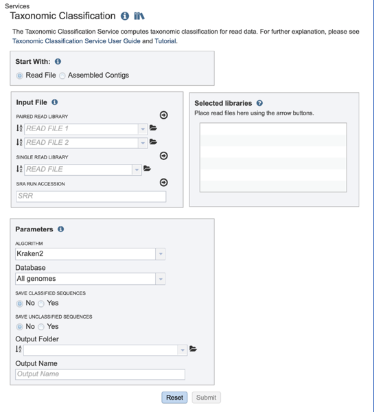
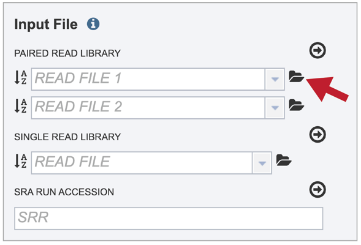
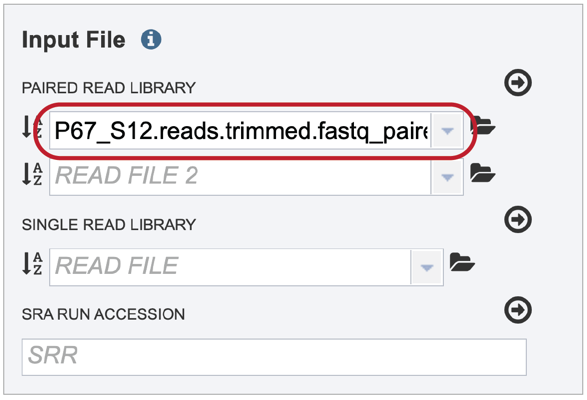
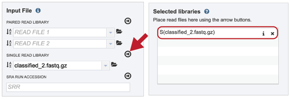
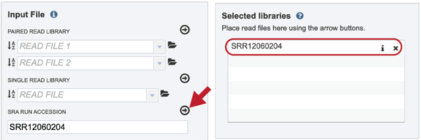
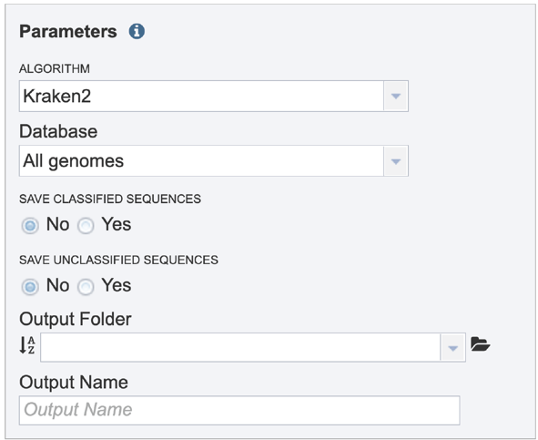
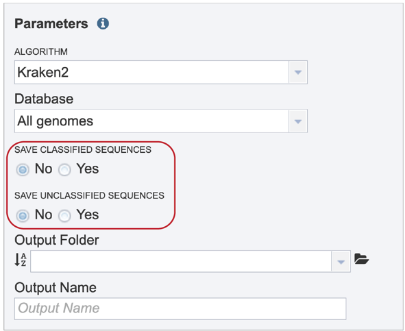
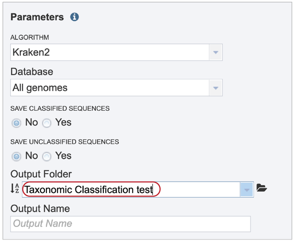
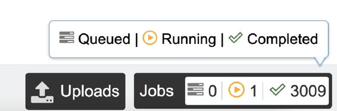
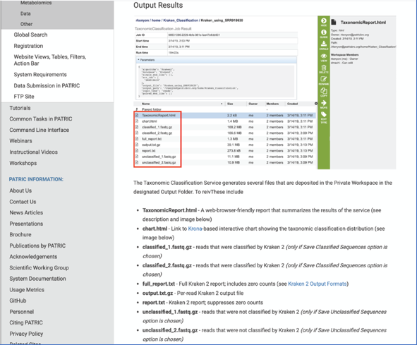

:github_url: https://github.com/PATRIC3/p3_docs/blob/master/docroot/tutorial/taxonomic_classification/taxonomic_classification.rst

===================================
Taxonomic Classification at PATRIC
===================================

Metagenomics is the study of genomic sequences obtained directly from an environment. For many metagenomic samples, the species, genera and even phyla present in the sample are largely unknown at the time of sequencing, and the goal of sequencing is to determine the microbial composition as precisely as possible.  The PATRIC Taxonomic Classification service can be used to identify the microbial composition of metagenomic samples.  Researchers can submit their metagenomic samples that are reads (paired-or single-end, long or short, zipped or not) to the service, as well as, Sequence Read Archive accession numbers or contigs.

I.  Locating the Taxonomic Classification Service App
------------------------------------------------------

1. At the top of any PATRIC page, find the Services tab.

2. Click on Taxonomic Classification.

.. image:: images/Picture2.png

3. This will open up the Taxonomic Classification landing page where researchers can submit long reads, single or paired read files, an SRA run accession number, or assembled contigs to the service.

II. Uploading paired end reads
-------------------------------

Many paired read libraries are given as file pairs, with each file containing half of each read pair. Paired read files are expected to be sorted in such a way that each read in a pair occurs in the same Nth position as its mate in their respective files. These files are specified as READ FILE 1 and READ FILE 2. For a given file pair, the selection of which file is READ 1 and which is READ 2 does not matter.

1. To upload a fastq file that contains paired reads, locate the box called “Paired read library.”

2. The reads must be located in the workspace.  To initiate the upload, first click on the folder icon.

3. This opens up a window where the files for upload can be selected.  Click on the icon with the arrow pointing up.

.. image:: images/Picture6.png

4. This opens a new window where the file you want to upload can be selected.  Click on the “Select File” in the blue bar.

5. This will open a window that allows you to choose files that are stored on your computer.  Select the file where you stored the fastq file on your computer (red arrow) and click “Open”.

.. image:: images/Picture8.png

6. Once selected, it will autofill the name of the file.  You can see it in the screenshot below.  Click on the Start Upload button.

.. image:: images/Picture9.png

7. This will auto-fill the name of the document into the text box as seen below. 

8. Pay attention to the upload monitor in the lower right corner of the PATRIC page.  It will show the progress of the upload.  Do not submit the job until the upload is 100% complete.

.. image:: images/Picture11.png

9. Repeat steps 2-5 to upload the second pair of reads.

.. image:: images/Picture12.png

10. To finish the upload, click on the icon of an arrow within a circle. This will move your file into the Selected libraries box

.. image:: images/Picture13.png

III.  Uploading single reads
-----------------------------

1. To upload a fastq file that contains single reads, locate the text box called “Single read library.”

2. If the reads have previously been uploaded, click the down arrow next to the text box below Read File.

.. image:: images/Picture15.png

3. This opens up a drop-down box that shows the all the reads that have been previously uploaded into the user account.  Click on the name of the reads of interest.

.. image:: images/Picture16.png

4. This will auto-fill the name of the document into the text box as seen below.

.. image:: images/Picture17.png

5. To finish the upload, click on the icon of an arrow within a circle.  This will move your file into the Selected libraries box where it is ready to be assembled

IV.  Submitting reads that are present at the Sequence Read Archive (SRA)
--------------------------------------------------------------------------

1. PATRIC also supports analysis of existing datasets from SRA. To submit this type of data, locate the Run Accession number and copy it.

2. Paste the copied accession number in the text box underneath SRA Run Accession, then click on the icon of an arrow within a circle.

.. image:: images/Picture20.png

3. This will move the file into the Selected libraries box where it is ready to be assembled

V.  Submitting assembled contigs
---------------------------------

1. To submit a taxonomic classification job that uses contigs, click on the check box in front of Assembled Contigs in the upper box.  Clicking on the folder icon.

2.  This will open a pop-up window that shows data in the private workspace that can be selected.  The upload icon in the upper right can also be used to upload contig files that might exist on your computer.

3.	Clicking on the down arrow next to the contigs text box will show .fa files that have been recently accessed in the private workspace.

.. image:: images/Picture24.png

VI. Selecting parameters.
--------------------------

1. Parameters must be selected prior to job submission.  The algorithm used for Taxonomic Classification is Kraken2[1], which uses exact alignment of k-mers for classification accuracy. The Kraken2 algorithm was downloaded from the following source: https://ccb.jhu.edu/software/kraken2/

2. Click on the down arrow at the end of the text box under Database to see the possible selections.  All genomes is the standard Kraken 2 database[1] (generated 23 October 2018) containing distinct 31-mers, based on completed microbial genomes from NCBI.  RDP is the Ribosomal Database Project (RDP)[2], a curated database that offers ribosome-related data that draws on data from major sequence repositories. SILVA is a ribosomal RNA gene database that contains aligned ribosomal RNA (rRNA) gene sequences from the Bacteria, Archaea and Eukaryota domains[3]. Clicking on a database will change the default selection of All genomes.

3. Sequences that map to identified taxa, as well as those that don’t map to anything, can be saved and will be available in the output folder when the job is completed.

4. A folder must be selected for the Taxonomic Classification job. Clicking on the down arrow at the end of the text box underneath Output Folder will show recent folders that have been used.  Clicking on the folder icon at the end of the text box will open a pop-up window where all folders can be viewed, or new folders created.

.. image:: images/Picture28.png

5. A name for the job must be entered in the text box under Output Name.  At this point, the Submit button turns blue and the job will be submitted once clicked.

6. A successful submission will generate a message indicating that the job has been queued.

.. image:: images/Picture30.png

7. The bottom of each PATRIC page has an indicator that shows the number of jobs that are queued, running or completed.  Clicking on the word Jobs will rewrite the page to show the Job status.

.. image:: images/Picture31.png

VII.  Viewing the Taxonomic Classification job
-----------------------------------------------

1. Researchers must monitor the Jobs Status page to see the status of their job, which is indicated in the first column (Queued, Running, Complete, Failed). 

2. Clicking on the row that contains the job of interest will open two icons in the vertical green bar.  If there is a problem with a particular job, the Report Issue icon should be clicked.

3. This will open a pop-up window where issues with particular jobs can be reported.  A description of the particular problem can be provided, and clicking the submission button will generate a message to PATRIC team members, notifying them that there has been a problem.  We encourage researchers to report all failed jobs, or those that have results that are confusing.  In addition, researchers should report long waits that they are experiencing in the queue.

4. A job that has been successfully completed can be viewed by clicking on the row and then clicking on the View icon in the vertical green bar.

.. image:: images/Picture35.png

5. This will open page for the selected job.  The top box has the job ID number and gives pertinent information about the time it took to complete and the selected parameters. The lower table has five output files.

6. Click on the TaxonomicReport.html.  This will populate the vertical green bar with a number of icons.  Clicking the information icon (i) will open a new tab that has the Taxonomic classification tutorial.  There are icons for downloading the data, viewing it, deleting the file, renaming the file, copying or sharing with another PATRIC user, moving it to a different director, or changing the type tagged to the file.  To examine the TaxonomicReport.html, click the View icon.

.. image:: images/Picture37.png

7. This page shows Kraken 2's standard sample report format, which is tab-delimited with one line per taxon. The fields of the output, from left-to-right, are as follows:

1. Percentage of fragments covered by the clade rooted at this taxon
2. Number of fragments covered by the clade rooted at this taxon
3. Number of fragments assigned directly to this taxon
4. A rank code, indicating (U)nclassified, (R)oot, (D)omain, (K)ingdom,
   (P)hylum, (C)lass, (O)rder, (F)amily, (G)enus, or (S)pecies.
   Taxa that are not at any of these 10 ranks have a rank code that is
   formed by using the rank code of the closest ancestor rank with
   a number indicating the distance from that rank.  E.g., "G2" is a
   rank code indicating a taxon is between genus and species and the
   grandparent taxon is at the genus rank.
5. NCBI taxonomic ID number
6. Indented scientific name

.. image:: images/Picture38.png

8. Clicking on any of the names in the blue text will open the landing page for the selected taxon.

.. image:: images/Picture39.png

9. To see an interactive, visual description of the results select the chart.html from the job page and click the View icon.

10. This will open a pie chart view of the results which gives a visual representation of the reads mapping to each taxon.

.. image:: images/Picture41.png

11. The chart view is interactive.  Clicking on a taxon within the pie chart will provide a summary of the reads mapping to that specific selection on the upper right corner.

12. The complete data can be found in the report.txt, which is a downloadable (or viewable) text document summarizing the results.

13. The full_report.txt is a downloadable text file of the results seen in the report.txt file, but also includes taxonomy entries for which there were zero hits.

14. The output.txt.gz contains information about each input sequence.  This will be a large file that should be downloaded in order to view it.

.. image:: images/Picture45.png

References
-----------

1.	Wood, D.E. and S.L. Salzberg, Kraken: ultrafast metagenomic sequence classification using exact alignments. Genome biology, 2014. 15(3): p. R46.
2.	Maidak, B.L., et al., The RDP (ribosomal database project) continues. Nucleic acids research, 2000. 28(1): p. 173-174.
3.	Quast, C., et al., The SILVA ribosomal RNA gene database project: improved data processing and web-based tools. Nucleic acids research, 2012. 41(D1): p. D590-D596.

