# Submitting an Tn-Seq job at PATRIC

Transposon insertion sequencing (Tn-Seq for short) is a popular experimental methodology for determining essential (and conditionally essential) regions in bacterial genomes. Tn-Seq (in the broad sense used in this paper) refers to a family of related methods that use deep sequencing to survey a transposon insertion library and quantify the abundance of insertions at different sites in the genome.

**Keywords:** Tn-seq analysis, Transposon insertion sequencing, Essential genes, Gene essentiality, Identification, Detection, Bacteria, Archaea. 

## I. Locating the Tn-Seq Service App.

1.	At the top of any PATRIC page, find the Services tab. Click on Tn-Seq Analysis.
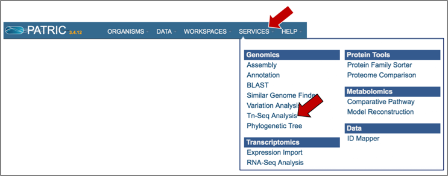

2.	This will open up the Tn-Seq landing page where researchers can submit long reads, single or paired read files.
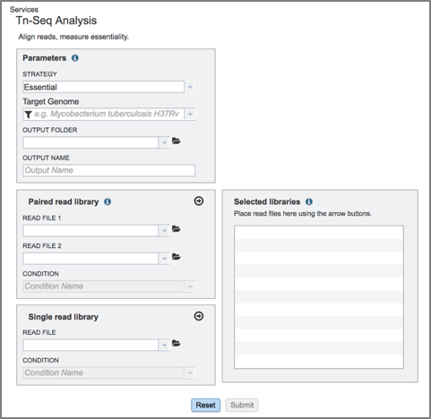

## II. Filling in parameters - Strategy

1. Information on any page is available by clicking on the blue icon (red arrow).  This will open an information box. The Tn-Seq pipeline in PATRIC uses TRANSIT [1]. TRANSIT is capable of analyzing Tn-Seq libraries constructed with Himar1 [2] or Tn5 [3] datasets.
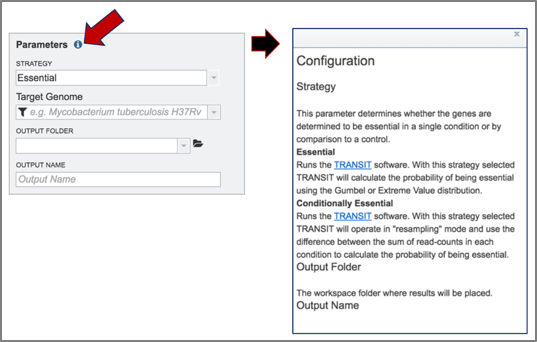

2.	The type of strategy must be selected.  Click on the arrow at the end of the text box that says Essential.  This will open a drop-down box that shows the two strategies offered by TRANSIT. **Essential regions** are inferred by the lack of insertions observed in a region (presumably because the insertion of the transposon (Tn) disrupts the protein product, making it non-functional). **Conditionally essential regions** have insertions in one condition but not in another. Select the strategy by clicking on it.
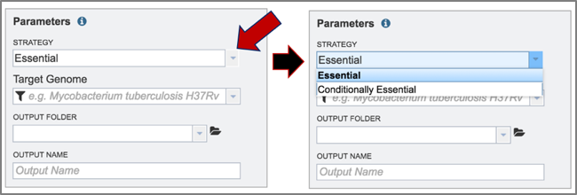

3.	The target genome must be selected.  Enter text into the box below Target Genome will open a drop-down box that shows all the possible genomes that match that text.  The target genome is selected by clicking on it.
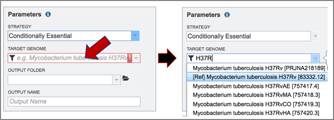

4.	To select the output folder for the Tn-Seq job, click on the arrow at the end of the text box under Output Folder.  This will open a drop-down box that shows the available folders. Clicking on the folder will select it.
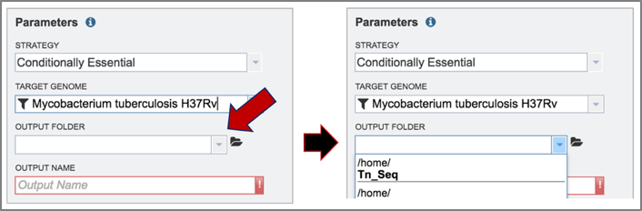

5.	Name the Tn-Seq job by entering text in the box under Output Name.
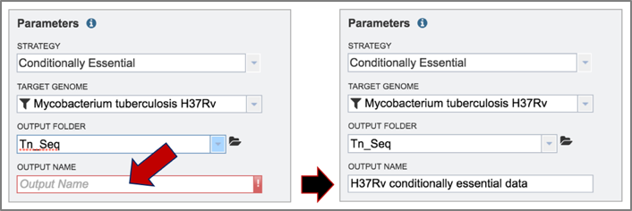

## III. Uploading reads and launching the job

1.	PATRIC allows researchers to compare paired or single end reads in the Tn-Seq service.

2.	To select reads for this example, click on the folder icon at the end of the text box underneath Read File.  This will open a pop-up window that provides access to the workspace.
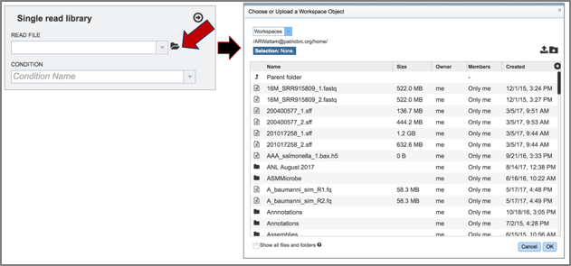

3.	Click on the down arrow that follows the word Workspace in the upper left corner.  This will open a drop-down box.  Click on Public Workspaces.
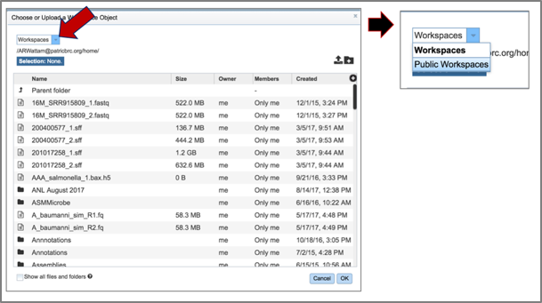

4.	This will open the Public Workspace.  Scroll down and find the icon in front of the word tnseq.  Click on that icon, and the page will reload to show a folder of Tn-Seq reads
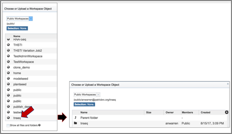

5.	Click on the folder.  The page will reload to show a folder that has four reads.  Two of these (U19_73_R1 and U19_74_R1) are controls, and two (U19_91_R1 and U19_92_R1) are treatments.
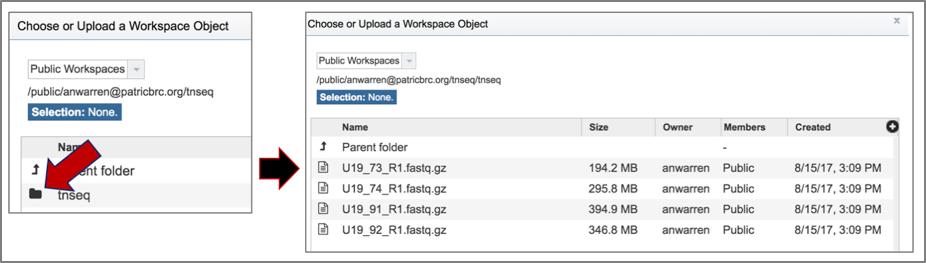

6.	Click on the read file of interest, which will highlight the row blue.  Then click the Ok button at the bottom right of the pop-up box.
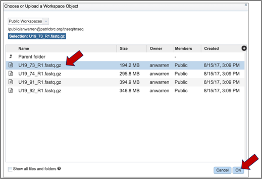

7.	The name of the read file will appear in the box.  To choose the condition, click on the down arrow at the end of the text box under condition.  This will open a drop-down box that has either control or treatment as an option.  Click on the appropriate label for the selected reads.
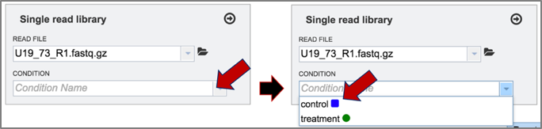

8.	Once the reads are loaded and the condition selected, click on the arrow icon at the top right of the read file box.  This will move them into the Selected libraries box, which is necessary before launching the tool.
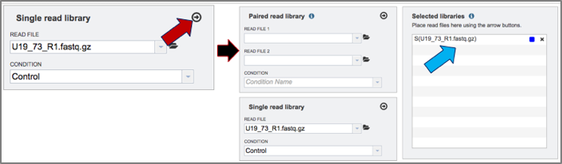

9.	Click on the other three reads and assign their treatment (U19_73 and U19_74 are control, and U19_91 and U19_92 are treatment).  Move all of them into the selected libraries box by clicking on the arrow icon at the top of the read file box.
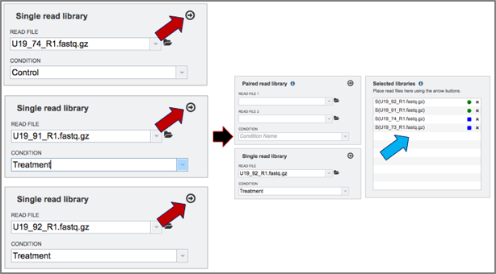

10.	 Once all the parameters and libraries are filled in, click on the Submit button at the bottom of the page.
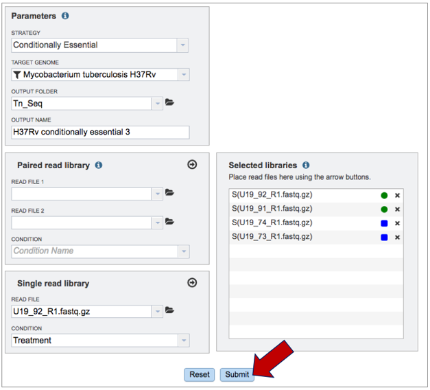
 
11.	Once the job has been submitted, a message will appear at the bottom of the page that shows that the job has been queued.
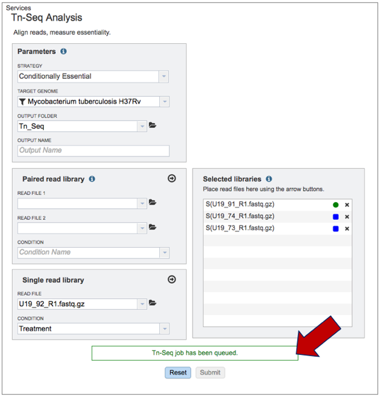

## IV. Examining The Results

1.	To check the status of the Tn-Seq job, click on the Jobs indicator at the bottom of the PATRIC page.
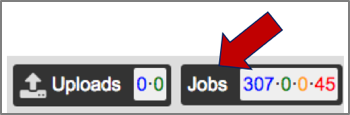

2.	Clicking on Jobs opens the Jobs Status page, where researchers can see the progression of the Tn-Seq job as well as the status of all the previous service jobs that have been submitted.
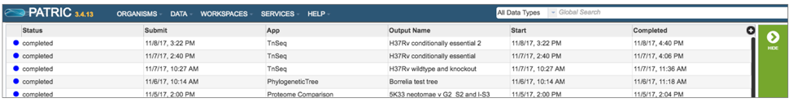

3.	From the jobs page, click on a row to select the variant analysis job of interest. Once selected, the downstream processes available for the selection appear in the vertical green bar. Clicking on the View icon will open the Tn-Seq job summary page.
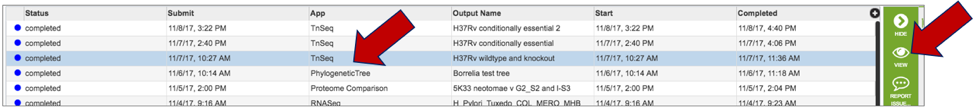

4.	The Tn-Seq job summary page provides researchers with a cornucopia of files that can be downloaded, viewed, and examined for further analysis.
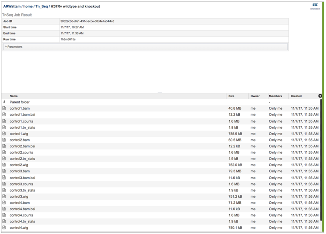

5.	This will open the landing page for that particular job.  To see the genome browser, where the results of the variation job can be summarized, click on the Browser icon that is visible in the upper right corner of the page.
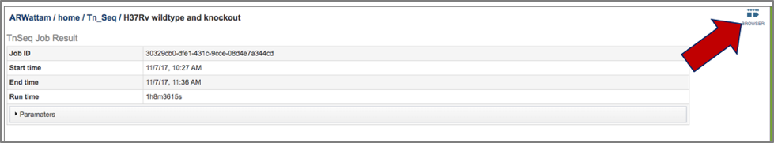

6.	This will open the genome browser for the genome that was selected as the reference.  There is a box on the left of the browser that shows the available tracks.  To see the reads, click on the check boxes before in front of the names that end in bam.  This will show the individual reads, with the colors indicative of the orientation of the reads (blue is forward, red is reverse).
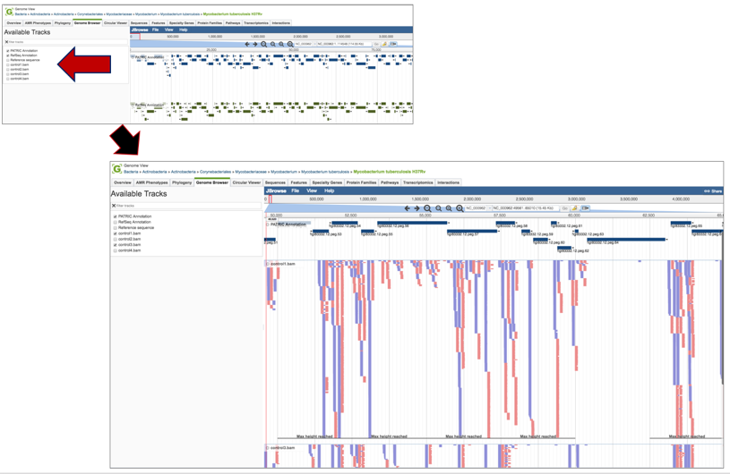

7.	Clicking on the Parameters line will provide the details of the Tn-Seq job.
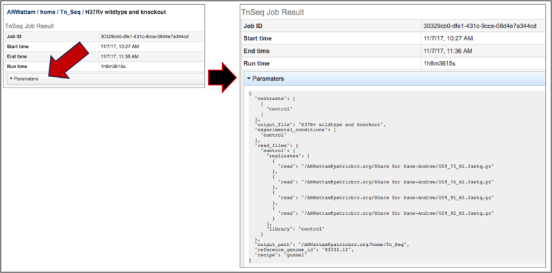

8.	PATRIC provides BAM files.  BAM is the compressed binary version of the Sequence Alignment/Map (SAM) format, a compact and index-able representation of nucleotide sequence alignments, and uploaded into a genome browser so that researchers can see the alignment of the reads compared to the annotation for the genome in question. The BAM index files (*.bam.bai) provide an index of the corresponding BAM file.
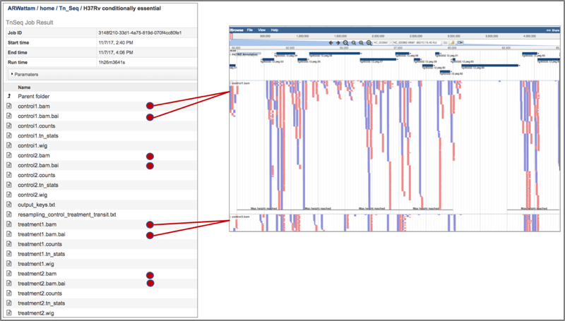

9.	The counts associated with each of the read files is provided in the control.counts or treatment.counts files.
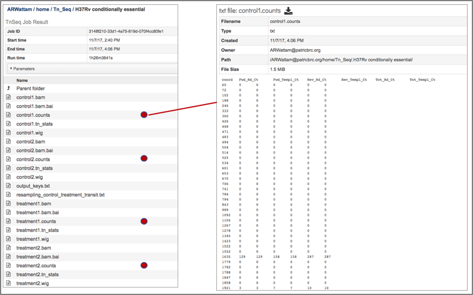

10.	The statistics associated with each of the read files that were loaded are provided in the control_counts or treatment_counts files.
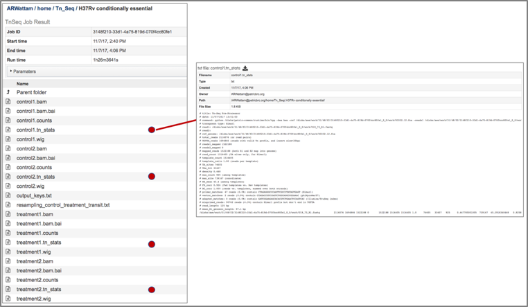

11.	 A summary of the reads and the metadata assigned to them is provided in the output_keys.txt file.
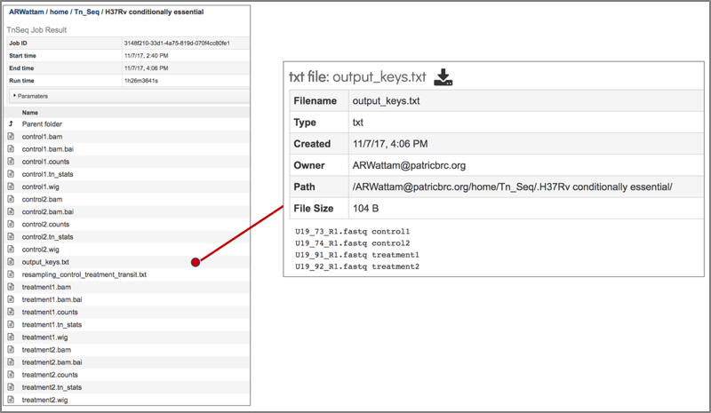

12.	The Transit package in PATRIC also provides a summary of the statistical data in a file that is called the resampling_control_treatment_transit.txt file.
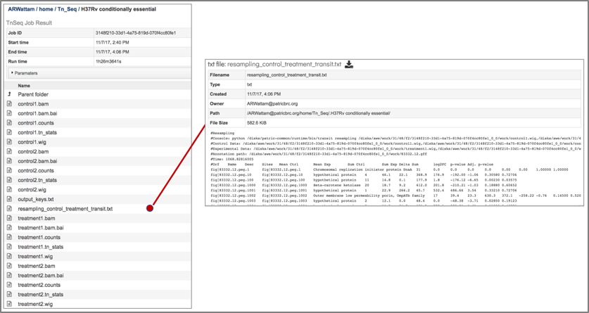

13.	 The resampling_control_treatment_transit file can be downloaded by clicking on the download icon that is visible at the top of the table.
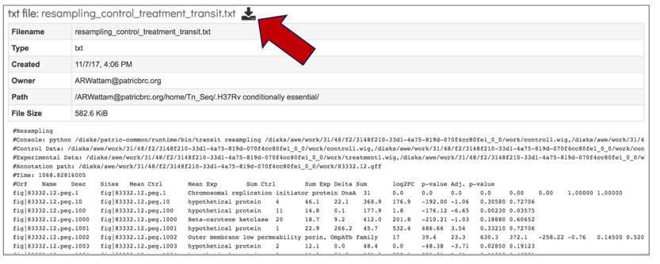

14.	The downloaded file can be opened in excel to more easily see the differences.
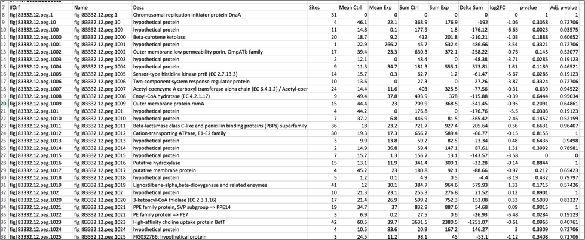

15.	The downloaded resampling_control_treatment_transit.txt file can be crossed with the data loaded on the genome browser to make sense of the numbers.
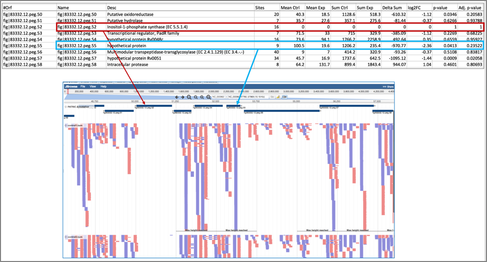

## References

1.	DeJesus MA, Ambadipudi C, Baker R, Sassetti C, Ioerger TR. TRANSIT - a software tool for Himar1 Tnseq analysis. PLoS Comput Biol. 2015;11: 1004401.

2.	Lampe DJ, Churchill ME, Robertson HM. A purified mariner transposase is sufficient to mediate transposition in vitro. The European Molecular Biology Organization Journal. 1996;15(19):5470–5479.

3.	Adey A, Morrison HG, Asan, Xun X, Kitzman JO, Turner EH, Stackhouse B, MacKenzie AP, Caruccio NC, Zhang X, et al. 2010. Rapid, low-input, low-bias construction of shotgun fragment libraries by high-density in vitro transposition. Genome Biol 11: R119.

