# Variation Analysis Service

## Submitting a Variant Analysis job at PATRIC

### I. Locating the Variant Service App

1. At the top of any PATRIC page, find the Services tab.
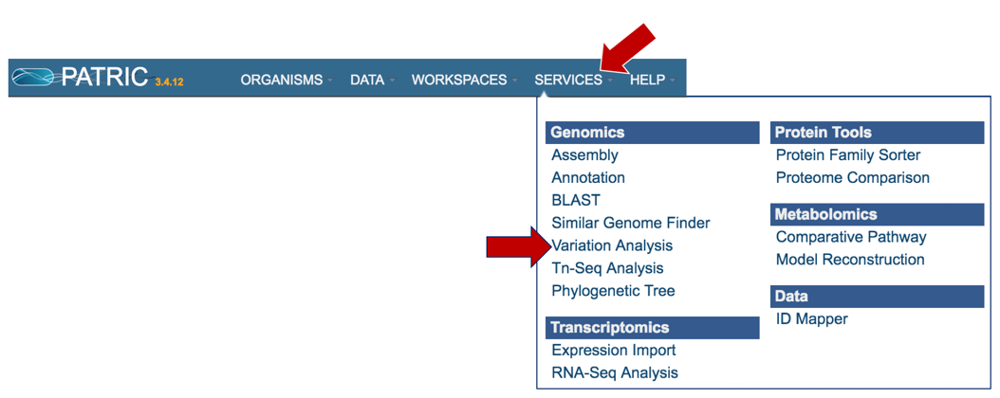

2.  Click on Variant analysis (red arrow).
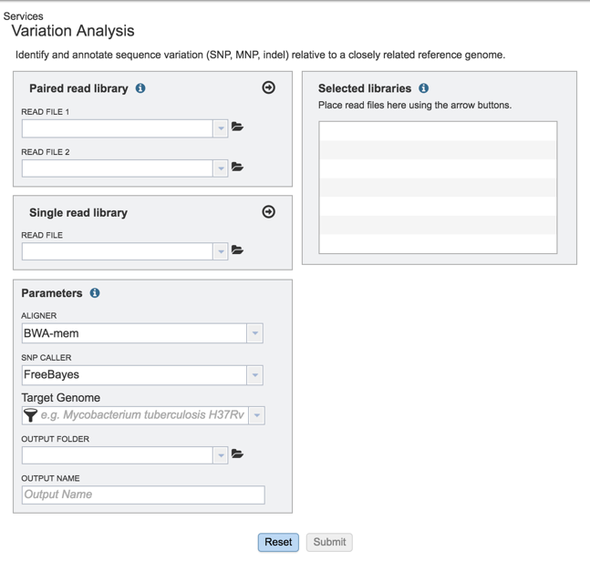

3.  This will open up the Variant Analysis landing page where researchers can submit single or paired read files.
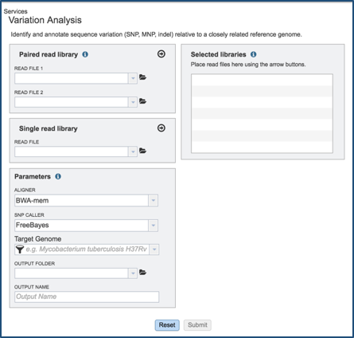

### II. Loading the Reads-Paired end

1.  Information on any page is available by clicking on the blue icon (red arrow).  This will open an information box
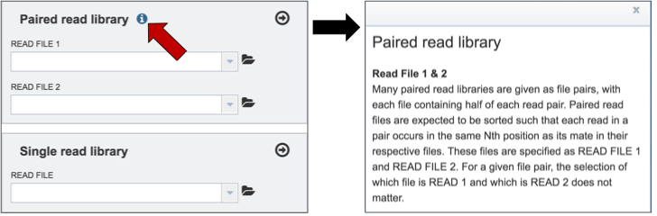 

2.  To upload paired reads for analysis, click on the down arrow that follows the text box (red arrow).  This will open a drop down box where reads that have been uploaded to PATRIC can be selected (black arrow).
 

3.  Once selected, the name will appear under the read file.  To load the second half of the pair, repeat the process for Read File 2.
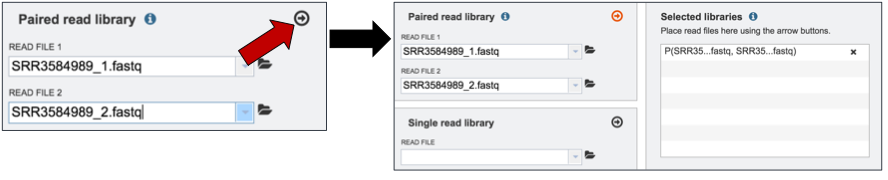 

4. Once both halves are selected, click on the arrow icon in the Paired read library box (red arrow).  This will load the reads (shown together in the same line for paired reads) into the Selected libraries panel.
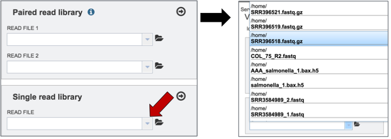 

### III. Loading the Reads-Single read

1.	 To upload single reads for analysis, click on the down arrow that follows the text box (red arrow).  This will open a drop down box where reads that have been uploaded to PATRIC can be selected (black arrow).
 

2.	Once selected, the name will appear under the read file.  Click on the arrow icon in the Single read library box (red arrow).  This will load the reads into the Selected libraries panel.
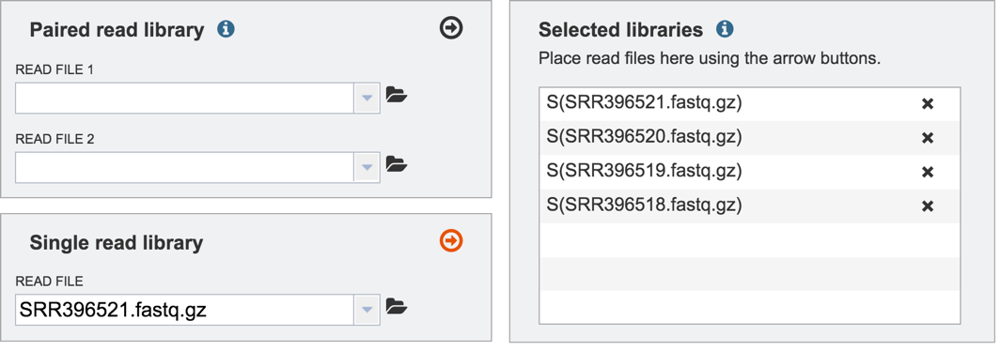 

3.	Repeat to add additional files to the analysis.
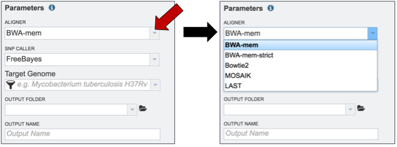 

### IV. Filling in parameters

1.	 PATRIC offers several types of aligners and SNP callers that can be used for comparison.  The Variant analysis service has BWA-mem as the default.  To see the other choices of aligners that can be used, click on the down arrow at the end of the Aligner text box (red arrow). This will open a drop down box that shows all the available programs.  A description of each program is provided below the screenshot.
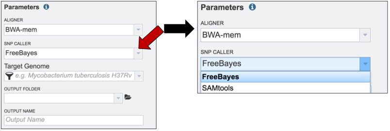 

* BWA-MEM is a new alignment algorithm for aligning sequence reads or long query sequences against a large reference genome such as human. It automatically chooses between local and end-to-end alignments, supports paired-end reads and performs chimeric alignment. The algorithm is robust to sequencing errors and applicable to a wide range of sequence lengths from 70bp to a few megabases. For mapping 100bp sequences, BWA-MEM shows better performance than several state-of-art read aligners to date(1). 

* Bowtie2, a method that combines the advantages of the full-text minute index and SIMD dynamic programming, achieves very fast and memory-efficient gapped alignment of sequencing reads. It improves on the previous Bowtie method in terms of speed and fraction of reads aligned and is substantially faster than non–full-text minute index–based approaches while aligning a comparable fraction of reads.   Bowtie 2 performs sensitive gapped alignment without incurring serious computational penalties(2).

* MOSAIK can align reads generated by all the major sequencing technologies, including Illumina, Applied Biosystems SOLiD, Roche 454, Ion Torrent and Pacific BioSciences SMRT.  To provide highly accurate alignments, MOSAIK employs a hash clustering strategy coupled with the Smith-Waterman algorithm. This method is well-suited to capture mismatches as well as short insertions and deletions. To support the growing interest in larger structural variant (SV) discovery, MOSAIK provides explicit support for handling known-sequence SVs, e.g. mobile element insertions (MEIs) as well as generating outputs tailored to aid in SV discovery.  MOSAIK uses a neural-network based training scheme to provide well-calibrated mapping quality scores(3).

* LAST can handle big sequence data, like comparing two vertebrate genomes.  It can align billions of DNA reads to a genome, and will indicate reliability of each aligned column.  In addition, it can compare DNA to proteins, with frameshifts, compare PSSMs to sequences, calculates the likelihood of chance similarities between random sequences, does split and spliced alignment, and can be trained for unusual kinds of sequences (like nanopore)(4).

2.	 PATRIC also offers a choice of SNP callers.  The default selection is for FreeBayes.  To see the other available choices, click on the down arrow that follows the SNP Caller text box (red arrow).  This will open a drop down box that shows all the available programs.  A description of each program is provided below the screenshot.
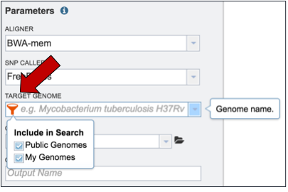 

* FreeBayes is an accurate method for sequence organization that includes fragment clustering, paralogue identification and multiple alignment. It calculates the probability that a given site is polymorphic and has an automated evaluation of the full length of all sequences, without limitations on alignment depth(5).

* The Sequence Alignment/Map (SAM) format is a generic alignment format for storing read alignments against reference sequences, supporting short and long reads (up to 128 Mbp) produced by different sequencing platforms. It is flexible in style, compact in size, efficient in random access and is the format in which alignments from the 1000 Genomes Project are released. SAMtools implements various utilities for post-processing alignments in the SAM format, such as indexing, variant caller and alignment viewer, and thus provides universal tools for processing read alignments(6).

3.	Researchers must select a Target Genome to align the reads against.  If this genome is a private genome, the search can be narrowed by clicking on the filter icon under the words Target Genome (red arrow).  This will open the filter where Public Genomes can be de-selected (blue arrow).

4.	To select a reference genome, start typing the name of a genome.  A box below Target Genome will show the closest matches that can be selected.
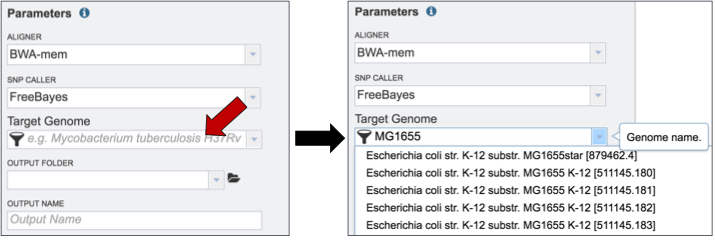

5.	Researchers that have used PATRIC before can click on the down arrow at the end of the Output Folder text box.  This will open a dropdown box that will show the folders that exist in the workspace (red arrow).
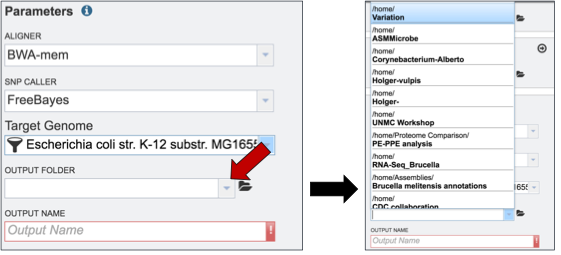

6.	Finally, researchers must name the Variant analysis job (red arrow).
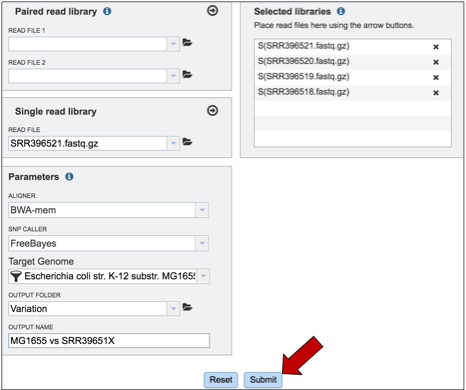

### V. Submitting the Variant Service Job

1. To submit the completed job, click the Submit button (red arrow).

2.	If the job was submitted successfully, a message will appear that indicates that the job has entered the assembly queue.
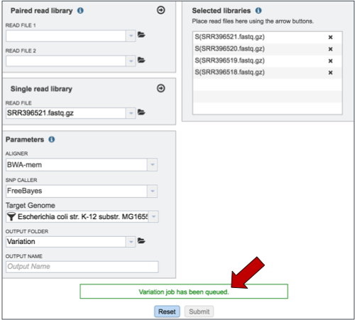

3.	To check the status of the assembly job, click on the Jobs indicator at the bottom of the PATRIC page.
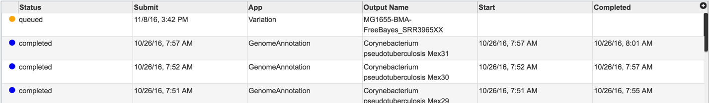

4.	Clicking on Jobs opens the Jobs Status page, where researchers can see the progression of the assembly job as well as the status of all the previous service jobs that have been submitted.
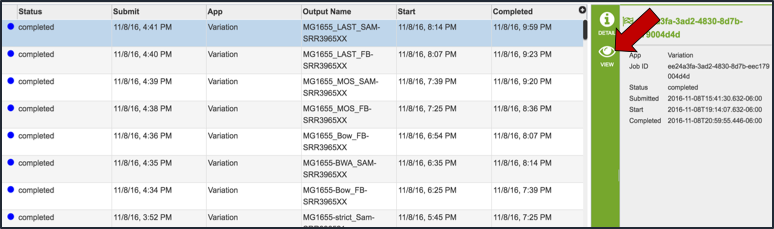

### VI. Viewing the Variant Analysis

1.	From the jobs page, click on a row to select the variant analysis job of interest. Once selected, the downstream processes available for the selection appear in the vertical green bar.  Each variant analysis job will only have one option, which is View (red arrow).  Clicking on the View icon will open the variant analysis job summary page.
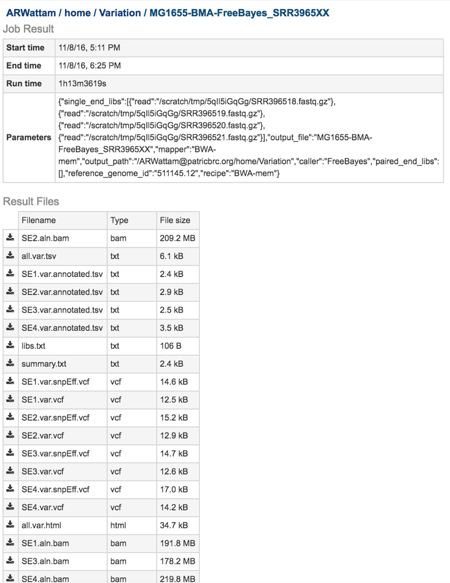

2.	The variant analysis job summary page provides researchers with a cornucopia of files that can be downloaded, viewed, and examined for further analysis.
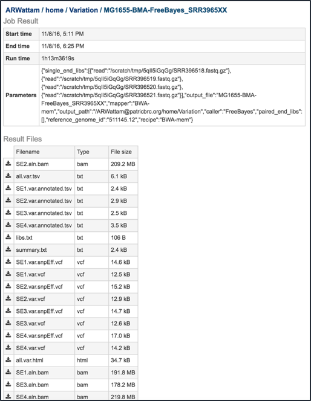

3.	**Bam files:** The Binary Alignment/Map (BAM) is the companion format of the Sequence Alignment/Map (SAM) format(6).  A SAM file (.sam) is a tab-delimited text file that contains sequence alignment data.  The .bam format is compact in size and supports fast retrieval of alignments in specified regions. It is optimal for viewing in a genome browser.  The PATRIC variant analysis service provides a .bam file for each of the read libraries that were loaded.
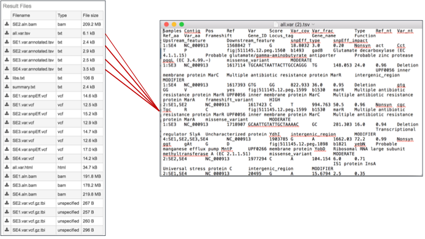

4a. **Tab Separated Values (.tsv):**  The PATRIC variant analysis service provides a .tsv file for each of the read libraries that were loaded. It summaries the locations of the variants, shows the nucleotide change, and identifies if it was a synonymous or nonsynonymous substitution, or an indel.  It also identifies the gene, or intergenic region, where the variation occurred.
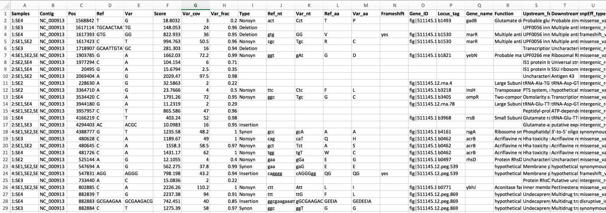

4b. These files can be opened using excel to easily see the different variants.
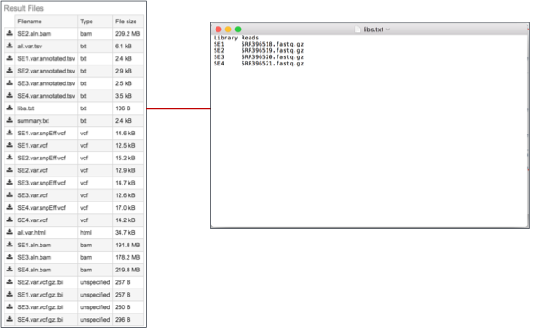

5.	**The lbs.txt file:**  This is a text file that describes the libraries used in the comparison.
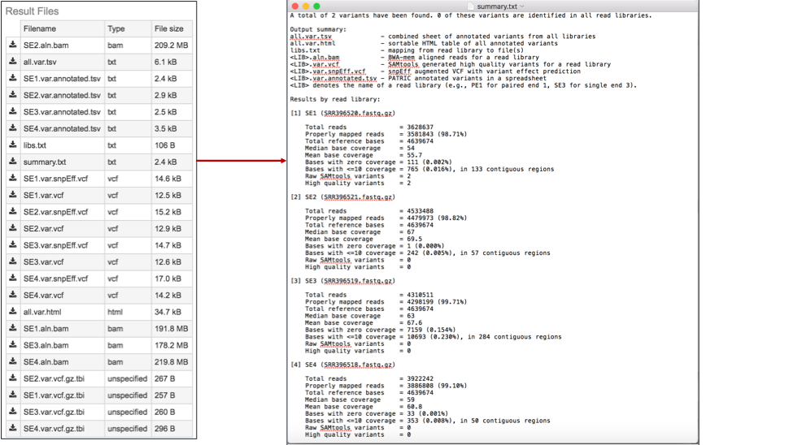

6.	**The summary.txt files:**  This file provides a summary of the analysis.  For each library it shows the number of reads, those that mapped to the reference, the number of bases in the reference, the median base coverage, bases with zero coverage, bases with less than (or equal to) 10 reads coverage, the raw variants that are detected by the variation calling tool, and those variants that have a high quality score.
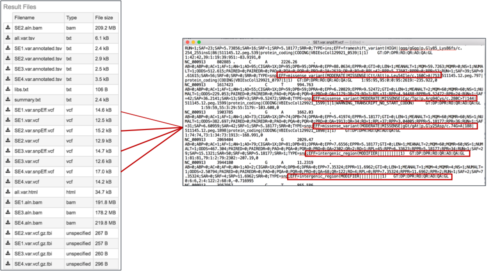

7.	**The var.snpEFF.vcf files:**  SnpEff rapidly categorizing the effects of variants in genome sequences. Once a genome is sequenced, SnpEff annotates variants based on their genomic locations and predicts coding effects. Annotated genomic locations include intronic, untranslated region, upstream, downstream, splice site, or intergenic regions. Coding effects such as synonymous or non-synonymous amino acid replacement, start codon gains or losses, stop codon gains or losses, or frame shifts can be predicted(7). Below is an example, with the effects highlighted in the red boxes.  The PATRIC variant analysis service provides a .var.snpEFF.vcf file for each of the read libraries that were loaded.
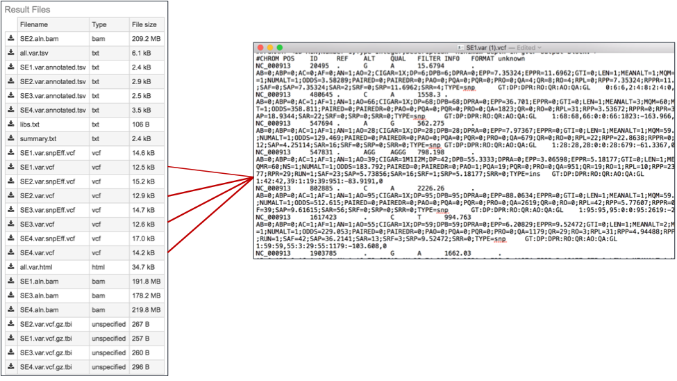

8.	The var.snp.vcf files.  These files show the location of the snp on the genome.  The PATRIC variant analysis service provides a .var.snp.vcf file for each of the read libraries that were loaded.

9.	**The .html file:**  The HyperText Markup Language (HTML) file will open a webpage that shows the same data available in the .tsv file.
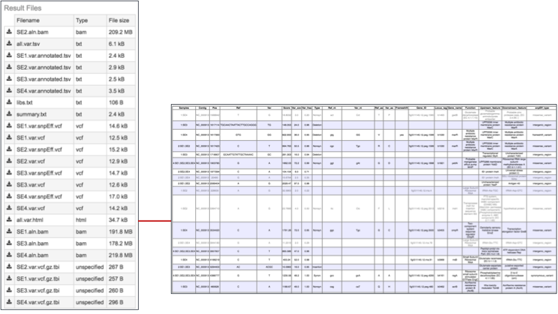

10.	**The var.vcf.gz.tbi file:**  This is a file that can be uploaded into a genome browser for viewing.  The PATRIC variant analysis service provides a .var.vcf.gz.tbi file for each of the read libraries that were loaded.

## References
1.	Li, H. (2014) Towards better understanding of artifacts in variant calling from high-coverage samples. Bioinformatics, btu356.

2.	Langmead, B. and Salzberg, S.L. (2012) Fast gapped-read alignment with Bowtie 2. Nat Methods, 9, 357-359.

3.	Lee, W.P., Stromberg, M.P., Ward, A., Stewart, C., Garrison, E.P. and Marth, G.T. (2014) MOSAIK: a hash-based algorithm for accurate next-generation sequencing short-read mapping. PLoS One, 9, e90581.

4.	Frith, M.C., Hamada, M. and Horton, P. (2010) Parameters for accurate genome alignment. BMC bioinformatics, 11, 1.

5.	Marth, G.T., Korf, I., Yandell, M.D., Yeh, R.T., Gu, Z., Zakeri, H., Stitziel, N.O., Hillier, L., Kwok, P.-Y. and Gish, W.R. (1999) A general approach to single-nucleotide polymorphism discovery. Nature genetics, 23, 452-456.

6.	Li, H., Handsaker, B., Wysoker, A., Fennell, T., Ruan, J., Homer, N., Marth, G., Abecasis, G., Durbin, R. and Genome Project Data Processing, S. (2009) The Sequence Alignment/Map format and SAMtools. Bioinformatics, 25, 2078-2079.

7.	Cingolani, P., Platts, A., Wang, L.L., Coon, M., Nguyen, T., Wang, L., Land, S.J., Lu, X. and Ruden, D.M. (2012) A program for annotating and predicting the effects of single nucleotide polymorphisms, SnpEff: SNPs in the genome of Drosophila melanogaster strain w1118; iso-2; iso-3. Fly, 6, 80-92.

