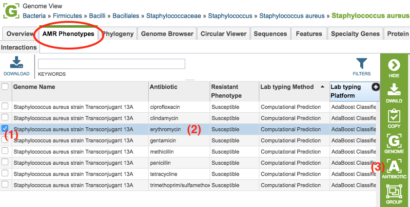
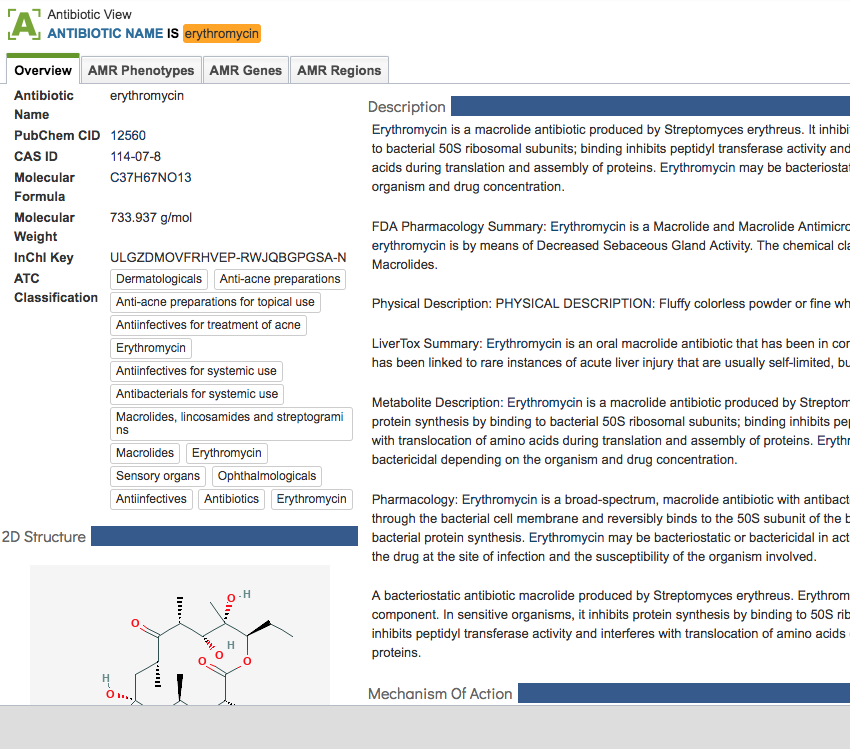

# Antibiotics

PATRIC provides additional detailed information about individual antibiotics. From the **AMR Phenotypes tab** (*shown below*), clicking the checkbox on one of the phenotypes enables the **Antibiotic button** in the green vertical **Selection Action Bar** on the right side of the table. 

Clicking the **Antibiotic** button will display a page of information about the corresponding antibiotic (*shown below*). 

